## Document Control

| Field | Value |
|---|---|
| Phase | Elaboration |
| Status | Draft |
| Milestone Target | End of Elaboration |
| Iteration | 1 (Cycle 1) |
| Elaboration Changes | All 10 UCs fully specified (was: 3 detailed / 7 outlined); AD display-data dependencies of UC-005/006/007 made explicit (CON-005, CON-006); offline clocking AF-1 confirmed in-scope by stakeholder; volatility updated with PoC learnings (R001, R003, R004). **RS Iter 1 additions:** activity diagrams completed for UC-002/003/005/009 (all 10 UCs now diagrammed); exception flows added (UC-002/003 EF-1 data-source unavailability; UC-005/009 EF-1 role denial per SEC-006); UC-001 AF-1 offline-sync thresholds + AF-3 ignore window quantified (delegated to RS by recorded stakeholder decision); UC-006 CSV column set v1 detailed. **RS Iter 1 post-answer:** timestamp convention decided by stakeholder — store UTC, display office local timezone, export ISO-8601 with explicit offset, payroll day = local calendar day; invented office-location references (Havana/Madrid) removed from discovery scenarios — the declared input names no office locations and all 3 offices share one timezone (stakeholder-confirmed). **RS Iter 1 final:** office local timezone decided by stakeholder — America/Havana (IANA identifier, DST-aware; a fixed offset would silently shift every payroll day boundary when the clocks change); incorporated into UC-001 timestamp convention and UC-006 event_timestamp column |

## Use-Case Diagram

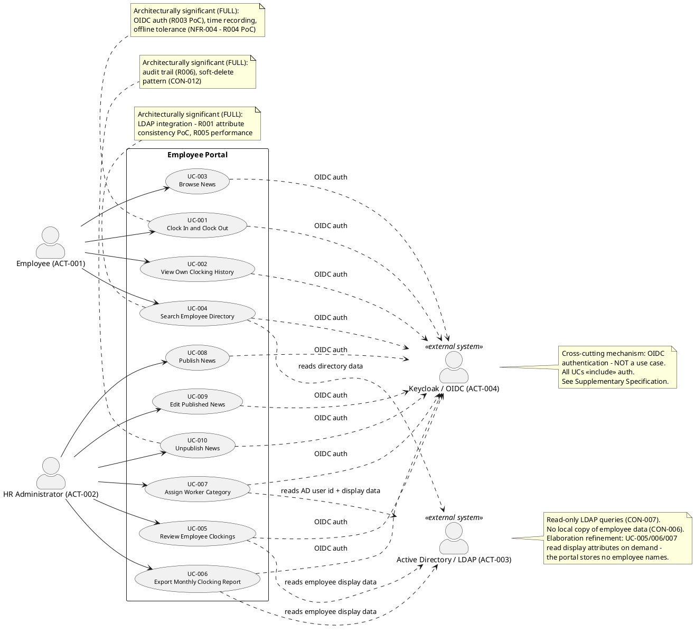

**System boundary:** The rectangle encloses all 10 use cases — the complete declared scope (10 UCs map 1:1 to the 10 declared FRs; confirmed Inception decision). Keycloak (OIDC) and Active Directory (LDAP) are external actors ON the boundary — the portal is a client of both, never manages either. Authentication is a cross-cutting mechanism (`<<include>>` from all UCs), not a standalone use case. Nothing enters the boundary without a declared FR; no 11th use case exists.

## Actors

| ID | Actor | Type | Description | Scope |
|---|---|---|---|---|
| ACT-001 | Employee | Human (primary) | 200 corporate employees across 3 offices. Authenticates with corporate credentials. Clocks in/out, views own history, browses news, searches directory. | In |
| ACT-002 | HR Administrator | Human (primary) | HR staff with elevated Keycloak role. Reviews all clockings, exports CSV reports, assigns worker categories, manages full news lifecycle. | In |
| ACT-003 | Active Directory (LDAP) | External system | System of record for employee corporate data (name, job title, department, office, email, extension). Queried read-only on demand via LDAP. | Out (boundary) |
| ACT-004 | Keycloak (OIDC) | External system | Existing identity provider. Authenticates users via OIDC; provides roles as claims. Not deployed or managed by this project. | Out (boundary) |

**Elaboration actor-discovery check (heuristic 8):** (a) direct human actors — Employee, HR Administrator, both covered; (b) external integrating systems — AD, Keycloak, both on the boundary; (c) time-based triggers — none declared (no batch jobs, no scheduled reports; news sorting is on-demand reads); (d) hardware devices — none declared (biometric clocking explicitly excluded); (e) administrative actors — the Infrastructure Team (STK-004) operates AD/Keycloak but explicitly performs NO portal interaction and takes on NO new operational work (CON-014), so it is a negative stakeholder, not an actor. **Actor set is complete and unchanged from Inception.**

## Use-Case Survey

| UC | Name | Primary Actor | Source | MoSCoW | Volatility | Depth (Elab Iter 1) | Arch-Significant |
|---|---|---|---|---|---|---|---|
| UC-001 | Clock In and Clock Out | Employee | FR-004 | Must | Low | **Full** | **Yes** — OIDC (R003 PoC), offline sync (R004 PoC), time recording |
| UC-002 | View Own Clocking History | Employee | FR-005 | Must | Low | **Full** | No |
| UC-003 | Browse News | Employee | FR-007 | Must | Low | **Full** | No |
| UC-004 | Search Employee Directory | Employee | FR-010 | Must | Medium | **Full** | **Yes** — LDAP integration (R001 PoC, R005) |
| UC-005 | Review Employee Clockings | HR Administrator | FR-001 | Must | Low | **Full** | No (consumes LDAP + auth mechanisms) |
| UC-006 | Export Monthly Clocking Report | HR Administrator | FR-002 | Must | Medium | **Full** | No (consumes LDAP + auth mechanisms; CSV format volatile) |
| UC-007 | Assign Worker Category | HR Administrator | FR-003 | Must | Medium | **Full** | No (consumes LDAP + audit mechanisms; external config) |
| UC-008 | Publish News | HR Administrator | FR-006 | Must | Low | **Full** | No (consumes audit mechanism) |
| UC-009 | Edit Published News | HR Administrator | FR-008 | Must | Low | **Full** | No (consumes audit mechanism — versioned trail) |
| UC-010 | Unpublish News | HR Administrator | FR-009 | Must | Low | **Full** | **Yes** — audit trail (R006), soft-delete pattern (CON-012) |

**Architectural significance (unchanged from Inception baseline):** UC-001, UC-004, UC-010 force architectural decisions (OIDC client design, offline sync mechanism, LDAP query strategy, audit/soft-delete persistence pattern) and are the first test targets (Elaboration test priority: UC-001, UC-004, UC-010). UC-005/006/007/008/009 consume the same cross-cutting mechanisms already forced by the significant three — they add no new architectural decision.

**Volatility rationale (updated with Elaboration PoC learnings):**
- **UC-004 (Medium):** R001 — LDAP attribute population may vary across the 3 offices; the R001 PoC may change the query/fallback strategy. Encapsulate the LDAP query strategy in a dedicated component.
- **UC-006 (Medium):** CSV column set is volatile — downstream payroll/records consumers may reshape it. RS details the columns; the export format must be encapsulated.
- **UC-007 (Medium):** The category list source is externally configured (CON-013); the configuration mechanism (file, table, setting) is an Architect decision and may change without portal code changes.
- All remaining UCs: **Low** — stable, declared, single-customer behavior.

## Use-Case Specifications

### UC-001: Clock In and Clock Out — FULL (architecturally significant)

| Field | Value |
|---|---|
| Primary Actor | Employee (ACT-001) |
| Trigger | Employee navigates to the portal main page |
| Precondition | Employee is authenticated via Keycloak OIDC |
| Postcondition | Exactly one clocking event (in or out) is persisted with exact timestamp; confirmation displayed |
| Source | FR-004 |

**Main Flow:**
1. Employee navigates to the portal main page.
2. System authenticates the employee via Keycloak OIDC (`<<include>>` authentication; AF-2 if session expired).
3. System checks the employee's current clocking status (clocked in or not).
4. System displays the main screen with either a "Clock In" or "Clock Out" button matching the current status.
5. Employee presses the button.
6. System records the exact timestamp of the event.
7. System persists the clocking event to the PostgreSQL database (AF-1 if the portal server is unreachable).
8. System displays a confirmation with the recorded time.

**Alternative Flows:**
- **AF-1: Network disruption (NFR-004, AC-005).** At step 7, if the network is temporarily unavailable, the system queues the clocking locally with the recorded timestamp and syncs it to the database once connectivity is restored. The confirmation at step 8 is shown from the queued data so the employee sees immediate feedback. *Stakeholder decision recorded: this mechanism is architectural, within declared scope — design ownership: Software Architect (R004 PoC); thresholds (max queue size, sync timeout, conflict policy): Requirements Specifier.*
- **AF-2: Session expired.** At step 2, if the OIDC session has expired, the system redirects to Keycloak for re-authentication before proceeding.
- **AF-3: Repeated press.** At step 5, presses repeated before the status refreshes are treated as a single transition (the button is status-aware; a stray second press must not produce an accidental opposite event). **Ignore window: 2 seconds** — a second press within 2 seconds of the first is treated as the same transition and produces no additional event. [ASSUMPTION — requires validation] Basis: 2 × the NFR-002 response budget of 1 second — a stray repeat lands inside the response window; a deliberate opposite transition cannot occur before the status refreshes.

**AF-1 quantified thresholds (Requirements Specifier, Elaboration Iter 1 — per the recorded stakeholder decision delegating threshold quantification to this role):**

| Threshold | Value | Source / Basis |
|---|---|---|
| Offline tolerance window | Network disruptions of at least 5 minutes are tolerated; queued events are never lost | AC-005 (declared) |
| Per-client queue capacity | ≥ 10 clocking events per employee browser | [ASSUMPTION — requires validation] Basis: at most 2 transitions per employee per workday (FR-004 in/out); 10 events covers 5 full workdays of total outage — far beyond the declared 5-minute window |
| Sync completion | All queued events persisted ≤ 60 seconds after connectivity is restored | [ASSUMPTION — requires validation] Basis: worst case 200 employees × 1 queued event each (STK-003 population), small records, restored corporate LAN |
| Conflict policy | Idempotent: an exact duplicate (same employee, same event type, same recorded timestamp) is rejected, never duplicated; events are ordered by recorded timestamp, not arrival order | DAT-001 (timestamp fixed at button press), AF-3 |
| Timestamp convention | Queued timestamps are captured at the moment of the button press, stored in UTC, and persisted unchanged on sync; displayed in the office local timezone (America/Havana, IANA — stakeholder decision, Elaboration Iter 1). All 3 offices share this one timezone (stakeholder-confirmed) | DAT-001; stakeholder decisions (Elaboration Iter 1): "store every clocking timestamp in UTC, display it in the office local timezone" — office local zone: America/Havana (IANA identifier, DST-aware) |

**Scenarios (discovery walk):**
- **S1:** María (Employee) opens the portal at 08:58, sees "Clock In", presses → confirmation "Clocked in at 08:58:12".
- **S2:** At 17:30 she returns; the button now reads "Clock Out"; she presses → confirmation; her history (UC-002) shows both events.
- **S3:** The network drops at 09:00 for 5 minutes; Luis presses "Clock In" during the outage → confirmation is shown from the queued data; the event syncs when connectivity returns (AC-005).
- **S4 (threshold walk):** Luis double-presses "Clock In" 0.8 s apart → one event only (AF-3, 2 s window); the stray press is ignored.

**Activity Diagram:**

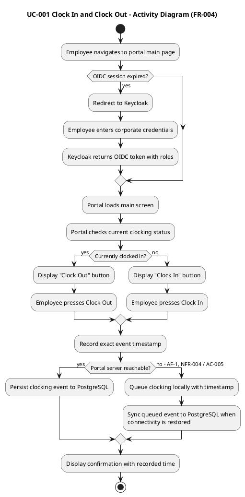

### UC-002: View Own Clocking History — FULL

| Field | Value |
|---|---|
| Primary Actor | Employee (ACT-001) |
| Trigger | Employee selects "My Clocking History" |
| Precondition | Employee is authenticated |
| Postcondition | The employee's own clocking history for the current month is displayed |
| Source | FR-005 |

**Main Flow:**
1. Employee selects "My Clocking History".
2. System authenticates the employee via Keycloak OIDC (`<<include>>` authentication).
3. System queries the employee's own clocking events for the current month from PostgreSQL.
4. System displays the list of in/out timestamps.
5. Employee reviews their history.

**Alternative Flows:**
- **AF-1: No events this month.** At step 3, if no events exist for the current month, the system displays an empty-state message.
- **AF-2: Offline-queued events not yet synced.** Events queued locally under UC-001 AF-1 appear in the history only once the sync completes; until then the history reflects the last synced state.

**Exception Flows:**
- **EF-1: PostgreSQL unreachable.** At step 3, if the portal database cannot be reached, the system displays "History temporarily unavailable" and shows no partial or cached list (NFR-004 fault tolerance; no local copy of portal data exists to fall back on). The employee may retry; locally queued, not-yet-synced events (AF-2) are unaffected.

**Scope notes:** Current month only (declared). Read-only — no editing, no export from this view. The employee sees only their own events (SEC-007).

**Activity Diagram:**

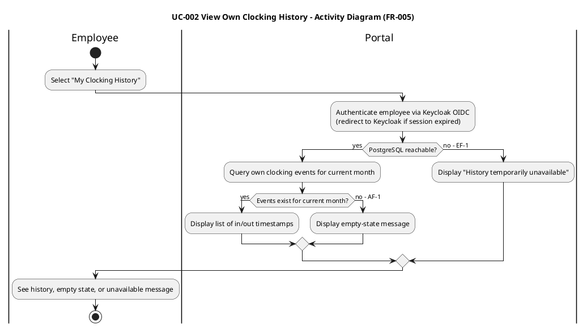

### UC-003: Browse News — FULL

| Field | Value |
|---|---|
| Primary Actor | Employee (ACT-001) |
| Trigger | Employee navigates to the main page or news section |
| Precondition | Employee is authenticated |
| Postcondition | News list displayed, sorted by date (newest first) |
| Source | FR-007 |

**Main Flow:**
1. Employee navigates to the main page or news section.
2. System authenticates the employee via Keycloak OIDC (`<<include>>` authentication).
3. System loads published news items sorted by date (newest first).
4. System displays featured news with a banner at the top.
5. Employee optionally selects a category filter (General, HR, IT, Events).
6. System displays the filtered list.

**Alternative Flows:**
- **AF-1: Filter yields no items.** At step 6, if the selected category has no published items, the system displays "No news in this category."
- **AF-2: No published news at all.** At step 3, if no published items exist, the system displays an empty-state message.

**Exception Flows:**
- **EF-1: PostgreSQL unreachable.** At step 3, if the portal database cannot be reached, the system displays "News temporarily unavailable" and shows no partial list (NFR-004 fault tolerance).

**Scope notes:** Read-only for employees — no comments, no reactions (declared). Unpublished items (UC-010) are never shown here.

**Activity Diagram:**

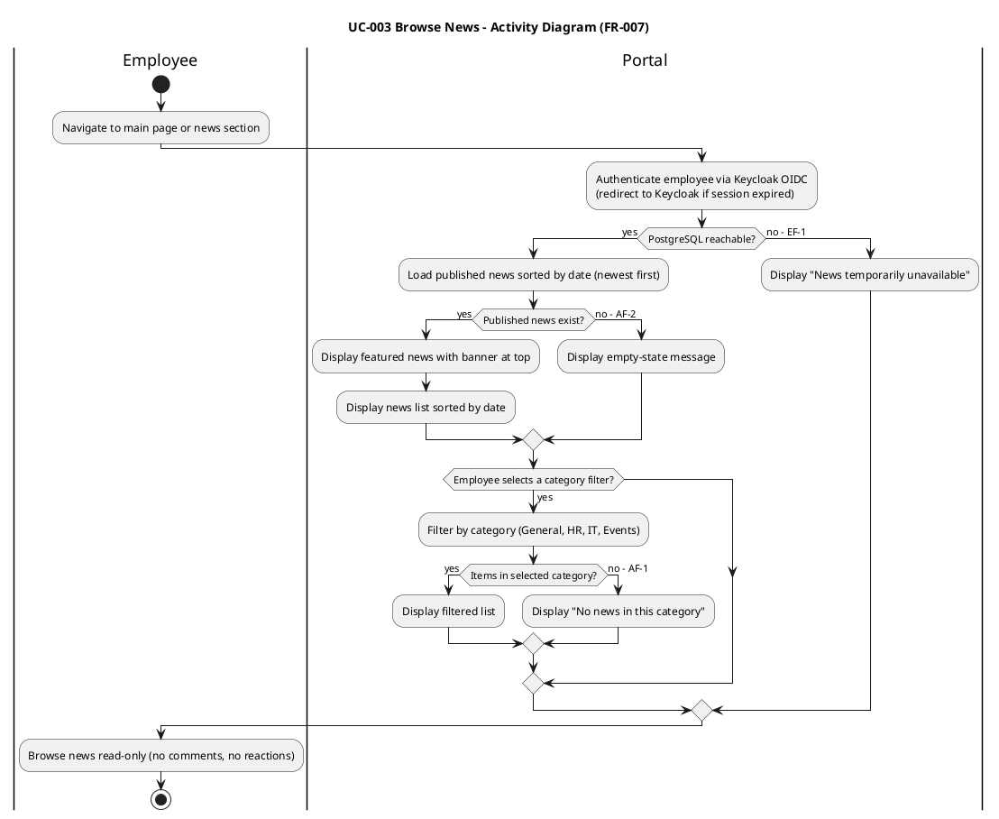

### UC-004: Search Employee Directory — FULL (architecturally significant)

| Field | Value |
|---|---|
| Primary Actor | Employee (ACT-001) |
| Trigger | Employee enters search criteria in the directory search field |
| Precondition | Employee is authenticated via Keycloak OIDC |
| Postcondition | Matching colleague entries displayed with corporate data |
| Source | FR-010 |

**Main Flow:**
1. Employee navigates to the directory search page.
2. System authenticates the employee via Keycloak OIDC (`<<include>>` authentication).
3. Employee enters search criteria: name, department, or office.
4. System queries Active Directory over LDAP with the search criteria (read-only, on demand — no local copy, CON-006).
5. AD returns matching entries with corporate attributes: name, job title, department, office, email, extension phone number.
6. System displays the results in a list.
7. Employee views the desired colleague's contact information.

**Alternative Flows:**
- **AF-1: No results.** At step 5, if AD returns no matches, the system displays "No colleagues found" with a suggestion to refine the search.
- **AF-2: LDAP attribute missing (R001).** At step 5, if a returned entry has missing attributes (e.g., extension not populated), the system displays the available fields and leaves missing fields blank rather than hiding the entry.
- **AF-3: LDAP connection failure.** At step 4, if the LDAP connection fails, the system displays "Directory temporarily unavailable." There is no local fallback — CON-006 forbids a local copy of employee data.

**Scenarios (discovery walk):**
- **S1:** Employee searches "Gómez" → sees all colleagues named Gómez with their title, department, office, email, and extension.
- **S2:** Employee filters by department "IT" → sees all IT department colleagues.
- **S3:** Employee searches by office → sees all colleagues in that office; some entries have missing extension numbers (R001) and show blank fields, not hidden entries.

**Activity Diagram:**

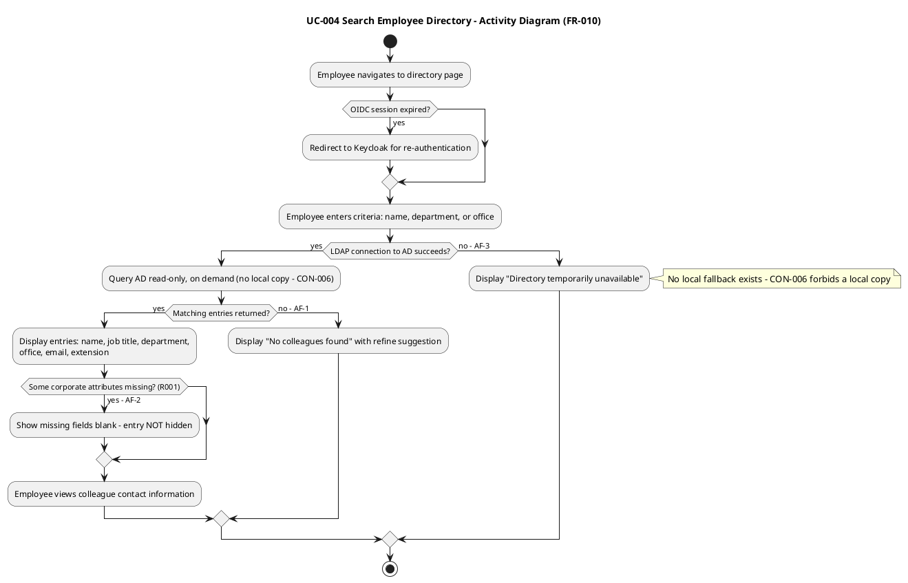

### UC-005: Review Employee Clockings — FULL

| Field | Value |
|---|---|
| Primary Actor | HR Administrator (ACT-002) |
| Trigger | HR navigates to the clocking review page |
| Precondition | HR Administrator is authenticated with elevated role (SEC-002) |
| Postcondition | All employees' clockings displayed for review |
| Source | FR-001 |

**Main Flow:**
1. HR Administrator navigates to the clocking review page.
2. System authenticates HR via Keycloak OIDC and verifies the HR Administrator role (`<<include>>` authentication; SEC-002).
3. System loads clocking events for all employees from PostgreSQL.
4. HR optionally filters by employee and/or date range.
5. System displays the matching events, with employee display data (name, etc.) read from Active Directory on demand (CON-005, CON-006 — the portal stores no employee names).

**Alternative Flows:**
- **AF-1: No events match the filter.** At step 5, the system displays a message that no clocking records match.
- **AF-2: AD unavailable.** At step 5, events remain viewable from PostgreSQL (they are portal data), but employee display attributes cannot be resolved; the system shows the AD user id and marks display attributes as unavailable. No local fallback exists (CON-006).

**Exception Flows:**
- **EF-1: Role denial.** At step 2, if the authenticated session holds only the Employee role, the system denies access to the clocking review page (SEC-006). No clocking data for other employees is revealed.

**Activity Diagram:**

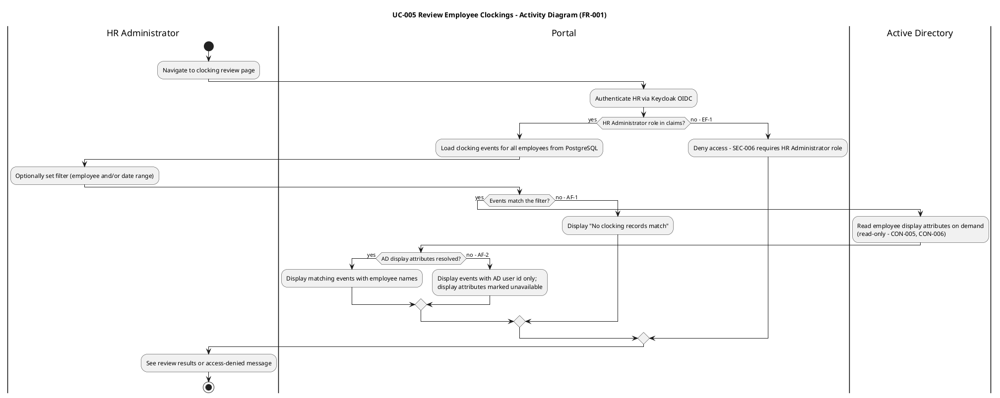

### UC-006: Export Monthly Clocking Report — FULL

| Field | Value |
|---|---|
| Primary Actor | HR Administrator (ACT-002) |
| Trigger | HR selects a month and "Export CSV" |
| Precondition | HR Administrator is authenticated with elevated role (SEC-002) |
| Postcondition | CSV file with the month's clocking data delivered to HR |
| Source | FR-002 |

**Main Flow:**
1. HR Administrator selects a month and "Export CSV" from the clocking review area.
2. System authenticates HR via Keycloak OIDC and verifies the HR Administrator role (`<<include>>` authentication; SEC-002).
3. System compiles all clocking events for the selected month from PostgreSQL (one row per event).
4. System reads employee display attributes from Active Directory on demand (CON-005, CON-006).
5. System generates the CSV file.
6. System delivers the CSV download to HR.

**Alternative Flows:**
- **AF-1: No events for the month.** At step 3, if no clocking records exist for the selected month, the system informs HR and produces no file.
- **AF-2: AD unavailable.** At step 4, if AD cannot be reached, the system aborts the export with "Directory temporarily unavailable" — no partial file is produced (a report with unresolved employee identities would be misleading for payroll/records use).

**CSV column set v1 (Requirements Specifier, Elaboration Iter 1) — one row per clocking event, columns in this order:**

| # | Column | Content | Source |
|---|---|---|---|
| 1 | ad_user_id | AD user id of the employee | CON-006 (the only employee identifier the portal stores) |
| 2 | employee_name | Full name, read from AD on demand | CON-005, FR-010 attribute set |
| 3 | department | Department, read from AD on demand | CON-005, FR-010 |
| 4 | office | Office, read from AD on demand | CON-005, FR-010 |
| 5 | event_timestamp | Event time in ISO-8601 with explicit offset, America/Havana local time (format YYYY-MM-DDThh:mm:ss±hh:mm; the offset is the one in force at the event time per the IANA zone database) | FR-004 recorded timestamp (stored UTC); stakeholder decisions (Elaboration Iter 1) |
| 6 | event_type | IN or OUT | FR-004 |

**CSV scope notes:** Job title, email, and extension are excluded — they are directory attributes (FR-010), not clocking data. Timestamps are stored in UTC and exported in ISO-8601 with an explicit offset in America/Havana local time (IANA identifier, DST-aware — a fixed offset would silently shift the payroll day boundary when the clocks change); the selected month's boundaries are computed in America/Havana local time — the payroll day is the local calendar day, never the server's (stakeholder decisions, Elaboration Iter 1). All 3 offices share this one timezone (stakeholder-confirmed). Volatility: Medium — downstream payroll/records consumers may reshape the column set; the export format must be encapsulated so column changes do not ripple (Use-Case Survey volatility rationale). AF-2 guarantees every exported row resolves employee display data. Export is HR-only; employees have no export (FR-005 is view-only).

**Activity Diagram:**

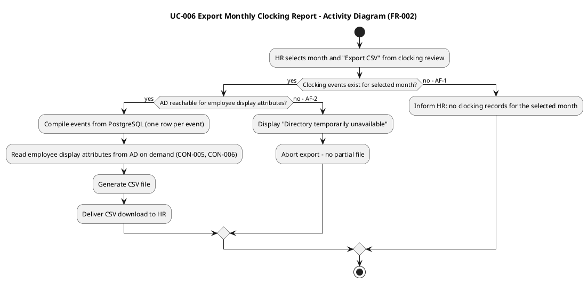

### UC-007: Assign Worker Category — FULL

| Field | Value |
|---|---|
| Primary Actor | HR Administrator (ACT-002) |
| Trigger | HR selects an employee and assigns a category |
| Precondition | HR Administrator is authenticated with elevated role; fixed category list available from external configuration (CON-013) |
| Postcondition | AD user id → category mapping persisted; change audited |
| Source | FR-003 |

**Main Flow:**
1. HR Administrator opens the worker category page.
2. System authenticates HR via Keycloak OIDC and verifies the HR Administrator role (`<<include>>` authentication; SEC-002).
3. HR locates the employee by browsing display data read from Active Directory on demand (read-only, CON-007).
4. System loads the fixed worker category list from the external configuration (CON-013).
5. HR selects a category and confirms.
6. System persists the AD user id → category mapping (two columns only — CON-006).
7. System appends an audit entry: actor + timestamp + old value + new value (AUD-004, NFR-005).
8. System confirms the assignment to HR.

**Alternative Flows:**
- **AF-1: Same category re-selected.** At step 5, if the selected category equals the current value, nothing is persisted and no audit entry is written (NFR-005 audits *changes*).
- **AF-2: AD unavailable.** At step 3, employee lookup is blocked; the system informs HR that the directory is temporarily unavailable. The assignment cannot proceed without AD (the portal holds no employee display data — CON-006).

**Business rules:** CON-013 — the category list is fixed and externally configured; no create/edit/rename/delete of categories in the portal UI. CON-006 — the portal stores only AD user id → category. NFR-005/AUD-004 — every category change is audited.

**Activity Diagram:**

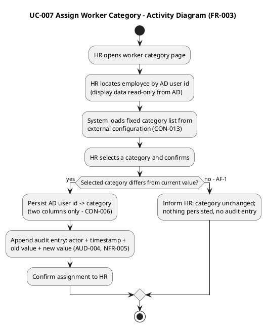

### UC-008: Publish News — FULL

| Field | Value |
|---|---|
| Primary Actor | HR Administrator (ACT-002) |
| Trigger | HR selects "Publish News" |
| Precondition | HR Administrator is authenticated with elevated role (SEC-002) |
| Postcondition | News item published and visible to employees; publication audited |
| Source | FR-006 |

**Main Flow:**
1. HR Administrator selects "Publish News".
2. System authenticates HR via Keycloak OIDC and verifies the HR Administrator role (`<<include>>` authentication; SEC-002).
3. HR enters title, body, and date; selects a category (General, HR, IT, Events); optionally marks the item as featured.
4. HR submits the form.
5. System validates the required fields.
6. System persists the news item with status "published".
7. System appends an audit entry: author + timestamp (AUD-001, NFR-005).
8. System confirms publication; the item is visible to employees (UC-003), with featured items shown under the banner.

**Alternative Flows:**
- **AF-1: Validation failure.** At step 5, the system highlights missing or invalid fields; HR corrects and resubmits.

**Activity Diagram:**

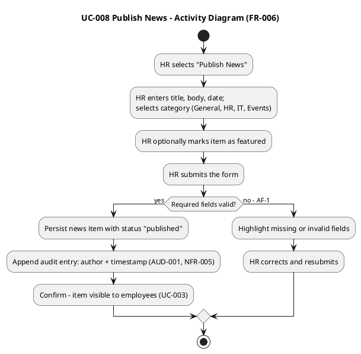

### UC-009: Edit Published News — FULL

| Field | Value |
|---|---|
| Primary Actor | HR Administrator (ACT-002) |
| Trigger | HR selects an existing news item and edits it |
| Precondition | HR Administrator is authenticated with elevated role; news item exists and is published |
| Postcondition | News item updated; edit audited with editor + timestamp; all versions traceable |
| Source | FR-008 |

**Main Flow:**
1. HR Administrator opens news management and selects a published news item to edit.
2. System authenticates HR via Keycloak OIDC and verifies the HR Administrator role (`<<include>>` authentication; SEC-002).
3. System loads the current version of the news item.
4. HR modifies the fields (title, body, date, category, featured flag).
5. HR saves the changes.
6. System persists the updated news item.
7. System appends an audit entry: editor + timestamp (AUD-002, NFR-005) — the trail records all versions, not just the final one.
8. System confirms; the updated item is visible to employees (UC-003).

**Alternative Flows:**
- **AF-1: Validation failure.** At step 5, the system highlights missing or invalid fields; HR corrects and resubmits.
- **AF-2: Concurrent unpublish.** At step 5, if another administrator unpublished the item while it was being edited, the system informs HR that the item is no longer published and the edit is not applied (editing an unpublished record would muddy the audit trail; the record is retained read-only for audit).

**Exception Flows:**
- **EF-1: Role denial.** At step 2, if the authenticated session holds only the Employee role, the system denies access to news editing (SEC-006). No news item is loaded for editing.

**Business rules:** NFR-005 — every edit audited exactly like the original publication. CON-012 — no hard delete; editing never removes prior versions from the trail.

**Activity Diagram:**

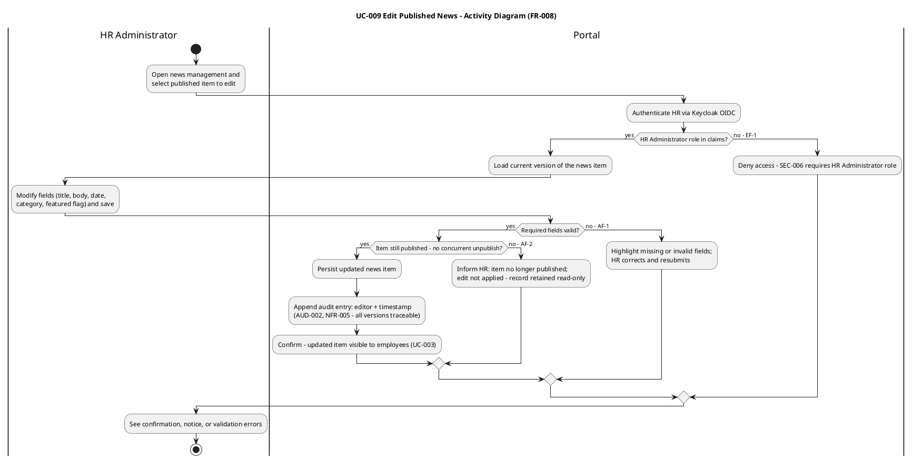

### UC-010: Unpublish News — FULL (architecturally significant)

| Field | Value |
|---|---|
| Primary Actor | HR Administrator (ACT-002) |
| Trigger | HR selects "Unpublish" on a published news item |
| Precondition | HR Administrator is authenticated with elevated role; news item is currently published |
| Postcondition | News item hidden from employees; record retained for audit trail; unpublish action audited |
| Source | FR-009 |

**Main Flow:**
1. HR Administrator opens news management.
2. System authenticates HR via Keycloak OIDC and verifies the HR Administrator role (`<<include>>` authentication; SEC-002).
3. System displays the list of published news items.
4. HR selects "Unpublish" on a specific news item.
5. System prompts for confirmation.
6. HR confirms the unpublish action.
7. System sets the news item's status to "unpublished" (soft delete — the record is NOT deleted).
8. System records the unpublish action in the audit trail: actor + timestamp (AUD-003, NFR-005).
9. System confirms the item is now hidden from employees (UC-003).

**Alternative Flows:**
- **AF-1: Cancel.** At step 5, HR cancels the confirmation; the item remains published, no change, no audit entry.
- **AF-2: Already unpublished.** At step 4, if the item is already unpublished, the "Unpublish" option is not shown.

**Scenarios (discovery walk):**
- **S1:** HR unpublishes an event announcement containing a typo → hidden from employees; record retained; audit shows actor + timestamp.
- **S2:** HR cancels at the confirmation prompt → item stays published, nothing recorded.
- **S3:** HR opens an item already unpublished → no "Unpublish" option offered (AF-2).

**Business rules:** CON-012 — no hard delete of a news item; unpublish hides it, the record stays for the audit trail. NFR-005 — the unpublish action is audited (actor + timestamp).

**Activity Diagram:**

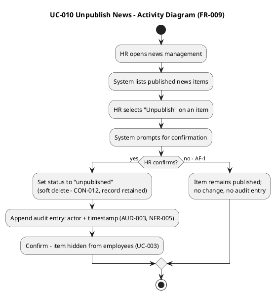

## Traceability

| Element | Traces From | Link Type | Traces To |
|---|---|---|---|
| UC-001 | FR-004 | Refines | Use-Case Realizations (Designer); Test priority 1 (Test Designer); R003/R004 PoCs (Architect) |
| UC-002 | FR-005 | Refines | Use-Case Realizations (Designer) |
| UC-003 | FR-007 | Refines | Use-Case Realizations (Designer) |
| UC-004 | FR-010 | Refines | Use-Case Realizations (Designer); Test priority 1 (Test Designer); R001 PoC (Architect) |
| UC-005 | FR-001 | Refines | Use-Case Realizations (Designer) |
| UC-006 | FR-002 | Refines | Use-Case Realizations (Designer); CSV column set v1 detailed (RS, Elab Iter 1) |
| UC-007 | FR-003 | Refines | Use-Case Realizations (Designer) |
| UC-008 | FR-006 | Refines | Use-Case Realizations (Designer) |
| UC-009 | FR-008 | Refines | Use-Case Realizations (Designer) |
| UC-010 | FR-009 | Refines | Use-Case Realizations (Designer); Test priority 1 (Test Designer); R006 (audit design) |
| ACT-001 | STK-003 | Derives | UC-001, UC-002, UC-003, UC-004 |
| ACT-002 | STK-001 | Derives | UC-005, UC-006, UC-007, UC-008, UC-009, UC-010 |
| ACT-003 | CON-005, CON-006 | Derives | UC-004, UC-005, UC-006, UC-007 (display data read on demand — Elaboration refinement) |
| ACT-004 | CON-004 | Derives | All UCs (<<include>> auth) |
| UC-001 AF-1 | NFR-004, AC-005 | Refines | Offline Sync Mechanism (Supplementary Specification; Architect — R004 PoC) |
| UC-001 AF-1 thresholds | NFR-004, AC-005, DAT-001 | Refines | REL-002, REL-003 (Supplementary Specification — quantified by RS, Elab Iter 1) |
| UC-001 timestamp convention | DAT-001 + stakeholder decisions (Elaboration Iter 1): store UTC, display office local timezone (America/Havana, IANA) | Refines | REL-002 timestamp convention (Supplementary Specification); UC-006 event_timestamp column |
| UC-001 AF-3 ignore window | NFR-002, FR-004 | Refines | PRF-002 (Supplementary Specification) |
| UC-002 EF-1 | NFR-004 | Refines | REL-002 (Supplementary Specification) |
| UC-003 EF-1 | NFR-004 | Refines | REL-002 (Supplementary Specification) |
| UC-004 AF-2 | R001 | Mitigates | LDAP attribute consistency PoC (Architect) |
| UC-005 EF-1 | SEC-006 | Refines | (Supplementary Specification — role enforcement) |
| UC-006 CSV column set | FR-002, CON-005, CON-006, INT-005 + stakeholder decisions (ISO-8601 offset export, local payroll day, office zone America/Havana) | Refines | STD-003 (CSV format); UC-006 AF-2 (abort on AD unavailable) |
| UC-009 EF-1 | SEC-006 | Refines | (Supplementary Specification — role enforcement) |