## Document Control
| Field | Value |
|---|---|
| Phase | Elaboration |
| Status | Draft — Reviewer verdict at the Elaboration Iter 2 LCA re-review: **Approved, zero findings** (all 10 UCs FULL with correct `Source: FR-NNN`; UC-004 AF-2 carries the behavioural bar with the S4 bar-walk; UC-005/006/007 AF-3 flows stakeholder-confirmed with markers retired in place; SB-05 storyboard added; activity diagrams complete for all 10 UCs). This revision (Iter 3) propagates the stakeholder's FOURTH behavioural-bar clause (A-25, System Analyst) and visualizes the featured-banner stacking contract (User Interface Designer — SB-03 frame 4, UC-003 compact reference, SCR-03 wireframe in the Design Model). **Iter 4 (preserved):** no finding or CR targets this artifact — UC specifications, flows, and activity diagrams PRESERVED verbatim; the User Interface Designer adds storyboards **SB-06 (UC-003 Browse News)** and **SB-07 (UC-009 Edit Published News)** per the Work Order instruction (storyboard completion for critical flows — the two critical flows that lacked full storyboards); Document Control milestone record updated to the observed validation state (record propagation only). **Iter 6 (preserved):** no finding or CR targets this artifact — zero findings across all five LCA review cycles (Iter 5 technical-lens verdict: PRESERVED — clean at all four prior LCA reviews, unchanged this pass); the ONE content delta is the same-pass record-propagation correction (R014 mitigation, per the DC's binding same-pass discipline): the Document Control milestone record's remainder-enumeration updated to the observed state; all UC specifications, flows, and activity diagrams preserved verbatim. **Iter 7 (this revision — R014 record-correction cycle, cycle 2):** UCM F1 (Minor, Reviewer lens, Iter 6 — post-write staleness subclass, confined to this Document Control record) RESOLVED via A-44: stale facts corrected (A-40/A-41 landed and ledger-closed 2026-09-03; live SCM census 1 open CR vehicle, not zero; zero-Critical held four consecutive cycles) and the remainder-enumeration replaced by an owner-reference per the stakeholder's Iter 6 convergence directive; NO UC-content change — all UC specifications, flows, activity diagrams, and storyboards preserved verbatim; UC content clean at all six LCA review cycles |
| Milestone Target | End of Elaboration (LCA) — NOT yet achieved; sanction still withheld on the stakeholder's all-findings directive. The empirical validation this artifact's flows specify is OBSERVED: formal TC-001…TC-023 pass complete — 15 PASS · 0 FAIL · 8 BLOCKED (the 8 BLOCKED are a recorded SCOPE decision, deferred to Construction, not missing — stakeholder framing directive, Iter 3); R001 FOUR clauses × FOUR consumers PASS (TC-011 + TC-021/022/023, clause (d) verified against substitution-attempt fixtures); R003 token-validation matrix PASS; R004 drop simulation PASS; execution trace CI run 33617748483; mechanisms merged (PRs #3/#4/#5 to iteration/E1 APPROVED ×3; PR #6 baseline-close to main APPROVED); Issue #1 closed. **Iter 7 correction (UCM F1 / A-44 — post-write staleness subclass):** A-40 (TES F4, Major) and A-41 (DC F5, Minor) landed and ledger-closed 2026-09-03 — the prior enumeration named both as remaining, stale; live SCM census at this revision: **1 open CR vehicle** (Issue #14 — cr:approved, assigned:test-manager; the CR vehicle for the ledger-closed TES F4/A-40, awaiting its cr:complete transition) and **5 closed** (Issues #1/#2/#9/#11/#12, all cr:complete) — the prior record claimed zero open, stale; zero Critical findings open (held four consecutive cycles). **Remaining pre-R6 work is not enumerated in this artifact:** per the stakeholder's Iter 6 directive (verbatim: "State the remaining work ONCE, in a single section that owns it. Every other place that needs it — Milestone Target, the master-workflow diagram, the schedule — references that section instead of restating it"), that state has a single owner — the Review Record findings ledger and the SCM issue tracker — and this record references that owner rather than restating its contents, because a document that copies another artifact's state drifts from it forever. The requirements baseline (UC content) carries zero open findings across all six LCA review cycles |
| Iteration | **Iter 7 (this revision — R014 record-correction cycle, cycle 2; System Analyst):** UCM F1 (Minor, Reviewer lens, Iter 6) resolved via A-44 — same-pass record correction confined to this Document Control record: stale facts corrected (A-40/A-41 landed and ledger-closed 2026-09-03; live census 1 open CR vehicle Issue #14, 5 closed; zero-Critical held four cycles) and the remainder-enumeration REPLACED by an owner-reference (Review Record findings ledger + SCM issues) per the stakeholder's Iter 6 convergence directive; NO UC specification, flow, activity diagram, actor behaviour, storyboard, or package-level content changed; the assigned UC slice remains NONE (stakeholder-confirmed R6 path: no code, no design, no new validation); remainder re-verified against the verified findings ledger and the live SCM census immediately before upsert. **Iter 6 (preserved — R014 record-correction cycle; Requirements Specifier):** same-pass record-propagation correction ONLY (R014 mitigation — the DC's binding same-pass discipline; the record-propagation defect class the Risk List registered with its trigger, which fired at the Iter 5 review): the Document Control milestone record's remainder-enumeration updated to the observed state — it still named the Iter 4 remainder (PoC results ledger A-32 + four Minor record corrections + PM close-pass), every item of which landed and ledger-closed at Iter 4, while A-37/A-38/A-39 landed and ledger-closed at Iter 5. The assigned iteration-6 UC slice is NONE per the Iteration Plan ("This pass's use-case scope: NONE" — the stakeholder-confirmed R6 path: no code, no design, no new validation); no UC specification, flow, activity diagram, actor behaviour, or package-level content changed; zero findings and zero CRs target this artifact (clean at all five LCA reviews). **Iter 4 (preserved):** record-propagation pass. This revision (System Analyst): **no UC model content changes** — zero findings and zero CRs target this artifact across all three full-coverage review cycles (Reviewer verdicts: Iter 1 Approved; Iter 2 Approved, zero findings; Iter 3 Approved, clean — A-25 fourth-clause propagation verified); the Document Control milestone record is updated to the observed validation state so this artifact does not lag the delivery it specifies (the same record-propagation class the Reviewer flagged on other artifacts). **This revision (User Interface Designer — Work Order instruction "Create storyboards visualizing critical use-case flows for stakeholder validation"):** storyboards **SB-06 (UC-003 Browse News — the BG-003 adoption gateway, carrying the stakeholder-decided featured-banner stacking contract)** and **SB-07 (UC-009 Edit Published News — the audited-edit flow, NFR-005/AUD-002)** added to §Use-Case Specifications → UI Flow References; the compact rows for UC-003 and UC-009 are absorbed into the storyboard tables; SB-01…SB-05, all UC specifications, flows, and activity diagrams preserved verbatim; Traceability rows added for SB-06/SB-07. **Iter 3 (preserved):** convergence cycle continuation. This revision (System Analyst — **A-25, fourth behavioural-bar clause propagation**, stakeholder contribution at the Iter 2 verdict gate, binding): **UC-004 AF-2, the R001 validation-bar record, and the S4 bar-walk extended from three to four clauses** — clause (d), verbatim: "a missing attribute is displayed as missing. It is never replaced by a default, a placeholder, a guessed value, or another employee's value"; **UC-005/006/007 AF-3 flows extended with the same fourth clause** (stakeholder: "Add a fourth clause to all four"); activity diagrams for UC-004/005/006/007, SB-02 frame 4, SB-05, and the compact UI flow references updated to render clause (d); Traceability rows updated. **User Interface Designer contribution (Iter 3):** the featured-banner stacking contract (stakeholder decision, Elaboration Iter 2, recorded verbatim: "newest first" — stack ALL featured banners, ordered newest first) is now visualized end-to-end — SB-03 frame 4 and the UC-003 compact reference state the stack contract explicitly (each featured item renders its own banner; no featured flag silently dropped), and the SCR-03 News Salt wireframe is added to the Design Model §Boundary Classes and Navigation Map; an Iter 3 evolution note records the change in §Use-Case Specifications → UI Flow References. **Iter 2 (preserved):** convergence-cycle disposition recorded; UC-004 AF-2 extended with the R001 behavioural validation bar (three clauses, stakeholder decision, Elaboration Iter 2); S4 bar-walk scenario added; RS contribution: UC-005/006/007 AF-3 flows (stakeholder-confirmed "Yes" — the bar applies to all four AD-reading use cases); UC-007 AF-2 formalized in its activity diagram; UI Designer contribution: storyboard SB-05 added; SB-01…SB-04 and compact references preserved. The prior >90% statistical criterion is dropped (invented, unsourceable). **Iter 1 (preserved):** all 10 UCs fully specified (was: 3 detailed / 7 outlined); AD display-data dependencies of UC-005/006/007 made explicit (CON-005, CON-006); offline clocking AF-1 confirmed in-scope by stakeholder; volatility updated with PoC learnings; RS additions (activity diagrams for all 10 UCs, exception flows, UC-001 AF-1 thresholds + AF-3 ignore window, UC-006 CSV column set v1); timestamp convention + America/Havana decided by stakeholder; invented office-location references removed |
| Elaboration Changes | **Iter 7 (this revision):** no UC-content change — the only delta is the Document Control milestone record correction (UCM F1 / A-44, post-write staleness subclass): the stale remainder-enumeration (which named A-40/A-41 as remaining after both landed and ledger-closed 2026-09-03) and the stale census claim (zero open SCM issues vs the live 1 open CR vehicle) corrected, and the remainder replaced by an owner-reference per the stakeholder's Iter 6 directive so this record cannot drift again; all UC specifications, flows, activity diagrams, and storyboards preserved verbatim. **Iter 6 (preserved):** no UC-content change — the only delta is the Document Control milestone record's remainder-enumeration corrected to the observed state (same-pass discipline, R014 mitigation; Requirements Specifier); all UC specifications, flows, activity diagrams, and storyboards preserved verbatim. **Iter 4 (preserved):** User Interface Designer — storyboards SB-06 (UC-003) and SB-07 (UC-009) added per the Work Order instruction; with them, every critical flow has a visual storyboard submitted for stakeholder validation: AC-001/AC-004 (SB-01), AC-003 (SB-02), AC-002 (SB-03), CON-012 (SB-04), the R001 four-clause bar (SB-05), the BG-003 adoption gateway (SB-06), the NFR-005 audit trail (SB-07). UC-002 remains compact-referenced (a read-only current-month table view — proportionality). All UC specifications, flows, and activity diagrams preserved verbatim (zero findings, zero CRs; A-25 verified complete at the Iter 3 review). **Iter 3 (preserved):** FOURTH behavioural-bar clause propagated (stakeholder contribution at the Iter 2 verdict gate — binding; tracked as A-25 in the Review Record): the R001 bar for all four AD-reading UCs is now **FOUR clauses** — (a) every employee is rendered whether or not their attributes are complete; (b) a missing attribute never removes someone from search results; (c) a missing attribute never raises an error; (d) a missing attribute is displayed as missing — never replaced by a default, a placeholder, a guessed value, or another employee's value. Stakeholder rationale, verbatim: "Blank is an answer. 'General', or the first office in the list, is a fabrication — and on the CSV that reaches payroll a fabricated department is worse than an empty cell. An empty cell gets questioned. A plausible wrong one does not." The first three clauses stop data from being LOST; the fourth stops it from being INVENTED. Featured-banner stacking contract visualized end-to-end (User Interface Designer, Iter 3): SB-03 frame 4 + UC-003 compact reference + SCR-03 wireframe (Design Model) — closing the visualization gap on the one stakeholder-decided UI contract two governance artifacts mis-transcribed in Iter 2 (Development Case F1, Risk List F2 — both Major, same defect class). **Iter 2 (preserved):** R001 validation bar decided by stakeholder — behavioural, not statistical; >90% figure dropped (invented; measured against self-seeded data it cannot fail); real-AD data-quality measurement moves to Construction (R011 residual, STK-004-dependent), excluded from the LCA evidence package; bar specified as one contract across all four AD-reading UCs (UC-004 declared home, FR-010; UC-005/006/007 stakeholder-confirmed "Yes"). **Iter 1 (preserved):** all 10 UCs fully specified; thresholds quantified (delegated to RS by recorded stakeholder decision); timestamp convention + America/Havana incorporated; markers retired in place |
## Use-Case Diagram

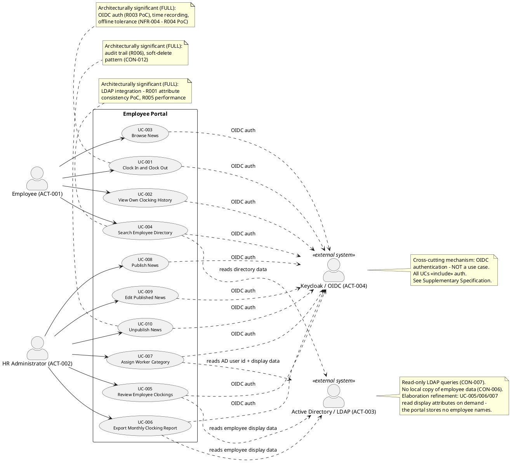
```plantuml
@startuml
left to right direction
skinparam packageStyle rectangle
skinparam actorStyle awesome
skinparam usecaseFontSize 11

rectangle "Employee Portal" {
  usecase "UC-001\nClock In and Clock Out" as UC001
  usecase "UC-002\nView Own Clocking History" as UC002
  usecase "UC-003\nBrowse News" as UC003
  usecase "UC-004\nSearch Employee Directory" as UC004
  usecase "UC-005\nReview Employee Clockings" as UC005
  usecase "UC-006\nExport Monthly Clocking Report" as UC006
  usecase "UC-007\nAssign Worker Category" as UC007
  usecase "UC-008\nPublish News" as UC008
  usecase "UC-009\nEdit Published News" as UC009
  usecase "UC-010\nUnpublish News" as UC010
}

actor "Employee (ACT-001)" as EMP
actor "HR Administrator (ACT-002)" as HR
actor "Active Directory / LDAP (ACT-003)" as AD <<external system>>
actor "Keycloak / OIDC (ACT-004)" as KC <<external system>>

EMP --> UC001
EMP --> UC002
EMP --> UC003
EMP --> UC004

HR --> UC005
HR --> UC006
HR --> UC007
HR --> UC008
HR --> UC009
HR --> UC010

UC004 ..> AD : reads directory data
UC005 ..> AD : reads employee display data
UC006 ..> AD : reads employee display data
UC007 ..> AD : reads AD user id + display data

UC001 ..> KC : OIDC auth
UC002 ..> KC : OIDC auth
UC003 ..> KC : OIDC auth
UC004 ..> KC : OIDC auth
UC005 ..> KC : OIDC auth
UC006 ..> KC : OIDC auth
UC007 ..> KC : OIDC auth
UC008 ..> KC : OIDC auth
UC009 ..> KC : OIDC auth
UC010 ..> KC : OIDC auth

note bottom of UC001
  Architecturally significant (FULL):
  OIDC auth (R003 PoC), time recording,
  offline tolerance (NFR-004 - R004 PoC)
end note

note bottom of UC004
  Architecturally significant (FULL):
  LDAP integration - R001 attribute
  consistency PoC, R005 performance
end note

note bottom of UC010
  Architecturally significant (FULL):
  audit trail (R006), soft-delete
  pattern (CON-012)
end note

note right of AD
  Read-only LDAP queries (CON-007).
  No local copy of employee data (CON-006).
  Elaboration refinement: UC-005/006/007
  read display attributes on demand -
  the portal stores no employee names.
end note

note right of KC
  Cross-cutting mechanism: OIDC
  authentication - NOT a use case.
  All UCs <<include>> auth.
  See Supplementary Specification.
end note
@enduml
```

**System boundary:** The rectangle encloses all 10 use cases — the complete declared scope (10 UCs map 1:1 to the 10 declared FRs; confirmed Inception decision). Keycloak (OIDC) and Active Directory (LDAP) are external actors ON the boundary — the portal is a client of both, never manages either. Authentication is a cross-cutting mechanism (`<<include>>` from all UCs), not a standalone use case. Nothing enters the boundary without a declared FR; no 11th use case exists.

## Actors

| ID | Actor | Type | Description | Scope |
|---|---|---|---|---|
| ACT-001 | Employee | Human (primary) | 200 corporate employees across 3 offices. Authenticates with corporate credentials. Clocks in/out, views own history, browses news, searches directory. | In |
| ACT-002 | HR Administrator | Human (primary) | HR staff with elevated Keycloak role. Reviews all clockings, exports CSV reports, assigns worker categories, manages full news lifecycle. | In |
| ACT-003 | Active Directory (LDAP) | External system | System of record for employee corporate data (name, job title, department, office, email, extension). Queried read-only on demand via LDAP. | Out (boundary) |
| ACT-004 | Keycloak (OIDC) | External system | Existing identity provider. Authenticates users via OIDC; provides roles as claims. Not deployed or managed by this project. | Out (boundary) |

**Elaboration actor-discovery check (heuristic 8):** (a) direct human actors — Employee, HR Administrator, both covered; (b) external integrating systems — AD, Keycloak, both on the boundary; (c) time-based triggers — none declared (no batch jobs, no scheduled reports; news sorting is on-demand reads); (d) hardware devices — none declared (biometric clocking explicitly excluded); (e) administrative actors — the Infrastructure Team (STK-004) operates AD/Keycloak but explicitly performs NO portal interaction and takes on NO new operational work (CON-014), so it is a negative stakeholder, not an actor. **Actor set is complete and unchanged from Inception.**

## Use-Case Survey

| UC | Name | Primary Actor | Source | MoSCoW | Volatility | Depth (Elab Iter 1) | Arch-Significant |
|---|---|---|---|---|---|---|---|
| UC-001 | Clock In and Clock Out | Employee | FR-004 | Must | Low | **Full** | **Yes** — OIDC (R003 PoC), offline sync (R004 PoC), time recording |
| UC-002 | View Own Clocking History | Employee | FR-005 | Must | Low | **Full** | No |
| UC-003 | Browse News | Employee | FR-007 | Must | Low | **Full** | No |
| UC-004 | Search Employee Directory | Employee | FR-010 | Must | Medium | **Full** | **Yes** — LDAP integration (R001 PoC, R005) |
| UC-005 | Review Employee Clockings | HR Administrator | FR-001 | Must | Low | **Full** | No (consumes LDAP + auth mechanisms) |
| UC-006 | Export Monthly Clocking Report | HR Administrator | FR-002 | Must | Medium | **Full** | No (consumes LDAP + auth mechanisms; CSV format volatile) |
| UC-007 | Assign Worker Category | HR Administrator | FR-003 | Must | Medium | **Full** | No (consumes LDAP + audit mechanisms; external config) |
| UC-008 | Publish News | HR Administrator | FR-006 | Must | Low | **Full** | No (consumes audit mechanism) |
| UC-009 | Edit Published News | HR Administrator | FR-008 | Must | Low | **Full** | No (consumes audit mechanism — versioned trail) |
| UC-010 | Unpublish News | HR Administrator | FR-009 | Must | Low | **Full** | **Yes** — audit trail (R006), soft-delete pattern (CON-012) |

**Architectural significance (unchanged from Inception baseline):** UC-001, UC-004, UC-010 force architectural decisions (OIDC client design, offline sync mechanism, LDAP query strategy, audit/soft-delete persistence pattern) and are the first test targets (Elaboration test priority: UC-001, UC-004, UC-010). UC-005/006/007/008/009 consume the same cross-cutting mechanisms already forced by the significant three — they add no new architectural decision.

**Volatility rationale (updated with Elaboration PoC learnings):**
- **UC-004 (Medium):** R001 — LDAP attribute population may vary across the 3 offices; the R001 PoC may change the query/fallback strategy. Encapsulate the LDAP query strategy in a dedicated component.
- **UC-006 (Medium):** CSV column set is volatile — downstream payroll/records consumers may reshape it. RS details the columns; the export format must be encapsulated.
- **UC-007 (Medium):** The category list source is externally configured (CON-013); the configuration mechanism (file, table, setting) is an Architect decision and may change without portal code changes.
- All remaining UCs: **Low** — stable, declared, single-customer behavior.

## Use-Case Specifications
### UC-001: Clock In and Clock Out — FULL (architecturally significant)

| Field | Value |
|---|---|
| Primary Actor | Employee (ACT-001) |
| Trigger | Employee navigates to the portal main page |
| Precondition | Employee is authenticated via Keycloak OIDC |
| Postcondition | Exactly one clocking event (in or out) is persisted with exact timestamp; confirmation displayed |
| Source | FR-004 |

**Main Flow:**
1. Employee navigates to the portal main page.
2. System authenticates the employee via Keycloak OIDC (`<<include>>` authentication; AF-2 if session expired).
3. System checks the employee's current clocking status (clocked in or not).
4. System displays the main screen with either a "Clock In" or "Clock Out" button matching the current status.
5. Employee presses the button.
6. System records the exact timestamp of the event.
7. System persists the clocking event to the PostgreSQL database (AF-1 if the portal server is unreachable).
8. System displays a confirmation with the recorded time.

**Alternative Flows:**
- **AF-1: Network disruption (NFR-004, AC-005).** At step 7, if the network is temporarily unavailable, the system queues the clocking locally with the recorded timestamp and syncs it to the database once connectivity is restored. The confirmation at step 8 is shown from the queued data so the employee sees immediate feedback. *Stakeholder decision recorded: this mechanism is architectural, within declared scope — design ownership: Software Architect (R004 PoC); thresholds (max queue size, sync timeout, conflict policy): Requirements Specifier.*
- **AF-2: Session expired.** At step 2, if the OIDC session has expired, the system redirects to Keycloak for re-authentication before proceeding.
- **AF-3: Repeated press.** At step 5, presses repeated before the status refreshes are treated as a single transition (the button is status-aware; a stray second press must not produce an accidental opposite event). **Ignore window: 2 seconds** — a second press within 2 seconds of the first is treated as the same transition and produces no additional event. [ASSUMPTION — requires validation] Basis: 2 × the NFR-002 response budget of 1 second — a stray repeat lands inside the response window; a deliberate opposite transition cannot occur before the status refreshes.

**AF-1 quantified thresholds (Requirements Specifier, Elaboration Iter 1 — per the recorded stakeholder decision delegating threshold quantification to this role):**

| Threshold | Value | Source / Basis |
|---|---|---|
| Offline tolerance window | Network disruptions of at least 5 minutes are tolerated; queued events are never lost | AC-005 (declared) |
| Per-client queue capacity | ≥ 10 clocking events per employee browser | [ASSUMPTION — requires validation] Basis: at most 2 transitions per employee per workday (FR-004 in/out); 10 events covers 5 full workdays of total outage — far beyond the declared 5-minute window |
| Sync completion | All queued events persisted ≤ 60 seconds after connectivity is restored | [ASSUMPTION — requires validation] Basis: worst case 200 employees × 1 queued event each (STK-003 population), small records, restored corporate LAN |
| Conflict policy | Idempotent: an exact duplicate (same employee, same event type, same recorded timestamp) is rejected, never duplicated; events are ordered by recorded timestamp, not arrival order | DAT-001 (timestamp fixed at button press), AF-3 |
| Timestamp convention | Queued timestamps are captured at the moment of the button press, stored in UTC, and persisted unchanged on sync; displayed in the office local timezone (America/Havana, IANA — stakeholder decision, Elaboration Iter 1). All 3 offices share this one timezone (stakeholder-confirmed) | DAT-001; stakeholder decisions (Elaboration Iter 1): "store every clocking timestamp in UTC, display it in the office local timezone" — office local zone: America/Havana (IANA identifier, DST-aware) |

**Scenarios (discovery walk):**
- **S1:** María (Employee) opens the portal at 08:58, sees "Clock In", presses → confirmation "Clocked in at 08:58:12".
- **S2:** At 17:30 she returns; the button now reads "Clock Out"; she presses → confirmation; her history (UC-002) shows both events.
- **S3:** The network drops at 09:00 for 5 minutes; Luis presses "Clock In" during the outage → confirmation is shown from the queued data; the event syncs when connectivity returns (AC-005).
- **S4 (threshold walk):** Luis double-presses "Clock In" 0.8 s apart → one event only (AF-3, 2 s window); the stray press is ignored.

**Activity Diagram:**

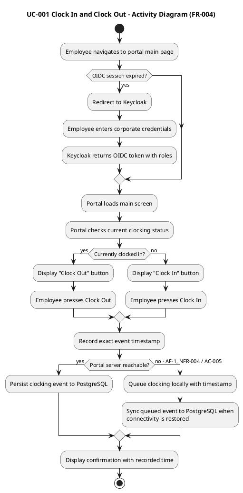
```plantuml
@startuml
title UC-001 Clock In and Clock Out - Activity Diagram (FR-004)
start
:Employee navigates to portal main page;
if (OIDC session expired?) then (yes)
  :Redirect to Keycloak;
  :Employee enters corporate credentials;
  :Keycloak returns OIDC token with roles;
endif
:Portal loads main screen;
:Portal checks current clocking status;
if (Currently clocked in?) then (yes)
  :Display "Clock Out" button;
  :Employee presses Clock Out;
else (no)
  :Display "Clock In" button;
  :Employee presses Clock In;
endif
:Record exact event timestamp;
if (Portal server reachable?) then (yes)
  :Persist clocking event to PostgreSQL;
else (no - AF-1, NFR-004 / AC-005)
  :Queue clocking locally with timestamp;
  :Sync queued event to PostgreSQL when\nconnectivity is restored;
endif
:Display confirmation with recorded time;
stop
@enduml
```

### UC-002: View Own Clocking History — FULL

| Field | Value |
|---|---|
| Primary Actor | Employee (ACT-001) |
| Trigger | Employee selects "My Clocking History" |
| Precondition | Employee is authenticated |
| Postcondition | The employee's own clocking history for the current month is displayed |
| Source | FR-005 |

**Main Flow:**
1. Employee selects "My Clocking History".
2. System authenticates the employee via Keycloak OIDC (`<<include>>` authentication).
3. System queries the employee's own clocking events for the current month from PostgreSQL.
4. System displays the list of in/out timestamps.
5. Employee reviews their history.

**Alternative Flows:**
- **AF-1: No events this month.** At step 3, if no events exist for the current month, the system displays an empty-state message.
- **AF-2: Offline-queued events not yet synced.** Events queued locally under UC-001 AF-1 appear in the history only once the sync completes; until then the history reflects the last synced state.

**Exception Flows:**
- **EF-1: PostgreSQL unreachable.** At step 3, if the portal database cannot be reached, the system displays "History temporarily unavailable" and shows no partial or cached list (NFR-004 fault tolerance; no local copy of portal data exists to fall back on). The employee may retry; locally queued, not-yet-synced events (AF-2) are unaffected.

**Scope notes:** Current month only (declared). Read-only — no editing, no export from this view. The employee sees only their own events (SEC-007).

**Activity Diagram:**

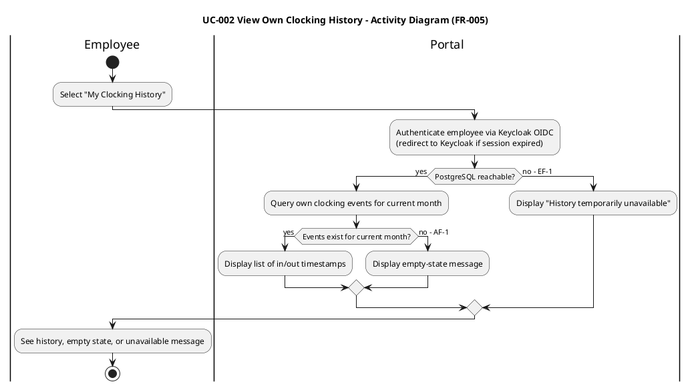
```plantuml
@startuml
title UC-002 View Own Clocking History - Activity Diagram (FR-005)
|Employee|
start
:Select "My Clocking History";
|Portal|
:Authenticate employee via Keycloak OIDC\n(redirect to Keycloak if session expired);
if (PostgreSQL reachable?) then (yes)
  :Query own clocking events for current month;
  if (Events exist for current month?) then (yes)
    :Display list of in/out timestamps;
  else (no - AF-1)
    :Display empty-state message;
  endif
else (no - EF-1)
  :Display "History temporarily unavailable";
endif
|Employee|
:See history, empty state, or unavailable message;
stop
@enduml
```

### UC-003: Browse News — FULL

| Field | Value |
|---|---|
| Primary Actor | Employee (ACT-001) |
| Trigger | Employee navigates to the main page or news section |
| Precondition | Employee is authenticated |
| Postcondition | News list displayed, sorted by date (newest first) |
| Source | FR-007 |

**Main Flow:**
1. Employee navigates to the main page or news section.
2. System authenticates the employee via Keycloak OIDC (`<<include>>` authentication).
3. System loads published news items sorted by date (newest first).
4. System displays featured news with a banner at the top.
5. Employee optionally selects a category filter (General, HR, IT, Events).
6. System displays the filtered list.

**Alternative Flows:**
- **AF-1: Filter yields no items.** At step 6, if the selected category has no published items, the system displays "No news in this category."
- **AF-2: No published news at all.** At step 3, if no published items exist, the system displays an empty-state message.

**Exception Flows:**
- **EF-1: PostgreSQL unreachable.** At step 3, if the portal database cannot be reached, the system displays "News temporarily unavailable" and shows no partial list (NFR-004 fault tolerance).

**Scope notes:** Read-only for employees — no comments, no reactions (declared). Unpublished items (UC-010) are never shown here.

**Activity Diagram:**

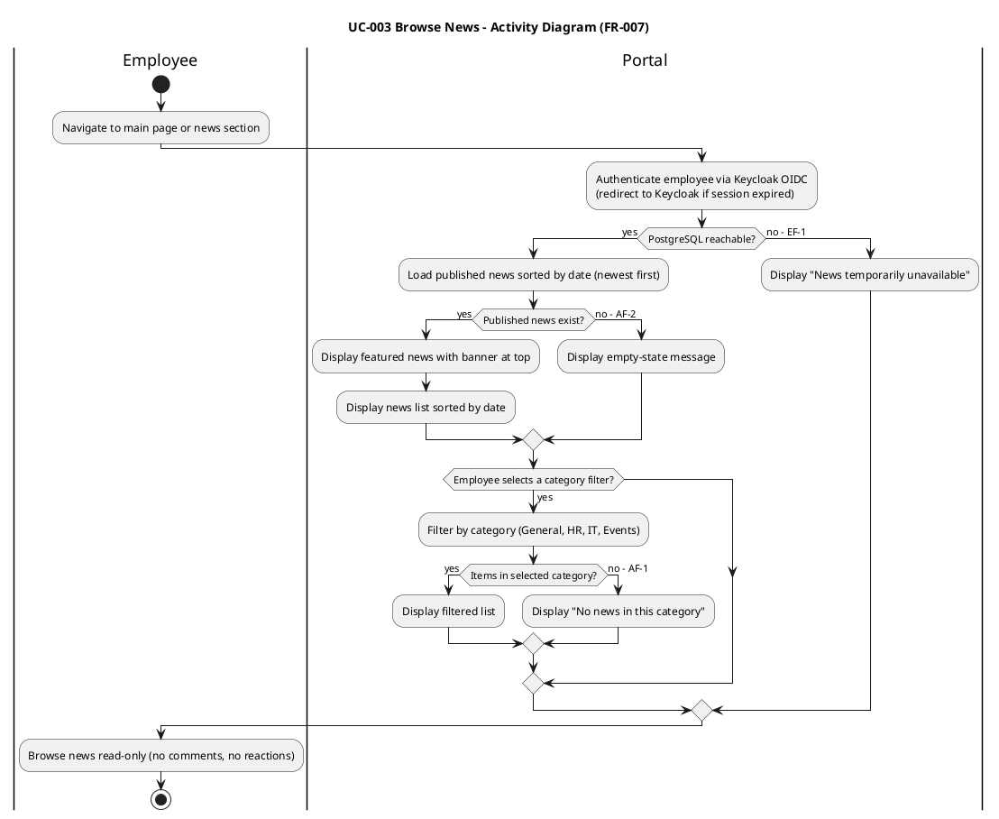
```plantuml
@startuml
title UC-003 Browse News - Activity Diagram (FR-007)
|Employee|
start
:Navigate to main page or news section;
|Portal|
:Authenticate employee via Keycloak OIDC\n(redirect to Keycloak if session expired);
if (PostgreSQL reachable?) then (yes)
  :Load published news sorted by date (newest first);
  if (Published news exist?) then (yes)
    :Display featured news with banner at top;
    :Display news list sorted by date;
  else (no - AF-2)
    :Display empty-state message;
  endif
  if (Employee selects a category filter?) then (yes)
    :Filter by category (General, HR, IT, Events);
    if (Items in selected category?) then (yes)
      :Display filtered list;
    else (no - AF-1)
      :Display "No news in this category";
    endif
  endif
else (no - EF-1)
  :Display "News temporarily unavailable";
endif
|Employee|
:Browse news read-only (no comments, no reactions);
stop
@enduml
```

### UC-004: Search Employee Directory — FULL (architecturally significant)

| Field | Value |
|---|---|
| Primary Actor | Employee (ACT-001) |
| Trigger | Employee enters search criteria in the directory search field |
| Precondition | Employee is authenticated via Keycloak OIDC |
| Postcondition | Matching colleague entries displayed with corporate data |
| Source | FR-010 |

**Main Flow:**
1. Employee navigates to the directory search page.
2. System authenticates the employee via Keycloak OIDC (`<<include>>` authentication).
3. Employee enters search criteria: name, department, or office.
4. System queries Active Directory over LDAP with the search criteria (read-only, on demand — no local copy, CON-006).
5. AD returns matching entries with corporate attributes: name, job title, department, office, email, extension phone number.
6. System displays the results in a list.
7. Employee views the desired colleague's contact information.

**Alternative Flows:**
- **AF-1: No results.** At step 5, if AD returns no matches, the system displays "No colleagues found" with a suggestion to refine the search.
- **AF-2: LDAP attribute missing (R001).** At step 5, if a returned entry has missing attributes (e.g., extension not populated), the system displays the available fields and leaves missing fields blank rather than hiding the entry. **R001 behavioural bar (stakeholder decision, Elaboration Iter 2; fourth clause added at the Iter 2 verdict gate, propagated Iter 3) — all four clauses hold:** (a) every employee is rendered whether or not their attributes are complete; (b) a missing attribute never removes someone from search results; (c) a missing attribute never raises an error; (d) **a missing attribute is displayed as missing. It is never replaced by a default, a placeholder, a guessed value, or another employee's value.**
- **AF-3: LDAP connection failure.** At step 4, if the LDAP connection fails, the system displays "Directory temporarily unavailable." There is no local fallback — CON-006 forbids a local copy of employee data.

**R001 empirical validation bar (stakeholder decision, Elaboration Iter 2 — replaces the prior >90% statistical criterion, which is dropped as invented; fourth clause added at the Iter 2 verdict gate, propagated Iter 3):** The bar is **behavioural, not statistical**. The prior ">90% of sampled users per office with all six corporate attributes populated" figure had no declared source (the declared R001 names no percentage; the PoC decision names none) and, measured against a disposable directory the team seeds itself, it would measure the team's own test data — it cannot fail, so it proves nothing. The architectural risk is what the portal DOES when an attribute is absent, not how many attributes are missing (a property of the real directory nobody can know until STK-004 delivers). **The bar, in the stakeholder's words:** "every employee is rendered whether or not their attributes are complete; a missing attribute never removes someone from search results; a missing attribute never raises an error. Seed the gaps deliberately and prove those three hold. That retires R001 empirically, this phase, without the production directory." **Fourth clause (stakeholder contribution at the Iter 2 verdict gate, verbatim):** "a missing attribute is displayed as missing. It is never replaced by a default, a placeholder, a guessed value, or another employee's value." With the stakeholder's stated rationale, verbatim: "Blank is an answer. 'General', or the first office in the list, is a fabrication — and on the CSV that reaches payroll a fabricated department is worse than an empty cell. An empty cell gets questioned. A plausible wrong one does not." The first three clauses stop data from being LOST; the fourth stops it from being INVENTED. The percentage belongs to a different activity — measuring the real AD's data quality once STK-004 delivers — tracked in Construction (R011 residual), kept out of the LCA evidence package.

**Scenarios (discovery walk):**
- **S1:** Employee searches "Gómez" → sees all colleagues named Gómez with their title, department, office, email, and extension.
- **S2:** Employee filters by department "IT" → sees all IT department colleagues.
- **S3:** Employee searches by office → sees all colleagues in that office; some entries have missing extension numbers (R001) and show blank fields, not hidden entries.
- **S4 (R001 bar walk, Elaboration Iter 2; clause d added Iter 3):** The disposable directory is deliberately seeded with gaps — one entry missing extension, one missing job title, one missing department. A search matching all three returns all three entries (clause a); none is removed from the results (clause b); no error is raised and the missing fields render blank (clause c); and the rendered value for each missing field is blank — never a default, a placeholder, a guessed value, or another employee's value (clause d — the fixture seeds substitution attempts, e.g. a default category or a first-office fallback, so the clause can actually fail). The same search against a fully-populated disposable directory renders identically for the complete entries.

**Activity Diagram:**

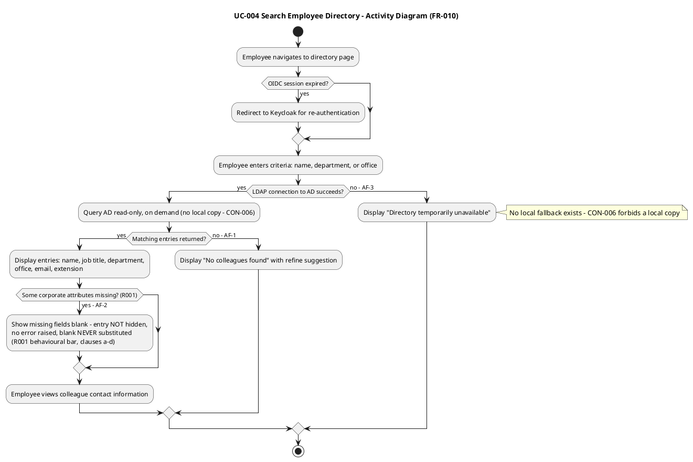
```plantuml
@startuml
title UC-004 Search Employee Directory - Activity Diagram (FR-010)
start
:Employee navigates to directory page;
if (OIDC session expired?) then (yes)
  :Redirect to Keycloak for re-authentication;
endif
:Employee enters criteria: name, department, or office;
if (LDAP connection to AD succeeds?) then (yes)
  :Query AD read-only, on demand (no local copy - CON-006);
  if (Matching entries returned?) then (yes)
    :Display entries: name, job title, department,\noffice, email, extension;
    if (Some corporate attributes missing? (R001)) then (yes - AF-2)
      :Show missing fields blank - entry NOT hidden,\nno error raised, blank NEVER substituted\n(R001 behavioural bar, clauses a-d);
    endif
    :Employee views colleague contact information;
  else (no - AF-1)
    :Display "No colleagues found" with refine suggestion;
  endif
else (no - AF-3)
  :Display "Directory temporarily unavailable";
  note right: No local fallback exists - CON-006 forbids a local copy
endif
stop
@enduml
```

### UC-005: Review Employee Clockings — FULL

| Field | Value |
|---|---|
| Primary Actor | HR Administrator (ACT-002) |
| Trigger | HR navigates to the clocking review page |
| Precondition | HR Administrator is authenticated with elevated role (SEC-002) |
| Postcondition | All employees' clockings displayed for review |
| Source | FR-001 |

**Main Flow:**
1. HR Administrator navigates to the clocking review page.
2. System authenticates HR via Keycloak OIDC and verifies the HR Administrator role (`<<include>>` authentication; SEC-002).
3. System loads clocking events for all employees from PostgreSQL.
4. HR optionally filters by employee and/or date range.
5. System displays the matching events, with employee display data (name, etc.) read from Active Directory on demand (CON-005, CON-006 — the portal stores no employee names).

**Alternative Flows:**
- **AF-1: No events match the filter.** At step 5, the system displays a message that no clocking records match.
- **AF-2: AD unavailable.** At step 5, events remain viewable from PostgreSQL (they are portal data), but employee display attributes cannot be resolved; the system shows the AD user id and marks display attributes as unavailable. No local fallback exists (CON-006).
- **AF-3: AD attribute missing (R001) — stakeholder-confirmed (Elaboration Iter 2); fourth clause added at the Iter 2 verdict gate, propagated Iter 3.** At step 5, if a matching employee's AD display attributes are partially populated (e.g., department or office missing), the event row is displayed with the missing display fields blank — the employee is NOT removed from the review and no error is raised. **A missing attribute is displayed as missing: it is never replaced by a default, a placeholder, a guessed value, or another employee's value.** The clocking data itself (event type, timestamp) is always complete: it is portal data from PostgreSQL, never AD data. *Confirmation recorded:* asked whether the R001 behavioural bar applies to all four AD-reading use cases and not only the directory search, the stakeholder answered **"Yes"** — this flow is a confirmed requirement. *Fourth clause recorded:* the stakeholder directed "Add a fourth clause to all four" at the Iter 2 verdict gate. *Rationale:* the R001 behavioural bar (stakeholder decision, Elaboration Iter 2; extended Iter 3) governs what the portal does when an attribute is absent — every employee is rendered whether or not their attributes are complete; a missing attribute never removes someone from results; a missing attribute never raises an error; a missing attribute is displayed as missing, never substituted — and UC-005 reads the same AD attributes through the same LDAP Query Mechanism as UC-004.

**Exception Flows:**
- **EF-1: Role denial.** At step 2, if the authenticated session holds only the Employee role, the system denies access to the clocking review page (SEC-006). No clocking data for other employees is revealed.

**Activity Diagram:**

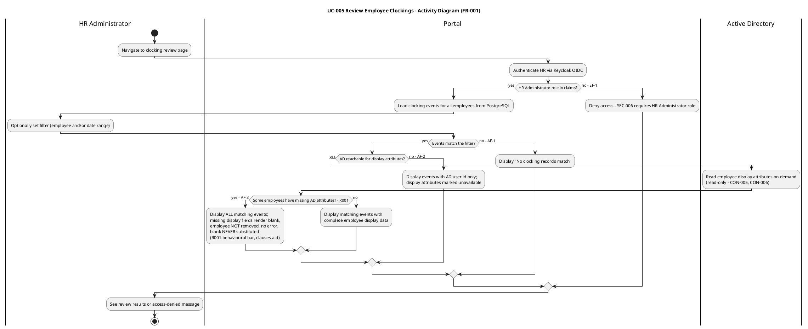
```plantuml
@startuml
title UC-005 Review Employee Clockings - Activity Diagram (FR-001)
|HR Administrator|
start
:Navigate to clocking review page;
|Portal|
:Authenticate HR via Keycloak OIDC;
if (HR Administrator role in claims?) then (yes)
  :Load clocking events for all employees from PostgreSQL;
  |HR Administrator|
  :Optionally set filter (employee and/or date range);
  |Portal|
  if (Events match the filter?) then (yes)
    if (AD reachable for display attributes?) then (yes)
      |Active Directory|
      :Read employee display attributes on demand\n(read-only - CON-005, CON-006);
      |Portal|
      if (Some employees have missing AD attributes? - R001) then (yes - AF-3)
        :Display ALL matching events;\nmissing display fields render blank,\nemployee NOT removed, no error,\nblank NEVER substituted\n(R001 behavioural bar, clauses a-d);
      else (no)
        :Display matching events with\ncomplete employee display data;
      endif
    else (no - AF-2)
      :Display events with AD user id only;\ndisplay attributes marked unavailable;
    endif
  else (no - AF-1)
    :Display "No clocking records match";
  endif
else (no - EF-1)
  :Deny access - SEC-006 requires HR Administrator role;
endif
|HR Administrator|
:See review results or access-denied message;
stop
@enduml
```

### UC-006: Export Monthly Clocking Report — FULL

| Field | Value |
|---|---|
| Primary Actor | HR Administrator (ACT-002) |
| Trigger | HR selects a month and "Export CSV" |
| Precondition | HR Administrator is authenticated with elevated role (SEC-002) |
| Postcondition | CSV file with the month's clocking data delivered to HR |
| Source | FR-002 |

**Main Flow:**
1. HR Administrator selects a month and "Export CSV" from the clocking review area.
2. System authenticates HR via Keycloak OIDC and verifies the HR Administrator role (`<<include>>` authentication; SEC-002).
3. System compiles all clocking events for the selected month from PostgreSQL (one row per event).
4. System reads employee display attributes from Active Directory on demand (CON-005, CON-006).
5. System generates the CSV file.
6. System delivers the CSV download to HR.

**Alternative Flows:**
- **AF-1: No events for the month.** At step 3, if no clocking records exist for the selected month, the system informs HR and produces no file.
- **AF-2: AD unavailable.** At step 4, if AD cannot be reached, the system aborts the export with "Directory temporarily unavailable" — no partial file is produced (a report with unresolved employee identities would be misleading for payroll/records use).
- **AF-3: AD attribute missing (R001) — stakeholder-confirmed (Elaboration Iter 2); fourth clause added at the Iter 2 verdict gate, propagated Iter 3.** At step 4, if an employee's AD display attributes are partially populated, the export proceeds: every event row is present, and the missing display fields (employee_name, department, office) are written as blank cells — no abort, no error. **A missing attribute is written as missing: it is never replaced by a default, a placeholder, a guessed value, or another employee's value.** The row's identity is never in doubt: `ad_user_id` (column 1) is the identifier the portal itself stores (CON-006) and is always present; the clocking columns (event_timestamp, event_type) are portal data and always complete. *Confirmation recorded:* asked whether the R001 behavioural bar applies to all four AD-reading use cases and not only the directory search, the stakeholder answered **"Yes"** — this flow is a confirmed requirement. *Fourth clause recorded:* the stakeholder directed "Add a fourth clause to all four" at the Iter 2 verdict gate, with the rationale, verbatim: "on the CSV that reaches payroll a fabricated department is worse than an empty cell. An empty cell gets questioned. A plausible wrong one does not." *Rationale:* the R001 behavioural bar (stakeholder decision, Elaboration Iter 2; extended Iter 3) governs what the portal does when an attribute is absent — every employee is rendered, a missing attribute never removes someone, a missing attribute never raises an error, a missing attribute is displayed as missing, never substituted — and UC-006 reads the same AD attributes through the same LDAP Query Mechanism as UC-004. AF-2 (AD unreachable) and AF-3 (individual attributes missing) are distinct conditions with distinct contracts: AF-2 aborts because NO identity data can be resolved; AF-3 exports because the identity (ad_user_id) is resolved and only display fields are blank.

**CSV column set v1 (Requirements Specifier, Elaboration Iter 1) — one row per clocking event, columns in this order:**

| # | Column | Content | Source |
|---|---|---|---|
| 1 | ad_user_id | AD user id of the employee | CON-006 (the only employee identifier the portal stores) |
| 2 | employee_name | Full name, read from AD on demand | CON-005, FR-010 attribute set |
| 3 | department | Department, read from AD on demand | CON-005, FR-010 |
| 4 | office | Office, read from AD on demand | CON-005, FR-010 |
| 5 | event_timestamp | Event time in ISO-8601 with explicit offset, America/Havana local time (format YYYY-MM-DDThh:mm:ss±hh:mm; the offset is the one in force at the event time per the IANA zone database) | FR-004 recorded timestamp (stored UTC); stakeholder decisions (Elaboration Iter 1) |
| 6 | event_type | IN or OUT | FR-004 |

**CSV scope notes:** Job title, email, and extension are excluded — they are directory attributes (FR-010), not clocking data. Timestamps are stored in UTC and exported in ISO-8601 with an explicit offset in America/Havana local time (IANA identifier, DST-aware — a fixed offset would silently shift the payroll day boundary when the clocks change); the selected month's boundaries are computed in America/Havana local time — the payroll day is the local calendar day, never the server's (stakeholder decisions, Elaboration Iter 1). All 3 offices share this one timezone (stakeholder-confirmed). Volatility: Medium — downstream payroll/records consumers may reshape the column set; the export format must be encapsulated so column changes do not ripple (Use-Case Survey volatility rationale). AF-2 guarantees no partial file when AD is unreachable; AF-3 guarantees every event row is present when individual attributes are missing (blank cells, no abort — the row identity is carried by ad_user_id; per clause d, a blank cell is the written value, never a substituted one). Export is HR-only; employees have no export (FR-005 is view-only).

**Activity Diagram:**

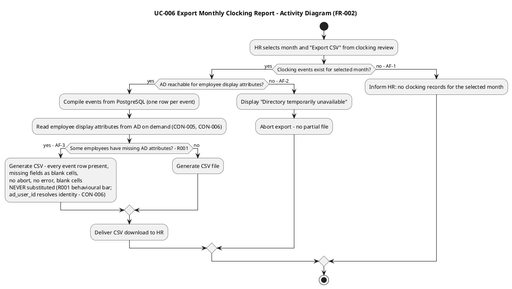
```plantuml
@startuml
title UC-006 Export Monthly Clocking Report - Activity Diagram (FR-002)
start
:HR selects month and "Export CSV" from clocking review;
if (Clocking events exist for selected month?) then (yes)
  if (AD reachable for employee display attributes?) then (yes)
    :Compile events from PostgreSQL (one row per event);
    :Read employee display attributes from AD on demand (CON-005, CON-006);
    if (Some employees have missing AD attributes? - R001) then (yes - AF-3)
      :Generate CSV - every event row present,\nmissing fields as blank cells,\nno abort, no error, blank cells\nNEVER substituted (R001 behavioural bar;\nad_user_id resolves identity - CON-006);
    else (no)
      :Generate CSV file;
    endif
    :Deliver CSV download to HR;
  else (no - AF-2)
    :Display "Directory temporarily unavailable";
    :Abort export - no partial file;
  endif
else (no - AF-1)
  :Inform HR: no clocking records for the selected month;
endif
stop
@enduml
```

### UC-007: Assign Worker Category — FULL

| Field | Value |
|---|---|
| Primary Actor | HR Administrator (ACT-002) |
| Trigger | HR selects an employee and assigns a category |
| Precondition | HR Administrator is authenticated with elevated role; fixed category list available from external configuration (CON-013) |
| Postcondition | AD user id → category mapping persisted; change audited |
| Source | FR-003 |

**Main Flow:**
1. HR Administrator opens the worker category page.
2. System authenticates HR via Keycloak OIDC and verifies the HR Administrator role (`<<include>>` authentication; SEC-002).
3. HR locates the employee by browsing display data read from Active Directory on demand (read-only, CON-007).
4. System loads the fixed worker category list from the external configuration (CON-013).
5. HR selects a category and confirms.
6. System persists the AD user id → category mapping (two columns only — CON-006).
7. System appends an audit entry: actor + timestamp + old value + new value (AUD-004, NFR-005).
8. System confirms the assignment to HR.

**Alternative Flows:**
- **AF-1: Same category re-selected.** At step 5, if the selected category equals the current value, nothing is persisted and no audit entry is written (NFR-005 audits *changes*).
- **AF-2: AD unavailable.** At step 3, employee lookup is blocked; the system informs HR that the directory is temporarily unavailable. The assignment cannot proceed without AD (the portal holds no employee display data — CON-006). *(Formalized in Elaboration Iter 2 from prior prose — the flow was already specified in the alternative-flows text; the activity diagram now renders it, closing a prior spec-diagram mismatch.)*
- **AF-3: AD attribute missing (R001) — stakeholder-confirmed (Elaboration Iter 2); fourth clause added at the Iter 2 verdict gate, propagated Iter 3.** At step 3, if the located employee's AD display attributes are partially populated, the employee remains locatable and selectable: missing display fields render blank, the entry is not hidden, and no error is raised. **A missing attribute is displayed as missing: it is never replaced by a default, a placeholder, a guessed value, or another employee's value.** The assignment target is unambiguous — HR selects the employee by their AD-resolved entry, and the persisted mapping stores the AD user id (CON-006), which is always present. *Confirmation recorded:* asked whether the R001 behavioural bar applies to all four AD-reading use cases and not only the directory search, the stakeholder answered **"Yes"** — this flow is a confirmed requirement. *Fourth clause recorded:* the stakeholder directed "Add a fourth clause to all four" at the Iter 2 verdict gate, with the stated rationale that "an employee nobody can select is an employee nobody can categorize" — a substituted display value would let HR select confidently against a fabricated identity. *Rationale:* the R001 behavioural bar (stakeholder decision, Elaboration Iter 2; extended Iter 3) governs what the portal does when an attribute is absent — every employee is rendered, a missing attribute never removes someone, a missing attribute never raises an error, a missing attribute is displayed as missing, never substituted — and UC-007 reads the same AD attributes through the same LDAP Query Mechanism as UC-004.

**Business rules:** CON-013 — the category list is fixed and externally configured; no create/edit/rename/delete of categories in the portal UI. CON-006 — the portal stores only AD user id → category. NFR-005/AUD-004 — every category change is audited.

**Activity Diagram:**

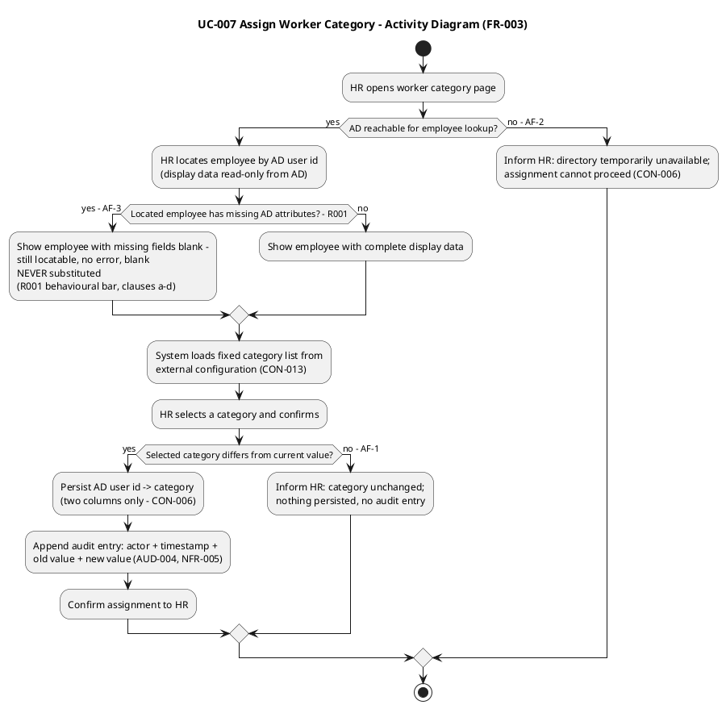
```plantuml
@startuml
title UC-007 Assign Worker Category - Activity Diagram (FR-003)
start
:HR opens worker category page;
if (AD reachable for employee lookup?) then (yes)
  :HR locates employee by AD user id\n(display data read-only from AD);
  if (Located employee has missing AD attributes? - R001) then (yes - AF-3)
    :Show employee with missing fields blank -\nstill locatable, no error, blank\nNEVER substituted\n(R001 behavioural bar, clauses a-d);
  else (no)
    :Show employee with complete display data;
  endif
  :System loads fixed category list from\nexternal configuration (CON-013);
  :HR selects a category and confirms;
  if (Selected category differs from current value?) then (yes)
    :Persist AD user id -> category\n(two columns only - CON-006);
    :Append audit entry: actor + timestamp +\nold value + new value (AUD-004, NFR-005);
    :Confirm assignment to HR;
  else (no - AF-1)
    :Inform HR: category unchanged;\nnothing persisted, no audit entry;
  endif
else (no - AF-2)
  :Inform HR: directory temporarily unavailable;\nassignment cannot proceed (CON-006);
endif
stop
@enduml
```

### UC-008: Publish News — FULL

| Field | Value |
|---|---|
| Primary Actor | HR Administrator (ACT-002) |
| Trigger | HR selects "Publish News" |
| Precondition | HR Administrator is authenticated with elevated role (SEC-002) |
| Postcondition | News item published and visible to employees; publication audited |
| Source | FR-006 |

**Main Flow:**
1. HR Administrator selects "Publish News".
2. System authenticates HR via Keycloak OIDC and verifies the HR Administrator role (`<<include>>` authentication; SEC-002).
3. HR enters title, body, and date; selects a category (General, HR, IT, Events); optionally marks the item as featured.
4. HR submits the form.
5. System validates the required fields.
6. System persists the news item with status "published".
7. System appends an audit entry: author + timestamp (AUD-001, NFR-005).
8. System confirms publication; the item is visible to employees (UC-003), with featured items shown under the banner.

**Alternative Flows:**
- **AF-1: Validation failure.** At step 5, the system highlights missing or invalid fields; HR corrects and resubmits.

**Activity Diagram:**

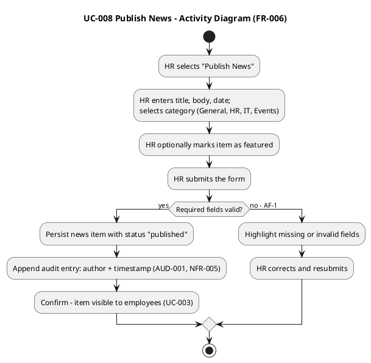
```plantuml
@startuml
title UC-008 Publish News - Activity Diagram (FR-006)
start
:HR selects "Publish News";
:HR enters title, body, date;\nselects category (General, HR, IT, Events);
:HR optionally marks item as featured;
:HR submits the form;
if (Required fields valid?) then (yes)
  :Persist news item with status "published";
  :Append audit entry: author + timestamp (AUD-001, NFR-005);
  :Confirm - item visible to employees (UC-003);
else (no - AF-1)
  :Highlight missing or invalid fields;
  :HR corrects and resubmits;
endif
stop
@enduml
```

### UC-009: Edit Published News — FULL

| Field | Value |
|---|---|
| Primary Actor | HR Administrator (ACT-002) |
| Trigger | HR selects an existing news item and edits it |
| Precondition | HR Administrator is authenticated with elevated role; news item exists and is published |
| Postcondition | News item updated; edit audited with editor + timestamp; all versions traceable |
| Source | FR-008 |

**Main Flow:**
1. HR Administrator opens news management and selects a published news item to edit.
2. System authenticates HR via Keycloak OIDC and verifies the HR Administrator role (`<<include>>` authentication; SEC-002).
3. System loads the current version of the news item.
4. HR modifies the fields (title, body, date, category, featured flag).
5. HR saves the changes.
6. System persists the updated news item.
7. System appends an audit entry: editor + timestamp (AUD-002, NFR-005) — the trail records all versions, not just the final one.
8. System confirms; the updated item is visible to employees (UC-003).

**Alternative Flows:**
- **AF-1: Validation failure.** At step 5, the system highlights missing or invalid fields; HR corrects and resubmits.
- **AF-2: Concurrent unpublish.** At step 5, if another administrator unpublished the item while it was being edited, the system informs HR that the item is no longer published and the edit is not applied (editing an unpublished record would muddy the audit trail; the record is retained read-only for audit).

**Exception Flows:**
- **EF-1: Role denial.** At step 2, if the authenticated session holds only the Employee role, the system denies access to news editing (SEC-006). No news item is loaded for editing.

**Business rules:** NFR-005 — every edit audited exactly like the original publication. CON-012 — no hard delete; editing never removes prior versions from the trail.

**Activity Diagram:**

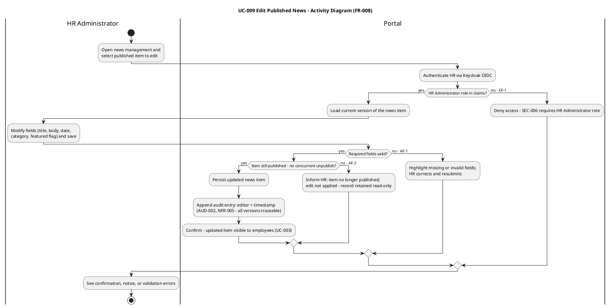
```plantuml
@startuml
title UC-009 Edit Published News - Activity Diagram (FR-008)
|HR Administrator|
start
:Open news management and\nselect published item to edit;
|Portal|
:Authenticate HR via Keycloak OIDC;
if (HR Administrator role in claims?) then (yes)
  :Load current version of the news item;
  |HR Administrator|
  :Modify fields (title, body, date,\ncategory, featured flag) and save;
  |Portal|
  if (Required fields valid?) then (yes)
    if (Item still published - no concurrent unpublish?) then (yes)
      :Persist updated news item;
      :Append audit entry: editor + timestamp\n(AUD-002, NFR-005 - all versions traceable);
      :Confirm - updated item visible to employees (UC-003);
    else (no - AF-2)
      :Inform HR: item no longer published;\nedit not applied - record retained read-only;
    endif
  else (no - AF-1)
    :Highlight missing or invalid fields;\nHR corrects and resubmits;
  endif
else (no - EF-1)
  :Deny access - SEC-006 requires HR Administrator role;
endif
|HR Administrator|
:See confirmation, notice, or validation errors;
stop
@enduml
```

### UC-010: Unpublish News — FULL (architecturally significant)

| Field | Value |
|---|---|
| Primary Actor | HR Administrator (ACT-002) |
| Trigger | HR selects "Unpublish" on a published news item |
| Precondition | HR Administrator is authenticated with elevated role; news item is currently published |
| Postcondition | News item hidden from employees; record retained for audit trail; unpublish action audited |
| Source | FR-009 |

**Main Flow:**
1. HR Administrator opens news management.
2. System authenticates HR via Keycloak OIDC and verifies the HR Administrator role (`<<include>>` authentication; SEC-002).
3. System displays the list of published news items.
4. HR selects "Unpublish" on a specific news item.
5. System prompts for confirmation.
6. HR confirms the unpublish action.
7. System sets the news item's status to "unpublished" (soft delete — the record is NOT deleted).
8. System records the unpublish action in the audit trail: actor + timestamp (AUD-003, NFR-005).
9. System confirms the item is now hidden from employees (UC-003).

**Alternative Flows:**
- **AF-1: Cancel.** At step 5, HR cancels the confirmation; the item remains published, no change, no audit entry.
- **AF-2: Already unpublished.** At step 4, if the item is already unpublished, the "Unpublish" option is not shown.

**Scenarios (discovery walk):**
- **S1:** HR unpublishes an event announcement containing a typo → hidden from employees; record retained; audit shows actor + timestamp.
- **S2:** HR cancels at the confirmation prompt → item stays published, nothing recorded.
- **S3:** HR opens an item already unpublished → no "Unpublish" option offered (AF-2).

**Business rules:** CON-012 — no hard delete of a news item; unpublish hides it, the record stays for the audit trail. NFR-005 — the unpublish action is audited (actor + timestamp).

**Activity Diagram:**

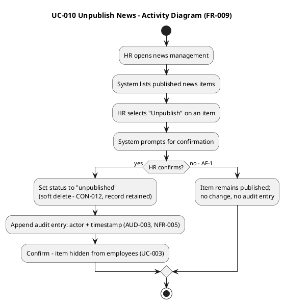
```plantuml
@startuml
title UC-010 Unpublish News - Activity Diagram (FR-009)
start
:HR opens news management;
:System lists published news items;
:HR selects "Unpublish" on an item;
:System prompts for confirmation;
if (HR confirms?) then (yes)
  :Set status to "unpublished"\n(soft delete - CON-012, record retained);
  :Append audit entry: actor + timestamp (AUD-003, NFR-005);
  :Confirm - item hidden from employees (UC-003);
else (no - AF-1)
  :Item remains published;\nno change, no audit entry;
endif
stop
@enduml
```

### UI Flow References (User-Interface Designer — Elaboration Iter 1)

These references realize the **user-interface-specific parts of each use case** (Interaction Design Chain): every UC step is mapped to an observable screen frame — user action and system response — so stakeholders can evaluate the interaction BEFORE implementation begins. They were developed in parallel with the Requirements Specifier's UC refinement (pre-baseline), per the parallel-execution principle. Screen IDs (SCR-01…SCR-09, M-01, EX-01) are formally defined in the Design Model §Boundary Classes and Navigation Map; every screen implements the mandatory design reference (CON-011, docs/inputs/employee-portal-design.html). Usability criteria cited per frame are quantified in the Supplementary Specification §Usability (USA-001…USA-009).

**Elaboration Iter 2 evolution (User Interface Designer — convergence cycle):** storyboard **SB-05** added — the R001 behavioural bar visualized across the three HR AD-reading screens (UC-005/006/007). The stakeholder confirmed this iteration (asked whether the behavioural bar applies to all four AD-reading use cases and not only the directory search, the stakeholder answered **"Yes"**), so the bar's rendering contract on the HR screens is now a validated interaction requirement, not a compact text row only. SB-01…SB-04, the compact references, and the design-reference reconciliations are preserved exactly as reviewed at the Elaboration Iter 1 LCA review (zero findings). Salt wireframes for the primary screens (SCR-01 Home; SCR-04 Directory — the latter rendering the R001 blank-field contract) are added to the Design Model §Boundary Classes and Navigation Map this iteration.

**Elaboration Iter 3 evolution (System Analyst — fourth-clause propagation, A-25):** the bar's rendering contract in SB-02 frame 4, SB-05, and the compact UI flow references for UC-005/006/007 now carries the FOURTH clause — a missing attribute is displayed as missing, never replaced by a default, a placeholder, a guessed value, or another employee's value (stakeholder contribution at the Iter 2 verdict gate, binding). The screen-level rendering contract for the blank fields is owned by the User Interface Designer (Design Model P-05, A-27); this artifact records the requirement the screens must satisfy.

**Elaboration Iter 3 evolution (User Interface Designer — featured-banner stack visualization):** the stakeholder-decided featured-banner rendering contract (Iter 2, recorded verbatim: "newest first" — stack ALL featured banners, ordered newest first) is now visualized end-to-end: **SB-03 frame 4** and the **UC-003 compact reference** state the stack contract explicitly (each featured item renders its own banner — no featured flag silently dropped), and the **SCR-03 News Salt wireframe** (Design Model §Boundary Classes and Navigation Map, added this iteration) renders the two-featured state — the stack newest-first above the list, each banner in the reference's warn-tinted style. This closes the visualization gap on the one stakeholder-decided UI contract that two governance artifacts mis-transcribed in Iter 2 (Development Case F1, Risk List F2 — both Major, same defect class): the interaction references now state the contract unambiguously so no consumer can read "newest first" as "single banner". SB-01…SB-05 frames and all other content are preserved exactly as reviewed (zero findings on this artifact).

**Elaboration Iter 4 evolution (User Interface Designer — storyboard completion per the Work Order instruction):** storyboards **SB-06 (UC-003 Browse News)** and **SB-07 (UC-009 Edit Published News)** added — the two critical flows that lacked full storyboards. UC-003 is the main-page adoption gateway (BG-003: 80% employee adoption within 3 months; R002 adoption risk — employees who never open News never adopt the portal) and carries the stakeholder-decided featured-banner stacking contract; UC-009 completes the audited news lifecycle (NFR-005/AUD-002 — every edit audited, all versions traceable). With SB-06/SB-07, every critical flow now has a visual storyboard submitted for stakeholder validation: AC-001/AC-004 (SB-01), AC-003 (SB-02), AC-002 (SB-03), CON-012 (SB-04), the R001 four-clause bar (SB-05), the BG-003 adoption gateway (SB-06), the NFR-005 audit trail (SB-07). UC-002 remains compact-referenced (a read-only current-month table view — proportionality). The compact rows for UC-003 and UC-009 are absorbed into SB-06/SB-07 (their AF/EF frames are carried in the storyboard tables). All UC specifications, flows, and activity diagrams are unchanged — zero findings and zero CRs target this artifact across all three full-coverage review cycles.

**Screen registry (summary — formal definition in Design Model):**

| Screen | Name | Realizes |
|---|---|---|
| SCR-01 | Home — clocking card + featured banner + history preview | UC-001, UC-003 |
| SCR-02 | My Clocking History (current month) | UC-002 |
| SCR-03 | News — featured banner + category chips + list | UC-003 |
| SCR-04 | Directory — search bar + person cards | UC-004 |
| SCR-05 | HR Clocking Report — filters + table + Export CSV | UC-005, UC-006 |
| SCR-06 | Worker Categories — employee lookup + fixed category select | UC-007 |
| SCR-07 | News Form (publish mode / edit mode) | UC-008, UC-009 |
| SCR-08 | News Management — list with status + actions | UC-009, UC-010 |
| SCR-09 | Access Denied (inline error state) | SEC-006 (UC-005 EF-1, UC-009 EF-1) |
| M-01 | Unpublish confirmation modal | UC-010 |
| EX-01 | Keycloak login (external — not a portal screen) | all UCs (`<<include>>` auth) |

#### SB-01 — UC-001: Clock In and Clock Out (FR-004) — storyboard

| Frame | UC-001 step | Screen | User action → System response | Criteria |
|---|---|---|---|---|
| 1 | 1–2 | SCR-01 / EX-01 | Open portal → [session expired] redirect to Keycloak (AF-2); credentials → OIDC token with roles | SEC-001 |
| 2 | 3–4 | SCR-01 | Clocking card renders: status chip ("Present since 08:02" / "Not clocked in today") + **status-aware button** — green ▶ Clock In (accent #17A398) or red ■ Clock Out (danger #C0392B) | USA-001, USA-004 |
| 3 | 5 | SCR-01 | Press button → button disables instantly; second press within 2 s ignored (AF-3) | USA-002, PRF-002 |
| 4 | 6–7 | SCR-01 | Timestamp recorded at press (UTC, DAT-001) → persist to PostgreSQL, or queue locally + sync on restore (AF-1) | REL-002, REL-003 |
| 5 | 8 | SCR-01 | Inline confirmation "Clocked in at 08:58:12" (America/Havana local, USA-008) + status chip updates; < 1 s from press | PRF-002, USA-008 |

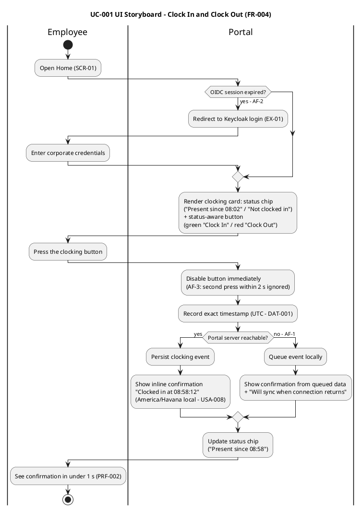
```plantuml
@startuml
title UC-001 UI Storyboard - Clock In and Clock Out (FR-004)
|Employee|
start
:Open Home (SCR-01);
|Portal|
if (OIDC session expired?) then (yes - AF-2)
  :Redirect to Keycloak login (EX-01);
  |Employee|
  :Enter corporate credentials;
endif
|Portal|
:Render clocking card: status chip\n("Present since 08:02" / "Not clocked in")\n+ status-aware button\n(green "Clock In" / red "Clock Out");
|Employee|
:Press the clocking button;
|Portal|
:Disable button immediately\n(AF-3: second press within 2 s ignored);
:Record exact timestamp (UTC - DAT-001);
if (Portal server reachable?) then (yes)
  :Persist clocking event;
  :Show inline confirmation\n"Clocked in at 08:58:12"\n(America/Havana local - USA-008);
else (no - AF-1)
  :Queue event locally;
  :Show confirmation from queued data\n+ "Will sync when connection returns";
endif
:Update status chip\n("Present since 08:58");
|Employee|
:See confirmation in under 1 s (PRF-002);
stop
@enduml
```

#### SB-02 — UC-004: Search Employee Directory (FR-010) — storyboard

| Frame | UC-004 step | Screen | User action → System response | Criteria |
|---|---|---|---|---|
| 1 | 1–2 | SCR-04 | Open Directory → search bar: name input, department select, office select, Search button | USA-003 |
| 2 | 3 | SCR-04 | Enter criteria → press Search | USA-003 |
| 3 | 4–5 | SCR-04 | LDAP query (5 s hard timeout, PRF-003) → person cards with all six corporate fields on the card — no detail view needed | USA-003, CON-006 |
| 4 | 6–7 | SCR-04 | AF-1: "No colleagues found" + refine suggestion; AF-2: missing attributes shown blank, entry NOT hidden, blank never substituted (R001, clauses a–d); AF-3: "Directory temporarily unavailable" (no local fallback) | R001, CON-006 |

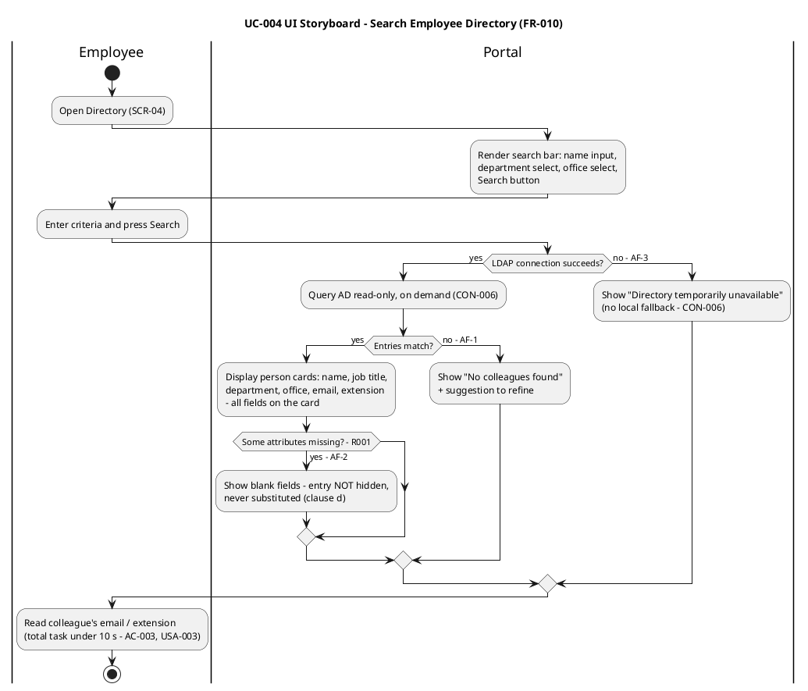
```plantuml
@startuml
title UC-004 UI Storyboard - Search Employee Directory (FR-010)
|Employee|
start
:Open Directory (SCR-04);
|Portal|
:Render search bar: name input,\ndepartment select, office select,\nSearch button;
|Employee|
:Enter criteria and press Search;
|Portal|
if (LDAP connection succeeds?) then (yes)
  :Query AD read-only, on demand (CON-006);
  if (Entries match?) then (yes)
    :Display person cards: name, job title,\ndepartment, office, email, extension\n- all fields on the card;
    if (Some attributes missing? - R001) then (yes - AF-2)
      :Show blank fields - entry NOT hidden,\nnever substituted (clause d);
    endif
  else (no - AF-1)
    :Show "No colleagues found"\n+ suggestion to refine;
  endif
else (no - AF-3)
  :Show "Directory temporarily unavailable"\n(no local fallback - CON-006);
endif
|Employee|
:Read colleague's email / extension\n(total task under 10 s - AC-003, USA-003);
stop
@enduml
```

#### SB-03 — UC-008: Publish News (FR-006) — storyboard

| Frame | UC-008 step | Screen | User action → System response | Criteria |
|---|---|---|---|---|
| 1 | 1–2 | SCR-07 | Select "Publish news" in sidebar [HR role] → form: title, body, date, category (General/HR/IT/Events), featured flag | USA-005 |
| 2 | 3–4 | SCR-07 | Fill fields → submit | USA-005 |
| 3 | 5 | SCR-07 | AF-1: invalid fields highlighted inline → correct → resubmit | USA-005 |
| 4 | 6–8 | SCR-07 → SCR-03 | Persist "published" + audit (author + timestamp, AUD-001) → confirmation; featured items each render their own banner on News — stacked newest first when more than one item is featured (P-02, stakeholder decision Iter 2) | AC-002, AUD-001 |

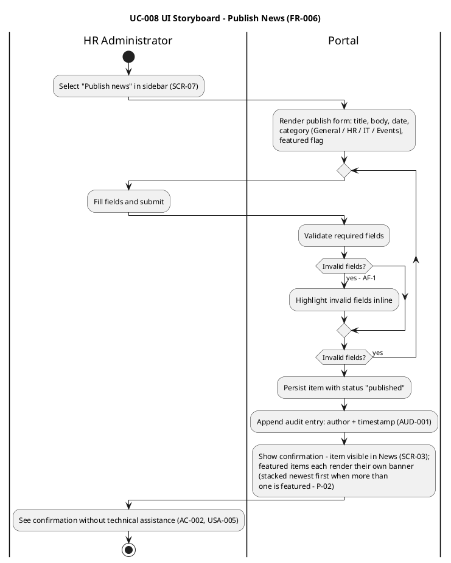
```plantuml
@startuml
title UC-008 UI Storyboard - Publish News (FR-006)
|HR Administrator|
start
:Select "Publish news" in sidebar (SCR-07);
|Portal|
:Render publish form: title, body, date,\ncategory (General / HR / IT / Events),\nfeatured flag;
repeat
  |HR Administrator|
  :Fill fields and submit;
  |Portal|
  :Validate required fields;
  if (Invalid fields?) then (yes - AF-1)
    :Highlight invalid fields inline;
  endif
repeat while (Invalid fields?) is (yes)
:Persist item with status "published";
:Append audit entry: author + timestamp (AUD-001);
:Show confirmation - item visible in News (SCR-03);\nfeatured items each render their own banner\n(stacked newest first when more than\none is featured - P-02);
|HR Administrator|
:See confirmation without technical assistance (AC-002, USA-005);
stop
@enduml
```

#### SB-04 — UC-010: Unpublish News (FR-009) — storyboard

| Frame | UC-010 step | Screen | User action → System response | Criteria |
|---|---|---|---|---|
| 1 | 1–3 | SCR-08 | Open News Management [HR role] → list with status; "Unpublish" offered on published items only (AF-2) | CON-012 |
| 2 | 4–5 | SCR-08 → M-01 | Press Unpublish → confirmation modal: "Hide this item from employees? The record is retained for the audit trail." | CON-012 |
| 3 | 6 | M-01 | Confirm → apply; Cancel (AF-1) → close modal, no change, no audit entry | USA-009 (modal focus + keyboard) |
| 4 | 7–9 | SCR-08 | Status "unpublished" (soft delete) + audit (actor + timestamp, AUD-003) → confirmation; item hidden from SCR-03 | AUD-003, CON-012 |

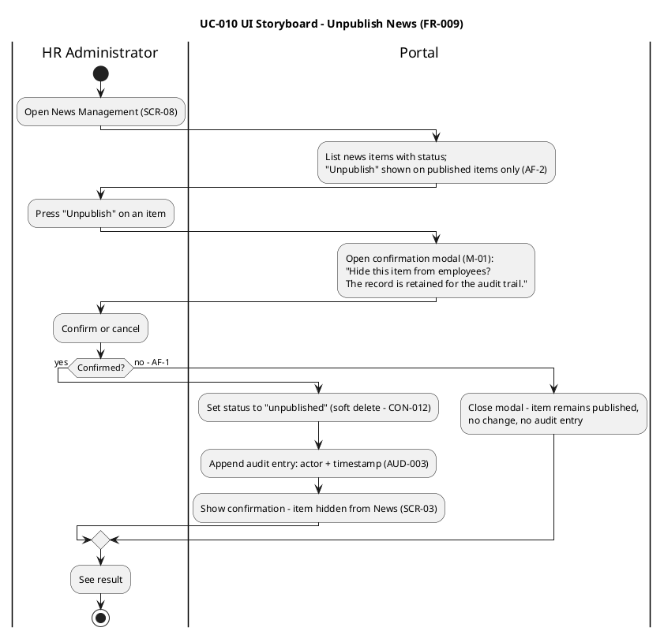
```plantuml
@startuml
title UC-010 UI Storyboard - Unpublish News (FR-009)
|HR Administrator|
start
:Open News Management (SCR-08);
|Portal|
:List news items with status;\n"Unpublish" shown on published items only (AF-2);
|HR Administrator|
:Press "Unpublish" on an item;
|Portal|
:Open confirmation modal (M-01):\n"Hide this item from employees?\nThe record is retained for the audit trail.";
|HR Administrator|
:Confirm or cancel;
if (Confirmed?) then (yes)
  |Portal|
  :Set status to "unpublished" (soft delete - CON-012);
  :Append audit entry: actor + timestamp (AUD-003);
  :Show confirmation - item hidden from News (SCR-03);
else (no - AF-1)
  |Portal|
  :Close modal - item remains published,\nno change, no audit entry;
endif
|HR Administrator|
:See result;
stop
@enduml
```

#### SB-05 — UC-005 / UC-006 / UC-007: R001 behavioural bar across the HR AD-reading screens (FR-001, FR-002, FR-003) — storyboard (Elaboration Iter 2; clause d propagated Iter 3)

The stakeholder confirmed this iteration that the R001 behavioural bar applies to **all four AD-reading use cases**, not only the directory search. The bar's four clauses: **(a)** every employee is rendered whether or not their attributes are complete; **(b)** a missing attribute never removes someone from results; **(c)** a missing attribute never raises an error; **(d)** a missing attribute is displayed as missing — never replaced by a default, a placeholder, a guessed value, or another employee's value (stakeholder contribution at the Iter 2 verdict gate, propagated Iter 3). UC-004's rendering contract is already visualized in SB-02 frame 4. This storyboard visualizes the same bar on the three HR screens, where the rendering stakes differ per use case: the review table must show **every event row** (clocking data is portal data, always complete); the CSV export must write **every event row with blank cells** for missing display fields (ad_user_id resolves identity — no abort; a blank cell is the written value, never a substituted one); the category lookup must keep the employee **locatable and selectable**.

| Frame | UC step | Screen | User action → System response | Criteria |
|---|---|---|---|---|
| 1 | UC-005 steps 3–5 | SCR-05 | Open report [HR role] → all-employees table; names resolved from AD on demand; employee with missing AD attributes → **row rendered with blank display fields, NOT removed, no error, blank never substituted** (AF-3) — clocking columns (event type, timestamp) always complete | R001 bar (a)(b)(c)(d), USA-008 |
| 2 | UC-006 steps 3–6 | SCR-05 | Select month + "Export CSV" → **every event row written**; missing display fields as blank cells; no abort (AF-3); ad_user_id (column 1) always present; blank cells never substituted | R001 bar, INT-005, STD-003 |
| 3 | UC-007 steps 3–5 | SCR-06 | Locate employee → entry with missing attributes rendered with **blank fields, still locatable and selectable**; no error; blank never substituted (AF-3) | R001 bar, CON-013 |
| 4 | UC-007 steps 6–8 | SCR-06 | Select category from FIXED list → confirm → mapping persisted (ad_user_id → category, CON-006) + audited (AUD-004) | CON-006, AUD-004 |

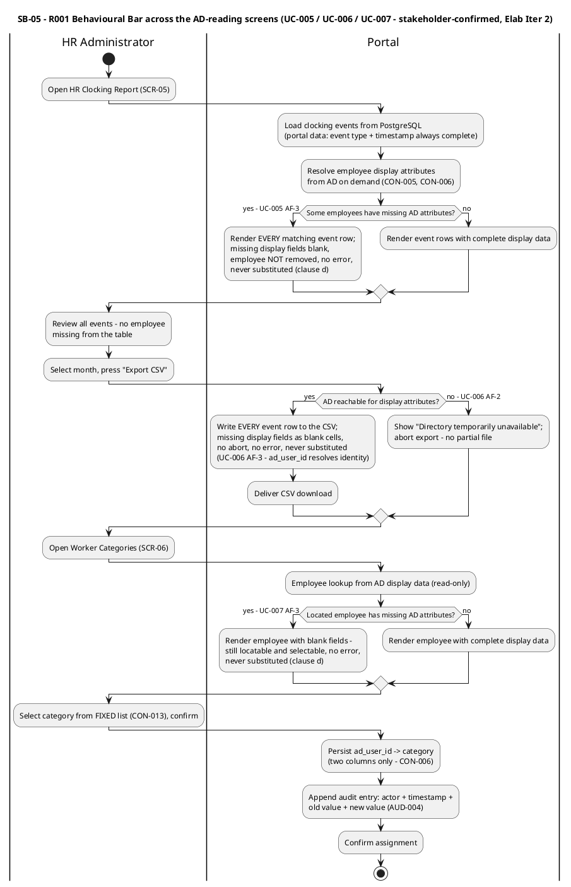
```plantuml
@startuml
title SB-05 - R001 Behavioural Bar across the AD-reading screens (UC-005 / UC-006 / UC-007 - stakeholder-confirmed, Elab Iter 2)
|HR Administrator|
start
:Open HR Clocking Report (SCR-05);
|Portal|
:Load clocking events from PostgreSQL\n(portal data: event type + timestamp always complete);
:Resolve employee display attributes\nfrom AD on demand (CON-005, CON-006);
if (Some employees have missing AD attributes?) then (yes - UC-005 AF-3)
  :Render EVERY matching event row;\nmissing display fields blank,\nemployee NOT removed, no error,\nnever substituted (clause d);
else (no)
  :Render event rows with complete display data;
endif
|HR Administrator|
:Review all events - no employee\nmissing from the table;
:Select month, press "Export CSV";
|Portal|
if (AD reachable for display attributes?) then (yes)
  :Write EVERY event row to the CSV;\nmissing display fields as blank cells,\nno abort, no error, never substituted\n(UC-006 AF-3 - ad_user_id resolves identity);
  :Deliver CSV download;
else (no - UC-006 AF-2)
  :Show "Directory temporarily unavailable";\nabort export - no partial file;
endif
|HR Administrator|
:Open Worker Categories (SCR-06);
|Portal|
:Employee lookup from AD display data (read-only);
if (Located employee has missing AD attributes?) then (yes - UC-007 AF-3)
  :Render employee with blank fields -\nstill locatable and selectable, no error,\nnever substituted (clause d);
else (no)
  :Render employee with complete display data;
endif
|HR Administrator|
:Select category from FIXED list (CON-013), confirm;
|Portal|
:Persist ad_user_id -> category\n(two columns only - CON-006);
:Append audit entry: actor + timestamp +\nold value + new value (AUD-004);
:Confirm assignment;
stop
@enduml
```

#### SB-06 — UC-003: Browse News (FR-007) — storyboard (Elaboration Iter 4)

UC-003 is the adoption gateway: the main page and the News screen are what every employee sees daily (BG-003 — 80% adoption within 3 months; R002 — employees who never open News never adopt the portal). The storyboard visualizes the stakeholder-decided featured-banner stacking contract (Iter 2, recorded verbatim: "newest first") in the interaction sequence — the same contract the SCR-03 Salt wireframe renders (Design Model §Boundary Classes and Navigation Map) and that two governance artifacts mis-transcribed in Iter 2 (Development Case F1, Risk List F2): the storyboard makes the stack contract unambiguous at the interaction level for stakeholder validation.

| Frame | UC-003 step | Screen | User action → System response | Criteria |
|---|---|---|---|---|
| 1 | 1–2 | SCR-01 / SCR-03 / EX-01 | Open portal (SCR-01) or select "News" (SCR-03) → [session expired] redirect to Keycloak (AF-2); credentials → OIDC token with roles | SEC-001 |
| 2 | 3–4 | SCR-01 / SCR-03 | Published news loads newest-first → **featured banner STACK renders at top: ALL featured items render their own banner, ordered newest first** (P-02, stakeholder decision Iter 2; SCR-03 wireframe) — no featured flag silently dropped; list renders below the stack | USA-007, FR-006/FR-007 |
| 3 | 5–6 | SCR-03 | Select category chip (All / General / HR / IT / Events) → filtered list (the stack renders per step 4; the filter applies to the list, steps 5–6) | USA-001 |
| 4 | AF-1 / AF-2 / EF-1 | SCR-03 | AF-1: "No news in this category"; AF-2: empty state; EF-1: "News temporarily unavailable" inline — no partial list (P-05) | P-05, NFR-004 |

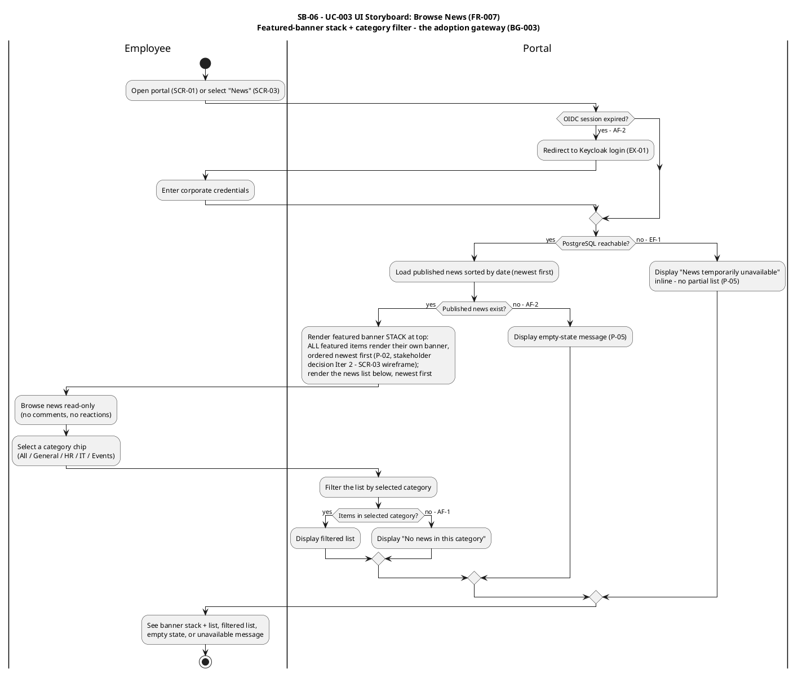
```plantuml
@startuml
title SB-06 - UC-003 UI Storyboard: Browse News (FR-007)\nFeatured-banner stack + category filter - the adoption gateway (BG-003)
|Employee|
start
:Open portal (SCR-01) or select "News" (SCR-03);
|Portal|
if (OIDC session expired?) then (yes - AF-2)
  :Redirect to Keycloak login (EX-01);
  |Employee|
  :Enter corporate credentials;
endif
|Portal|
if (PostgreSQL reachable?) then (yes)
  :Load published news sorted by date (newest first);
  if (Published news exist?) then (yes)
    :Render featured banner STACK at top:\nALL featured items render their own banner,\nordered newest first (P-02, stakeholder\ndecision Iter 2 - SCR-03 wireframe);\nrender the news list below, newest first;
    |Employee|
    :Browse news read-only\n(no comments, no reactions);
    :Select a category chip\n(All / General / HR / IT / Events);
    |Portal|
    :Filter the list by selected category;
    if (Items in selected category?) then (yes)
      :Display filtered list;
    else (no - AF-1)
      :Display "No news in this category";
    endif
  else (no - AF-2)
    :Display empty-state message (P-05);
  endif
else (no - EF-1)
  :Display "News temporarily unavailable"\ninline - no partial list (P-05);
endif
|Employee|
:See banner stack + list, filtered list,\nempty state, or unavailable message;
stop
@enduml
```

#### SB-07 — UC-009: Edit Published News (FR-008) — storyboard (Elaboration Iter 4)

UC-009 completes the audited news lifecycle: publish (SB-03) → edit (SB-07) → unpublish (SB-04). The edit flow carries NFR-005/AUD-002 — every edit is audited exactly like the original publication, and the trail records all versions, not just the final one — plus the AF-2 concurrent-unpublish guard (editing an unpublished record would muddy the audit trail; the record is retained read-only per CON-012). The storyboard visualizes the SCR-08 → SCR-07 (edit mode) navigation and the three outcome paths (updated + audited / not-published notice / inline validation) for stakeholder validation.

| Frame | UC-009 step | Screen | User action → System response | Criteria |
|---|---|---|---|---|
| 1 | 1–3 | SCR-08 | Open News Management [HR role] → list with status; "Edit" offered on published items only → select "Edit" → form loads current version (SCR-07, edit mode) | SEC-006 |
| 2 | 4–5 | SCR-07 (edit mode) | Modify fields (title, body, date, category, featured flag) → save | USA-005 |
| 3 | 6–8 | SCR-07 | Valid fields + item still published → persist + audit entry (editor + timestamp, post-edit snapshot — AUD-002: all versions traceable, not just the final one) → confirmation; updated item visible on SCR-03 | AUD-002, NFR-005 |
| 4 | AF-1 / AF-2 / EF-1 | SCR-07 / SCR-08 / SCR-09 | AF-1: invalid fields highlighted inline → correct → resubmit; AF-2: "no longer published" notice — edit NOT applied, record retained read-only for audit (CON-012); EF-1: role denial → SCR-09, no item loaded | P-05, CON-012, SEC-006 |

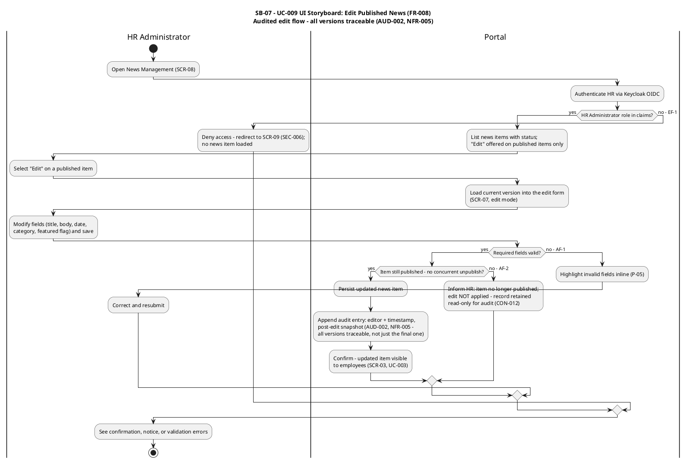
```plantuml
@startuml
title SB-07 - UC-009 UI Storyboard: Edit Published News (FR-008)\nAudited edit flow - all versions traceable (AUD-002, NFR-005)
|HR Administrator|
start
:Open News Management (SCR-08);
|Portal|
:Authenticate HR via Keycloak OIDC;
if (HR Administrator role in claims?) then (yes)
  :List news items with status;\n"Edit" offered on published items only;
  |HR Administrator|
  :Select "Edit" on a published item;
  |Portal|
  :Load current version into the edit form\n(SCR-07, edit mode);
  |HR Administrator|
  :Modify fields (title, body, date,\ncategory, featured flag) and save;
  |Portal|
  if (Required fields valid?) then (yes)
    if (Item still published - no concurrent unpublish?) then (yes)
      :Persist updated news item;
      :Append audit entry: editor + timestamp,\npost-edit snapshot (AUD-002, NFR-005 -\nall versions traceable, not just the final one);
      :Confirm - updated item visible\nto employees (SCR-03, UC-003);
    else (no - AF-2)
      :Inform HR: item no longer published;\nedit NOT applied - record retained\nread-only for audit (CON-012);
    endif
  else (no - AF-1)
    :Highlight invalid fields inline (P-05);
    |HR Administrator|
    :Correct and resubmit;
  endif
else (no - EF-1)
  :Deny access - redirect to SCR-09 (SEC-006);\nno news item loaded;
endif
|HR Administrator|
:See confirmation, notice, or validation errors;
stop
@enduml
```

#### Compact UI flow references — remaining UCs

UC-003 and UC-009 were promoted to full storyboards (SB-06, SB-07) in Elaboration Iter 4; their compact rows are absorbed into the storyboard tables above. UC-005/006/007 remain compact-referenced here — SB-05 visualizes their shared R001-bar flow; these rows carry their per-UC AF/EF frames and criteria.

| UC | Screen(s) | Main-flow frames (user action → system response) | Alternative / exception frames | Criteria |
|---|---|---|---|---|
| UC-002 (FR-005) | SCR-02 | Select "My Clocking History" → current-month table (Date, Clock In, Clock Out, Hours, Status) rendered from PostgreSQL | AF-1 empty state; AF-2 queued-not-yet-synced note; EF-1 "History temporarily unavailable" inline | USA-001, USA-008 |
| UC-005 (FR-001) | SCR-05 | Open [HR role] → all-employees table; filter by employee / date range → matching events, names resolved from AD on demand | AF-1 "No clocking records match"; AF-2 AD user id shown, display attributes marked unavailable; AF-3 missing display fields blank, employee NOT removed, no error, blank never substituted (R001 behavioural bar — stakeholder-confirmed; clause d propagated Iter 3); EF-1 role denial → SCR-09 | SEC-006, USA-008 |
| UC-006 (FR-002) | SCR-05 | Select month + "Export CSV" → file download (ISO-8601 with explicit offset, per stakeholder decision) | AF-1 "No clocking records for this month"; AF-2 "Directory temporarily unavailable" — export aborted, no partial file; AF-3 missing display fields as blank cells, every event row present, no abort, blank cells never substituted (R001 behavioural bar — stakeholder-confirmed; clause d propagated Iter 3) | INT-005, SEC-006 |
| UC-007 (FR-003) | SCR-06 | Open [HR role] → locate employee (AD display data, read-only) → select category from FIXED list → confirm → mapping persisted + audited | AF-1 same category → "unchanged", nothing persisted, no audit entry; AF-2 "Directory temporarily unavailable"; AF-3 missing display fields blank, employee still locatable, no error, blank never substituted (R001 behavioural bar — stakeholder-confirmed; clause d propagated Iter 3) | CON-013, AUD-004 |

#### Design-reference reconciliations (CON-011 — R007 mitigation)

The design reference is authoritative for the visual layer; three reconciliations were required where the mockup's shorthand met the declared requirements:

1. **Sidebar item "Manage directory" → SCR-06 "Worker categories".** CON-007 forbids editing employee fields anywhere in the portal; the only HR management adjacent to the directory is the worker category assignment (FR-003). The nav item keeps the design reference's position, icon slot, and style, but its label reads **"Worker categories"** — a label promising directory management would mislead users (error prevention; match real world).
2. **"Export CSV (HR)" placement.** The mockup shows an HR-only export affordance on the personal history card; UC-006 step 1 places the export in the clocking review area. The control renders on **SCR-05** in the design reference's ghost-button style, visible to the HR role only (SEC-006); the personal history (SCR-02) carries no export (FR-005 is view-only; SEC-007).
3. **Mockup UC labels.** The design reference's internal labels UC01/UC02/UC03 map to project **UC-001 / UC-003 / UC-004** (project UC IDs follow the Use-Case Model, not the mockup's sequence — the LCO F1 defect was exactly a UC-ID mismatch; this note prevents recurrence).

#### Storyboard validation status

Storyboards SB-01…SB-07 are submitted for stakeholder validation with this iteration's review (STK-001 sponsor, STK-003 end-user representatives). **SB-05 visualizes the R001 behavioural bar exactly as stakeholder-confirmed — now FOUR clauses** (clause d added at the Iter 2 verdict gate: a missing attribute is displayed as missing, never substituted) — the same four clauses the disposable-directory validation proves empirically with deliberately-seeded gaps, including substitution-attempt fixtures (UC-004 S4 bar walk; R001 PoC, Work Item 7). **SB-06 (added Iter 4) visualizes the featured-banner stacking contract** (stakeholder decision, Iter 2, recorded verbatim: "newest first" — stack ALL featured banners, ordered newest first) in the interaction sequence of the adoption-gateway flow — the same contract the SCR-03 wireframe renders; **SB-07 (added Iter 4) visualizes the audited-edit flow** (NFR-005/AUD-002 — all versions traceable) completing the news-lifecycle storyboard set (publish SB-03 → edit SB-07 → unpublish SB-04). Any feedback is recorded in the Review Record and traced to requirement impacts — the prototype-as-probe principle. The User-Interface Prototype artifact is **[OMITTED — trigger not fired per Development Case §5.2]**; these storyboards inside the Use-Case Model, plus the Boundary Classes and Navigation Map (with Salt wireframes for SCR-01, SCR-03, and SCR-04) in the Design Model, carry the interaction design. Full UI traceability: Design Model §Traceability.
## Traceability
| Element | Traces From | Link Type | Traces To |
|---|---|---|---|
| UC-001 | FR-004 | Refines | Use-Case Realizations (Designer); Test priority 1 (Test Designer); R003/R004 PoCs (Architect) |
| UC-002 | FR-005 | Refines | Use-Case Realizations (Designer) |
| UC-003 | FR-007 | Refines | Use-Case Realizations (Designer); SB-06 storyboard (UI Designer, Iter 4) |
| UC-004 | FR-010 | Refines | Use-Case Realizations (Designer); Test priority 1 (Test Designer); R001 PoC (Architect) |
| UC-005 | FR-001 | Refines | Use-Case Realizations (Designer) |
| UC-006 | FR-002 | Refines | Use-Case Realizations (Designer); CSV column set v1 detailed (RS, Elab Iter 1) |
| UC-007 | FR-003 | Refines | Use-Case Realizations (Designer) |
| UC-008 | FR-006 | Refines | Use-Case Realizations (Designer) |
| UC-009 | FR-008 | Refines | Use-Case Realizations (Designer); SB-07 storyboard (UI Designer, Iter 4) |
| UC-010 | FR-009 | Refines | Use-Case Realizations (Designer); Test priority 1 (Test Designer); R006 (audit design) |
| ACT-001 | STK-003 | Derives | UC-001, UC-002, UC-003, UC-004 |
| ACT-002 | STK-001 | Derives | UC-005, UC-006, UC-007, UC-008, UC-009, UC-010 |
| ACT-003 | CON-005, CON-006 | Derives | UC-004, UC-005, UC-006, UC-007 (display data read on demand — Elaboration refinement) |
| ACT-004 | CON-004 | Derives | All UCs (<<include>> auth) |
| UC-001 AF-1 | NFR-004, AC-005 | Refines | Offline Sync Mechanism (Supplementary Specification; Architect — R004 PoC) |
| UC-001 AF-1 thresholds | NFR-004, AC-005, DAT-001 | Refines | REL-002, REL-003 (Supplementary Specification — quantified by RS, Elab Iter 1) |
| UC-001 timestamp convention | DAT-001 + stakeholder decisions (Elaboration Iter 1): store UTC, display office local timezone (America/Havana, IANA) | Refines | REL-002 timestamp convention (Supplementary Specification); UC-006 event_timestamp column |
| UC-001 AF-3 ignore window | NFR-002, FR-004 | Refines | PRF-002 (Supplementary Specification) |
| UC-002 EF-1 | NFR-004 | Refines | REL-002 (Supplementary Specification) |
| UC-003 EF-1 | NFR-004 | Refines | REL-002 (Supplementary Specification) |
| UC-004 AF-2 | R001 + stakeholder decision (Elaboration Iter 2): behavioural bar — every employee is rendered whether or not their attributes are complete; a missing attribute never removes someone from search results; a missing attribute never raises an error; + stakeholder contribution at the Iter 2 verdict gate (fourth clause, propagated Iter 3): a missing attribute is displayed as missing — never replaced by a default, a placeholder, a guessed value, or another employee's value; validated against deliberately-seeded gaps (including substitution-attempt fixtures) in the disposable LDAP directory; prior >90% statistical criterion dropped (invented, unsourceable) | Mitigates | R001 PoC (Architect, Work Item 7 — deliberately-seeded gaps + substitution-attempt fixtures); Test Case TC-011 (Test Designer — fourth-clause verification steps per A-28); real-AD data-quality measurement → Construction (R011 residual, STK-004-dependent), excluded from the LCA evidence package |
| UC-005 AF-3 | FR-001 + R001 behavioural bar (stakeholder decision, Elaboration Iter 2; fourth clause added at the Iter 2 verdict gate, propagated Iter 3) + stakeholder confirmation (Elaboration Iter 2): asked whether the bar applies to all four AD-reading use cases and not only the directory search, the stakeholder answered "Yes" — the AF-3 flow is a confirmed requirement; clause (d): a missing attribute is displayed as missing, never substituted | Refines | R001 PoC (Architect, Work Item 7 — deliberately-seeded gaps); Test Case TC-021 (fourth-clause verification steps per A-28); SCR-05 (Design Model — compact UI flow reference updated, Elab Iter 2; P-05 rendering contract extended per A-27) |
| UC-006 AF-3 | FR-002 + R001 behavioural bar (stakeholder decision, Elaboration Iter 2; fourth clause added at the Iter 2 verdict gate, propagated Iter 3) + stakeholder confirmation (Elaboration Iter 2): answer "Yes" — the bar applies to all four AD-reading use cases; the AF-3 flow is a confirmed requirement; clause (d): a missing attribute is written as missing — blank cells, never substituted (stakeholder rationale: on the CSV that reaches payroll a fabricated department is worse than an empty cell) | Refines | R001 PoC (Architect, Work Item 7); Test Case TC-022 (fourth-clause verification steps per A-28); STD-003 (CSV format — blank cells on missing display attributes); SCR-05 |
| UC-007 AF-3 | FR-003 + R001 behavioural bar (stakeholder decision, Elaboration Iter 2; fourth clause added at the Iter 2 verdict gate, propagated Iter 3) + stakeholder confirmation (Elaboration Iter 2): answer "Yes" — the bar applies to all four AD-reading use cases; the AF-3 flow is a confirmed requirement; clause (d): a missing attribute is displayed as missing, never substituted (stakeholder rationale: an employee nobody can select is an employee nobody can categorize) | Refines | R001 PoC (Architect, Work Item 7); Test Case TC-023 (fourth-clause verification steps per A-28); SCR-06 |
| UC-005 EF-1 | SEC-006 | Refines | (Supplementary Specification — role enforcement) |
| UC-006 CSV column set | FR-002, CON-005, CON-006, INT-005 + stakeholder decisions (ISO-8601 offset export, local payroll day, office zone America/Havana) | Refines | STD-003 (CSV format); UC-006 AF-2 (abort on AD unavailable); UC-006 AF-3 (blank cells on missing attributes — every event row present, never substituted) |
| UC-009 EF-1 | SEC-006 | Refines | (Supplementary Specification — role enforcement) |
| SB-06 storyboard (UC-003, UI Designer, Iter 4) | FR-007, BG-003 (80% adoption within 3 months), R002 (adoption risk), CON-011 + stakeholder decision (Elaboration Iter 2, verbatim: "newest first" — stack ALL featured banners, ordered newest first) | Refines | SCR-01, SCR-03 (banner stack rendering); P-02 + SCR-03 Salt wireframe (Design Model); SB-03 frame 4 (publish-side banner contract); stakeholder validation (STK-001, STK-003) |
| SB-07 storyboard (UC-009, UI Designer, Iter 4) | FR-008, NFR-005, AUD-002 (all versions traceable), CON-012, SEC-006 | Refines | SCR-08 → SCR-07 (edit mode) navigation (Design Model Navigation Map); SB-03 (publish) + SB-04 (unpublish) — the news-lifecycle storyboard set; stakeholder validation (STK-001) |
