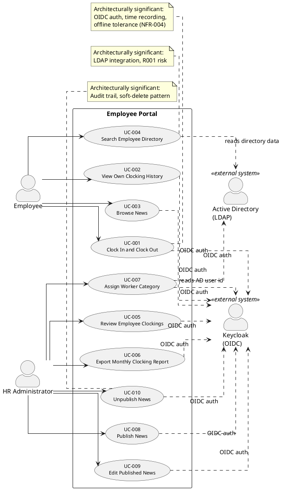
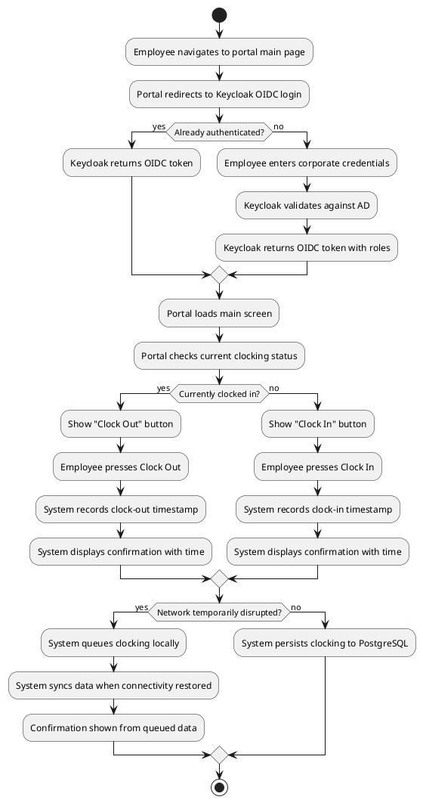

## Document Control

| Field | Value |
|---|---|
| Phase | Inception |
| Status | Draft |
| Milestone Target | End of Inception |
| Iteration | 1 (Cycle 1) |

## Use-Case Diagram

**System boundary:** The rectangle encloses all 10 use cases. Keycloak (OIDC) and Active Directory (LDAP) are external actors on the boundary — the portal is a client of both, never manages either. Authentication is a cross-cutting mechanism (`<<include>>` from all UCs), not a standalone use case.

## Actors

| ID | Actor | Type | Description | Scope |
|---|---|---|---|---|
| ACT-001 | Employee | Human (primary) | 200 corporate employees across 3 offices. Uses corporate credentials to authenticate. Clocks in/out, views own history, browses news, searches directory. | In |
| ACT-002 | HR Administrator | Human (primary) | HR staff with elevated Keycloak role. Reviews all clockings, exports CSV reports, assigns worker categories, manages full news lifecycle. | In |
| ACT-003 | Active Directory (LDAP) | External system | System of record for employee corporate data (name, job title, department, office, email, extension). Queried read-only on demand via LDAP. | Out (boundary) |
| ACT-004 | Keycloak (OIDC) | External system | Existing identity provider. Authenticates users via OIDC; provides roles as claims. Not deployed or managed by this project. | Out (boundary) |

## Use-Case Survey

| UC | Name | Primary Actor | Source | MoSCoW | Volatility | ATM Test | Detailed? |
|---|---|---|---|---|---|---|---|
| UC-001 | Clock In and Clock Out | Employee | FR-004 | Must | Low | ✅ Actor, Trigger, Outcome | **Yes** (arch. significant) |
| UC-002 | View Own Clocking History | Employee | FR-005 | Must | Low | ✅ | Outline |
| UC-003 | Browse News | Employee | FR-007 | Must | Low | ✅ | Outline |
| UC-004 | Search Employee Directory | Employee | FR-010 | Must | Medium | ✅ Actor, Trigger, Outcome | **Yes** (arch. significant — LDAP, R001) |
| UC-005 | Review Employee Clockings | HR Administrator | FR-001 | Must | Low | ✅ | Outline |
| UC-006 | Export Monthly Clocking Report | HR Administrator | FR-002 | Must | Medium | ✅ | Outline |
| UC-007 | Assign Worker Category | HR Administrator | FR-003 | Must | Medium | ✅ | Outline |
| UC-008 | Publish News | HR Administrator | FR-006 | Must | Low | ✅ | Outline |
| UC-009 | Edit Published News | HR Administrator | FR-008 | Must | Low | ✅ | Outline |
| UC-010 | Unpublish News | HR Administrator | FR-009 | Must | Low | ✅ Actor, Trigger, Outcome | **Yes** (arch. significant — audit, soft-delete) |

**Volatility rationale:**
- UC-004 (Medium): LDAP attribute availability may vary across offices (R001); query strategy may need adjustment.
- UC-006 (Medium): CSV export format may change based on downstream payroll/records needs.
- UC-007 (Medium): Category list is externally configured (CON-013); source of the list may change.

## Use-Case Specifications

### UC-001: Clock In and Clock Out — DETAILED

| Field | Value |
|---|---|
| Primary Actor | Employee (ACT-001) |
| Trigger | Employee navigates to the portal main page |
| Precondition | Employee is authenticated via Keycloak OIDC |
| Postcondition | Clocking event (in or out) is persisted with exact timestamp; confirmation displayed |
| Source | FR-004 |

**Main Flow:**
1. Employee navigates to the portal main page.
2. System authenticates the employee via Keycloak OIDC (`<<include>>` authentication).
3. System checks the employee's current clocking status (clocked in or not).
4. System displays the main screen with either a "Clock In" or "Clock Out" button based on current status.
5. Employee presses the button.
6. System records the exact timestamp of the event.
7. System persists the clocking event to the PostgreSQL database.
8. System displays a confirmation with the recorded time.

**Alternative Flows:**
- **AF-1: Network disruption (NFR-004, AC-005).** At step 7, if the network is temporarily unavailable, the system queues the clocking locally and syncs to the database once connectivity is restored. The confirmation at step 8 is shown from the queued data so the employee sees immediate feedback.
- **AF-2: Session expired.** At step 2, if the OIDC session has expired, the system redirects to Keycloak for re-authentication before proceeding.

**Activity Diagram:**

### UC-002: View Own Clocking History — OUTLINE

| Field | Value |
|---|---|
| Primary Actor | Employee (ACT-001) |
| Trigger | Employee selects "My Clocking History" |
| Precondition | Employee is authenticated |
| Postcondition | Current month's clocking history displayed |
| Source | FR-005 |

**Outline:** Employee views their own clocking entries (in/out timestamps) for the current month. Data is read from the portal's PostgreSQL database. No editing or export from this view.

### UC-003: Browse News — OUTLINE

| Field | Value |
|---|---|
| Primary Actor | Employee (ACT-001) |
| Trigger | Employee navigates to the main page or news section |
| Precondition | Employee is authenticated |
| Postcondition | News list displayed, sorted by date (newest first) |
| Source | FR-007 |

**Outline:** Employee sees news items on the main page sorted by date (newest first). Can filter by category (General, HR, IT, Events). Featured news appears with a banner at the top. Read-only — no comments or reactions.

### UC-004: Search Employee Directory — DETAILED

| Field | Value |
|---|---|
| Primary Actor | Employee (ACT-001) |
| Trigger | Employee enters search criteria in the directory search field |
| Precondition | Employee is authenticated via Keycloak OIDC |
| Postcondition | Matching colleague entries displayed with corporate data |
| Source | FR-010 |

**Main Flow:**
1. Employee navigates to the directory search page.
2. System authenticates the employee via Keycloak OIDC (`<<include>>` authentication).
3. Employee enters search criteria: name, department, or office.
4. System queries Active Directory over LDAP with the search criteria (read-only).
5. AD returns matching entries with corporate attributes: name, job title, department, office, email, extension phone number.
6. System displays the results in a list.
7. Employee views the desired colleague's contact information.

**Alternative Flows:**
- **AF-1: No results.** At step 5, if AD returns no matches, the system displays "No colleagues found" with a suggestion to refine the search.
- **AF-2: LDAP attribute missing (R001).** At step 5, if a returned entry has missing attributes (e.g., extension not populated), the system displays the available fields and leaves missing fields blank rather than hiding the entry.
- **AF-3: LDAP connection failure.** At step 4, if the LDAP connection fails, the system displays an error message: "Directory temporarily unavailable."

**Scenarios (discovery):**
- **S1:** Employee searches "Gómez" → sees all colleagues named Gómez with their title, department, office, email, and extension.
- **S2:** Employee filters by department "IT" → sees all IT department colleagues.
- **S3:** Employee searches "Madrid" (office) → sees all colleagues in the Madrid office. Some entries may have missing extension numbers (R001).

### UC-005: Review Employee Clockings — OUTLINE

| Field | Value |
|---|---|
| Primary Actor | HR Administrator (ACT-002) |
| Trigger | HR navigates to the clocking review page |
| Precondition | HR Administrator is authenticated with elevated role |
| Postcondition | All employees' clockings displayed for review |
| Source | FR-001 |

**Outline:** HR views clocking records for all employees to monitor attendance. Can filter by employee and/or date range. Data is read from the portal's PostgreSQL database.

### UC-006: Export Monthly Clocking Report — OUTLINE

| Field | Value |
|---|---|
| Primary Actor | HR Administrator (ACT-002) |
| Trigger | HR selects "Export CSV" for a given month |
| Precondition | HR Administrator is authenticated with elevated role |
| Postcondition | CSV file downloaded with monthly clocking data |
| Source | FR-002 |

**Outline:** HR selects a month and exports all clocking data as a CSV file for downstream use (payroll, records). Format and columns to be detailed in Elaboration by the Requirements Specifier.

### UC-007: Assign Worker Category — OUTLINE

| Field | Value |
|---|---|
| Primary Actor | HR Administrator (ACT-002) |
| Trigger | HR selects an employee and assigns a category |
| Precondition | HR Administrator is authenticated; worker category list is available (externally configured) |
| Postcondition | AD user id → category mapping persisted; change audited |
| Source | FR-003 |

**Outline:** HR selects an employee (identified by AD user id) and assigns a worker category from a fixed, externally-configured list. The portal stores only AD user id → category (two columns). The category list itself is not created, edited, or managed through the portal (CON-013). Any change to a worker's category is audited (NFR-005).

### UC-008: Publish News — OUTLINE

| Field | Value |
|---|---|
| Primary Actor | HR Administrator (ACT-002) |
| Trigger | HR selects "Publish News" and fills in the form |
| Precondition | HR Administrator is authenticated with elevated role |
| Postcondition | News item published and visible to employees; publication audited |
| Source | FR-006 |

**Outline:** HR creates a news item with title, body, date, and category (General, HR, IT, Events). Can mark it as featured (banner at top). Publication is audited — author and timestamp recorded (NFR-005). Once published, the item is visible to all employees on the main page.

### UC-009: Edit Published News — OUTLINE

| Field | Value |
|---|---|
| Primary Actor | HR Administrator (ACT-002) |
| Trigger | HR selects an existing news item and edits it |
| Precondition | HR Administrator is authenticated; news item exists and is published |
| Postcondition | News item updated; edit audited with author + timestamp |
| Source | FR-008 |

**Outline:** HR edits a published news item (e.g., fix a typo). Every edit is audited exactly like the original publication — who and when — so the trail records all versions, not just the final one (NFR-005).

### UC-010: Unpublish News — DETAILED

| Field | Value |
|---|---|
| Primary Actor | HR Administrator (ACT-002) |
| Trigger | HR selects "Unpublish" on a published news item |
| Precondition | HR Administrator is authenticated with elevated role; news item is currently published |
| Postcondition | News item hidden from employees; record retained for audit trail; unpublish action audited |
| Source | FR-009 |

**Main Flow:**
1. HR Administrator navigates to the news management page.
2. System authenticates HR via Keycloak OIDC (`<<include>>` authentication).
3. System displays the list of published news items.
4. HR selects "Unpublish" on a specific news item.
5. System prompts for confirmation.
6. HR confirms the unpublish action.
7. System sets the news item's status to "unpublished" (soft delete — record is NOT deleted).
8. System records the unpublish action in the audit trail (who + timestamp).
9. System confirms the item is now hidden from employees.

**Alternative Flows:**
- **AF-1: Cancel.** At step 5, HR cancels the confirmation. The news item remains published. No change.
- **AF-2: Already unpublished.** At step 4, if the item is already unpublished, the "Unpublish" option is not shown.

**Business rules:**
- CON-012: No hard delete of a news item. Unpublish hides it; the record stays for the audit trail.
- NFR-005: The unpublish action is audited (author + timestamp).

## Traceability

| Element | Traces From | Link Type | Traces To |
|---|---|---|---|
| UC-001 | FR-004 | Refines | (Design Model — future) |
| UC-002 | FR-005 | Refines | (Design Model — future) |
| UC-003 | FR-007 | Refines | (Design Model — future) |
| UC-004 | FR-010 | Refines | (Design Model — future) |
| UC-005 | FR-001 | Refines | (Design Model — future) |
| UC-006 | FR-002 | Refines | (Design Model — future) |
| UC-007 | FR-003 | Refines | (Design Model — future) |
| UC-008 | FR-006 | Refines | (Design Model — future) |
| UC-009 | FR-008 | Refines | (Design Model — future) |
| UC-010 | FR-009 | Refines | (Design Model — future) |
| ACT-001 | STK-003 | Derives | UC-001, UC-002, UC-003, UC-004 |
| ACT-002 | STK-001 | Derives | UC-005, UC-006, UC-007, UC-008, UC-009, UC-010 |
| ACT-003 | CON-005, CON-006 | Derives | UC-004, UC-007 |
| ACT-004 | CON-004 | Derives | All UCs (<<include>> auth) |