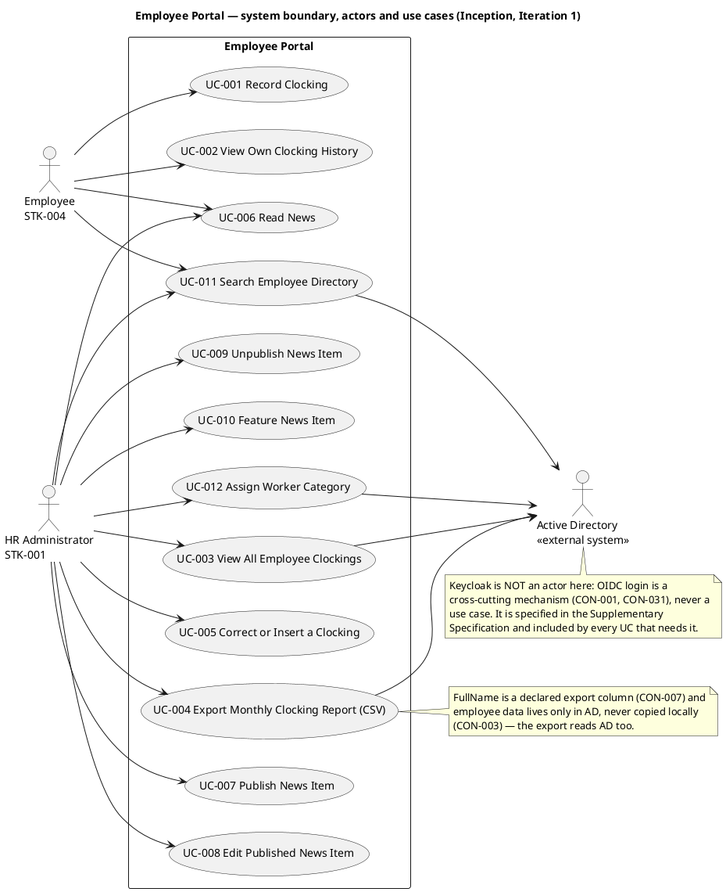
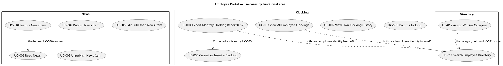
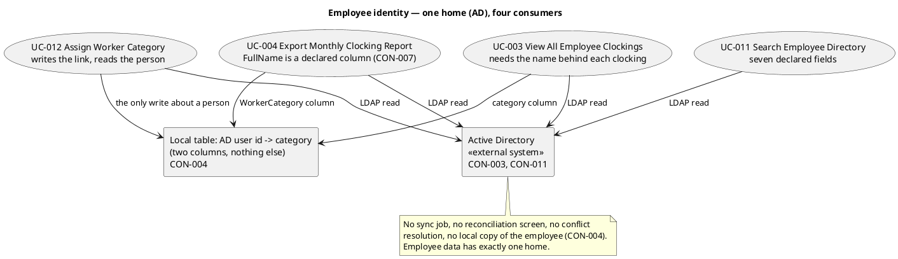
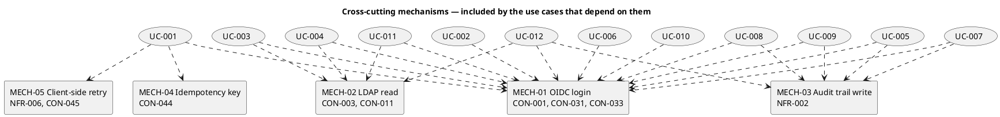
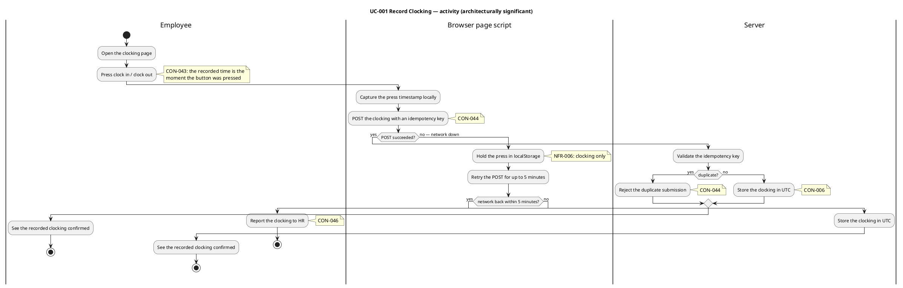
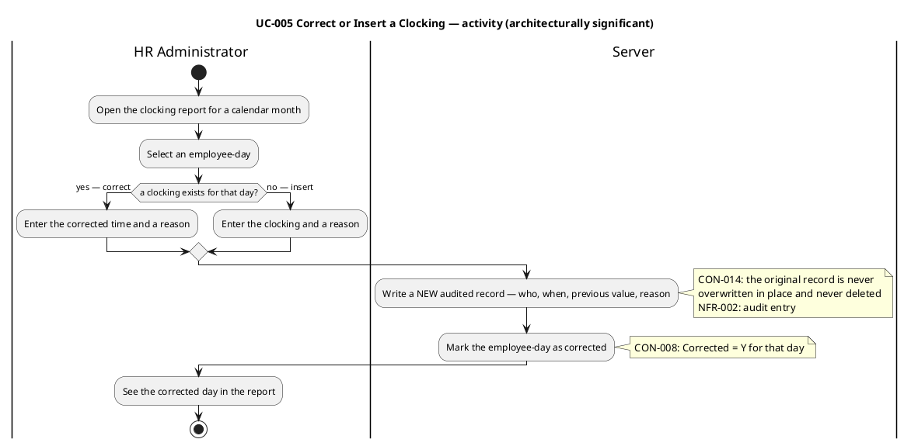
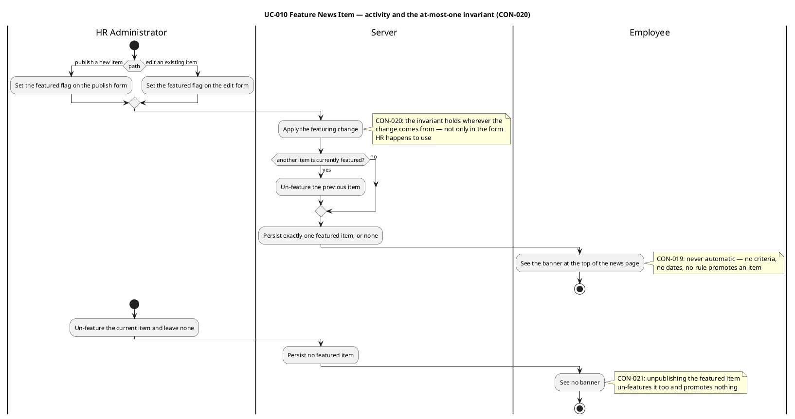

## Document Control

- Phase: Inception
- Status: Draft — under review for the end-of-Inception milestone
- Milestone Target: end-of-Inception (NOT YET ACHIEVED)
- Iteration: 1, Cycle 1
- Owner: SystemAnalyst
- Last updated: 2026-09-28

## Use-Case Diagram

Actors sit ON the boundary line. Everything inside the rectangle is the portal's responsibility; everything outside is consumed or excluded. Twelve use cases, two human actors and one external system actor.

```plantuml
@startuml
title Employee Portal — system boundary, actors and use cases (Inception, Iteration 1)
left to right direction
skinparam packageStyle rectangle

actor "Employee\nSTK-004" as EMP
actor "HR Administrator\nSTK-001" as HR
actor "Active Directory\n<<external system>>" as AD

rectangle "Employee Portal" {
  usecase "UC-001 Record Clocking" as UC001
  usecase "UC-002 View Own Clocking History" as UC002
  usecase "UC-003 View All Employee Clockings" as UC003
  usecase "UC-004 Export Monthly Clocking Report (CSV)" as UC004
  usecase "UC-005 Correct or Insert a Clocking" as UC005
  usecase "UC-006 Read News" as UC006
  usecase "UC-007 Publish News Item" as UC007
  usecase "UC-008 Edit Published News Item" as UC008
  usecase "UC-009 Unpublish News Item" as UC009
  usecase "UC-010 Feature News Item" as UC010
  usecase "UC-011 Search Employee Directory" as UC011
  usecase "UC-012 Assign Worker Category" as UC012
}

EMP --> UC001
EMP --> UC002
EMP --> UC006
EMP --> UC011
HR --> UC003
HR --> UC004
HR --> UC005
HR --> UC006
HR --> UC007
HR --> UC008
HR --> UC009
HR --> UC010
HR --> UC011
HR --> UC012
UC003 --> AD
UC004 --> AD
UC011 --> AD
UC012 --> AD

note bottom of AD
  Keycloak is NOT an actor here: OIDC login is a
  cross-cutting mechanism (CON-001, CON-031), never a
  use case. It is specified in the Supplementary
  Specification and included by every UC that needs it.
end note

note right of UC004
  FullName is a declared export column (CON-007) and
  employee data lives only in AD, never copied locally
  (CON-003) — the export reads AD too.
end note
@enduml
```

### Use-case grouping

The twelve use cases fall into three functional areas over one database. The grouping is a reading aid, not a package decomposition — the Software Architect owns the decomposition.

```plantuml
@startuml
title Employee Portal — use cases by functional area
skinparam packageStyle rectangle

package "Clocking" {
  usecase "UC-001 Record Clocking" as UC001
  usecase "UC-002 View Own Clocking History" as UC002
  usecase "UC-003 View All Employee Clockings" as UC003
  usecase "UC-004 Export Monthly Clocking Report (CSV)" as UC004
  usecase "UC-005 Correct or Insert a Clocking" as UC005
}

package "News" {
  usecase "UC-006 Read News" as UC006
  usecase "UC-007 Publish News Item" as UC007
  usecase "UC-008 Edit Published News Item" as UC008
  usecase "UC-009 Unpublish News Item" as UC009
  usecase "UC-010 Feature News Item" as UC010
}

package "Directory" {
  usecase "UC-011 Search Employee Directory" as UC011
  usecase "UC-012 Assign Worker Category" as UC012
}

UC004 ..> UC005 : Corrected = Y is set by UC-005
UC010 ..> UC006 : the banner UC-006 renders
UC012 ..> UC011 : the category column UC-011 shows
UC003 ..> UC011 : both read employee identity from AD
UC004 ..> UC011 : both read employee identity from AD
@enduml
```

### Employee identity is read from Active Directory, never stored

CON-003 makes employee data read-only from AD with no local copy, and CON-004 limits the local table to AD user id → category. Any use case that must show *who* an employee is therefore reads AD — not only the directory feature. This is a boundary fact the Software Architect needs: the LDAP read is not confined to UC-011.

```plantuml
@startuml
title Employee identity — one home (AD), four consumers
skinparam componentStyle rectangle

component "Active Directory\n<<external system>>\nCON-003, CON-011" as AD
component "Local table: AD user id -> category\n(two columns, nothing else)\nCON-004" as LINK

usecase "UC-003 View All Employee Clockings\nneeds the name behind each clocking" as UC003
usecase "UC-004 Export Monthly Clocking Report\nFullName is a declared column (CON-007)" as UC004
usecase "UC-011 Search Employee Directory\nseven declared fields" as UC011
usecase "UC-012 Assign Worker Category\nwrites the link, reads the person" as UC012

UC003 --> AD : LDAP read
UC004 --> AD : LDAP read
UC011 --> AD : LDAP read
UC012 --> AD : LDAP read
UC012 --> LINK : the only write about a person
UC003 --> LINK : category column
UC004 --> LINK : WorkerCategory column

note bottom of AD
  No sync job, no reconciliation screen, no conflict
  resolution, no local copy of the employee (CON-004).
  Employee data has exactly one home.
end note
@enduml
```

## Actors

| Actor | Type | ID | Description | Use cases |
|---|---|---|---|---|
| Employee | Human, primary | STK-004 | A Cuba Corp employee — 200 people across 3 offices. Authenticated with corporate credentials; not a member of the HR AD group. Reads the directory and the news, records and views their own clockings. | UC-001, UC-002, UC-006, UC-011 |
| HR Administrator | Human, primary | STK-001 | A member of the HR AD group (CON-033). Sees and corrects all clockings, exports the monthly report, and owns the news lifecycle and worker categories. | UC-003, UC-004, UC-005, UC-006, UC-007, UC-008, UC-009, UC-010, UC-011, UC-012 |
| Active Directory | External system, supporting | STK-003 | The single home of employee data (CON-003, CON-004). Read over LDAP wherever a use case must show who an employee is — the directory, the clocking report, the CSV export and the category assignment. Never written to (CON-011). | UC-003, UC-004, UC-011, UC-012 |

### Actors deliberately NOT modelled

| Candidate | Why it is not an actor |
|---|---|
| Keycloak | OIDC login is a cross-cutting technical mechanism, not a user-facing process. It delivers no observable value to an actor on its own. It is specified in the Supplementary Specification and included by every use case that needs an authenticated session (CON-001, CON-031). |
| Time / scheduler | No batch job, no scheduled report and no time-based trigger is declared. Nothing in the portal runs on a clock. |
| Hardware device | No device actor is declared. Biometric clocking is explicitly out of scope; clocking is a button press in the corporate browser. |
| Auditor | NFR-002 declares there is no in-portal audit view screen. The audit trail is read directly from the database by HR or Infrastructure, ad hoc — not through a portal use case. |
| Payroll system | Integration with the payroll system is explicitly out of scope. |

## Use-Case Survey
Twelve use cases. Priority is MoSCoW. Volatility is assessed on two axes — will this change for this customer over time, and does it differ across customers now. High volatility feeds the Software Architect's decomposition: volatile behaviour must be encapsulated in a dedicated component, not spread across the codebase.

| UC | Source | Name | Primary actor | Trigger | Measurable outcome | Priority | Volatility |
|---|---|---|---|---|---|---|---|
| UC-001 | AC-002, AC-005, AC-006, NFR-004, NFR-006, CON-043, CON-044, CON-045, CON-046; declared Vision statement ("centralises clock-in/out") | Record Clocking | Employee | Employee presses the clock in or clock out button | A clocking record exists in UTC for the employee's current calendar day, and the employee sees the recorded time in Europe/Madrid | Must | Low |
| UC-002 | FR-001 | View Own Clocking History | Employee | Employee opens their clocking history | The employee sees their own clockings for the current month, and nobody else's | Must | Low |
| UC-003 | FR-002 | View All Employee Clockings | HR Administrator | HR opens the clocking report | HR sees every employee's clockings; an employee cannot reach this view | Must | Low |
| UC-004 | FR-003 | Export Monthly Clocking Report (CSV) | HR Administrator | HR selects a calendar month and requests the export | A CSV file covering exactly one calendar month, with the eight declared columns in the declared order and the declared value formats | Must | High |
| UC-005 | Stakeholder-confirmed 2026-09-28 (DC §Declared use-case scope); CON-008, CON-013, CON-014, NFR-002 | Correct or Insert a Clocking | HR Administrator | HR identifies an employee-day with a missing or wrong clocking | A new audited record exists (who, when, previous value, reason), the original record is intact, and the employee-day exports with Corrected = Y | Must | Medium |
| UC-006 | FR-005 | Read News | Employee, HR Administrator | Actor opens the main page | News is listed newest-first, filterable by the four declared categories, with the featured item in a banner at the top | Must | Medium |
| UC-007 | FR-004 | Publish News Item | HR Administrator | HR submits a new item with title, body, date and category | The item is visible to employees and an audit entry names who published it and when | Must | Low |
| UC-008 | FR-007 | Edit Published News Item | HR Administrator | HR opens a published item and changes it | The item changes in place without a republish, and an audit entry names who edited it and when | Must | Low |
| UC-009 | FR-008 | Unpublish News Item | HR Administrator | HR unpublishes an item | The item disappears from every employee view and the record remains in the database | Must | Low |
| UC-010 | FR-006 | Feature News Item | HR Administrator | HR flags an item as featured, when publishing or when editing | At most one item is featured at any moment regardless of which path changed it; with none featured the banner does not appear | Must | Medium |
| UC-011 | FR-009, CON-024 | Search Employee Directory | Employee, HR Administrator | Actor searches by name, department or office, or filters by worker category | The actor finds a colleague's phone and email in under 10 seconds, with the seven declared fields shown | Must | High |
| UC-012 | FR-010 | Assign Worker Category | HR Administrator | HR assigns or clears a category from the directory screen | The category is stored as AD user id → category, the change is audited, and no employee field is written | Must | High |

**UC-001 source note.** No FR-NNN enumerates the act of clocking. The stakeholder declared it in the Vision statement ("centralises clock-in/out") and as acceptance criteria AC-002, AC-005 and AC-006, with NFR-004 and NFR-006 constraining it and CON-043, CON-044, CON-045 and CON-046 fixing its behaviour. UC-001 is the realization of those declared items, not an inference.

**UC-011 filter note.** CON-024 places worker category in exactly two places: as a column of the directory that also filters it, and as a column of the CSV export. The directory therefore filters by worker category in addition to the name, department and office search of FR-009.

### Volatility notes feeding the architecture

| UC | Why volatile | What must be encapsulated |
|---|---|---|
| UC-004 | The column set and the value formats of a report are the classic requirement that changes for the same customer over time and differs across customers. CON-007 and CON-008 pin them for this project, but the pin is a project decision, not a property of the domain. | The export's column set and value formatting, behind one boundary — a change to a column or a format must not reach the clocking model. |
| UC-011 | The searchable and displayed fields are exactly the AD attributes that R004 says may not be filled consistently across the three offices. The field set is therefore both uncertain now and likely to change. | The directory field set and the AD attribute mapping, behind one boundary. |
| UC-012 | The worker-category list is a closed list of four values fixed for this project (CON-026), and CON-026 itself anticipates a Change Request to change it. | The category enumeration and its validation, in one place. |
| UC-010 | The featuring policy (CON-019, CON-020, CON-021) is business policy, not a property of the news item. | The at-most-one-featured invariant, enforced wherever the change originates — not in the form HR happens to use. |
| UC-006 | The category list (CON-023) and the banner behaviour are presentation policy. | The category enumeration and the banner selection. |

### Cross-cutting mechanisms — NOT use cases

These are specified in the Supplementary Specification and included by every use case that depends on them. They are not user-facing processes and deliver no observable value to an actor on their own.

| Mechanism | Declared by | Included by |
|---|---|---|
| MECH-01 OIDC login via Keycloak, roles read from token claims | CON-001, CON-031, CON-033 | Every use case — all require an authenticated session |
| MECH-02 LDAP read of directory attributes | CON-003, CON-011 | UC-003, UC-004, UC-011, UC-012 — every use case that must show who an employee is, since employee data is never copied locally (CON-003) |
| MECH-03 Audit trail write | NFR-002 | UC-005, UC-007, UC-008, UC-009, UC-012 |
| MECH-04 Idempotency key on clocking submission | CON-044 | UC-001 |
| MECH-05 Client-side retry of the clocking POST | NFR-006, CON-045 | UC-001 |

```plantuml
@startuml
title Cross-cutting mechanisms — included by the use cases that depend on them
skinparam componentStyle rectangle

component "MECH-01 OIDC login\nCON-001, CON-031, CON-033" as M1
component "MECH-02 LDAP read\nCON-003, CON-011" as M2
component "MECH-03 Audit trail write\nNFR-002" as M3
component "MECH-04 Idempotency key\nCON-044" as M4
component "MECH-05 Client-side retry\nNFR-006, CON-045" as M5

usecase "UC-001" as UC001
usecase "UC-002" as UC002
usecase "UC-003" as UC003
usecase "UC-004" as UC004
usecase "UC-005" as UC005
usecase "UC-006" as UC006
usecase "UC-007" as UC007
usecase "UC-008" as UC008
usecase "UC-009" as UC009
usecase "UC-010" as UC010
usecase "UC-011" as UC011
usecase "UC-012" as UC012

UC001 ..> M1
UC002 ..> M1
UC003 ..> M1
UC004 ..> M1
UC005 ..> M1
UC006 ..> M1
UC007 ..> M1
UC008 ..> M1
UC009 ..> M1
UC010 ..> M1
UC011 ..> M1
UC012 ..> M1

UC003 ..> M2
UC004 ..> M2
UC011 ..> M2
UC012 ..> M2

UC005 ..> M3
UC007 ..> M3
UC008 ..> M3
UC009 ..> M3
UC012 ..> M3

UC001 ..> M4
UC001 ..> M5
@enduml
```

## Use-Case Specifications
Inception details only the architecturally significant use cases — those that force an architectural decision. Four are detailed here: UC-001 (client timestamp, idempotency, client-side retry), UC-004 (report format, timezone and the AD read behind FullName), UC-005 (immutability and audit), UC-010 (the at-most-one-featured invariant). The remaining eight are detailed by the RequirementsSpecifier in Elaboration.

### UC-001 Record Clocking

| Field | Value |
|---|---|
| Primary actor | Employee |
| Source | AC-002, AC-005, AC-006, NFR-004, NFR-006, CON-043, CON-044, CON-045, CON-046 |
| Trigger | The employee presses the clock in or clock out button on the clocking page. |
| Preconditions | The employee has an authenticated session (CON-001). The clocking page is loaded. |
| Postconditions | A clocking record exists in UTC for the employee's current calendar day (CON-006, CON-017). The employee sees the recorded time in Europe/Madrid. |
| Priority | Must |
| Volatility | Low |

**Main flow**

1. The employee opens the clocking page.
2. The system shows today's state for that employee — no clocking yet, or clocked in at HH:mm.
3. The employee presses clock in or clock out.
4. The page script captures the press timestamp and POSTs the clocking with an idempotency key.
5. The system validates the idempotency key and rejects a duplicate submission (CON-044).
6. The system stores the clocking in UTC (CON-006).
7. The system confirms the recorded time to the employee in Europe/Madrid.

**Alternative flows**

| ID | Condition | Flow |
|---|---|---|
| A1 | The corporate network is unavailable at the moment of the press | The page script holds the press in localStorage and retries the POST for up to 5 minutes (NFR-006). On success the flow resumes at step 6. Beyond 5 minutes the employee reports the clocking to HR (CON-046). |
| A2 | The submission is a duplicate | The idempotency key rejects it (CON-044); the employee sees the already-recorded clocking. |
| A3 | The employee already has a complete clocking pair for today | At most one clocking pair per employee per calendar day (CON-017) — the system refuses the press and shows the existing pair. |

**Special requirements**

- The recorded time is the moment the button was pressed, not the time the server received it; the server accepts the timestamp the client sends (CON-043).
- The clock in/out operation responds in under 1 second (NFR-004).
- The retry is one action, one queue, one entity — there is nothing to reconcile and no conflict resolution to write (CON-045).

```plantuml
@startuml
title UC-001 Record Clocking — activity (architecturally significant)
|Employee|
start
:Open the clocking page;
:Press clock in / clock out;
note right
  CON-043: the recorded time is the
  moment the button was pressed
end note
|Browser page script|
:Capture the press timestamp locally;
:POST the clocking with an idempotency key;
note right
  CON-044
end note
if (POST succeeded?) then (yes)
  |Server|
  :Validate the idempotency key;
  if (duplicate?) then (yes)
    :Reject the duplicate submission;
    note right
      CON-044
    end note
  else (no)
    :Store the clocking in UTC;
    note right
      CON-006
    end note
  endif
  |Employee|
  :See the recorded clocking confirmed;
  stop
else (no — network down)
  |Browser page script|
  :Hold the press in localStorage;
  note right
    NFR-006: clocking only
  end note
  :Retry the POST for up to 5 minutes;
  if (network back within 5 minutes?) then (yes)
    |Server|
    :Store the clocking in UTC;
    |Employee|
    :See the recorded clocking confirmed;
    stop
  else (no)
    |Employee|
    :Report the clocking to HR;
    note right
      CON-046
    end note
    stop
  endif
endif
@enduml
```

### UC-004 Export Monthly Clocking Report (CSV)

| Field | Value |
|---|---|
| Primary actor | HR Administrator |
| Source | FR-003, CON-005, CON-007, CON-008, CON-012, CON-015, CON-018, CON-025 |
| Trigger | HR selects a calendar month and requests the export. |
| Preconditions | HR has an authenticated session and is a member of the HR AD group (CON-033). |
| Postconditions | A CSV file covering exactly one calendar month (00:00 on the first day to 23:59:59 on the last, Europe/Madrid) exists, with the eight declared columns in the declared order. |
| Priority | Must |
| Volatility | High |

**Main flow**

1. HR opens the clocking report.
2. HR selects one calendar month.
3. The system collects every employee-day in that month that has at least one clocking (CON-018).
4. The system resolves each employee's FullName and WorkerCategory — FullName from Active Directory over LDAP, since employee data is never copied locally (CON-003), and WorkerCategory from the local AD-user-id-to-category link (CON-004).
5. The system writes one row per employee-day: EmployeeId, FullName, WorkerCategory, Date, ClockIn, ClockOut, HoursWorked, Corrected — in that order (CON-007).
6. The system returns the CSV file.

**Alternative flows**

| ID | Condition | Flow |
|---|---|---|
| A1 | An employee-day has no clock-out | ClockOut and HoursWorked are written empty; the row is still exported (CON-015). A zero would falsely state the employee worked no hours. |
| A2 | The employee has no worker category | WorkerCategory is written blank; no default value is invented (CON-025). |
| A3 | A day has no clocking at all | No row is produced — weekend, holiday, sick day and day before joining all produce nothing (CON-018). |
| A4 | An AD attribute behind a column is empty | The column is written blank for that employee; the row is still exported. R004 records that job title and extension may not be filled consistently across the three offices. |

**Special requirements**

- EmployeeId is the AD sAMAccountName, read from the authenticated session and written as-is; no mapping table (CON-005).
- Date is ISO 8601 (2026-06-22); ClockIn and ClockOut are 24-hour HH:mm with no seconds; HoursWorked is decimal hours with two decimals, computed from the recorded clocking times and not from the minute-rounded values shown; Corrected is Y when HR corrected or inserted any clocking of that day, N otherwise (CON-008).
- All three offices are in Europe/Madrid; there is no multi-timezone case (CON-012).

### UC-005 Correct or Insert a Clocking

| Field | Value |
|---|---|
| Primary actor | HR Administrator |
| Source | Stakeholder-confirmed 2026-09-28 (DC §Declared use-case scope); CON-008, CON-013, CON-014, NFR-002 |
| Trigger | HR identifies an employee-day with a missing or wrong clocking. |
| Preconditions | HR has an authenticated session and is a member of the HR AD group (CON-033). |
| Postconditions | A new audited record exists carrying who, when, previous value and reason; the original record is intact; the employee-day exports with Corrected = Y. |
| Priority | Must |
| Volatility | Medium |

**Main flow**

1. HR opens the clocking report for a calendar month.
2. HR selects an employee-day.
3. The system shows the existing clocking, if any.
4. HR enters the corrected or inserted time and a reason.
5. The system writes a NEW record — the original is never overwritten in place and never deleted (CON-014).
6. The system writes the audit entry: who, when, previous value, reason (NFR-002).
7. The system marks the employee-day as corrected (CON-008).
8. HR sees the corrected day in the report.

**Alternative flows**

| ID | Condition | Flow |
|---|---|---|
| A1 | No clocking exists for that day | HR inserts one; the same audit and Corrected rules apply. |
| A2 | The day already carries a correction | A further new record is written; the previous correction is not overwritten (CON-014). |

**Special requirements**

- Only HR corrects or inserts a clocking. There is no self-service correction screen for the employee; an employee who forgets to clock out asks HR (CON-013).
- The audit trail is read directly from the database; there is no in-portal audit view screen (NFR-002).

```plantuml
@startuml
title UC-005 Correct or Insert a Clocking — activity (architecturally significant)
|HR Administrator|
start
:Open the clocking report for a calendar month;
:Select an employee-day;
if (a clocking exists for that day?) then (yes — correct)
  :Enter the corrected time and a reason;
else (no — insert)
  :Enter the clocking and a reason;
endif
|Server|
:Write a NEW audited record — who, when, previous value, reason;
note right
  CON-014: the original record is never
  overwritten in place and never deleted
  NFR-002: audit entry
end note
:Mark the employee-day as corrected;
note right
  CON-008: Corrected = Y for that day
end note
|HR Administrator|
:See the corrected day in the report;
stop
@enduml
```

### UC-010 Feature News Item

| Field | Value |
|---|---|
| Primary actor | HR Administrator |
| Source | FR-006, CON-019, CON-020, CON-021 |
| Trigger | HR flags a news item as featured, when publishing or when editing. |
| Preconditions | HR has an authenticated session and is a member of the HR AD group (CON-033). |
| Postconditions | At most one news item is featured; the banner shows it, or no banner appears if none is featured. |
| Priority | Must |
| Volatility | Medium |

**Main flow**

1. HR publishes a new item or opens an existing item for editing.
2. HR sets the featured flag.
3. The system applies the change and un-features any previously featured item (CON-020).
4. The system persists exactly one featured item.
5. Employees see the banner at the top of the news page.

**Alternative flows**

| ID | Condition | Flow |
|---|---|---|
| A1 | HR un-features the current item and leaves none | No banner appears (CON-020). |
| A2 | HR unpublishes the featured item | It is un-featured too, and no other item is promoted to take its place (CON-021). |

**Special requirements**

- Featuring is a manual flag HR sets — never automatic. There are no criteria, no dates and no rules that promote a news item by themselves (CON-019).
- The at-most-one invariant holds wherever the change comes from, not only in the form HR happens to use (CON-020).

```plantuml
@startuml
title UC-010 Feature News Item — activity and the at-most-one invariant (CON-020)
|HR Administrator|
start
if (path) then (publish a new item)
  :Set the featured flag on the publish form;
else (edit an existing item)
  :Set the featured flag on the edit form;
endif
|Server|
:Apply the featuring change;
note right
  CON-020: the invariant holds wherever the
  change comes from — not only in the form
  HR happens to use
end note
if (another item is currently featured?) then (yes)
  :Un-feature the previous item;
else (no)
endif
:Persist exactly one featured item, or none;
|Employee|
:See the banner at the top of the news page;
note right
  CON-019: never automatic — no criteria,
  no dates, no rule promotes an item
end note
stop

|HR Administrator|
start
:Un-feature the current item and leave none;
|Server|
:Persist no featured item;
|Employee|
:See no banner;
note right
  CON-021: unpublishing the featured item
  un-features it too and promotes nothing
end note
stop
@enduml
```

### Remaining use cases — outline only

Detailed by the RequirementsSpecifier in Elaboration. Each passes the ATM test: a named primary actor, a trigger event, and a measurable outcome.

| UC | Primary actor | Trigger | Measurable outcome |
|---|---|---|---|
| UC-002 View Own Clocking History | Employee | Employee opens their clocking history | The employee sees their own clockings for the current month, and nobody else's |
| UC-003 View All Employee Clockings | HR Administrator | HR opens the clocking report | HR sees every employee's clockings; an employee cannot reach this view |
| UC-006 Read News | Employee, HR Administrator | Actor opens the main page | News listed newest-first, filterable by the four declared categories, featured item in a banner |
| UC-007 Publish News Item | HR Administrator | HR submits a new item | The item is visible to employees and an audit entry names who published it and when |
| UC-008 Edit Published News Item | HR Administrator | HR opens a published item and changes it | The item changes in place without a republish, and an audit entry names who edited it and when |
| UC-009 Unpublish News Item | HR Administrator | HR unpublishes an item | The item disappears from every employee view and the record remains in the database |
| UC-011 Search Employee Directory | Employee, HR Administrator | Actor searches by name, department or office, or filters by worker category | The actor finds a colleague's phone and email in under 10 seconds, with the seven declared fields shown |
| UC-012 Assign Worker Category | HR Administrator | HR assigns or clears a category from the directory screen | The category is stored as AD user id → category, the change is audited, and no employee field is written |

## Traceability
| Element | Traces From | Link Type | Traces To |
|---|---|---|---|
| UC-001 Record Clocking | AC-002, AC-005, AC-006, NFR-004, NFR-006, CON-043, CON-044, CON-045, CON-046 | DependsOn | Supplementary Specification |
| UC-002 View Own Clocking History | FR-001 | DependsOn | Supplementary Specification |
| UC-003 View All Employee Clockings | FR-002, CON-003 | DependsOn | Supplementary Specification |
| UC-004 Export Monthly Clocking Report (CSV) | FR-003, CON-003, CON-005, CON-007, CON-008, CON-012, CON-015, CON-018 | DependsOn | Supplementary Specification |
| UC-004 Export Monthly Clocking Report (CSV) | FR-003, CON-007, CON-008 | Derives | Software Architecture Document |
| UC-005 Correct or Insert a Clocking | CON-008, CON-013, CON-014, NFR-002 | DependsOn | Supplementary Specification |
| UC-006 Read News | FR-005, CON-023 | DependsOn | Supplementary Specification |
| UC-007 Publish News Item | FR-004, NFR-002 | DependsOn | Supplementary Specification |
| UC-008 Edit Published News Item | FR-007, NFR-002 | DependsOn | Supplementary Specification |
| UC-009 Unpublish News Item | FR-008, CON-022 | DependsOn | Supplementary Specification |
| UC-010 Feature News Item | FR-006, CON-019, CON-020, CON-021 | DependsOn | Supplementary Specification |
| UC-011 Search Employee Directory | FR-009, CON-003, CON-024, CON-027 | DependsOn | Supplementary Specification |
| UC-011 Search Employee Directory | FR-009, CON-003 | Derives | Software Architecture Document |
| UC-012 Assign Worker Category | FR-010, CON-004, CON-024, CON-025, CON-026 | DependsOn | Supplementary Specification |
| UC-012 Assign Worker Category | FR-010, CON-026 | Derives | Software Architecture Document |
| STK-004 Employee | STK-004 | Refines | UC-001, UC-002, UC-006, UC-011 |
| STK-001 HR Administrator | STK-001 | Refines | UC-003, UC-004, UC-005, UC-006, UC-007, UC-008, UC-009, UC-010, UC-011, UC-012 |
| STK-003 Infrastructure team (Active Directory) | STK-003, CON-003, CON-011 | Refines | UC-003, UC-004, UC-011, UC-012 |

The three `Derives` links to the Software Architecture Document carry the High-volatility use cases — UC-004, UC-011 and UC-012 — whose volatile behaviour must be encapsulated in a dedicated component rather than spread across the codebase.

### Downstream — what each use case feeds

| Element | Link Type | Traces To |
|---|---|---|
| UC-001 Record Clocking | DependsOn | Supplementary Specification |
| UC-002 View Own Clocking History | DependsOn | Supplementary Specification |
| UC-003 View All Employee Clockings | DependsOn | Supplementary Specification |
| UC-004 Export Monthly Clocking Report (CSV) | DependsOn | Supplementary Specification |
| UC-004 Export Monthly Clocking Report (CSV) | Derives | Software Architecture Document |
| UC-005 Correct or Insert a Clocking | DependsOn | Supplementary Specification |
| UC-006 Read News | DependsOn | Supplementary Specification |
| UC-007 Publish News Item | DependsOn | Supplementary Specification |
| UC-008 Edit Published News Item | DependsOn | Supplementary Specification |
| UC-009 Unpublish News Item | DependsOn | Supplementary Specification |
| UC-010 Feature News Item | DependsOn | Supplementary Specification |
| UC-011 Search Employee Directory | DependsOn | Supplementary Specification |
| UC-011 Search Employee Directory | Derives | Software Architecture Document |
| UC-012 Assign Worker Category | DependsOn | Supplementary Specification |
| UC-012 Assign Worker Category | Derives | Software Architecture Document |

The three `Derives` links to the Software Architecture Document carry the High-volatility use cases — UC-004, UC-011 and UC-012 — whose volatile behaviour must be encapsulated in a dedicated component rather than spread across the codebase.

### Coverage

| Declared item | Realized by |
|---|---|
| FR-001 | UC-002 |
| FR-002 | UC-003 |
| FR-003 | UC-004 |
| FR-004 | UC-007 |
| FR-005 | UC-006 |
| FR-006 | UC-010 |
| FR-007 | UC-008 |
| FR-008 | UC-009 |
| FR-009 | UC-011 |
| FR-010 | UC-012 |
| Vision statement ("centralises clock-in/out"), AC-002, AC-005, AC-006 | UC-001 |
| Stakeholder decision 2026-09-28 (DC §Declared use-case scope) | UC-005 |

All ten declared functional requirements and the two declared processes outside the FR series are realized. No use case is orphaned and no declared item is unaddressed.

