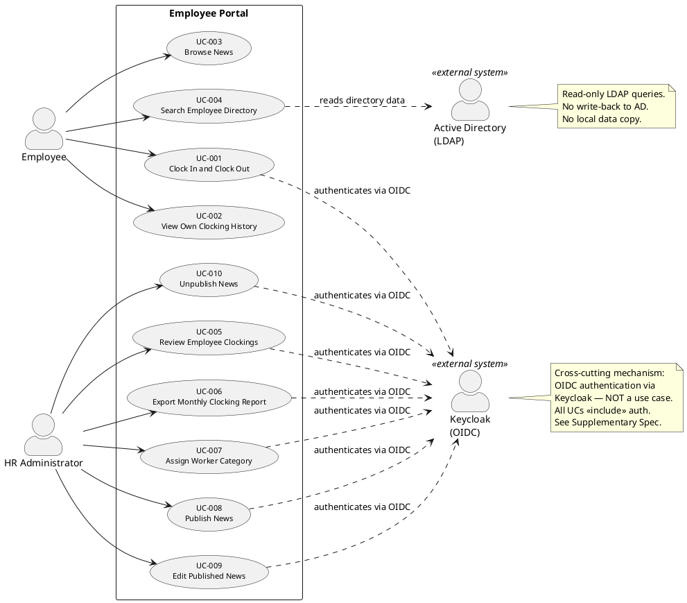

## Document Control

| Field | Value |
|---|---|
| Phase | Inception |
| Status | Draft |
| Milestone Target | End of Inception |
| Iteration | 1 (Cycle 1) |

## Problem Statement

Cuba Corp (200 employees, 3 offices) manages employee clocking via shared Excel sheets, distributes HR news through mass emails, and maintains an outdated PDF directory for colleague lookup. These manual workflows cause:

- **HR administrative overhead:** Manual Excel consolidation for attendance tracking, email blasts for news distribution, and stale PDF directories consume significant HR time.
- **Data inconsistency:** Excel sheets are versioned ad-hoc across offices; the PDF directory is perpetually out of date.
- **No audit trail:** Clocking records and news distribution lack traceability of who did what and when.

**Root cause:** No centralized, authoritative system exists for these three core HR workflows. Each is handled by a different manual tool with no integration.

**Affected stakeholders:** STK-001 (HR Director — bears the overhead), STK-003 (Employees — endure stale data and email noise), STK-004 (Infrastructure — concerned about operational impact).

**Success criteria (measurable):**
- BG-001: Reduce HR management time by 50%
- BG-002: Eliminate 100% of Excel usage for clocking, news, and directory
- BG-003: 80% employee adoption within 3 months
- AC-001: Employee clocks in/out without help
- AC-003: Employee finds colleague's phone/email in under 10 seconds

## Product Position Statement

**For** Cuba Corp employees and HR staff
**Who** need centralized clocking, news, and directory tools
**The Employee Portal** is an internal web application
**That** replaces Excel sheets, mass emails, and the PDF directory with a single browser-accessible system
**Unlike** the current manual workflows
**Our product** provides real-time clocking with audit trails, centralized news publishing with version history, and a live AD-backed directory — all behind corporate authentication.

## Stakeholder Summary

| ID | Stakeholder | Role | Influence | Key Needs |
|---|---|---|---|---|
| STK-001 | Laura Gómez (HR Director) | Project sponsor | High | Centralized HR workflows; reduced admin overhead; audit trail for news and category changes |
| STK-002 | Miguel Torres (Software Engineer) | Technical advisor | High | Clarifies engineering questions; does not build the system |
| STK-003 | Cuba Corp Employees (200 people, 3 offices) | End users | Medium | Simple clocking, news browsing, directory lookup without training |
| STK-004 | Infrastructure Team | Operates AD and Keycloak | High | No modifications to AD; no new operational work; portal is a read-only consumer |

## Product Overview

The Employee Portal is a single internal web application (Razor Pages, .NET 10 backend, PostgreSQL database) hosted on an internal Windows Server, accessible only from the corporate network via Chrome or Edge. It provides three functional areas:

1. **Clocking** — Employees clock in/out from the main screen; HR reviews all clockings and exports CSV reports.
2. **News** — HR publishes, edits, and unpublishes internal news; employees browse and filter by category.
3. **Directory** — Employees search colleagues by name, department, or office; data read live from Active Directory over LDAP (read-only).

Authentication is via existing Keycloak (OIDC). Employee directory data is never copied into the portal database — only AD user id → worker category is stored locally.

### Not in scope

- Native mobile app (responsive web only)
- Push notifications
- Payroll system integration
- Vacation or sick-leave management
- Biometric clocking
- Any Keycloak work (deployment, provisioning, realm design)
- Writing back to Active Directory
- Local copy of employee data (no sync, no reconciliation)
- News archive screen
- Hard delete of news items
- Worker category list management (fixed, externally configured)
- Backup and server crash recovery (Infrastructure's responsibility)

## Features

| Feature | Source | MoSCoW | Volatility | Success Metric |
|---|---|---|---|---|
| F-001: Employee clock in/out with status-aware button and time confirmation | FR-004 | Must | Low | AC-001, AC-004 |
| F-002: Employee clocking history (current month) | FR-005 | Must | Low | Employee self-service |
| F-003: HR clocking review (all employees) | FR-001 | Must | Low | Replaces Excel attendance tracking |
| F-004: Monthly clocking CSV export | FR-002 | Must | Medium | Replaces manual Excel export |
| F-005: Worker category assignment (AD uid → category) | FR-003 | Must | Medium | Category stored and displayed |
| F-006: News publishing with title, body, date, category, featured flag | FR-006 | Must | Low | AC-002 |
| F-007: News browsing with category filter and featured banner | FR-007 | Must | Low | Replaces mass email |
| F-008: News editing with full audit trail | FR-008 | Must | Low | All versions traceable |
| F-009: News unpublish (soft delete, no hard delete) | FR-009 | Must | Low | Record retained for audit |
| F-010: Employee directory search (name, department, office) | FR-010 | Must | Medium | AC-003 (under 10 seconds) |
| F-011: OIDC authentication via Keycloak | CON-004 | Must | Low | Corporate credentials work |
| F-012: Audit trail for news lifecycle and category changes | NFR-005 | Must | Low | Author + timestamp recorded |

## Assumptions and Dependencies

- Keycloak is already running with a configurable realm; the portal registers as an OIDC client only (CON-004).
- Active Directory LDAP endpoints are accessible from the portal server on the corporate network (CON-005, CON-009).
- AD attributes (job title, department, office, email, extension) are populated for all employees — **R001 flags this as a risk** if consistency varies across the 3 offices.
- The worker category list is configured outside the application and available to the portal at runtime (CON-013).
- The custom UI design (docs/inputs/employee-portal-design.html) is authoritative and will be implemented as-is (CON-011).
- Corporate network provides sufficient bandwidth for sub-3-second page loads (NFR-001).

## Constraints

| ID | Type | Constraint |
|---|---|---|
| CON-001 | Technical | Backend: .NET 10 with REST API |
| CON-002 | Technical | Frontend: Razor Pages (intranet, no SPA) |
| CON-003 | Technical | Database: PostgreSQL |
| CON-004 | Architectural | Keycloak is external — portal is OIDC client only |
| CON-005 | Architectural | Directory data read from AD over LDAP on demand |
| CON-006 | Architectural | No local copy of employee data — only AD uid → category stored |
| CON-007 | BusinessRule | No writing back to AD; no editing employee fields in portal |
| CON-008 | Environmental | Hosting: internal Windows Server (no cloud) |
| CON-009 | Operational | Internal corporate network only — no external access |
| CON-010 | Technical | Compatible with current Chrome and Edge browsers |
| CON-011 | Technical | Custom UI design is mandatory and authoritative |
| CON-012 | BusinessRule | No hard delete of news items — unpublish only |
| CON-013 | BusinessRule | Worker category list is fixed, externally configured |
| CON-014 | Operational | Backup and server crash recovery are Infrastructure's responsibility |

## Other Product Requirements

- **Security:** OIDC authentication via Keycloak; role-based access (Employee vs HR Administrator) from Keycloak claims. No anonymous access. Internal network only (CON-009).
- **Licensing:** All software is open-source or already owned (.NET 10, PostgreSQL, Keycloak). No additional licensing required.
- **Internationalization:** Not declared in scope. [RECOMMENDATION — requires CR] if multi-language support is needed.
- **Documentation:** User documentation not explicitly declared. [RECOMMENDATION — requires CR] for user guide or help pages.

## System Boundary

## Traceability

| Element | Traces From | Link Type | Traces To |
|---|---|---|---|
| F-001 | FR-004 | Refines | UC-001 |
| F-002 | FR-005 | Refines | UC-002 |
| F-003 | FR-001 | Refines | UC-005 |
| F-004 | FR-002 | Refines | UC-006 |
| F-005 | FR-003 | Refines | UC-007 |
| F-006 | FR-006 | Refines | UC-008 |
| F-007 | FR-007 | Refines | UC-003 |
| F-008 | FR-008 | Refines | UC-009 |
| F-009 | FR-009 | Refines | UC-010 |
| F-010 | FR-010 | Refines | UC-004 |
| F-011 | CON-004 | Refines | (Supplementary Spec) |
| F-012 | NFR-005 | Refines | (Supplementary Spec) |
| BG-001 | STK-001 | Derives | F-001–F-010 |
| BG-002 | STK-001, STK-003 | Derives | F-001–F-010 |
| BG-003 | STK-001, STK-003 | Derives | F-001, F-003, F-007, F-010 |