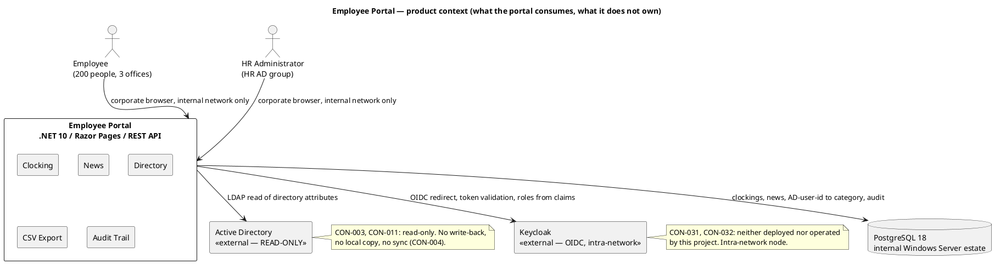
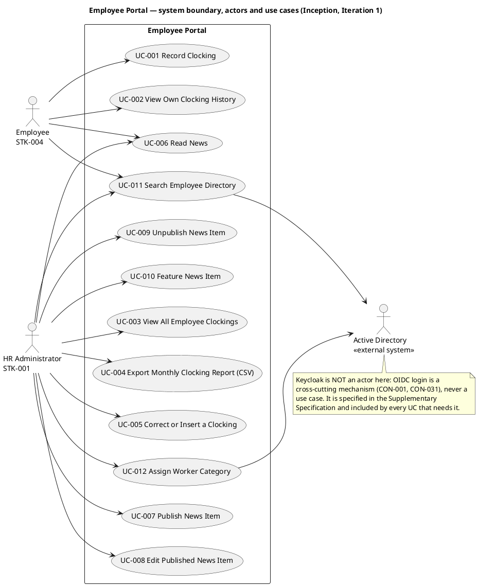
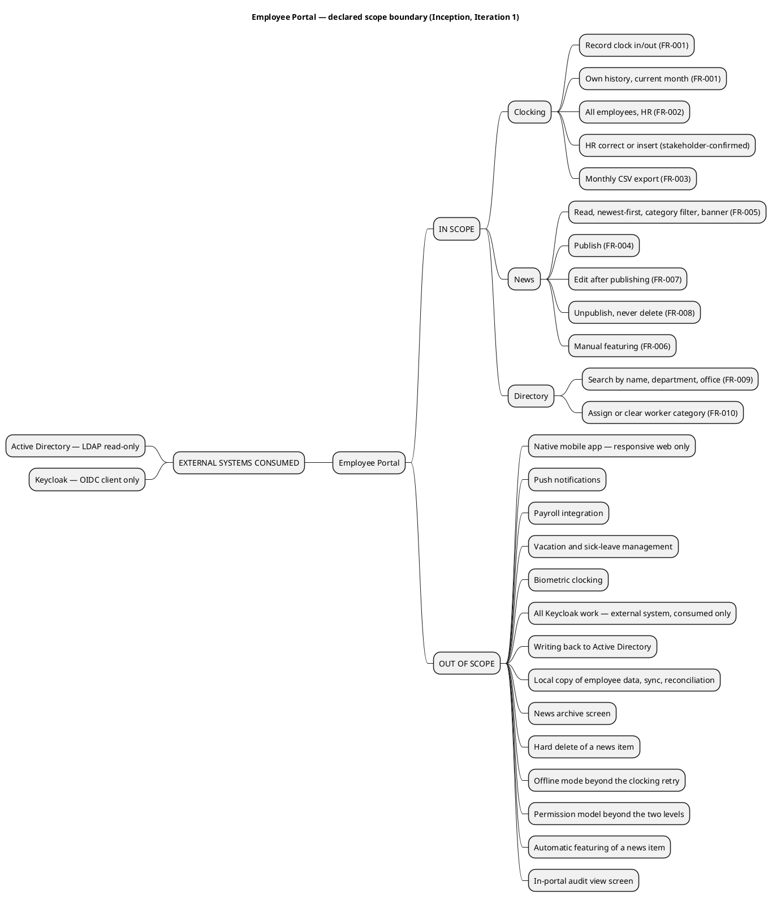

## Document Control

- Phase: Inception
- Status: Draft — under review for the end-of-Inception milestone
- Milestone Target: end-of-Inception (NOT YET ACHIEVED)
- Iteration: 1, Cycle 1
- Owner: SystemAnalyst
- Last updated: 2026-09-28

## Problem Statement

| Aspect | Statement |
|---|---|
| The problem | Cuba Corp's 200 employees across 3 offices record their working hours in shared Excel sheets, receive internal announcements by mass email, and look up colleagues in an outdated PDF phone list. Three separate artefacts, none of them authoritative, none of them reachable from the corporate browser in one place. |
| Affected stakeholders | STK-001 Laura Gómez (HR Director) — collects, corrects and reports clockings by hand. STK-004 Cuba Corp Employees — clock in/out, read news, look up colleagues. STK-003 Infrastructure team — operates the identity and directory systems the portal must consume without modification. |
| Impact | HR time is consumed by clocking collection, correction and reporting instead of HR work (BG-001). Announcements reach employees inconsistently. The phone list is stale the day it is printed. |
| Root cause | There is no single system of record for clockings, and no single place employees go for news and directory data. The data that does exist is duplicated across files that only one person can edit. |
| Success criteria | BG-001 HR management time reduced by 50% against current effort. BG-002 no new clocking recorded in a shared Excel sheet once live. BG-003 80% of the 200 employees actively using the portal within three months of go-live. |

## Product Position Statement

| Aspect | Statement |
|---|---|
| For | Cuba Corp employees (STK-004) and the HR Director (STK-001) |
| Who | currently record hours in shared Excel sheets, receive news by mass email and consult a PDF phone list |
| The product | Employee Portal |
| Is | an internal web application, reached from the corporate browser on the corporate network, that centralises clock-in/out, HR-published news and the corporate directory |
| That | records clockings once and immutably, publishes news with an audited lifecycle, and reads the directory from Active Directory as the single home of employee data |
| Unlike | shared Excel sheets, mass email and a printed phone list |
| Our product | gives every employee one place to clock in and out, read news and find a colleague, and gives HR one place to see, correct and export clockings — with no duplicate copy of employee data anywhere |

## Stakeholder Summary

| ID | Stakeholder | Role and interest | Influence | Needs the portal must satisfy |
|---|---|---|---|---|
| STK-001 | Laura Gómez | HR Director — project sponsor; budget and policy authority | High | See and correct all clockings, export the monthly report, publish/edit/unpublish/feature news, assign worker categories. Grants risk acceptance in advance (CON-047). |
| STK-002 | Miguel Torres | Software Engineer — will NOT build the system; clarifies engineering-related doubts for the technical roles | High | Not a portal user. Availability of engineering clarification is a project risk (R003). |
| STK-003 | Infrastructure team | Operates Active Directory and Keycloak — both external systems the portal depends on | High | Not to be asked to modify AD (CON-011); not to take on a new kind of platform. Has accepted operating the portal as a .NET application on the existing Windows Server estate (CON-010). No outstanding concerns. |
| STK-004 | Cuba Corp Employees | End users — 200 people across 3 offices | Medium | Clock in/out without help (AC-002), read news, find a colleague's phone/email in under 10 seconds (AC-004). |

## Product Overview

The portal is one internal web application with three functional areas — clocking, news and directory — over a single PostgreSQL database, consuming two external systems it does not own.

```plantuml
@startuml
title Employee Portal — product context (what the portal consumes, what it does not own)

skinparam componentStyle rectangle

actor "Employee\n(200 people, 3 offices)" as EMP
actor "HR Administrator\n(HR AD group)" as HR

rectangle "Employee Portal\n.NET 10 / Razor Pages / REST API" as PORTAL {
  component "Clocking" as C_CLOCK
  component "News" as C_NEWS
  component "Directory" as C_DIR
  component "CSV Export" as C_EXP
  component "Audit Trail" as C_AUD
}

database "PostgreSQL 18\ninternal Windows Server estate" as PG
component "Active Directory\n<<external — READ-ONLY>>" as AD
component "Keycloak\n<<external — OIDC, intra-network>>" as KC

EMP --> PORTAL : corporate browser, internal network only
HR --> PORTAL : corporate browser, internal network only
PORTAL --> PG : clockings, news, AD-user-id to category, audit
PORTAL --> AD : LDAP read of directory attributes
PORTAL --> KC : OIDC redirect, token validation, roles from claims

note right of AD
  CON-003, CON-011: read-only. No write-back,
  no local copy, no sync (CON-004).
end note
note right of KC
  CON-031, CON-032: neither deployed nor operated
  by this project. Intra-network node.
end note
@enduml
```

### System boundary — actors and use cases

Actors sit ON the boundary line. Everything inside the rectangle is the portal's responsibility; everything outside is consumed or excluded.

```plantuml
@startuml
title Employee Portal — system boundary, actors and use cases (Inception, Iteration 1)
left to right direction
skinparam packageStyle rectangle

actor "Employee\nSTK-004" as EMP
actor "HR Administrator\nSTK-001" as HR
actor "Active Directory\n<<external system>>" as AD

rectangle "Employee Portal" {
  usecase "UC-001 Record Clocking" as UC001
  usecase "UC-002 View Own Clocking History" as UC002
  usecase "UC-003 View All Employee Clockings" as UC003
  usecase "UC-004 Export Monthly Clocking Report (CSV)" as UC004
  usecase "UC-005 Correct or Insert a Clocking" as UC005
  usecase "UC-006 Read News" as UC006
  usecase "UC-007 Publish News Item" as UC007
  usecase "UC-008 Edit Published News Item" as UC008
  usecase "UC-009 Unpublish News Item" as UC009
  usecase "UC-010 Feature News Item" as UC010
  usecase "UC-011 Search Employee Directory" as UC011
  usecase "UC-012 Assign Worker Category" as UC012
}

EMP --> UC001
EMP --> UC002
EMP --> UC006
EMP --> UC011
HR --> UC003
HR --> UC004
HR --> UC005
HR --> UC006
HR --> UC007
HR --> UC008
HR --> UC009
HR --> UC010
HR --> UC011
HR --> UC012
UC011 --> AD
UC012 --> AD

note bottom of AD
  Keycloak is NOT an actor here: OIDC login is a
  cross-cutting mechanism (CON-001, CON-031), never a
  use case. It is specified in the Supplementary
  Specification and included by every UC that needs it.
end note
@enduml
```

### Not in scope

Declared exclusions, carried verbatim from the scope statement. Each is a boundary the portal must not cross, not a deferred feature.

- No native mobile app (responsive web only).
- No push notifications.
- No integration with the payroll system.
- No vacation or sick-leave management (separate system).
- No biometric clocking (AD username/password only).
- No Keycloak work of any kind — no realm design, no client provisioning scripts, no Keycloak hosting, no Keycloak in the deployment diagram as something we install; it is an external system we consume.
- No writing back to Active Directory and no editing of employee fields anywhere in the portal.
- No local copy of the employee — no sync job, no reconciliation screen, no conflict resolution; the portal stores AD user id → worker category and nothing else about a person.
- No news archive screen — newest-first plus the category filter is the whole navigation.
- No hard delete of a news item — unpublish hides it, the record stays for the audit trail.
- No offline mode beyond the clocking retry — no PWA, no service worker, no installable app, no client cache of the directory or the news.
- No permission model beyond the two levels — no role matrix, no permission administration screen, no rule that reads the worker category to decide what somebody may do.
- No rule that features a news item by itself — no 'most recent', no 'most read', no expiry date on the banner.
- No in-portal audit view screen — the audit trail is read directly from the database (NFR-002).

```plantuml
@startmindmap
title Employee Portal — declared scope boundary (Inception, Iteration 1)
* Employee Portal
** IN SCOPE
*** Clocking
**** Record clock in/out (FR-001)
**** Own history, current month (FR-001)
**** All employees, HR (FR-002)
**** HR correct or insert (stakeholder-confirmed)
**** Monthly CSV export (FR-003)
*** News
**** Read, newest-first, category filter, banner (FR-005)
**** Publish (FR-004)
**** Edit after publishing (FR-007)
**** Unpublish, never delete (FR-008)
**** Manual featuring (FR-006)
*** Directory
**** Search by name, department, office (FR-009)
**** Assign or clear worker category (FR-010)
** OUT OF SCOPE
*** Native mobile app — responsive web only
*** Push notifications
*** Payroll integration
*** Vacation and sick-leave management
*** Biometric clocking
*** All Keycloak work — external system, consumed only
*** Writing back to Active Directory
*** Local copy of employee data, sync, reconciliation
*** News archive screen
*** Hard delete of a news item
*** Offline mode beyond the clocking retry
*** Permission model beyond the two levels
*** Automatic featuring of a news item
*** In-portal audit view screen
left side
** EXTERNAL SYSTEMS CONSUMED
*** Active Directory — LDAP read-only
*** Keycloak — OIDC client only
@endmindmap
```

## Features

Every feature below is a declared requirement, cited by its identifier. Volatility is assessed on two axes — will it change for this customer over time, and does it differ across customers now. High volatility feeds the Software Architect's decomposition: volatile behaviour must be encapsulated, not spread.

| Feature | Source | Description | Success criterion | Priority | Volatility |
|---|---|---|---|---|---|
| Record clock in/out | Vision statement, AC-002, AC-006 | The employee presses one button to clock in or out; the recorded time is the moment the button was pressed (CON-043); a duplicate submission is rejected by an idempotency key (CON-044); a clocking made during a network outage of up to 5 minutes is not lost (NFR-006). | AC-002 — an employee clocks in and out without help from HR or the development team. AC-006 — a clocking made while the network is down for up to 5 minutes is not lost. | Must | Low |
| View own clocking history | FR-001 | The employee sees their own clockings for the current month. | The employee's own current-month clockings are visible to them and to nobody else. | Must | Low |
| View all employee clockings | FR-002 | HR sees the clockings of all employees. | HR sees every employee's clockings; an employee cannot reach this view. | Must | Low |
| Export monthly clocking report (CSV) | FR-003, CON-007, CON-008 | HR exports one calendar month (00:00 first day to 23:59:59 last day, Europe/Madrid) with exactly the columns EmployeeId, FullName, WorkerCategory, Date, ClockIn, ClockOut, HoursWorked, Corrected in that order. | The exported file carries the eight declared columns in the declared order, with the declared value formats, for exactly one calendar month. | Must | Medium |
| Correct or insert a clocking | Stakeholder-confirmed 2026-09-28 (DC §Declared use-case scope — HR clocking correction) | HR corrects or inserts a clocking in the portal, as an HR-only action. The original record is never overwritten or deleted (CON-014); a new audited record carries who, when, previous value and reason (NFR-002); the affected employee-day exports with Corrected = Y (CON-008). | Every correction or insertion produces an audit entry with who, when, previous value and reason, and sets Corrected = Y for that employee-day, while the original record remains intact. | Must | Medium |
| Read news | FR-005, CON-023 | Employees see news on the main page sorted by date, filter by category (General, HR, IT, Events), and see featured news in a banner at the top. Read-only — no comments, no reactions. | An employee sees news newest-first, can filter by the four declared categories, and sees the banner when an item is featured. | Must | Medium |
| Publish news item | FR-004 | HR publishes internal news and announcements with title, body, date and category. | AC-003 — an HR Administrator publishes a news item without technical assistance. | Must | Low |
| Edit published news item | FR-007 | HR edits a news item after publishing — a typo does not force a republish. Every edit is audited exactly like the original publication (who and when). | An edit changes the item in place and produces an audit entry naming who and when, without creating a new item. | Must | Low |
| Unpublish news item | FR-008, CON-022 | HR unpublishes a news item, which hides it and never deletes it. | The item disappears from every employee view and the record remains in the database. | Must | Low |
| Feature news item | FR-006, CON-019, CON-020, CON-021 | HR manually flags a news item as featured, when publishing or when editing, and can un-feature the current one and leave none. At most one item is featured at any moment; unpublishing the featured item un-features it and promotes nothing. | At most one featured item exists at any moment regardless of which path changed it; with none featured the banner does not appear. | Must | Medium |
| Search employee directory | FR-009, CON-003, CON-027 | The employee searches colleagues by name, department or office. Each entry shows name, job title, department, office, email, extension phone number and worker category. Corporate data only. | AC-004 — any employee finds a colleague's phone/email in under 10 seconds. | Must | Medium |
| Assign worker category | FR-010, CON-004, CON-024, CON-025, CON-026 | HR assigns or clears a worker's category from the directory screen itself. This is the only write the portal makes about a person, and it is audited. The category is descriptive and drives no access decision. | The category is stored as AD user id → category, the change is audited, and no employee field is written. | Must | Medium |

## Assumptions and Dependencies

| ID | Type | Statement | Consequence if false |
|---|---|---|---|
| CON-002 | Dependency | The portal's OIDC client is already registered in Keycloak and its credentials are with the development team. Login can be tested from day one — no request to raise, no queue, no gate. | Login-dependent use cases cannot be built or tested; the iteration is delayed. |
| CON-038 | Dependency | The team works against stand-ins it controls — a test OIDC issuer and a test LDAP directory carrying the declared attributes, including entries whose job title or extension is empty. Validation against the real Keycloak and the real AD is done by people (Infrastructure, with HR) and its feedback reaches the team before Elaboration closes. | Directory and login behaviour is validated against the wrong data; R004 materialises as gaps in the directory. |
| CON-041 | Dependency | The custom design at `docs/inputs/employee-portal-design.html` is mandatory and authoritative for the UI visual layer. It is committed to the repository with the project inputs. | The UI visual layer has no authority; the UserInterfaceDesigner would have to invent it. |
| CON-042 | Dependency | The Infrastructure team's existing server-backup practice already covers this PostgreSQL instance in restorable form, confirmed in writing with a verified restore test. | No backup design, tooling or restore procedure is part of this project; a data loss would be unrecoverable. |
| CON-039 | Dependency | Infrastructure operates the portal in production once live — deployment, monitoring and patching. The development team hands over at the end of Transition. | The team would have to plan production operations, which is not declared scope. |
| CON-040 | Assumption | There is no data migration. The portal starts empty and records clockings from go-live onwards. The historical Excel sheets stay on the shared drive as a read-only archive. | An import would be required, which is not declared scope. |
| CON-012 | Assumption | All three offices are in the same timezone (Europe/Madrid). There is no multi-timezone case and no normalisation to design. | Clocking display and export would need timezone normalisation. |
| CON-016 | Assumption | A clocking pair never crosses midnight; a pair belongs to one calendar date. | Export rows would need a date-boundary rule. |
| CON-017 | Assumption | At most one clocking pair per employee per calendar day. | The export's one-row-per-employee-per-day rule (CON-018) would not hold. |
| CON-047 | Assumption | Risk acceptance is granted in advance by Laura Gómez (project sponsor) and is not asked again. | Each risk would need a separate acceptance decision, delaying the iteration. |

## Constraints

| ID | Category | Constraint |
|---|---|---|
| CON-001 | Technical | Authentication uses corporate credentials via Active Directory, through Keycloak (OIDC). |
| CON-003 | Architectural | Employee directory data (name, job title, department, office, email, extension) is read from Active Directory over LDAP and is READ-ONLY in the portal. No edit form and no local copy. |
| CON-004 | Architectural | Worker category is stored as a link — AD user id → category — never as a duplicate of the employee. The local table holds two columns and nothing else. |
| CON-005 | Technical | EmployeeId in the CSV export is the AD sAMAccountName, read from the authenticated session and written as-is. No mapping table. |
| CON-006 | Technical | Clockings are stored in UTC and displayed in Europe/Madrid. |
| CON-009 | Environmental | The portal is an internal web application accessed from the corporate browser. |
| CON-010 | Environmental | Deployment target: a .NET application on the internal Windows Server estate that Infrastructure already runs. |
| CON-011 | Operational | Infrastructure will not modify Active Directory. The portal must work with AD as it stands. |
| CON-028 | Technical | Backend: .NET 10 with a REST API. |
| CON-029 | Technical | Frontend: Razor Pages (intranet, no SPA needed). No client-side framework and no client-side router — a page-level script on an already-rendered page is Razor Pages as normal, and the clocking page needs one. |
| CON-030 | Technical | Database: PostgreSQL 18 — major pinned, patch level floats. Infrastructure installs it on the same Windows Server estate. |
| CON-031 | Technical | Keycloak is already running and maintained separately — NOT part of this project. The portal is an OIDC client only: register a client, redirect for login, validate the token, read roles from its claims. |
| CON-032 | Architectural | Keycloak runs INSIDE the corporate network. The OIDC redirect is an intra-network call; login keeps working with no internet link. A deployment view that puts Keycloak in a cloud node is wrong. |
| CON-033 | BusinessRule | Authorization has two levels, from Active Directory group membership: members of the HR AD group publish, edit and unpublish news and manage worker categories; everybody else is an employee with read access to the directory and the news, plus their own clockings. |
| CON-034 | Environmental | The portal is accessible only from the internal corporate network. |
| CON-035 | Environmental | Compatible with the corporate browsers: current Chrome and Edge. |
| CON-036 | Operational | CI runs on the hosted SCM provider's hosted CI. 'No cloud' and 'internal network only' govern the portal at runtime, not the development toolchain. CI never holds production data or credentials and never deploys. |
| CON-037 | Operational | No budget or cap on token spend; none is to be set by the team. Declared scope is never cut or deferred to fit an estimate. |
| CON-039 | Operational | Infrastructure operates the portal in production once live. The development team hands over at the end of Transition. |
| CON-040 | Operational | Data migration: there is none. The portal starts empty. |
| CON-041 | Architectural | The custom design at `docs/inputs/employee-portal-design.html` is MANDATORY and authoritative for the UI visual layer. |
| CON-042 | Operational | Backups: the Infrastructure team's existing server-backup practice covers this PostgreSQL instance. No backup design is part of this project. |
| CON-047 | Operational | Risk acceptance is granted in advance by Laura Gómez and is not asked again. |

Business rules that shape the product rather than its technology — immutability of clockings (CON-014), the missing clock-out export rule (CON-015), the one-row-per-employee-per-day rule (CON-018), the featuring invariant (CON-020), the closed worker-category list (CON-026) and the descriptive nature of worker category (CON-024) — are stated in full in the Supplementary Specification, which is their home.

## Other Product Requirements

Non-functional requirements, carried by identifier. Thresholds are quantified by the RequirementsSpecifier in the Supplementary Specification; this section states what the stakeholder declared.

| ID | Category | Requirement |
|---|---|---|
| NFR-001 | Performance / Scale | The stakeholder addressed volume only in the context of news: 200 employees is small enough that news need no archive screen. No general scalability target was declared for the portal. |
| NFR-002 | Reliability / Compliance | Mandatory audit trail, written for compliance and read directly from the database: who publishes, edits and unpublishes each news item (author + timestamp); any change to a worker's category; and every clocking HR corrects or inserts (who, when, previous value, reason). No external compliance regime applies and no retention period is mandated. There is no in-portal audit view screen. |
| NFR-003 | Performance | The page must load in under 3 seconds on the corporate network. |
| NFR-004 | Performance | The clock in/out operation must respond in under 1 second. |
| NFR-005 | Reliability | The portal must be available during extended working hours, Monday to Friday 07:00-19:00, with fault tolerance within the corporate network. 24/7 availability is not required. |
| NFR-006 | Reliability | A clocking made while the corporate network is down for up to 5 minutes is not lost. The clocking page holds the press in the browser (localStorage) and retries its POST for up to 5 minutes. This applies to clocking only. |
| NFR-007 | Usability | The directory and the news require the network and show a 'no connection' message when it is unavailable. Nothing is copied locally, so there is nothing to cache and nothing to sync. |

### Business goals

| ID | Goal | Measure |
|---|---|---|
| BG-001 | Reduce HR management time by 50% | Measured against current HR effort spent on clocking collection, correction and reporting. |
| BG-002 | Eliminate 100% of Excel usage for recording new clockings | No new clocking is recorded in a shared Excel sheet once the portal is live. |
| BG-003 | 80% employee adoption within 3 months | 80% of the 200 employees actively using the portal within three months of go-live. |

### Acceptance criteria

| ID | Criterion |
|---|---|
| AC-001 | The full page load as the employee experiences it — from the browser's request to the page displayed and usable, including the clocking page's script. Server response time is the engineering target that makes it achievable, not a substitute for it. |
| AC-002 | An employee can clock in and out without help from HR or the development team. |
| AC-003 | An HR Administrator can publish a news item without technical assistance. |
| AC-004 | Any employee finds a colleague's phone/email in under 10 seconds. |
| AC-005 | 80% of employees complete at least one clocking with no prior training. |
| AC-006 | A clocking made while the corporate network is down for up to 5 minutes is not lost. |

### Risks carried by this vision

| ID | P | I | Exposure | Statement |
|---|---|---|---|---|
| R001 | 3 | 4 | 12 | Adoption risk: employees keep their Excel and mass-email habits, the 80% target is missed, and the Excel-elimination goal fails with it. |
| R002 | 4 | 3 | 12 | Data-quality risk: missing clock-outs produce incomplete days that HR must resolve manually, consuming the very HR time the project is meant to save. |
| R003 | 3 | 3 | 9 | People risk: engineering clarification depends on a single named person, who is not building the system. |
| R004 | 3 | 3 | 9 | Active Directory integration: the LDAP attributes the directory reads may not be filled consistently across the 3 offices (job title, extension). If not tested early the directory shows gaps. |

## Traceability

| Element | Traces From | Link Type | Traces To |
|---|---|---|---|
| Vision §Problem Statement | BG-001, BG-002, BG-003 | Refines | Use-Case Model |
| Vision §Product Overview — system boundary | FR-001, FR-002, FR-003, FR-004, FR-005, FR-006, FR-007, FR-008, FR-009, FR-010 | Refines | Use-Case Model |
| Vision §Product Overview — Not in scope | CON-031, CON-032, CON-034, CON-040 | Refines | Supplementary Specification |
| Vision §Features — Record clock in/out | AC-002, AC-006, NFR-006, CON-043, CON-044 | Refines | UC-001 |
| Vision §Features — View own clocking history | FR-001 | Refines | UC-002 |
| Vision §Features — View all employee clockings | FR-002 | Refines | UC-003 |
| Vision §Features — Export monthly clocking report (CSV) | FR-003, CON-007, CON-008 | Refines | UC-004 |
| Vision §Features — Correct or insert a clocking | CON-008, CON-013, CON-014, NFR-002 | Refines | UC-005 |
| Vision §Features — Read news | FR-005, CON-023 | Refines | UC-006 |
| Vision §Features — Publish news item | FR-004, AC-003 | Refines | UC-007 |
| Vision §Features — Edit published news item | FR-007, NFR-002 | Refines | UC-008 |
| Vision §Features — Unpublish news item | FR-008, CON-022 | Refines | UC-009 |
| Vision §Features — Feature news item | FR-006, CON-019, CON-020, CON-021 | Refines | UC-010 |
| Vision §Features — Search employee directory | FR-009, CON-003, CON-027, AC-004 | Refines | UC-011 |
| Vision §Features — Assign worker category | FR-010, CON-004, CON-024, CON-025, CON-026 | Refines | UC-012 |
| Vision §Assumptions and Dependencies | CON-002, CON-012, CON-016, CON-017, CON-038, CON-039, CON-040, CON-041, CON-042, CON-047 | Refines | Supplementary Specification |
| Vision §Constraints | CON-001, CON-003, CON-004, CON-005, CON-006, CON-009, CON-010, CON-011, CON-028, CON-029, CON-030, CON-031, CON-032, CON-033, CON-034, CON-035, CON-036, CON-037, CON-039, CON-040, CON-041, CON-042, CON-047 | Refines | Supplementary Specification |
| Vision §Other Product Requirements | NFR-001, NFR-002, NFR-003, NFR-004, NFR-005, NFR-006, NFR-007 | Refines | Supplementary Specification |
| Vision §Other Product Requirements — acceptance criteria | AC-001, AC-002, AC-003, AC-004, AC-005, AC-006 | Refines | Test Case |
| Vision §Other Product Requirements — risks | R001, R002, R003, R004 | Refines | Risk List |
