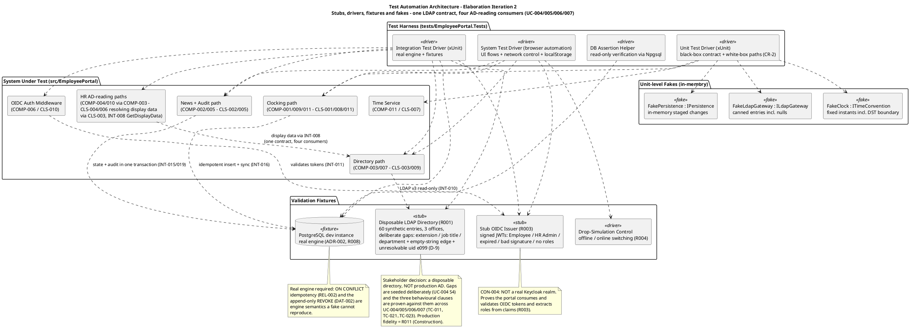
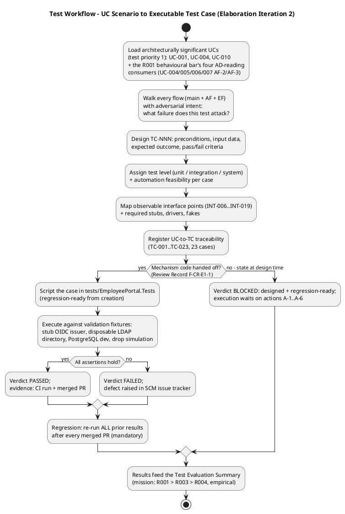
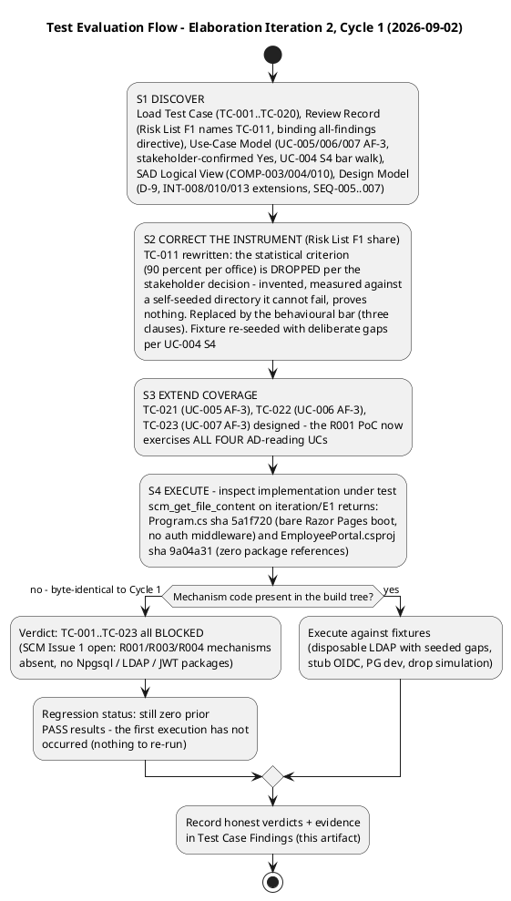
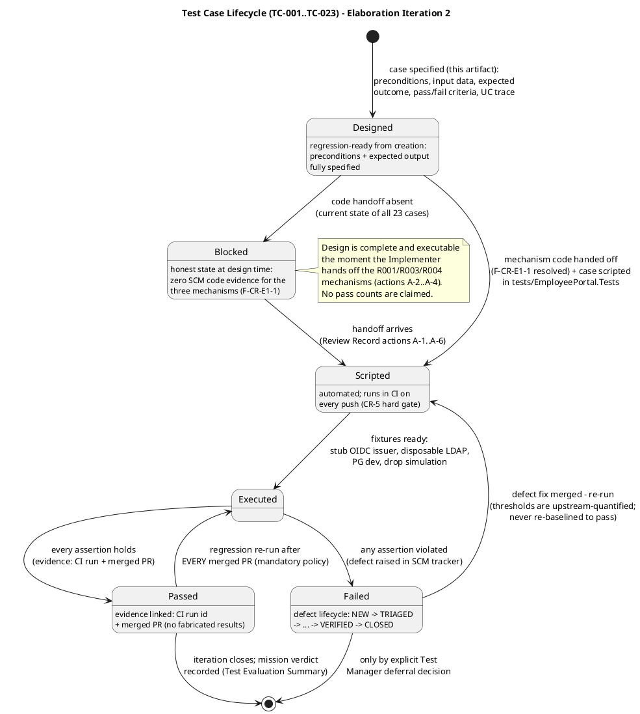
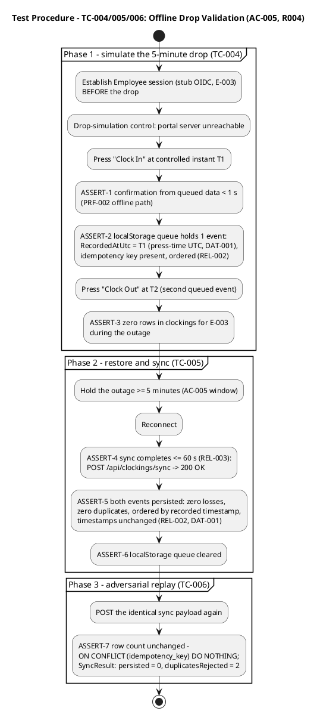
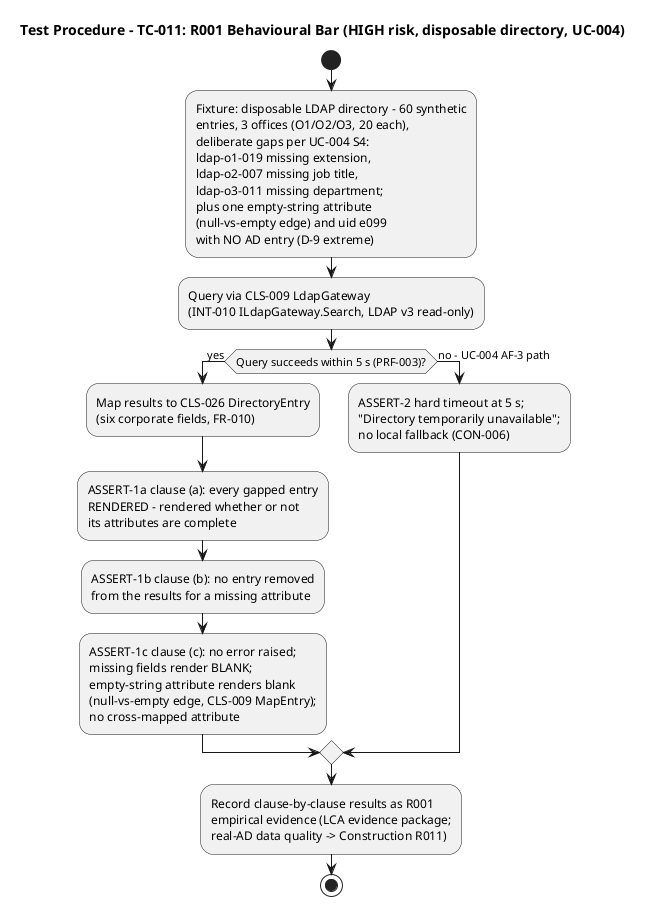
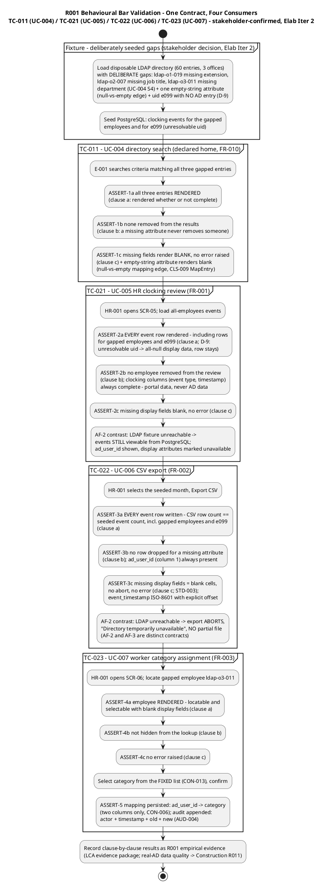
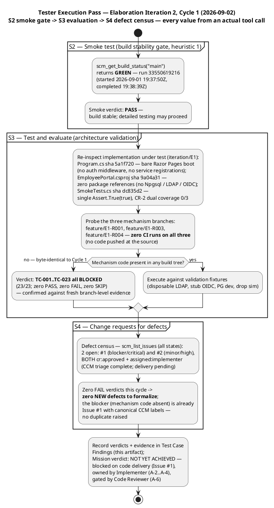

## Document Control
| Field | Value |
|---|---|
| Phase | Elaboration |
| Status | Draft — 23 test cases DESIGNED; execution Cycle 2 record: all 23 cases verdict **BLOCKED** (mechanism code still absent from SCM — Issue #1 open, cr:approved, assigned:implementer; `Program.cs` sha 5a1f720 and `EmployeePortal.csproj` sha 9a04a31 byte-identical to the Cycle 1 inspection). **Tester execution pass (this revision): smoke gate PASS (main CI run 33550619216); BLOCKED verdicts independently confirmed with branch-level evidence — zero CI runs on `feature/E1-R001`/`R003`/`R004` (no code pushed at the source); defect census verified (Issues #1/#2 both cr:approved, assigned:implementer); zero new CRs (zero FAIL verdicts).** No pass counts claimed or fabricated |
| Milestone Target | End of Elaboration (LCA) — NOT yet achieved |
| Iteration | 2 (Cycle 1) — convergence cycle |
| Date | 2026-09-02 |
| Elaboration Changes | **Iter 2 (this revision):** (1) **Risk List F1 (Reviewer, Minor) share resolved** — TC-011 no longer validates the ">90% of sampled users per office" criterion: the stakeholder ruled the figure invented and self-seeding-proof ("it would measure our own test data, not the risk — it cannot fail, so it proves nothing"); TC-011 is rewritten to the **R001 behavioural bar** (three clauses: every employee rendered whether or not complete; a missing attribute never removes someone; a missing attribute never raises an error) and the disposable LDAP fixture is re-seeded with deliberate gaps per UC-004 S4 (extension / job title / department) plus the empty-string edge and the D-9 unresolvable-uid extreme. (2) **Coverage extended to all four AD-reading UCs** — the stakeholder confirmed "Yes" that the behavioural bar applies to UC-005/006/007, not only UC-004: **TC-021 (UC-005 AF-3), TC-022 (UC-006 AF-3), TC-023 (UC-007 AF-3)** designed at Integration level so the R001 PoC exercises all four consumers; catalog, coverage check, goals table, automation architecture, workflow/lifecycle diagrams, test data and traceability updated (23 cases). (3) **Cycle 2 execution record** — honest BLOCKED verdicts with fresh SCM evidence. (4) **Tester execution pass (this revision)** — smoke gate re-run: **PASS** (main CI run 33550619216); implementation re-inspected: byte-identical to Cycle 1 (`Program.cs` 5a1f720, `EmployeePortal.csproj` 9a04a31, `SmokeTests.cs` dc835d2); **three mechanism branches probed: zero CI runs on `feature/E1-R001`, `feature/E1-R003`, `feature/E1-R004` — the handoff is absent at the source, not merely unmerged**; defect census verified: Issues #1/#2 both cr:approved + assigned:implementer (CCM triage complete, delivery pending); zero FAIL verdicts → zero new CRs (the blocker is already Issue #1 — no duplicate raised). **Iter 1 (preserved):** 20 test cases (TC-001…TC-020) covering UC-001, UC-004, UC-010 (test priority 1), the R003 authentication mechanism, and SEC-006/SEC-007 — each with preconditions, input data, expected outcome, pass/fail criteria, attacked failure scenario, automation hints, and interface points (INT-006…INT-019); automation architecture specified; Cycle 1 execution record preserved in § Findings (smoke PASS, main CI run 33492338439, all 20 BLOCKED, Issues #1/#2 formalized). |
## Test Scope

### Evaluation Mission Alignment

This test model is the verification counterpart of the Use-Case Model for the **Elaboration Evaluation Mission** (Test Evaluation Summary): empirically validate the three architecturally significant mechanisms — **R001 (HIGH, disposable LDAP directory) > R003 (SIGNIFICANT, stub OIDC issuer) > R004 (SIGNIFICANT, direct)** — against the architecture baseline (SAD COMP-001…011, ADR-001…004; Design Model CLS-001…027, INT-006…INT-019). Per the binding stakeholder decision, the PoC is produced in Elaboration and validated empirically; these test cases are the executable instrument of that validation, ready to run the moment the Implementer hands off the mechanisms (Review Record actions A-2…A-4; SCM Issue #1).

**R001 validation bar (stakeholder decision, Elaboration Iter 2 — governs this revision):** the bar is **behavioural, not statistical**. The prior ">90% of sampled users per office" figure is dropped — it is invented, and measured against a disposable directory the team seeds itself it cannot fail, so it proves nothing. The architectural risk is what the portal DOES when an attribute is absent. The three clauses, proven against deliberately-seeded gaps: **(a)** every employee is rendered whether or not their attributes are complete; **(b)** a missing attribute never removes someone from results; **(c)** a missing attribute never raises an error. The stakeholder confirmed ("Yes") that the bar applies to **all four AD-reading use cases** — UC-004 (declared home, FR-010), UC-005 (FR-001), UC-006 (FR-002), UC-007 (FR-003) — so the R001 PoC exercises all four consumers through the one LDAP contract (INT-010, one graceful-degradation policy via INT-008). Real-AD data-quality measurement belongs to Construction (R011 residual, STK-004-dependent) and is excluded from the LCA evidence package.

**In scope (this iteration):** test case design for UC-001, UC-004, UC-010 (all flows: main + AF + EF), the R003 token-validation matrix, SEC-006/SEC-007 role enforcement, and the R001 behavioural bar across all four AD-reading consumers (UC-004 AF-2; UC-005/006/007 AF-3) — with automation architecture, test data, and UC→TC traceability; **execution** of every case whose mechanism code exists in SCM (Cycle 2 result: none exists — all BLOCKED, see Findings).

**Out of scope (per Evaluation Mission):** full functional testing of all 10 UCs (Construction); execution against production AD/Keycloak (Construction, R010/R011); full-scale load testing (Construction); usability/adoption testing (AC-004, Transition pilot); UI visual-fidelity testing against CON-011 (Construction).

**[OMITTED: Test Plan — trigger not fired per Development Case §5.2 oracle (re-consulted this iteration, 2026-09-02: formal delivery / regulatory audit / contractual test reporting not in scope); per-iteration testing scope lives in the Iteration Plan and the Test Evaluation Summary.]**

### Measurable Testing Goals (per Quality Dimension)

Every goal is quantified from upstream artifacts — none invented here. Upstream thresholds marked `[ASSUMPTION — requires validation]` (2 s ignore window, queue capacity ≥ 10, sync ≤ 60 s, 95th-percentile basis) are treated by this test model as **the validation targets themselves**: the tests below are the empirical instrument that retires those assumptions. The R001 goal is the stakeholder-decided behavioural bar — deliberately not a percentage.

| Quality Dimension | Measurable Goal | Threshold Source | Validated By |
|---|---|---|---|
| Reliability | 5-minute drop tolerated; queued events never lost; exact duplicates rejected; events ordered by recorded timestamp; sync ≤ 60 s after restore | REL-002, REL-003, AC-005, ADR-003 | TC-004, TC-005, TC-006, TC-020 |
| Functionality | One clocking event per press; status-aware button; six directory attributes displayed; unpublish = soft delete with record retained; **every AD-reading consumer renders every employee — blank fields on missing attributes, no removal, no error (behavioural bar, all four consumers)** | FR-004, FR-009, FR-010, CON-012, FR-001, FR-002, FR-003 + R001 behavioural bar (stakeholder decision, Elab Iter 2) | TC-001…TC-003, TC-009…TC-011, TC-013…TC-016, TC-021…TC-023 |
| Performance | Clocking confirmation < 1 s on BOTH online and offline paths; LDAP query hard timeout 5 s | PRF-002, PRF-003, NFR-002 | TC-001, TC-004, TC-011, TC-012 |
| Security | OIDC token validated; roles extracted from claims; HR-only functions reject Employee-role sessions; employee sees only own clockings; no anonymous access | SEC-001, SEC-002, SEC-003, SEC-006, SEC-007, R003 | TC-007, TC-017, TC-018, TC-019 |
| Usability | Colleague's email + extension visible on the result card (no detail view); displayed times render America/Havana local, DST-aware — never raw UTC or server time | USA-003, USA-008, AC-003 | TC-008, TC-009, TC-011 |
| Data Integrity / Auditability | Timestamp captured at press, stored UTC, persisted unchanged on sync; audit entries append-only, atomic with the state change; category change audited with old + new values | DAT-001, DAT-002, NFR-005, AUD-003, AUD-004 | TC-004, TC-005, TC-008, TC-013, TC-016, TC-023 |

### Test Types Mapped to Quality Dimensions and Levels

| Test Type | Dimension | Level | Cases |
|---|---|---|---|
| Functional (mechanism validation) | Functionality | System + Integration | TC-001…TC-003, TC-009…TC-011, TC-013…TC-016, TC-021…TC-023 |
| Reliability (fault tolerance) | Reliability | System | TC-004…TC-006, TC-020 |
| Security (auth + authorization) | Security | Integration + System | TC-007, TC-017…TC-019 |
| Performance (latency + timeout) | Performance | System + Integration | assertions inside TC-001, TC-004, TC-011, TC-012 |
| Data integrity / audit | Auditability | Unit + Integration | TC-008, TC-016, TC-023 |
| Regression | All | All | every case — re-run after EVERY merged PR (mandatory policy, Test Evaluation Summary) |

Multi-level coverage is deliberate: unit level (FakeClock DST boundary, audit atomicity), integration level (stub issuer, disposable directory, real PostgreSQL — including the four-consumer R001 bar cases TC-011/TC-021…TC-023), system level (browser flows with network control). No level is skipped; no level is exclusive.

### Test Automation Architecture (stubs, drivers, fakes)

Test infrastructure is a deliverable, not a convenience. The component diagram below is the shared automation architecture referenced by every case's automation notes; test scripts and suites are code in `tests/EmployeePortal.Tests/` (co-owned with the Implementer), gated by CI on every push (CR-5 hard gate).

**Stub/driver justification (testability contract):** the stub OIDC issuer and disposable LDAP directory exist because the stakeholder explicitly refused to wait on STK-004 (R010) — R003 is proven by consuming tokens correctly, not by how the issuer got its users; R001 is a data-shape question answered by a disposable directory with deliberately-seeded gaps. The PostgreSQL dev instance is the REAL declared engine because idempotency (`ON CONFLICT`), the UNIQUE constraint, and the append-only REVOKE are engine semantics an in-memory fake cannot reproduce. The unit-level fakes exist because the Design Model made every subsystem boundary an interface (INT-006…INT-019) — the testability entry points are consumed here, not re-invented. The HR AD-reading cases (TC-021…TC-023) run at Integration level against the same disposable directory and the shared INT-008 GetDisplayData path, so the R001 PoC validates one contract across all four consumers without waiting for Construction UI.

### Test Workflow — UC Scenario to Executable Test Case

**Test Evaluation Flow — Cycle 2 execution record (2026-09-02):**

### Test Case Lifecycle

**Execution status (Cycle 2 record, 2026-09-02):** the implementation under test was re-inspected empirically on `iteration/E1` — `Program.cs` (sha 5a1f720) is still a bare Razor Pages boot (no auth middleware, no services) and `EmployeePortal.csproj` (sha 9a04a31) still has zero package references — **byte-identical to the Cycle 1 inspection**. All 23 cases (TC-001…TC-020 from Iter 1 plus TC-021…TC-023 designed this iteration) therefore remain **Designed → Blocked** on SCM Issue #1 (severity:blocker — mechanism code absent). CI trigger configuration was verified correct in Cycle 1 (`ci.yml` covers `iteration/**` for push and PR), so the blocker remains code delivery, not test infrastructure. Full evidence in § Findings. No test counts, pass rates, or durations are claimed.

## Test Case Catalog
### Catalog Overview — UC→TC Traceability

| TC | UC / Flow | Level | Type | Automation | Priority |
|---|---|---|---|---|---|
| TC-001 | UC-001 main — clock in online | System | Functional + Performance | Browser automation + DB assert | 1 |
| TC-002 | UC-001 main — clock out, status-aware button | System | Functional | Browser automation + DB assert | 1 |
| TC-003 | UC-001 AF-3 — 2 s ignore window | System | Functional (adversarial) | Browser automation + DB assert | 1 |
| TC-004 | UC-001 AF-1 — queue during 5-min drop | System | Reliability | Browser automation + drop control | 1 (R004) |
| TC-005 | UC-001 AF-1 — sync on restore ≤ 60 s | System | Reliability | Browser automation + DB assert | 1 (R004) |
| TC-006 | UC-001 AF-1 — duplicate replay idempotency | Integration | Reliability (adversarial) | API driver + DB assert | 1 (R004) |
| TC-007 | UC-001 AF-2 — session expired → redirect | System | Security | Browser automation + stub issuer | 2 (R003) |
| TC-008 | UC-001 / DAT-001 / USA-008 — timestamp convention, DST boundary | Unit | Data integrity | xUnit + FakeClock | 1 |
| TC-009 | UC-004 main — search by name, six fields on card | Integration | Functional + Usability | API driver + disposable LDAP | 1 (R001) |
| TC-010 | UC-004 AF-1 — no results | Integration | Functional | API driver + disposable LDAP | 2 |
| TC-011 | UC-004 AF-2 / R001 — behavioural bar: deliberate gaps, three clauses | Integration | Functional (risk validation) | API driver + disposable LDAP | 1 (R001, HIGH) |
| TC-012 | UC-004 AF-3 — LDAP timeout, no local fallback | Integration | Performance + Reliability | API driver + fault injection | 1 |
| TC-013 | UC-010 main — unpublish = soft delete + audit | System | Functional + Audit | Browser automation + DB assert | 1 |
| TC-014 | UC-010 AF-1 — cancel: no change, no audit | System | Functional (adversarial) | Browser automation + DB assert | 2 |
| TC-015 | UC-010 AF-2 — already unpublished: option not offered | System | Functional (adversarial) | Browser automation | 2 |
| TC-016 | DAT-002 / AUD-003 — audit atomicity + append-only | Integration | Auditability (adversarial) | xUnit + PG dev + fault injection | 1 |
| TC-017 | SEC-006 — role denial on HR endpoints (UC-005/UC-010) | System | Security (adversarial) | API driver + stub issuer | 2 (R003) |
| TC-018 | SEC-007 — own-data-only history (UC-002 boundary) | System | Security (adversarial) | API driver + stub issuer | 2 |
| TC-019 | R003 / SEC-001/002/003 — token validation matrix | Integration | Security (risk validation) | API driver + stub issuer | 1 (R003) |
| TC-020 | UC-001 AF-1 / REL-002 — queue capacity ≥ 10 boundary | System | Reliability (adversarial) | Browser automation + drop control | 2 |
| TC-021 | UC-005 AF-3 / R001 — every event row rendered, blank display fields | Integration | Functional (risk validation) | API driver + disposable LDAP + DB assert | 1 (R001, HIGH) |
| TC-022 | UC-006 AF-3 / R001 — every CSV row written, blank cells, no abort | Integration | Functional (risk validation) | API driver + disposable LDAP + DB assert | 1 (R001, HIGH) |
| TC-023 | UC-007 AF-3 / R001 — employee locatable/selectable with blank fields | Integration | Functional (risk validation) | API driver + disposable LDAP + DB assert | 1 (R001, HIGH) |

**Coverage check:** UC-001 — main (TC-001/002), AF-1 (TC-004/005/006/020), AF-2 (TC-007), AF-3 (TC-003), timestamp convention (TC-008). UC-004 — main (TC-009), AF-1 (TC-010), AF-2 (TC-011), AF-3 (TC-012). UC-005 — AF-3 (TC-021). UC-006 — AF-3 (TC-022). UC-007 — AF-3 (TC-023). UC-010 — main (TC-013), AF-1 (TC-014), AF-2 (TC-015), audit/soft-delete invariants (TC-016). Cross-cutting: SEC-006 (TC-017), SEC-007 (TC-018), R003/SEC-001/002/003 (TC-019). **The R001 behavioural bar is covered on all four AD-reading consumers (TC-011 + TC-021/022/023), each with an adversarial clause walk against deliberately-seeded gaps.** Every flow of the three priority UCs has at least one adversarial case; no case exists without a UC or declared-mechanism trace.

### Detailed Test Case Specifications

Each case names the **failure scenario it attacks** — the testing mindset is inversion: these cases exist to demonstrate the system does NOT work, and pass only when the attack fails.

---

**TC-001 — UC-001 main flow: clock in online (System, Functional + Performance)**

| Field | Value |
|---|---|
| Traces | UC-001 main flow; FR-004; PRF-002; DAT-001; SEQ-001 |
| Preconditions | E-003 (Employee, stub OIDC session) authenticated; no clocking event for E-003 today; portal server reachable; PostgreSQL dev instance clean for E-003 |
| Input data | Press "Clock In" at controlled instant T1 = 2026-09-01T12:58:12Z |
| Procedure | 1. Open Home (SCR-01). 2. Verify status chip "Not clocked in today" + green "Clock In" button. 3. Press button. 4. Measure press→confirmation latency. 5. Query `clockings` via DB Assertion Helper. |
| Expected outcome | Inline confirmation "Clocked in at 08:58:12" (America/Havana local, USA-008) visible **< 1 s** from press; exactly ONE row: employee_uid=e003, event_type=in, timestamp_utc=T1 (UTC), idempotency_key non-empty, synced_at_utc NULL; button flips to red "Clock Out"; status chip updates |
| Pass criteria | All assertions hold; latency < 1 s (PRF-002 online path) |
| Failure scenario attacked | Confirmation shown but row not persisted; timestamp captured at server-arrival time instead of press time (DAT-001 violation); confirmation > 1 s |
| Automation + interface points | Browser automation (system driver) + DB assert; INT-006 RecordEvent, INT-016 Add; fixtures: stub OIDC issuer, PG dev |

---

**TC-002 — UC-001 main flow: clock out, status-aware button (System, Functional)**

| Field | Value |
|---|---|
| Traces | UC-001 main flow steps 3–4; FR-004; SEQ-001 |
| Preconditions | E-003 has one persisted IN event (seeded, today); session valid |
| Input data | Reload Home; press "Clock Out" at T2 = T1 + 4 h |
| Procedure | 1. Reload Home. 2. Verify button reads "Clock Out" (red) — status-aware. 3. Press. 4. Query `clockings`. |
| Expected outcome | Button label/color matched the IN state BEFORE the press (never both buttons); second row: event_type=out, timestamp_utc=T2; confirmation < 1 s; history (UC-002 view) shows both events |
| Pass criteria | All assertions hold |
| Failure scenario attacked | Button not status-aware → wrong event type recorded (an OUT recorded while not clocked in, or vice versa) |
| Automation + interface points | Browser automation + DB assert; INT-006 GetCurrentStatus/RecordEvent; fixtures: stub OIDC, PG dev |

---

**TC-003 — UC-001 AF-3: repeated press within 2 s ignore window (System, adversarial)**

| Field | Value |
|---|---|
| Traces | UC-001 AF-3; FR-004; PRF-002 (window basis: 2 × response budget — upstream [ASSUMPTION] this test validates); SEQ-001 |
| Preconditions | E-003 not clocked in today; session valid |
| Input data | Two presses 0.8 s apart (inside the 2 s window); then, separately, a deliberate press 3 s after a first (outside the window) |
| Procedure | 1. Press "Clock In" at T1. 2. Press again at T1+0.8 s. 3. Query rows. 4. In a fresh state, press at T1, wait 3 s, press again — verify the second press IS processed as a new transition. |
| Expected outcome | Inside window: exactly ONE event (the stray press ignored, no opposite event). Outside window: the second press produces the next legitimate transition. |
| Pass criteria | 1 row after the double-press; no accidental opposite event; outside-window press behaves as a new transition |
| Failure scenario attacked | A stray second press producing an accidental opposite event (clock-in immediately followed by clock-out) — corrupting the attendance record |
| Automation + interface points | Browser automation + DB assert; INT-006 RecordEvent; fixtures: stub OIDC, PG dev |

---

**TC-004 — UC-001 AF-1: queue during 5-minute network drop (System, Reliability — R004)**

| Field | Value |
|---|---|
| Traces | UC-001 AF-1; NFR-004; AC-005; REL-002; PRF-002 (offline path); DAT-001; ADR-003; SEQ-001 |
| Preconditions | E-003 authenticated BEFORE the drop (session established); portal server then made unreachable via Drop-Simulation Control; `clockings` empty for E-003 |
| Input data | Press "Clock In" at T1; press "Clock Out" at T2 = T1 + 5 min (both during the outage) |
| Procedure | See procedure diagram below (Phases 1–3 shared with TC-005/TC-006) |
| Expected outcome | Confirmation from queued data **< 1 s** on BOTH presses (PRF-002 offline path); localStorage queue holds 2 events with RecordedAtUtc = press-time UTC (DAT-001) and idempotency keys, ordered by recorded timestamp (REL-002); ZERO rows in `clockings` during the outage |
| Pass criteria | All Phase-1 assertions hold (ASSERT-1…ASSERT-3) |
| Failure scenario attacked | Confirmation delayed > 1 s offline; timestamp captured at sync time instead of press time; event lost before sync |
| Automation + interface points | Browser automation + Drop-Simulation Control + DB assert; CLS-008 OfflineQueueClient (localStorage), INT-006; fixtures: stub OIDC, drop control, PG dev |

---

**TC-005 — UC-001 AF-1: sync on restore, ≤ 60 s, zero losses/duplicates (System, Reliability — R004)**

| Field | Value |
|---|---|
| Traces | UC-001 AF-1; AC-005; REL-002; REL-003; DAT-001; ADR-003; SEQ-001 |
| Preconditions | TC-004 Phase 1 complete: 2 events queued, outage held ≥ 5 minutes (AC-005 window) |
| Input data | Reconnect via Drop-Simulation Control |
| Procedure | See procedure diagram below (Phase 2) |
| Expected outcome | Sync completes ≤ 60 s from restore (REL-003): POST /api/clockings/sync → 200 OK; BOTH events persisted — zero losses, zero duplicates, ordered by recorded timestamp, timestamps UNCHANGED from press-time capture; localStorage queue cleared |
| Pass criteria | ASSERT-4…ASSERT-6 hold |
| Failure scenario attacked | Events lost or reordered on replay; sync exceeding 60 s; timestamps rewritten at sync time |
| Automation + interface points | Browser automation + DB assert; INT-006 SyncEvents, INT-016 AddRange, `uk_clockings_idempotency_key`; fixtures: drop control, PG dev |

---

**TC-006 — UC-001 AF-1: adversarial duplicate replay (Integration, Reliability — R004)**

| Field | Value |
|---|---|
| Traces | UC-001 AF-1; REL-002 conflict policy; ADR-003; SEQ-001 |
| Preconditions | TC-005 complete: both events persisted; the identical sync payload retained by the harness |
| Input data | POST the identical sync payload a second time (simulating a retry storm / double replay) |
| Procedure | See procedure diagram below (Phase 3) |
| Expected outcome | Row count UNCHANGED — `ON CONFLICT (idempotency_key) DO NOTHING` rejects exact duplicates; SyncResult: persisted=0, duplicatesRejected=2 |
| Pass criteria | ASSERT-7 holds; no new rows |
| Failure scenario attacked | Replay duplicating rows (idempotency broken) — the payroll record would count one clocking twice |
| Automation + interface points | API driver + DB assert; INT-006 SyncEvents; fixture: PG dev (real engine required — UNIQUE semantics) |

**Test Procedure — TC-004 / TC-005 / TC-006 (shared, AC-005 / R004):**

---

**TC-007 — UC-001 AF-2: session expired → redirect to Keycloak (System, Security)**

| Field | Value |
|---|---|
| Traces | UC-001 AF-2; SEC-001; SEQ-001 |
| Preconditions | E-003's stub-issued token EXPIRED (stub issuer emits an expired JWT); no valid session cookie |
| Input data | Navigate to Home with the expired session |
| Procedure | 1. Navigate to portal with expired token. 2. Observe redirect. 3. Complete re-authentication via stub issuer with a fresh Employee token. 4. Proceed to clocking. |
| Expected outcome | Redirect to the OIDC issuer login (EX-01) BEFORE any portal content renders; after re-auth, the clocking flow proceeds normally; at NO point is clocking data accessible with an expired token |
| Pass criteria | Redirect occurs; no content leak pre-auth; flow completes after re-auth |
| Failure scenario attacked | Expired session silently proceeding (auth bypass) — an unauthenticated actor recording clockings |
| Automation + interface points | Browser automation + stub issuer; INT-011 IAuthProvider; fixture: stub OIDC (expired-token variant) |

---

**TC-008 — DAT-001 / USA-008: timestamp convention across the DST boundary (Unit, Data Integrity)**

| Field | Value |
|---|---|
| Traces | UC-001 timestamp convention; DAT-001; USA-008; stakeholder decisions (store UTC, display America/Havana, export ISO-8601 with offset); CLS-007 TimeService; INT-014 |
| Preconditions | FakeClock injected as ITimeConvention (Design Model testability entry point); no database needed |
| Input data | Two fixed instants: summer S1 = 2026-07-15T12:00:00Z (Cuba DST in force) and winter W1 = 2026-12-15T12:00:00Z (standard time) |
| Procedure | 1. ToLocalDisplay(S1) → expect "08:00" (UTC-4). 2. ToLocalDisplay(W1) → expect "07:00" (UTC-5). 3. ToIso8601WithOffset(S1) → expect "2026-07-15T08:00:00-04:00". 4. ToIso8601WithOffset(W1) → expect "2026-12-15T07:00:00-05:00". 5. MonthBoundsLocal(2026, 9) → expect UTC bounds of the local September calendar days in America/Havana. |
| Expected outcome | Display strings differ by the DST offset between the two instants (08:00 vs 07:00 for the same 12:00Z); export strings carry the offset in force at each event time per the IANA zone database; month bounds are local calendar days, never the server's |
| Pass criteria | All five assertions hold; NO output renders raw UTC or a fixed -05:00 offset for the summer instant |
| Failure scenario attacked | A hardcoded UTC-5 offset — the exact defect the stakeholder warned about: it would silently shift every payroll day boundary when the clocks change. This case fails any implementation that ignores DST |
| Automation + interface points | xUnit unit driver + FakeClock; INT-014 ITimeConvention (all four operations); no fixtures beyond the fake |

---

**TC-009 — UC-004 main flow: search by name, six fields on the card (Integration, Functional + Usability)**

| Field | Value |
|---|---|
| Traces | UC-004 main flow; FR-010; USA-003; AC-003; SEQ-004 |
| Preconditions | Disposable LDAP directory loaded (60 entries, § Test Data); E-001 authenticated; target entry "Gómez, Elena" fully populated in office O1 |
| Input data | Search criteria: name = "Gómez" |
| Procedure | 1. Open Directory (SCR-04). 2. Enter name "Gómez". 3. Press Search. 4. Inspect result cards. |
| Expected outcome | All matching colleagues returned; the target card shows ALL SIX corporate fields on the card (name, job title, department, office, email, extension) — no detail view needed (USA-003); end-to-end ≤ 10 s (AC-003) |
| Pass criteria | Six fields present and correctly mapped per entry; no cross-mapped attribute (extension rendered as email, etc.); within time budget |
| Failure scenario attacked | Attribute cross-mapping in the LDAP result mapping (CLS-009 MapEntry) — a colleague's extension shown in the email field would send AC-003's "find a colleague's phone/email" wrong |
| Automation + interface points | API driver + disposable LDAP; INT-008 Search, INT-010 ILdapGateway.Search; fixture: disposable LDAP directory |

---

**TC-010 — UC-004 AF-1: no results (Integration, Functional)**

| Field | Value |
|---|---|
| Traces | UC-004 AF-1; FR-010; SEQ-004 |
| Preconditions | Disposable LDAP directory loaded; E-001 authenticated |
| Input data | Search criteria: name = "Zzzznonexistent" (matches nothing) |
| Procedure | 1. Enter the non-matching criteria. 2. Press Search. |
| Expected outcome | "No colleagues found" message with a suggestion to refine the search (P-05 empty state); NO error, NO blank page, NO partial card |
| Pass criteria | Message displayed; HTTP flow completes normally; no crash |
| Failure scenario attacked | Unhandled empty result → crash or blank page (the classic empty-set defect) |
| Automation + interface points | API driver + disposable LDAP; INT-008 Search; fixture: disposable LDAP directory |

---

**TC-011 — UC-004 AF-2 / R001: behavioural bar — deliberate gaps, three clauses (Integration, risk validation — HIGH)**

| Field | Value |
|---|---|
| Traces | UC-004 AF-2; FR-010; **R001 behavioural bar (stakeholder decision, Elab Iter 2 — replaces the dropped >90% statistical criterion)**; USA-003; SEQ-004; CLS-009 MapEntry; INT-010 postcondition extension |
| Preconditions | Disposable LDAP directory loaded with DELIBERATE attribute gaps (§ Test Data: `ldap-o1-019` missing extension; `ldap-o2-007` missing job title; `ldap-o3-011` missing department — the UC-004 S4 bar walk; plus one empty-string attribute and the D-9 unresolvable uid e099); E-001 authenticated |
| Input data | One search per gapped entry's match criteria (name fragment matching each), plus one search matching all three gapped entries at once |
| Procedure | See procedure diagram below |
| Expected outcome | **Clause (a):** every gapped entry is RENDERED whether or not its attributes are complete. **Clause (b):** no entry is removed from the results for a missing attribute. **Clause (c):** a missing attribute never raises an error — missing fields render BLANK; the empty-string attribute renders blank too (null-vs-empty mapping edge in CLS-009 MapEntry); no cross-mapped attributes |
| Pass criteria | ASSERT-1a/1b/1c hold for all three gapped entries; empty-string edge renders blank; zero errors raised |
| Failure scenario attacked | R001's declared failure mode: an entry with a missing attribute hidden entirely (the directory shows gaps), or a missing attribute raising an error that breaks the search — the exact HIGH risk this validation retires empirically. The prior statistical criterion could not fail against self-seeded data; the behavioural clauses CAN fail — that is what makes them evidence |
| Automation + interface points | API driver + disposable LDAP; INT-008 Search, INT-010 ILdapGateway.Search + MapEntry; fixture: disposable LDAP directory (NOT production AD — production fidelity is R011, Construction) |

**Test Procedure — TC-011 (R001 behavioural bar, disposable directory, UC-004 declared home):**

---

**TC-012 — UC-004 AF-3: LDAP timeout / connection failure, no local fallback (Integration, Performance + Reliability)**

| Field | Value |
|---|---|
| Traces | UC-004 AF-3; PRF-003 (5 s hard timeout); CON-006 (no local copy); SEQ-004 |
| Preconditions | LDAP fixture configured to HANG (accept connection, never respond) — fault injection |
| Input data | Search criteria: name = "Gómez" |
| Procedure | 1. Issue the search against the hanging directory. 2. Measure time to user-visible outcome. 3. Verify no cached/partial data is displayed. |
| Expected outcome | Query aborts at the 5 s hard timeout (PRF-003); "Directory temporarily unavailable" displayed (P-05); NO partial list, NO cached data (CON-006 forbids a local copy — there is nothing to fall back to) |
| Pass criteria | Timeout enforced at 5 s (not hanging indefinitely); unavailable message shown; zero entries rendered |
| Failure scenario attacked | Indefinite hang burning the AC-003 10-second budget; or a stale local cache displayed as if live (a CON-006 violation masquerading as fault tolerance) |
| Automation + interface points | API driver + fault-injected LDAP fixture; INT-010 ILdapGateway (timeout path); fixture: disposable LDAP in hang mode |

---

**TC-013 — UC-010 main flow: unpublish = soft delete + audit (System, Functional + Audit)**

| Field | Value |
|---|---|
| Traces | UC-010 main flow; FR-009; CON-012; NFR-005; AUD-003; DAT-002; SEQ-010 |
| Preconditions | HR-001 (HR Administrator, stub OIDC) authenticated; news item N-001 (published, featured, Events) exists; N-001 visible on SCR-03 |
| Input data | Press "Unpublish" on N-001; confirm in modal M-01 |
| Procedure | 1. Open News Management (SCR-08). 2. Verify "Unpublish" offered on N-001 (published). 3. Press; verify M-01 states the record is retained. 4. Confirm. 5. Query `news_items` + `news_audit` via DB assert. 6. Load News (SCR-03) as E-001. |
| Expected outcome | N-001 status = 'unpublished' (row STILL EXISTS — soft delete, CON-012); exactly ONE new `news_audit` row: action='unpublish', actor_uid=hr001, timestamp_utc set, snapshot present; N-001 hidden from SCR-03 (GetPublishedNews never returns it); record retained for audit |
| Pass criteria | All assertions hold; row count in `news_items` unchanged (no delete) |
| Failure scenario attacked | Hard delete instead of soft delete (CON-012 violation — the audit trail destroyed); or state change committed WITHOUT its audit entry (NFR-005 violation) |
| Automation + interface points | Browser automation + DB assert; INT-007 Unpublish, INT-012 AppendNewsAction, INT-015/INT-019; fixtures: stub OIDC, PG dev |

---

**TC-014 — UC-010 AF-1: cancel — no change, no audit entry (System, adversarial)**

| Field | Value |
|---|---|
| Traces | UC-010 AF-1; FR-009; NFR-005 (audits changes only); SEQ-010 |
| Preconditions | HR-001 authenticated; N-001 published; `news_audit` row count recorded |
| Input data | Press "Unpublish" on N-001; press Cancel in M-01 |
| Procedure | 1. Press Unpublish. 2. Cancel in the modal. 3. Query both tables. 4. Verify SCR-03 still shows N-001. |
| Expected outcome | N-001 status UNCHANGED ('published'); `news_audit` row count UNCHANGED (a cancelled action is not a change — NFR-005 audits changes); modal closed; item still visible to employees |
| Pass criteria | Zero state delta, zero audit delta |
| Failure scenario attacked | Cancel silently applying the unpublish, or writing a phantom audit entry — either corrupts the trail's meaning |
| Automation + interface points | Browser automation + DB assert; INT-007; fixtures: stub OIDC, PG dev |

---

**TC-015 — UC-010 AF-2: already unpublished — option not offered (System, adversarial)**

| Field | Value |
|---|---|
| Traces | UC-010 AF-2; FR-009; CON-012; CLS-022 state machine (Unpublished terminal); SEQ-010 |
| Preconditions | HR-001 authenticated; N-003 exists with status 'unpublished' (seeded) |
| Input data | Open News Management; inspect N-003's row; additionally, craft a direct POST to /hr/news/{N-003}/unpublish |
| Procedure | 1. Verify the UI offers NO "Unpublish" on N-003. 2. Craft the direct POST anyway (adversarial — UI hiding is never the only barrier). |
| Expected outcome | UI: no Unpublish affordance on the unpublished item. API: the crafted unpublish of an already-unpublished item does NOT create a second audit entry and does not corrupt state (idempotent no-op or explicit rejection — the state machine makes Unpublished terminal) |
| Pass criteria | No affordance; no new audit row; no state corruption from the crafted request |
| Failure scenario attacked | State machine violation — unpublishing an unpublished item (double audit entries for one logical action), or UI-only guarding (direct API call bypasses) |
| Automation + interface points | Browser automation + API driver + DB assert; INT-007 Unpublish precondition (item Status=Published); fixtures: stub OIDC, PG dev |

---

**TC-016 — DAT-002 / AUD-003: audit atomicity + append-only (Integration, adversarial)**

| Field | Value |
|---|---|
| Traces | DAT-002; NFR-005; AUD-003; UC-010; Process View audit atomicity rule; INT-019 (Add-only interface) |
| Preconditions | HR-001 authenticated; N-001 published; PG dev instance with baseline migration V1 applied (REVOKEs in force) |
| Input data | (a) Normal unpublish. (b) Fault-injected run: the audit INSERT is made to FAIL (e.g., constraint violation injected via the harness). (c) Attempted UPDATE and DELETE on `news_audit` as the application role. |
| Procedure | 1. Unpublish N-001 normally — verify item + audit committed in ONE transaction. 2. Re-run with the audit write faulted — verify the STATE CHANGE ROLLED BACK (no unpublish without its trail entry). 3. As the application role, attempt UPDATE and DELETE on `news_audit`. |
| Expected outcome | (a) Both rows committed together. (b) ZERO state change when the audit write fails — atomicity holds. (c) UPDATE and DELETE REJECTED by the engine (REVOKE per DAT-002) — the trail is physically append-only |
| Pass criteria | All three sub-assertions hold |
| Failure scenario attacked | A state change surviving a failed audit write (the trail lies by omission); or a mutable trail (an actor editing history) — both destroy NFR-005's mandatory traceability |
| Automation + interface points | xUnit integration driver + fault injection + DB assert; INT-012, INT-015 SaveChanges (single commit boundary), INT-019 Add-only; fixture: PG dev (real engine required — REVOKE semantics) |

---

**TC-017 — SEC-006: role denial on HR endpoints (System, adversarial)**

| Field | Value |
|---|---|
| Traces | SEC-006; UC-005 EF-1; UC-009 EF-1; UC-010; CON-004; SEQ-005/SEQ-009/SEQ-010 |
| Preconditions | E-003 authenticated with an EMPLOYEE-ONLY token (stub issuer: Employee role, no HR Administrator claim); N-001 published; clocking data exists for other employees |
| Input data | (a) Deep-link GET to /hr/clockings, /hr/news, /hr/categories. (b) Crafted POST to /hr/news/{N-001}/unpublish. (c) Crafted POST to /hr/clockings/export. |
| Procedure | 1. Attempt each GET — expect SCR-09 Access Denied. 2. Attempt each crafted POST — expect rejection BEFORE the controller executes. 3. Verify no data in any response body. |
| Expected outcome | Every HR path rejects the Employee-role session at the request boundary (middleware, before controller execution); SCR-09 rendered on GETs; NO clocking data for other employees, NO news management data, NO CSV content revealed in any response |
| Pass criteria | All requests rejected; zero data leakage in response bodies; rejection happens server-side (not UI-hiding) |
| Failure scenario attacked | Role enforcement implemented only as hidden navigation items — the classic bypass: a direct URL or crafted POST reaching the controller with an Employee token |
| Automation + interface points | API driver + stub issuer; INT-011 IAuthProvider (role mapping), SEC-006 enforcement point; fixture: stub OIDC (Employee-only token variant) |

---

**TC-018 — SEC-007: own-data-only clocking history (System, adversarial)**

| Field | Value |
|---|---|
| Traces | SEC-007; UC-002; FR-005; INT-006 GetHistory precondition (uid from claims, never from request); SEQ-002 |
| Preconditions | E-003 authenticated (Employee); E-001 has seeded clocking events; E-003 has its own distinct seeded events |
| Input data | (a) Normal GET /history as E-003. (b) Crafted request attempting to query E-001's history (e.g., parameter tampering: employeeUid=e001 in the request) |
| Procedure | 1. Load own history — verify only E-003's events. 2. Craft the request naming E-001's uid. 3. Inspect the response. |
| Expected outcome | (a) Only E-003's own events returned. (b) The tampered request returns E-003's OWN data (or an explicit rejection) — NEVER E-001's events; the uid is taken from the authenticated claims, never from the request |
| Pass criteria | Zero exposure of another employee's clocking data under any crafted request |
| Failure scenario attacked | IDOR — the uid read from the request instead of claims, exposing a colleague's attendance record to any employee |
| Automation + interface points | API driver + stub issuer; INT-006 GetHistory (SEC-007 precondition); fixtures: stub OIDC, PG dev |

---

**TC-019 — R003 / SEC-001/002/003: OIDC token validation matrix (Integration, risk validation)**

| Field | Value |
|---|---|
| Traces | R003; SEC-001; SEC-002; SEC-003; CON-004; INT-011 IAuthProvider; CLS-010 |
| Preconditions | Stub OIDC issuer emits five token variants (§ Test Data); portal configured as OIDC client of the stub |
| Input data | One request per variant: (V1) valid Employee token; (V2) valid HR Administrator token; (V3) expired token; (V4) bad-signature token; (V5) no token at all |
| Procedure | For each variant: attempt to load Home and one HR function; record accept/reject and the extracted roles. |
| Expected outcome | V1 → authenticated, Employee role extracted from claims, HR function denied. V2 → authenticated, HR Administrator role extracted, HR function allowed. V3 → redirect to issuer (AF-2 path). V4 → REJECTED (signature validation actually runs — not just decoded). V5 → challenge/redirect; NO anonymous access to any page (SEC-003) |
| Pass criteria | All five outcomes hold; roles come from claims (SEC-002), not from any portal-side assumption |
| Failure scenario attacked | Tokens accepted without signature validation (V4 — the highest-severity auth defect); roles not extracted (HR locked out or Employee elevated); anonymous access to any page |
| Automation + interface points | API driver + stub issuer; INT-011 ConfigureOidc/GetAuthenticatedUser; fixture: stub OIDC issuer (all five variants). This case IS the R003 empirical validation the stakeholder mandated — the portal consumes and validates OIDC tokens correctly, regardless of how the issuer got its users |

---

**TC-020 — UC-001 AF-1 / REL-002: queue capacity ≥ 10 boundary (System, adversarial)**

| Field | Value |
|---|---|
| Traces | UC-001 AF-1; REL-002 (per-client queue capacity ≥ 10 — upstream [ASSUMPTION] this test validates); ADR-003; CLS-008 |
| Preconditions | E-003 authenticated; portal unreachable (drop control); queue empty |
| Input data | 10 clocking presses during the outage (alternating in/out at 30 s intervals — the maximum the queue must hold) |
| Procedure | 1. Execute 10 presses during the outage. 2. Verify all 10 queue locally (capacity boundary). 3. Reconnect. 4. Verify all 10 sync with zero losses, zero duplicates, in recorded-timestamp order. |
| Expected outcome | All 10 events queued (none dropped at the capacity boundary); after restore, 10 rows persisted, correctly ordered, timestamps unchanged; sync ≤ 60 s |
| Pass criteria | 10/10 queued, 10/10 persisted, zero duplicates |
| Failure scenario attacked | Queue capacity below the declared ≥ 10 (events silently dropped at the boundary) — an employee's attendance record loses entries with no error shown |
| Automation + interface points | Browser automation + drop control + DB assert; CLS-008 (capacity = 10), INT-006 SyncEvents; fixtures: stub OIDC, drop control, PG dev |

---

**TC-021 — UC-005 AF-3 / R001: behavioural bar on the HR clocking review — every event row rendered (Integration, risk validation — HIGH)**

| Field | Value |
|---|---|
| Traces | UC-005 AF-3 (stakeholder-confirmed, Elab Iter 2 — answer "Yes"); FR-001; R001 behavioural bar (three clauses); CON-005, CON-006; SEQ-005; CLS-017 (renders every event row); CLS-003 GetDisplayData (INT-008 postcondition extension); D-9 (unresolvable uid → all-null EmployeeDisplayData) |
| Preconditions | HR-001 authenticated (stub OIDC, HR Administrator token); disposable LDAP directory loaded with deliberate gaps (§ Test Data); PostgreSQL seeded (seed S-4): clocking events this month for `ldap-o1-019` (missing extension), `ldap-o2-007` (missing job title), `ldap-o3-011` (missing department), and `e099` (uid with NO AD entry — the D-9 extreme), plus fully-populated control employees |
| Input data | Open the all-employees clocking review (SCR-05) with no filter — all events for the current month |
| Procedure | 1. GET the review data as HR-001. 2. Count rendered event rows; compare to the seeded event count. 3. Inspect the rows for the three gapped employees and e099. 4. Contrast run: LDAP fixture unreachable → reload the review. |
| Expected outcome | **Clause (a):** EVERY event row is rendered — including rows for the three gapped employees and e099 (D-9: an unresolvable uid maps to all-null display data; the row STAYS). **Clause (b):** no employee is removed from the review for a missing attribute. **Clause (c):** missing display fields render blank; no error raised. Clocking columns (event type, timestamp) are always complete — portal data from PostgreSQL, never AD data. **AF-2 contrast:** with LDAP unreachable, events remain viewable from PostgreSQL; the AD user id is shown and display attributes are marked unavailable — AF-2 (directory down) and AF-3 (attribute missing) are distinct contracts |
| Pass criteria | All three clauses hold for every gapped row; rendered row count == seeded event count; no error in either run; AF-2 contrast behaves per its own contract |
| Failure scenario attacked | An employee with missing AD attributes vanishing from the HR review — the review silently under-reports attendance (the exact R001 failure mode in the HR consumer); or an unresolvable uid crashing the review load; or AF-3 mis-implemented as AF-2 (the whole review blocked because one attribute is missing) |
| Automation + interface points | API driver + disposable LDAP + DB assert; INT-006 (ICLK review query), INT-008 GetDisplayData (postcondition extension), INT-010 ILdapGateway; fixtures: stub OIDC (HR token), disposable LDAP, PG dev |

---

**TC-022 — UC-006 AF-3 / R001: behavioural bar on the CSV export — every row written, blank cells, no abort (Integration, risk validation — HIGH)**

| Field | Value |
|---|---|
| Traces | UC-006 AF-3 (stakeholder-confirmed, Elab Iter 2 — answer "Yes"); FR-002; R001 behavioural bar (three clauses); INT-005 / STD-003 (CSV column contract); CON-006 (ad_user_id always present); SEQ-006; CLS-006 ReportExportService; INT-013 postcondition extension; D-9 |
| Preconditions | HR-001 authenticated; disposable LDAP with deliberate gaps; PostgreSQL seeded (seed S-4): the same month's events for the three gapped employees, e099, and control employees |
| Input data | Select the seeded month; Export CSV |
| Procedure | 1. Request the export. 2. Parse the CSV. 3. Count data rows; compare to the seeded event count. 4. Inspect the rows for the gapped employees and e099. 5. Verify event_timestamp format (ISO-8601 with explicit offset). 6. Contrast run: LDAP fixture unreachable → request the export again. |
| Expected outcome | **Clause (a):** EVERY event row is written — CSV data-row count == seeded event count, including the gapped employees and e099. **Clause (b):** no row dropped for a missing attribute. **Clause (c):** missing display fields (employee_name, department, office) are BLANK CELLS; no abort, no error. ad_user_id (column 1) always present; event_timestamp ISO-8601 with explicit offset (America/Havana, DST-aware); event_type IN/OUT. **AF-2 contrast:** with LDAP unreachable the export ABORTS with "Directory temporarily unavailable" and NO partial file is produced — AF-2 (no identity resolvable at all) and AF-3 (identity resolved, display fields blank) are distinct contracts |
| Pass criteria | Row count exact; blank cells present on gapped rows; no abort; ad_user_id complete on every row; contrast run aborts with no partial file |
| Failure scenario attacked | The export aborting or dropping rows when one employee's department is missing — payroll loses a whole employee's attendance from the report; or AF-3 swallowing AF-2 — a partial file with unresolved identities delivered to payroll, misleading for records use |
| Automation + interface points | API driver + disposable LDAP + DB assert; INT-013 (IReportExport), INT-008 GetDisplayData (via CLS-003), INT-014 (ITIME — ISO-8601 offset), INT-005/STD-003 (CSV column contract); fixtures: stub OIDC, disposable LDAP, PG dev |

---

**TC-023 — UC-007 AF-3 / R001: behavioural bar on worker category assignment — employee locatable and selectable (Integration, risk validation — HIGH)**

| Field | Value |
|---|---|
| Traces | UC-007 AF-3 (stakeholder-confirmed, Elab Iter 2 — answer "Yes"); FR-003; R001 behavioural bar (three clauses); CON-006, CON-013; AUD-004, NFR-005; SEQ-007; CLS-020 CategoryController; CLS-004 CategoryService; INT-009 (ICAT), INT-008 (GetDisplayData) |
| Preconditions | HR-001 authenticated; disposable LDAP with deliberate gaps; `ldap-o3-011` (missing department) has NO current category mapping; `worker-categories.json` test copy loaded (FIXED list, CON-013) |
| Input data | Locate `ldap-o3-011` in the employee lookup; select "Operational" from the fixed category list; confirm |
| Procedure | 1. Query the employee lookup for `ldap-o3-011`. 2. Verify the entry renders with the department blank — still locatable and selectable. 3. Select the category; confirm. 4. Query `worker_categories` + `category_audit` via DB assert. |
| Expected outcome | **Clause (a):** the employee is RENDERED — locatable and selectable with the missing display field blank. **Clause (b):** not hidden from the lookup. **Clause (c):** no error raised. Post-assignment: mapping persisted (ad_user_id → category, two columns only — CON-006); audit entry appended: actor + timestamp + old value + new value (AUD-004) |
| Pass criteria | All three clauses hold; mapping persisted; audit entry present with correct actor/old/new values |
| Failure scenario attacked | An employee with a missing attribute being unlocatable in the lookup — HR cannot assign a category and the assignment function silently loses people (the R001 failure mode in the category consumer); or the assignment persisting WITHOUT its audit entry (NFR-005 violation) |
| Automation + interface points | API driver + disposable LDAP + DB assert; INT-009 (ICAT Assign), INT-008 GetDisplayData, INT-012 (IAUD append), INT-018 (worker_categories repository), INT-019 (category_audit, Add-only); fixtures: stub OIDC, disposable LDAP, PG dev |

**Test Procedure — TC-011 / TC-021 / TC-022 / TC-023 (shared, R001 behavioural bar — one contract, four consumers):**

---

**Cases deferred to Construction (recorded, not designed here):** UC-002/003/005/006/007/008/009 main-flow functional suites (the AF-3 R001-bar flows of UC-005/006/007 are designed NOW — TC-021…TC-023 — because they are part of the R001 PoC's empirical validation; their main flows remain Construction); PRF-001 full-scale page-load percentile measurement; USA-001/006/007/009 visual-fidelity and accessibility passes; AC-002/AC-004 usability tests. These trace to the Evaluation Mission's out-of-scope boundary and the Iteration Plan's Construction assignments — designing them now would exceed the Development Case's Elaboration test intensity (Medium).

### Findings — Elaboration Iteration 2, Cycle 1 (Execution Record)

**Execution context (all values from actual tool calls, 2026-09-02 — nothing fabricated):**

| Item | Value | Source |
|---|---|---|
| Smoke test (build stability gate — Tester execution pass) | **PASS** — CI green on `main`, run 33550619216 (started 2026-09-01 19:37:50Z, completed 19:38:39Z) | `scm_get_build_status("main")` |
| Implementation under test | `iteration/E1` — `Program.cs` sha 5a1f720b0f03be897f524e9d1e8425440d5aa540 (bare Razor Pages boot: `AddRazorPages`/`MapRazorPages` only — no auth middleware, no service registrations) and `EmployeePortal.csproj` sha 9a04a31ebe4a98f731982c8ce0a74ba952e7b10d (zero package references — no Npgsql, no LDAP, no OIDC/JWT) — **byte-identical to the Cycle 1 inspection (2026-09-01)** | `scm_get_file_content("iteration/E1")` |
| Test-code state | `SmokeTests.cs` sha dc835d2b30f80ceb96a5cb296cb29364e52423e4 — single `Assert.True(true)`; CR-2 dual coverage 0/3 mechanisms | `scm_get_file_content("iteration/E1")` |
| **Mechanism branch probes (Tester execution pass — NEW evidence)** | **Zero CI runs on ALL THREE mechanism branches**: `feature/E1-R001`, `feature/E1-R003`, `feature/E1-R004` — no code has been pushed at the source; the handoff is absent, not merely unmerged | `scm_get_build_status` ×3 |
| CI on `iteration/E1` | No runs found — zero pushes have landed on the integration branch | `scm_get_build_status("iteration/E1")` |
| Defect census (Tester execution pass) | **2 open issues**: #1 (blocker/critical) and #2 (minor/high) — **both `cr:approved` + `assigned:implementer`** (CCM triage complete; delivery pending) | `scm_list_issues` (all states) |
| Verdict | **TC-001…TC-023 all BLOCKED (23/23; zero PASS, zero FAIL, zero SKIP)** — confirmed by independent Tester re-inspection against fresh branch-level evidence | Issue #1 |

**Tester execution pass — evaluation flow (S2 smoke gate → S3 evaluation → S4 defect census; every value from an actual tool call):**

**Per-case verdicts — Cycle 2 (23/23 BLOCKED; independently confirmed by the Tester execution pass):**

| Case group | Verdict | Blocking cause (empirically confirmed) | CR |
|---|---|---|---|
| TC-001…TC-008, TC-020 (UC-001 clocking, offline queue, timestamp convention) | **BLOCKED** | R004 mechanism (CLS-008 OfflineQueueClient) and R003 mechanism (CLS-010) absent from the build tree: `EmployeePortal.csproj` (sha 9a04a31) has zero package references; `Program.cs` (sha 5a1f720) is a bare Razor Pages boot with no auth middleware | Issue #1 |
| TC-009…TC-012 (UC-004 directory) | **BLOCKED** | R001 mechanism (CLS-009 LdapGateway) absent: no LDAP package, no LDAP configuration | Issue #1 |
| TC-013…TC-016 (UC-010 news/audit) | **BLOCKED** | News/audit mechanism is **Construction scope** (not an Elaboration WI-7…9 mechanism) — design complete; execution deferred with the mechanism. NOT an Elaboration exit-criterion blocker (exit criteria 1–3 cover R001/R003/R004 only) | Construction scheduling |
| TC-017, TC-018 (SEC-006/SEC-007 role enforcement) | **BLOCKED** | R003 mechanism (CLS-010) absent — no auth middleware exists to enforce roles | Issue #1 |
| TC-019 (R003 token validation matrix) | **BLOCKED** | R003 mechanism absent — the empirical R003 validation the stakeholder mandated cannot run | Issue #1 |
| **TC-021, TC-022, TC-023 (UC-005/006/007 AF-3 — R001 behavioural bar, NEW this iteration)** | **BLOCKED** | R001 mechanism (CLS-009 LdapGateway) and the shared display-data path (CLS-003 GetDisplayData, INT-008 extension) absent — the four-consumer bar validation cannot run | Issue #1 |

**Tester pass confirmation of the blocking causes:** the branch probes (zero CI runs on all three `feature/E1-*` branches) independently confirm every Issue-#1 blocking cause — no mechanism code exists at the source, so no case in any group can execute. The verdicts are BLOCKED, not SKIPPED: each case's preconditions, procedure, and pass criteria are fully specified and regression-ready; only the implementation under test is absent.

**Regression status:** still zero prior PASS results exist — **the first execution has not occurred; there is nothing to re-run**. The regression baseline activates with the first executed PASS; from that point the mandatory policy applies (re-run ALL prior results after EVERY merged PR).

**Cycle 2 verdict for the Evaluation Mission:** NOT YET ACHIEVED — exit criteria 1–3 (empirical R001/R003/R004 validation) still have no code evidence. What changed this cycle is the INSTRUMENT, not the verdict: TC-011 now validates the stakeholder-decided behavioural bar (the >90% statistical criterion is dropped — it was invented and could not fail against self-seeded data), the fixture is re-seeded with deliberate gaps per UC-004 S4, and the R001 validation now covers all four AD-reading consumers (TC-011 + TC-021/022/023) as the stakeholder confirmed. **The Tester execution pass adds branch-level confirmation: zero CI runs on `feature/E1-R001`/`R003`/`R004` prove the handoff is absent at the source — the blocker is code delivery (Issue #1, cr:approved, assigned:implementer), owned by the Implementer (A-2…A-4) and gated by the Code Reviewer (A-6). Zero FAIL verdicts → zero new defects to formalize; the blocker is already Issue #1 with canonical CCM labels — no duplicate raised.**

**Test-code materialization status (Tester pass, re-confirmed):** the Tester role holds no SCM push tooling this cycle, and with zero mechanism code in the build tree there is nothing under test to script against. Test-code materialization remains folded into **Issue #1's remediation scope**: the Implementer ships dual-coverage automated tests per mechanism (CR-2), materializing this artifact's automation architecture (§ Test Automation Architecture) in `tests/EmployeePortal.Tests/`, so the run is repeatable in CI per the Work Order instruction. Flagged explicitly — not silently dropped.

### Findings — Elaboration Iteration 1, Cycle 1 (Execution Record — historical, preserved)

**Execution context (all values from actual tool calls, 2026-09-01 — nothing fabricated):**

| Item | Value | Source |
|---|---|---|
| Smoke test (build stability gate) | **PASS** — CI green on `main`, run 33492338439 (started 2026-09-01 09:27:49Z, completed 09:28:38Z) | `scm_get_build_status("main")` |
| Implementation under test | `iteration/E1` — branch **EXISTS** (Review Record action A-1 DONE; it was absent at the Code Reviewer's cycle) but holds 51 entries: skeleton only — no `Services/`, no `Infrastructure/`, no `worker-categories.json`, no `CONTRIBUTING.md` | `scm_get_repo_tree("iteration/E1")` |
| CI on `iteration/E1` | No runs found — zero pushes have landed on the branch | `scm_get_build_status("iteration/E1")` |
| CI trigger configuration | **VERIFIED CORRECT** — push + PR triggers on `main`, `iteration/**`, `chore/**`, `feature/**`, `hotfix/**` (sha 84443920ba9d87e9c1c675cdff1ab9a54bc21da5): the blocker is code delivery, NOT CI infrastructure | `scm_get_file_content(".github/workflows/ci.yml")` |
| Defect baseline before this cycle | 0 issues (all states) — the SCM tracker held no record of the two Review Record findings | `scm_list_issues` (all states) |

**Per-case verdicts — Cycle 1 (20/20 BLOCKED; zero PASS, zero FAIL, zero SKIP):**

| Case group | Verdict | Blocking cause (empirically confirmed) | CR |
|---|---|---|---|
| TC-001…TC-008, TC-020 (UC-001 clocking, offline queue, timestamp convention) | **BLOCKED** | R004 mechanism (CLS-008 OfflineQueueClient) and R003 mechanism (CLS-010) absent from the build tree: `EmployeePortal.csproj` (sha 9a04a31) has zero package references — no Npgsql, no LDAP, no OIDC/JWT; `Program.cs` (sha 5a1f720) is a bare Razor Pages boot with no auth middleware | Issue #1 |
| TC-009…TC-012 (UC-004 directory) | **BLOCKED** | R001 mechanism (CLS-009 LdapGateway) absent: no LDAP package, no LDAP configuration in `appsettings.json` (sha 10f68b8) | Issue #1 |
| TC-013…TC-016 (UC-010 news/audit) | **BLOCKED** | News/audit mechanism is **Construction scope** (not an Elaboration WI-7…9 mechanism) — design complete this iteration per WI-10; execution deferred with the mechanism. NOT an Elaboration exit-criterion blocker (exit criteria 1–3 cover R001/R003/R004 only) | Construction scheduling |
| TC-017, TC-018 (SEC-006/SEC-007 role enforcement) | **BLOCKED** | R003 mechanism (CLS-010) absent — no auth middleware exists to enforce roles | Issue #1 |
| TC-019 (R003 token validation matrix) | **BLOCKED** | R003 mechanism absent — the empirical R003 validation the stakeholder mandated cannot run | Issue #1 |

**Reproduction notes (exact evidence, build ID captured):** build under test = `iteration/E1` @ file shas `Program.cs` 5a1f720b0f03be897f524e9d1e8425440d5aa540, `EmployeePortal.csproj` 9a04a31ebe4a98f731982c8ce0a74ba952e7b10d, `appsettings.json` 10f68b8c8b4f796baf8ddeee7551b6a52b9437cc, `SmokeTests.cs` dc835d2b30f80ceb96a5cb296cb29364e52423e4 (single `Assert.True(true)` — no mechanism tests, CR-2 dual coverage 0/3); smoke baseline = main CI run 33492338439 (GREEN). Expected (Iteration Plan WIs 7–9): evolutionary mechanism code in `src/` for R001/R003/R004 with dual-coverage tests on `feature/E1-{risk-id}` branches labeled `ready-for-review`. Actual: zero mechanism code, zero `ready-for-review` branches, zero PRs.

**Defects formalized in the SCM tracker (canonical CCM labels — heuristic #8):**

| Issue | Title | Labels | Traces |
|---|---|---|---|
| **#1** | R001/R003/R004 mechanism code absent from SCM — empirical validation of all Elaboration test cases BLOCKED | `change-request, cr:logged, nature:defect, severity:blocker, priority:critical` | Review Record F-CR-E1-1, actions A-2…A-4; Iteration Plan WIs 7–9, exit criteria 1–3; R001 (HIGH), R003, R004; TC-001…TC-023 |
| **#2** | CONTRIBUTING.md absent — programming-guidelines baseline missing for CR-1 review of the first mechanism PR | `change-request, cr:logged, nature:defect, severity:minor, priority:medium` | Review Record F-CR-E1-2, action A-5; code-review checklist CR-1 |

**Test-code materialization status:** the Tester role holds no SCM push tooling this cycle, and with zero mechanism code in the build tree there is nothing under test to script against. Test-code materialization is therefore folded into **Issue #1's remediation scope**: the Implementer ships dual-coverage automated tests per mechanism (CR-2), materializing this artifact's automation architecture (§ Test Automation Architecture) in `tests/EmployeePortal.Tests/`, so the run is repeatable in CI. Flagged explicitly — not silently dropped.
## Test Data

All data is synthetic and self-contained — no production AD data, no real employee identities. Fixtures are reusable Construction assets (R011 mitigation, Test Evaluation Summary recommendation 4).

### Test Identities (stub OIDC issuer)

| ID | uid | Role(s) | Purpose |
|---|---|---|---|
| E-001 | e001 | Employee | directory search actor (TC-009, TC-010, TC-011, TC-013 step 6) |
| E-002 | e002 | Employee | seeded history owner (TC-018 target) |
| E-003 | e003 | Employee | primary clocking actor (TC-001…TC-008, TC-017, TC-018, TC-020) |
| E-004 | e004 | Employee | reserve |
| HR-001 | hr001 | HR Administrator | news management actor (TC-013…TC-016); HR review/export/category actor (TC-021, TC-022, TC-023) |
| e099 | e099 | (no AD entry) | **D-9 extreme**: uid with clocking events in PostgreSQL but NO AD entry — an unresolvable uid must map to all-null display data and the row must stay (TC-021, TC-022) |

**Token variants (TC-007, TC-017, TC-018, TC-019, TC-021…TC-023):** V1 valid Employee (roles: ["employee"]); V2 valid HR Administrator (roles: ["employee","hr-administrator"]); V3 expired (valid signature, exp in the past); V4 bad signature (valid structure, wrong signing key); V5 absent (no Authorization header). Role claim names are the stub's configuration — the test asserts the PORTAL maps whatever claims the issuer sends (SEC-002), not a hardcoded claim path.

### Disposable LDAP Directory (R001 fixture — TC-009…TC-012, TC-021…TC-023)

60 synthetic entries, 3 offices (O1/O2/O3), 20 each. Six corporate attributes per entry (FR-010): displayName, title, department, office, mail, telephoneNumber (extension). **Re-seeded this iteration (Elab Iter 2) per the stakeholder's behavioural-bar decision and UC-004 S4** — the gaps are the point: they are seeded deliberately so the three clauses can be proven to hold against them. The prior population-rate column is dropped with the statistical criterion (a self-seeded rate measures our own test data — it cannot fail, so it proves nothing).

| Office | Entries | Deliberate gap | Purpose |
|---|---|---|---|
| O1 | 20 | `ldap-o1-019` missing telephoneNumber (extension) | TC-011 clause walk; TC-021 review row; TC-022 CSV row |
| O2 | 20 | `ldap-o2-007` missing title (job title) | TC-011 clause walk; TC-021 review row; TC-022 CSV row |
| O3 | 20 | `ldap-o3-011` missing department | TC-011 clause walk; TC-021 review row; TC-022 CSV row; **TC-023 assignment target** |

Additional fixture edges: `ldap-o2-013` carries an **empty-string** telephoneNumber (distinct from absent) — exercises the null-vs-empty mapping edge in CLS-009 MapEntry (TC-011). **uid e099 has NO AD entry at all** (D-9 extreme) — clocking events exist for e099 in PostgreSQL; the review and export must still render/write its rows with all-null display data (TC-021, TC-022). Named search target: "Gómez, Elena" (`ldap-o1-003`, fully populated, department=O1) — the TC-009 happy-path hit. **This is NOT production AD** — production-instance fidelity is risk R011, retired in Construction integration (R010).

### News Fixture (TC-013…TC-016)

| ID | Title | Category | Featured | Status | Purpose |
|---|---|---|---|---|---|
| N-001 | "Summer event announcement" | Events | yes | published | TC-013 unpublish target (featured → banner disappears from SCR-03) |
| N-002 | "IT maintenance window" | IT | no | published | browse control (remains visible after N-001 unpublish) |
| N-003 | "Old HR policy note" | HR | no | unpublished | TC-015 already-unpublished target (retained record) |
| N-004 | "Welcome aboard" | General | no | published | reserve |

### Clocking Event Seeds

| Seed | Owner | Content | Purpose |
|---|---|---|---|
| S-1 | E-003 | one IN event today (timestamp_utc = today 12:00Z) | TC-002 clock-out precondition |
| S-2 | E-002 | 4 events this month (2 in, 2 out) | TC-018 own-data boundary target |
| S-3 | E-001 | 2 events this month | TC-017 leakage canary (must NEVER appear in E-003 responses) |
| **S-4 (new, Elab Iter 2)** | `ldap-o1-019`, `ldap-o2-007`, `ldap-o3-011`, `e099` | one IN + one OUT event each, current month (8 events total) | TC-021 review rows / TC-022 CSV rows for the gapped employees and the D-9 unresolvable uid — the behavioural-bar data under test |

### Time Fixture (TC-008 — FakeClock instants)

| Instant | UTC | America/Havana (expected) | Why |
|---|---|---|---|
| S1 (summer) | 2026-07-15T12:00:00Z | 08:00:00, offset -04:00 (DST in force) | proves DST-aware display/export |
| W1 (winter) | 2026-12-15T12:00:00Z | 07:00:00, offset -05:00 (standard) | same 12:00Z must render differently — a fixed -05:00 fails here |
| Month bounds | September 2026 | local calendar days in America/Havana → UTC bounds | payroll day = local calendar day, never the server's |

### Offline Queue Data (TC-004…TC-006, TC-020)

Controlled press instants T1/T2 (TC-004/005: 2 events) and 10 alternating presses at 30 s intervals (TC-020: capacity boundary). Each press carries a harness-generated idempotency key (UUID) — the same keys are replayed verbatim in TC-006's duplicate-replay phase.

### Worker Category Fixture

`worker-categories.json` (ADR-004) test copy: ["Administrative", "Technical", "Operational"] — a representative FIXED list; no CRUD path exists anywhere in the portal (CON-013), so the fixture only needs to load and be read. TC-023 assigns "Operational" to `ldap-o3-011`.

## Traceability

| Element | Traces From | Link Type | Traces To |
|---|---|---|---|
| Test Case artifact (this) | Use-Case Model (UC-001, UC-004, UC-010 — test priority 1; UC-005/006/007 AF-3 — R001 behavioural bar, stakeholder-confirmed Elab Iter 2); Supplementary Specification (PRF-002/003, REL-002/003, SEC-001/002/003/006/007, AUD-003/004, DAT-001/002, USA-003/008, INT-005, STD-003); SAD (COMP-001…011, ADR-003/004); Design Model (CLS-001…027, INT-006…019, D-9, testability entry points); Test Evaluation Summary (Evaluation Mission R001 > R003 > R004); Review Record (Risk List F1 — TC-011 named; F-CR-E1-1, actions A-1…A-6) | Tests | Elaboration exit criteria 1–3; LCA evidence package; Construction regression suite baseline |
| TC-001, TC-002 | UC-001 main flow, FR-004, PRF-002, DAT-001, SEQ-001 | Tests | CLS-001, CLS-007, CLS-017; INT-006, INT-016; COMP-001/011 |
| TC-003 | UC-001 AF-3, FR-004, PRF-002 (window basis) | Tests | CLS-017 (2 s ignore), INT-006 |
| TC-004, TC-005, TC-006, TC-020 | UC-001 AF-1, NFR-004, AC-005, REL-002, REL-003, PRF-002, DAT-001, ADR-003, R004 | Tests | CLS-008, CLS-001.SyncEvents, CLS-011; INT-006, INT-016; `uk_clockings_idempotency_key`; COMP-009 |
| TC-007 | UC-001 AF-2, SEC-001, R003 | Tests | CLS-010, INT-011; COMP-006 |
| TC-008 | DAT-001, USA-008, stakeholder decisions (UTC storage / America/Havana / ISO-8601 offset / local payroll day) | Tests | CLS-007, INT-014; COMP-011 |
| TC-009, TC-010 | UC-004 main/AF-1, FR-010, USA-003, AC-003, SEQ-004 | Tests | CLS-003, CLS-009, CLS-019; INT-008, INT-010; COMP-003/007 |
| TC-011 | UC-004 AF-2, FR-010, **R001 behavioural bar (stakeholder decision, Elab Iter 2 — three clauses; replaces the dropped >90% statistical criterion per Risk List F1 remediation)**, USA-003, UC-004 S4 bar walk | Tests | CLS-009 MapEntry, INT-010 (postcondition extension); COMP-007; disposable LDAP fixture with deliberately-seeded gaps (R001 empirical evidence) |
| TC-012 | UC-004 AF-3, PRF-003, CON-006 | Tests | CLS-009 (timeout path), INT-010; COMP-007 |
| TC-013, TC-014, TC-015 | UC-010 main/AF-1/AF-2, FR-009, CON-012, NFR-005, AUD-003, SEQ-010 | Tests | CLS-002, CLS-018, CLS-022 state machine; INT-007; COMP-002 |
| TC-016 | DAT-002, NFR-005, AUD-003, UC-010, Process View audit atomicity | Tests | CLS-005, CLS-011, INT-012, INT-015, INT-019; append-only REVOKE (migration V1); COMP-005/008 |
| TC-017 | SEC-006, UC-005 EF-1, UC-009 EF-1, UC-010, CON-004, R003 | Tests | CLS-010, INT-011; COMP-006; SCR-09 |
| TC-018 | SEC-007, UC-002, FR-005, INT-006 GetHistory precondition | Tests | CLS-017, CLS-001; INT-006 |
| TC-019 | R003, SEC-001, SEC-002, SEC-003, CON-004 | Tests | CLS-010, INT-011; COMP-006; stub OIDC issuer (R003 empirical evidence) |
| TC-021 | UC-005 AF-3 (stakeholder-confirmed, Elab Iter 2 — answer "Yes"), FR-001, R001 behavioural bar (three clauses), CON-005, CON-006, SEQ-005, D-9 | Tests | CLS-017, CLS-003 GetDisplayData (INT-008 postcondition extension), INT-006, INT-010; COMP-003; disposable LDAP fixture (R001 empirical evidence, HR review consumer) |
| TC-022 | UC-006 AF-3 (stakeholder-confirmed, Elab Iter 2 — answer "Yes"), FR-002, R001 behavioural bar (three clauses), INT-005, STD-003, CON-006, SEQ-006, D-9 | Tests | CLS-006 ReportExportService, INT-013 (postcondition extension), INT-008, INT-014; COMP-010; disposable LDAP fixture (R001 empirical evidence, CSV consumer) |
| TC-023 | UC-007 AF-3 (stakeholder-confirmed, Elab Iter 2 — answer "Yes"), FR-003, R001 behavioural bar (three clauses), CON-006, CON-013, AUD-004, NFR-005, SEQ-007 | Tests | CLS-020, CLS-004, INT-009, INT-008, INT-012, INT-018, INT-019; COMP-004; disposable LDAP fixture (R001 empirical evidence, category consumer) |
| Automation architecture (§ Test Scope) | Design Model testability entry points (INT-006…INT-019 fakeable); Test Evaluation Summary test configurations; Review Record CR-2 (dual coverage), CR-5 (CI gate) | DependsOn | tests/EmployeePortal.Tests; CI (ci.yml); Implementer mechanism PRs (WIs 7–9) |
| Test data (§ Test Data) | FR-010 (six attributes), FR-006/FR-009 (news lifecycle), FR-001/FR-002/FR-003 (HR AD-reading consumers), ADR-004 (category list), stakeholder decisions (America/Havana; behavioural bar + deliberate gap seeding, Elab Iter 2), UC-004 S4, D-9 | Derives | Disposable LDAP directory (re-seeded with deliberate gaps), stub OIDC issuer, PG dev instance, FakeClock (reusable Construction fixtures — R011) |
| Findings — Cycle 2 execution record (§ Test Case Catalog) | Review Record Risk List F1 (TC-011 named — resolved this revision); `scm_get_file_content("iteration/E1")` 2026-09-02 (Program.cs 5a1f720, csproj 9a04a31 — byte-identical to Cycle 1); Issue #1 open | DependsOn | Issue #1 (SCM tracker); Test Evaluation Summary quality metrics; Iteration Assessment; LCA evidence package |
| Findings — Cycle 1 execution record (§ Test Case Catalog, historical) | Review Record F-CR-E1-1; CI run 33492338439 (`scm_get_build_status`); `iteration/E1` tree + file shas 5a1f720/9a04a31/10f68b8/dc835d2/8444392 (`scm_get_repo_tree`, `scm_get_file_content`); defect baseline 0 (`scm_list_issues`) | DependsOn | Issue #1, Issue #2 (SCM tracker); Test Evaluation Summary quality metrics; Iteration Assessment |
| Issue #1 (CR — blocker/critical) | TC-001…TC-023 BLOCKED verdicts; Iteration Plan WIs 7–9, exit criteria 1–3; R001 (HIGH), R003, R004; Review Record actions A-2…A-4 | Derives | Implementer (mechanism delivery + dual-coverage test code); Code Reviewer (A-6); LCA evidence package |
| Issue #2 (CR — minor/medium) | Review Record F-CR-E1-2, action A-5; code-review checklist CR-1 | Derives | CONTRIBUTING.md commit; first mechanism PR review |
| Test Evaluation Flow diagram (Cycle 2, § Test Scope) | S1–S4 execution this cycle (discover; correct the instrument per Risk List F1; extend coverage to four consumers; honest BLOCKED verdicts) | Refines | Findings — Cycle 2 execution record; Test Evaluation Summary mission verdict |
| Execution BLOCKED status | Review Record F-CR-E1-1 (Critical), actions A-1…A-6; SCM Issue #1 (blocker), Issue #2 (minor); Test Evaluation Summary INC-1 | DependsOn | Integrator (A-1 — DONE); Implementer (A-2…A-4); Code Reviewer (A-6) — unblocks all 23 cases |
| Test Plan omission | Development Case §5.2 oracle (trigger not fired — re-consulted 2026-09-02) | DependsOn | Iteration Plan (per-iteration testing scope); Test Evaluation Summary (strategy, schedule, resources) |