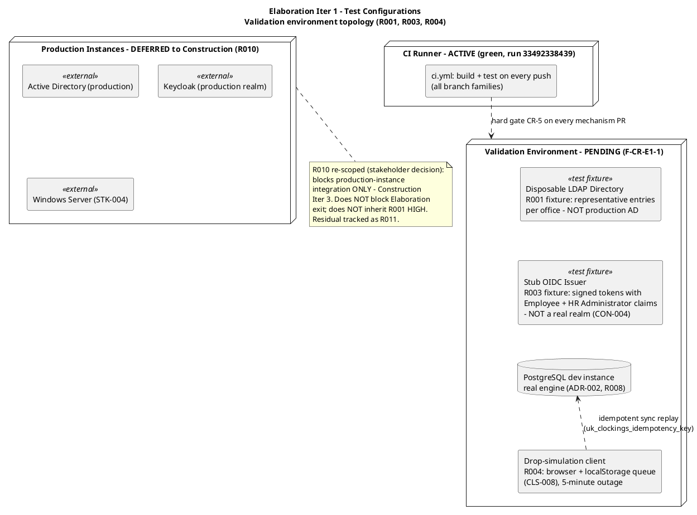
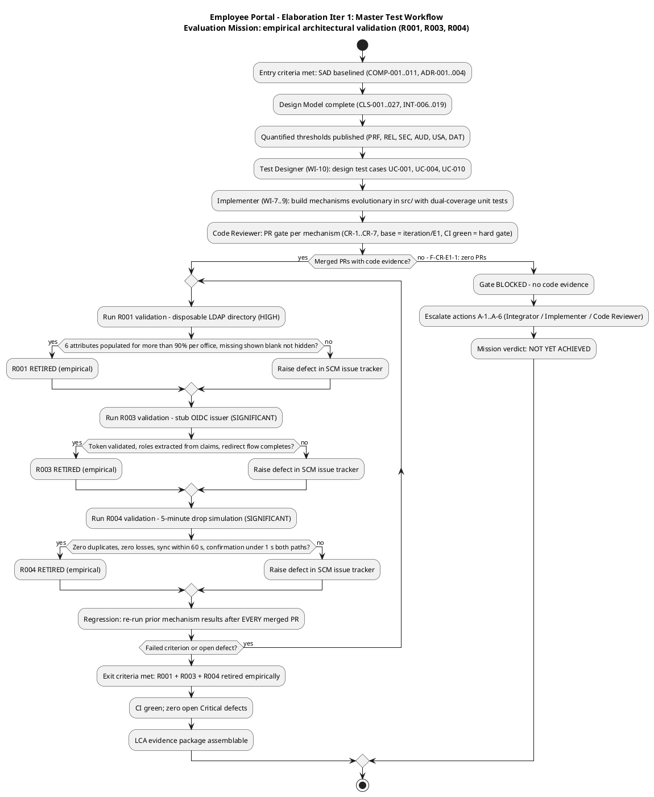
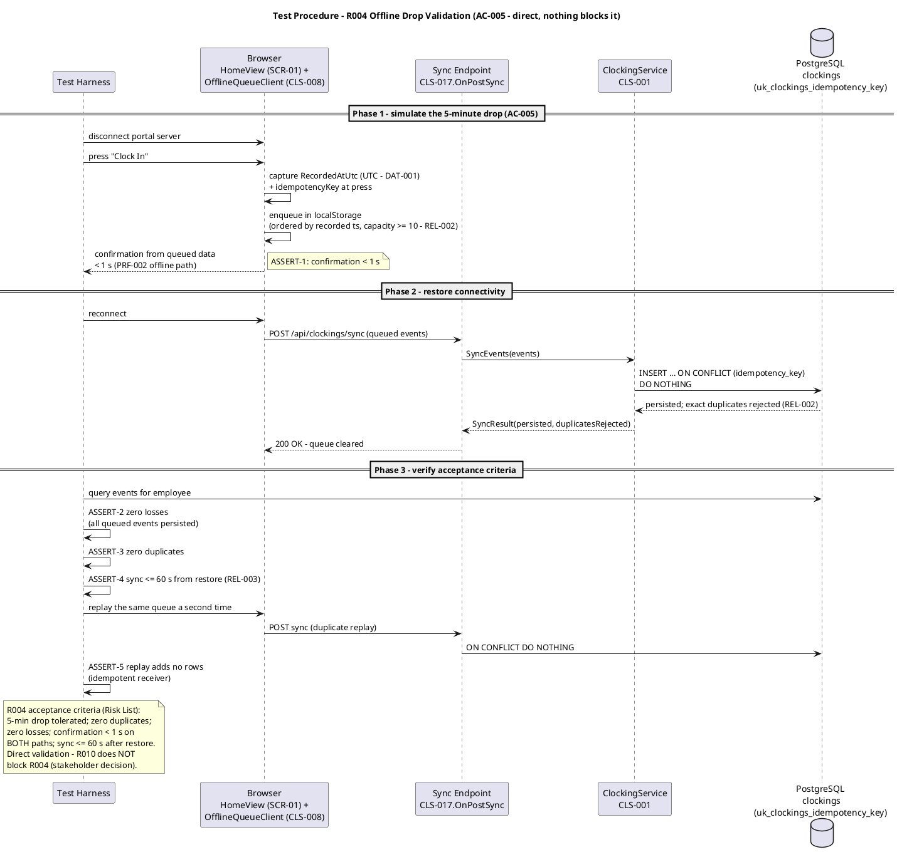
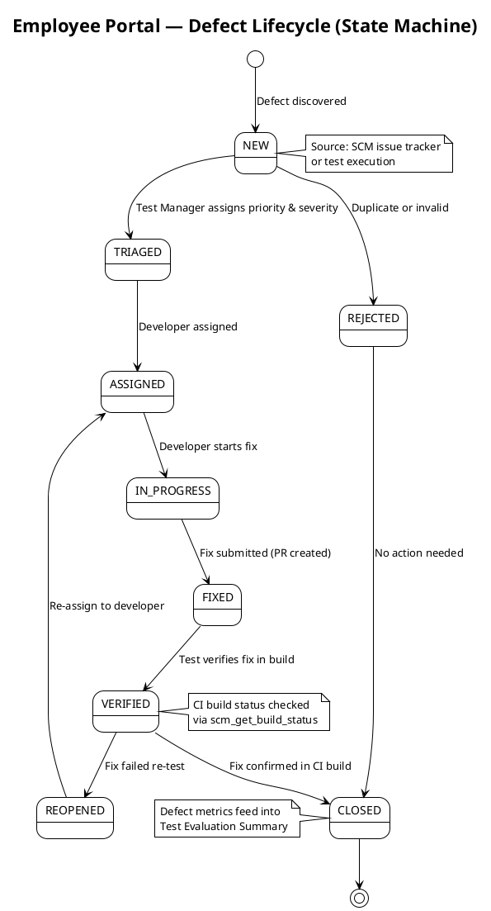

## Document Control

| Field | Value |
|---|---|
| Phase | Elaboration |
| Status | Draft — Elaboration Iter 1 evaluation record |
| Milestone Target | End of Elaboration (LCA) — NOT yet achieved |
| Iteration | 1 (Cycle 1) |
| Date | 2026-09-01 |
| Prior Version | Inception Test Evaluation Summary (Approved at LCO — mission ACHIEVED); EVOLVED, not recreated |
| CI Baseline | Green on main (run 33492338439, verified this iteration) |
| Defect Baseline | 0 open, 0 closed (verified this iteration — `scm_list_issues`, all states) |
| Elaboration Changes | Evaluation Mission redefined for Elaboration Iter 1 (empirical architectural validation: R001 > R003 > R004, per binding stakeholder decision); acceptance thresholds per quality attribute defined from quantified Supplementary Specification (PRF/REL/SEC/AUD/DAT/USA); test configurations identified (validation environment vs deferred production instances); master test workflow, R004 test procedure, and test-configuration topology diagrams added; defect lifecycle preserved; quality baseline re-verified against real SCM data; incident F-CR-E1-1 recorded (no code evidence — validation cannot execute); mission verdict recorded honestly as NOT YET ACHIEVED |

## Test Scope

### Evaluation Mission (Elaboration Iteration 1)

**Purpose:** Empirically validate the three architecturally significant mechanisms — **R001 (HIGH) via a disposable LDAP directory, R003 (SIGNIFICANT) via a stub OIDC issuer, R004 (SIGNIFICANT) directly** — so the LCA milestone is decided on **code evidence, not paper**. Binding stakeholder decision: "The PoC is produced in Elaboration and validated empirically"; "I will not accept an LCA that validates a HIGH architectural risk on paper only."

**Focus:** UC-001 (Clock In and Clock Out), UC-004 (Search Employee Directory), UC-010 (Unpublish News) — the three architecturally significant use cases (SAD Use-Case View priority 1–3; Inception test priority confirmed). Validation order: **R001 > R003 > R004** (R001 is the only HIGH-magnitude risk).

**Acceptable outcome (mission met):** all three validations pass their Risk-List acceptance criteria **with SCM code evidence** (merged PRs on `iteration/E1`, CI green), zero open Critical defects, and the regression baseline established → the LCA evidence package is assemblable. **Exit criterion = Evaluation Mission met, NOT 100% pass rate or perfect coverage.**

**Mission scope boundaries:**

| In Scope | Out of Scope |
|---|---|
| Empirical validation of R001/R003/R004 mechanisms (evolutionary code in `src/`) | Full functional testing of all 10 UCs (Construction) |
| Test case design for UC-001, UC-004, UC-010 + PoC acceptance criteria (Test Designer, WI-10) | Test procedure execution against production AD / Keycloak (Construction Iter 3 — R010/R011) |
| Regression of prior mechanism results after every merged PR | Performance load testing (NFR-001 full-scale — Construction) |
| Defect tracking via SCM issue tracker (authoritative source) | Usability / adoption testing (AC-004, BG-003 — Transition pilot) |
| Quality signals: CI build status, SCM defect census | UI visual-fidelity testing against CON-011 (Construction) |

**Test configurations (S2 output — S4 verified against SAD):**

**Resource justification (every resource justified against the mission):** the CI runner is the only ACTIVE configuration — it exists and is green. The four validation fixtures are the minimum set that retires the three risks without waiting on STK-004 (R010): a disposable LDAP directory answers R001's data-shape question empirically; a stub issuer proves OIDC consumption without a real realm (CON-004); the drop-simulation client exercises ADR-003 end-to-end; the PostgreSQL dev instance validates against the real declared engine (R008). No fifth environment is justified — production instances are Construction integration scope, not Elaboration.

### Acceptance Thresholds per Quality Attribute (architecture-milestone go/no-go)

Every threshold is quantified upstream (Supplementary Specification, Risk List, SAD) — none is invented here. These are the measurable criteria the LCA gate applies to the architecture milestone.

| Quality Attribute | Threshold (go/no-go) | Source | Validated By |
|---|---|---|---|
| Reliability — offline tolerance | 5-minute drop tolerated; queue ≥ 10 events/employee browser; queued events never lost; exact duplicates rejected, never duplicated; events ordered by recorded timestamp | REL-002, AC-005, ADR-003 | R004 validation (direct) |
| Reliability — sync completion | All queued events persisted ≤ 60 s after connectivity restored | REL-003 | R004 validation |
| Performance — clocking response | Confirmation < 1 s from button press on BOTH the online and offline-queued paths | PRF-002, NFR-002 | R004 validation |
| Security — authentication | OIDC token validated; Employee + HR Administrator roles extracted from claims; redirect flow completes; HR-only functions reject Employee-role sessions | SEC-001, SEC-002, SEC-006, R003 | R003 validation (stub issuer) |
| Functionality — directory data shape | All six corporate attributes (name, job title, department, office, email, extension) populated for >90% of sampled users per office; missing attributes display blank, entry NOT hidden | R001 acceptance criteria (Risk List), UC-004 AF-2 | R001 validation (disposable directory) |
| Data integrity — timestamp capture | Timestamp fixed at button press, stored UTC; queued events persist recorded timestamp unchanged on sync | DAT-001, ADR-003 | R004 validation |
| Data integrity — display convention | Displayed clocking times render in America/Havana local time (IANA, DST-aware); raw UTC or server time never shown | USA-008, stakeholder decision | UC-001 test cases (Test Designer) |
| Auditability — append-only | Audit entries append-only; no update/delete path exists; state change and audit entry commit in one transaction | DAT-002, NFR-005 | UC-010 test cases (Test Designer); Construction integration |
| Build integrity | CI green on every merged mechanism PR (hard gate CR-5) | Review Record CR-5 | Code Reviewer gate |

**Note on the R001 threshold:** the >90% criterion is defined against the **disposable directory's representative data** (validation environment). The residual question — does production AD match it? — is risk R011, retired by Construction integration testing once STK-004 delivers (R010). This split is the stakeholder's own framing: R001 is about the shape of the data and is answered empirically this phase; production-instance integration is a separate, smaller risk.

## Test Summary

### Master Test Workflow (Elaboration Iteration 1)

### Test Types (Elaboration Iteration 1)

| Test Type | Target | Method | Owner |
|---|---|---|---|
| Mechanism validation (functional) | R001 LDAP attribute mapping + graceful degradation (COMP-007/CLS-009) | Query the disposable directory over LDAP v3; verify six-attribute mapping; missing attributes → blank, entry NOT hidden | Implementer builds; Test Designer designs cases |
| Auth validation (security) | R003 OIDC consumption (COMP-006/CLS-010) | Stub issuer emits signed tokens with Employee + HR Administrator claims; verify validation, role extraction, redirect flow | Implementer builds; Test Designer designs cases |
| Reliability validation | R004 offline queue + idempotent sync (COMP-009/CLS-008, ADR-003) | 5-minute drop simulation; queue, reconnect, replay; zero duplicates/losses; sync ≤ 60 s | Implementer builds; Test Designer designs cases |
| Dual-coverage unit testing | Every mechanism PR | Black-box contract + white-box paths (branches, loops, error handlers) — Review Record CR-2 | Implementer |
| Regression | All previously merged mechanisms | Re-run prior mechanism results after EVERY merged PR; CI gates every push | Test Designer / CI |
| Build-time validation | R008 PostgreSQL + .NET 10 | Basic CRUD + migration test against the real engine | Implementer |

### Test Procedure — R004 Offline Drop Validation (highest-procedure risk; AC-005)

### Schedule and Resources (aligned to Iteration Plan WIs 7–10)

| Activity | Owner | Plan Reference | Sequence |
|---|---|---|---|
| Test case design: UC-001, UC-004, UC-010 + PoC acceptance criteria | Test Designer (~120K tokens) | WI-10 | After mechanisms exist (WIs 7–9); cases designed against the quantified thresholds |
| R001 mechanism + validation | Implementer (~100K tokens) | WI-7 | Priority 1 — only HIGH risk |
| R003 mechanism + validation | Implementer (~80K tokens) | WI-8 | Priority 2 |
| R004 mechanism + validation | Implementer (~70K tokens) | WI-9 | Priority 3 — direct, nothing blocks it |
| PR gate per mechanism | Code Reviewer | Review Record A-6 | After each `ready-for-review` branch; base `iteration/E1` |
| Regression re-run | Test Designer + CI | This document | After EVERY merged PR — mandatory, not optional |

**Cost-of-testing constraint honored:** the Test discipline holds ~10% of the iteration budget box (Test Designer ~120K of ~1,180K tokens) — within the 30–50%-of-project-cost reality when Construction's larger test share is included; Elaboration's test intensity is concentrated on the three risk-retiring mechanisms, not spread thin.

**Two clocks (never summed):** agent work is measured in tokens (Test Designer ~120K this iteration; actuals recorded by the Project Manager in the Iteration Assessment); human gates are quoted separately (LCA review queue: [ASSUMPTION — up to 2 days, basis: heavier review than LCO; Inception measured 0s]). No person-week figures are produced by this system.

### Regression Policy (mandatory per iteration)

Every merged mechanism PR triggers a re-run of all previously validated mechanism results. With three mechanisms merging in sequence (R001 → R003 → R004), the third validation re-runs the first two. An iteration without regression accumulates undiscovered defect debt — this policy is not waivable under schedule pressure. CI gates every push on all branch families (ConfigurationManager pattern), so a red build blocks the PR before review (CR-5 hard gate).

### Quality Metrics (defined now, measured from real SCM data)

| Metric | Definition | Current Value (real data) |
|---|---|---|
| CI build status | Latest run on main | **Green** — run 33492338439 (started 2026-09-01 09:27:49Z, completed 09:28:38Z) |
| Open defects | SCM issue tracker, all states | **0** (verified via `scm_list_issues`) |
| Risk-retirement evidence | Merged PRs per mechanism with passing validation | **0 of 3** — no code evidence exists (F-CR-E1-1) |
| Tests executed / pass rate | Actual validation runs | **None executed** — no mechanism code exists; no counts are fabricated |
| Defect density | Defects per merged mechanism PR | Not yet measurable — zero PRs |
| Escaped defects | Defects found in Construction/Transition that Elaboration validation missed | Tracked from Construction Iter 1 onward — the key quality indicator |

### Risk-Driven Test Prioritization (evolved from Inception baseline — preserved, status updated)

| Risk | Magnitude | Affected UCs / ACs | Test Activity | Priority | Status (Elab Iter 1) |
|---|---|---|---|---|---|
| R001 — AD LDAP attribute consistency | HIGH | UC-004, AC-003 | Empirical validation against disposable LDAP directory (stakeholder decision — R010 dependency REMOVED) | 1 | MITIGATING — validation pending code handoff |
| R003 — OIDC/Keycloak integration | SIGNIFICANT | All UCs (auth) | Empirical validation against stub OIDC issuer (stakeholder decision — no real realm, CON-004) | 2 | MITIGATING — validation pending code handoff |
| R004 — Offline fault tolerance | SIGNIFICANT | UC-001, AC-005, NFR-004 | Direct 5-minute drop simulation; queue + sync + idempotency | 3 | MITIGATING — validation pending code handoff |
| R010 — Infra team deliverables | SIGNIFICANT (re-scoped) | Production-instance integration | Deferred to Construction Iter 3 — does NOT block Elaboration exit | 4 | OPEN — PM owns STK-004 engagement |
| R011 — Validation-environment fidelity | MODERATE (new) | R001/R003 residuals | Record deltas between fixtures and production instances; fixtures kept as reusable Construction test fixtures | 5 | OPEN — surfaces at Construction integration |
| R002 — Clocking adoption | SIGNIFICANT | UC-001, AC-004, BG-003 | Usability test in Transition (pilot); not a technical test | 6 | OPEN — Transition |
| R005 — LDAP query performance | MODERATE | UC-004, NFR-001, AC-003 | Measured during R001 validation; 5 s hard timeout (PRF-003); cache tactic in reserve | 7 | Monitored during R001 |
| R006 — Audit trail completeness | MODERATE | UC-007…UC-010, NFR-005 | UC-010 test cases this iteration (design); Construction integration test on all four flows | 8 | Design complete (CLS-005, DAT-002); test pending |
| R007 — UI design fidelity | MODERATE | All user-facing UCs | Visual regression against CON-011 in Construction | 9 | OPEN — Construction |
| R008 — PostgreSQL + .NET 10 compat | MODERATE | All UCs (persistence) | Build-time CRUD + migration validation (Implementer) | 10 | OPEN — build-time |
| R009 — Scope creep | MODERATE | All declared scope | Process control (CCB gate); not a test activity | 11 | OPEN — CCB enforced |

### Use-Case to Acceptance Criteria Coverage Map (preserved from Inception — unchanged, all 5 ACs mapped)

| UC | Source FR | Acceptance Criteria Covered | Test Type |
|---|---|---|---|
| UC-001 | FR-004 | AC-001, AC-004, AC-005 | Functional + usability + reliability |
| UC-002 | FR-005 | — | Functional |
| UC-003 | FR-007 | — | Functional |
| UC-004 | FR-010 | AC-003 | Functional + performance |
| UC-005 | FR-001 | — | Functional |
| UC-006 | FR-002 | — | Functional + format validation (CSV) |
| UC-007 | FR-003 | — | Functional + audit verification |
| UC-008 | FR-006 | AC-002 | Functional + usability + audit |
| UC-009 | FR-008 | — | Functional + audit verification |
| UC-010 | FR-009 | — | Functional + audit verification |

**Coverage assessment (unchanged):** all 5 ACs mapped to at least one UC. AC-001/AC-004/AC-005 → UC-001 (highest-risk convergence: OIDC + offline + persistence); AC-003 → UC-004 (only HIGH risk, R001); AC-002 → UC-008.

## Defects and Incidents

### Defect Lifecycle (preserved — governs all defect management)

The following state machine governs defect management throughout the project lifecycle. Defects are tracked in the SCM issue tracker (GitHub Issues), which is the authoritative source for defect data.

### Current Defect Status (real SCM data — verified this iteration)

| Metric | Count | Source |
|---|---|---|
| Total defects (open) | 0 | `scm_list_issues` (all states), 2026-09-01 |
| Total defects (closed) | 0 | `scm_list_issues` (all states), 2026-09-01 |
| Critical / Major / Minor | 0 / 0 / 0 | `scm_list_issues` |

**No defects are recorded in the SCM tracker.** No validation has executed (no mechanism code exists), so no test-execution defects could have been raised yet. Defect tracking activates the moment the first mechanism PR is reviewed and the first validation runs.

### Incidents

**INC-1 (Elaboration Iter 1, Cycle 1) — Validation environment absent; test effort impeded.** The Review Record's Critical finding **F-CR-E1-1** records the observable SCM state: zero `ready-for-review` branches, zero PRs in any state, no mechanism code in the build tree (no `Services/`, no `Infrastructure/`), and `iteration/E1` (the mandatory PR base) absent. Consequence for the test effort: **exit criteria 1–3 (empirical R001/R003/R004 validation) have no code evidence, and no validation can execute.** This is the #1 testing bottleneck — environment/handoff availability, not test design. Remediation is owned outside the Test discipline (Review Record actions A-1…A-6: Integrator creates `iteration/E1`; Implementer builds and hands off the three mechanisms with dual-coverage tests; Code Reviewer gates each PR). The Test Designer's case design (WI-10) proceeds against the quantified thresholds and is ready to execute the moment handoffs arrive.

**INC-2 (upstream inconsistency — noted, not owned by Test):** the SAD §Quality PoC Plan still carries the superseded "analysis-only + designed mechanism" disposition and states R010 blocks R001/R003 validation. This contradicts the binding stakeholder decision (empirical validation this phase via disposable directory / stub issuer; R010 blocks production-instance integration only) and the corrected Risk List and Iteration Plan. Per the Active Constraints, the SAD correction is owned by the Software Architect. The Test discipline aligns to the stakeholder decision, the Risk List, and the Iteration Plan — the authoritative chain for this mission.

## Conclusions

### Evaluation Mission Verdict (Elaboration Iteration 1, Cycle 1)

**Mission status: NOT YET ACHIEVED — blocked on code evidence (INC-1 / F-CR-E1-1).**

The Evaluation Mission is **defined, agreed, and executable**: objectives (empirical R001/R003/R004 validation), focus (UC-001, UC-004, UC-010), acceptance thresholds (quantified, upstream-sourced, none invented), test configurations (identified, with the production-instance boundary drawn at Construction per the R010 re-scope), resources (Test Designer ~120K tokens, WI-10), schedule (R001 > R003 > R004, regression after every merged PR), and metrics (real SCM data) are all in place.

What the mission **cannot yet claim**: the three empirical validations have not run, because no mechanism code exists in SCM (zero PRs, `iteration/E1` absent — F-CR-E1-1). Recording a "mission achieved" verdict here would be exactly the paper-only validation of a HIGH architectural risk the stakeholder refused. The verdict is therefore recorded honestly: **NOT YET ACHIEVED**, with the blocker documented (INC-1) and the unblocking actions owned by the Integrator, Implementer, and Code Reviewer (A-1…A-6). The moment handoffs arrive, the master test workflow's "yes" branch executes: three validations, regression per merged PR, and the LCA evidence package becomes assemblable.

**Evidence summary (all real, none fabricated):** CI green on main (run 33492338439); 0 defects in the SCM tracker (all states); 0 of 3 risk-retirement validations evidenced; 0 test executions (no code to test). The Inception Evaluation Mission remains ACHIEVED (historical record — five objectives met, preserved in SCM history).

### Recommendations

1. **Unblock the validation environment first (A-1).** `iteration/E1` must exist before any mechanism PR can be opened — it is the base of every PR. This is the single cheapest action with the largest unblocking effect.
2. **Sequence the Implementer handoffs R001 → R003 → R004** (risk magnitude order). R001 is the only HIGH risk; R004 is direct and unblocked by anything — it can proceed in parallel if capacity allows.
3. **Hold the regression line.** Three mechanisms merging in one iteration is precisely the situation where skipped regression accumulates hidden defect debt. The third validation must re-run the first two.
4. **Keep the disposable directory and stub issuer as reusable Construction fixtures** (R011 mitigation) — they become the integration-test baseline until production instances arrive (R010).
5. **Escaped-defect tracking starts at Construction Iter 1** — every defect found later in a mechanism validated here is a direct measure of this iteration's validation quality.

### Test Plan Status

**[OMITTED: Test Plan — trigger not fired per Development Case §5.2 oracle; per-iteration testing scope lives in the Iteration Plan]**

The Development Case oracle (`get_optional_artifact_triggers`, consulted this iteration) reports the Test Plan trigger **not fired**: the project requires no formal delivery, regulatory audit, or contractual test reporting. Per-iteration testing scope is defined in the Iteration Plan (Work Items 7–10), and this Test Evaluation Summary carries the test strategy, schedule, resources, test types, and architecture-milestone acceptance criteria. **Recorded conflict:** the Work Order's additional instruction ("update test plan with detailed schedule, resources, test types, and acceptance criteria for the architecture milestone") names an artifact the Development Case does not sanction this round. The Development Case is the law that governs artifact production; the requested substance is delivered here, inside the sanctioned Test Evaluation Summary, rather than by silently producing an unsanctioned artifact. If formal test reporting is later required, a Change Request through the CCB can fire the trigger — the Development Case re-evaluates triggers every iteration.

## Traceability

| Element | Traces From | Link Type | Traces To |
|---|---|---|---|
| Evaluation Mission (Elab Iter 1) | Stakeholder decision (Elab Iter 1): "The PoC is produced in Elaboration and validated empirically"; Risk List R001/R003/R004 re-scope; Iteration Plan objectives 1, exit criteria 1–3 | Refines | R001, R003, R004 retirement evidence; LCA milestone gate |
| R001 validation activity | R001 (Risk List — HIGH), FR-010, UC-004 AF-2, COMP-007, CLS-009 | Tests | AC-003 (partial evidence); disposable LDAP directory fixture |
| R003 validation activity | R003 (Risk List — SIGNIFICANT), CON-004, SEC-001/002/006, COMP-006, CLS-010 | Tests | All UCs (auth `<<include>>`); stub OIDC issuer fixture |
| R004 validation activity | R004 (Risk List — SIGNIFICANT), NFR-004, AC-005, REL-002/003, PRF-002, ADR-003, COMP-009, CLS-008 | Tests | AC-005 (partial evidence); UC-001 AF-1 |
| Acceptance thresholds table | PRF-002, REL-002, REL-003, SEC-001/002/006, DAT-001/002, USA-008 (Supplementary Specification); R001 criteria (Risk List) | Refines | LCA milestone go/no-go criteria |
| Test configurations topology | SAD Deployment View; R010 re-scope (stakeholder decision); R011 (Risk List) | DependsOn | Implementer WIs 7–9; Construction Iter 3 integration (R010/R011) |
| Master test workflow | Iteration Plan WIs 7–10; Review Record CR-1…CR-7, actions A-1…A-6 | Refines | Elaboration Iter 1 exit criteria 1–3 |
| R004 test procedure | AC-005, REL-002/003, PRF-002, DAT-001, SEQ-001, CLS-008/CLS-001/CLS-017 | Tests | uk_clockings_idempotency_key (Design Model §Persistent Data Classes) |
| Regression policy | RUP test discipline (mandatory per iteration); CI pattern (all branch families) | Refines | Construction regression suite baseline |
| Quality metrics | `scm_get_build_status` (run 33492338439), `scm_list_issues` (0 all states) | DependsOn | Iteration Assessment (actuals); Construction defect tracking |
| INC-1 | Review Record F-CR-E1-1 (Critical), actions A-1…A-6 | Derives | Integrator (A-1); Implementer (A-2…A-5); Code Reviewer (A-6) |
| INC-2 | SAD §Quality PoC Plan (superseded disposition); Active Constraints (Architect owns correction) | Reviews | Software Architecture Document (Architect) |
| Defect lifecycle | `scm_list_issues` (authoritative source); RUP test management | DependsOn | Elaboration+ defect tracking; Test Evaluation Summary metrics |
| UC-to-AC coverage map (preserved) | UC-001…UC-010 (Use-Case Model), AC-001…AC-005 (declared) | Tests | Construction functional test design |
| Risk-driven prioritization (evolved) | R001–R011 (Risk List, Elab Iter 1 reappraisal) | Refines | Test Designer case design (WI-10); Construction/Transition test planning |
| Test Plan omission | Development Case §5.2 oracle (Test Plan trigger not fired) | DependsOn | Iteration Plan (per-iteration testing scope); CCB (trigger re-evaluation) |