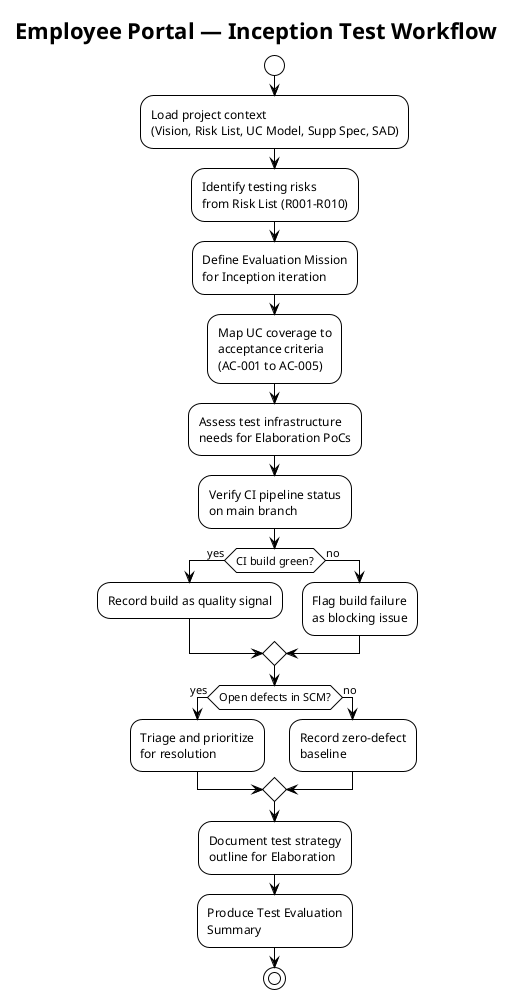
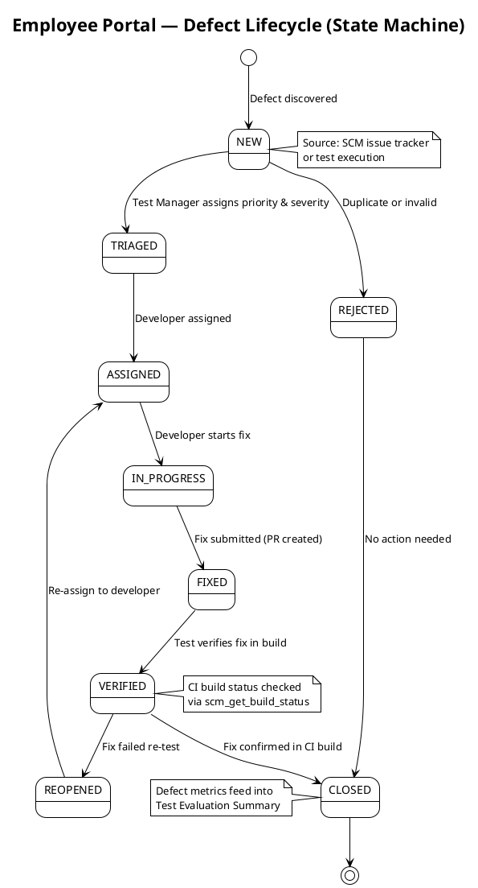

## Document Control

| Field | Value |
|---|---|
| Phase | Inception |
| Status | Draft |
| Milestone Target | End of Inception |
| Iteration | 1 (Cycle 1) |
| Date | 2026-09-01 |

## Test Scope

### Evaluation Mission (Inception Iteration 1)

The Evaluation Mission for this iteration is to **establish the test strategy foundation** for the Employee Portal — identifying testing risks, mapping use-case coverage to acceptance criteria, assessing test infrastructure needs, and recording the initial quality baseline from CI and SCM signals. No test execution occurs in Inception; the mission is preparatory and risk-driven.

**Mission objectives:**

1. **Identify and prioritize testing risks** from the Risk List (R001–R010) that will drive test effort in Elaboration and Construction.
2. **Map use-case coverage** — all 10 UCs (UC-001 to UC-010) to their source FRs and acceptance criteria (AC-001 to AC-005), establishing the traceability backbone for future test case design.
3. **Assess test infrastructure needs** — identify what environments, tools, and external system access are required for Elaboration PoCs and Construction test execution.
4. **Record the initial quality baseline** — CI build status and SCM defect count as of Inception close.
5. **Outline the test strategy** for Elaboration — what will be tested, how, and with what entry/exit criteria.

**Mission scope boundaries:**

| In Scope | Out of Scope |
|---|---|
| Risk-driven test strategy outline | Detailed test case design |
| UC-to-AC coverage mapping | Test procedure execution |
| Test infrastructure needs assessment | Performance test scripts |
| CI/SCM quality baseline recording | Automated test framework setup |
| Elaboration PoC test support plan | Integration test execution |

### Test Strategy Outline (for Elaboration)

The test strategy is use-case driven and risk-prioritized. Testing begins in Elaboration with PoC validation of the three highest-risk areas, then expands in Construction to cover all 10 UCs.

### Risk-Driven Test Prioritization

The Risk List (R001–R010) drives test effort allocation. Risks are mapped to the UCs and acceptance criteria they threaten, and to the test activities that will validate their mitigation.

| Risk | Magnitude | Affected UCs / ACs | Test Activity (Elaboration+) | Test Priority |
|---|---|---|---|---|
| R001 — AD LDAP attribute consistency | HIGH | UC-004, AC-003 | PoC: query AD from 3 offices, verify attribute population | 1 (highest) |
| R003 — OIDC/Keycloak integration | SIGNIFICANT | All UCs (auth) | PoC: register OIDC client, test full auth flow, role extraction | 2 |
| R004 — Offline fault tolerance | SIGNIFICANT | UC-001, AC-005, NFR-004 | PoC: simulate 5-min network drop, verify queue + sync + idempotency | 3 |
| R010 — Infra team availability | SIGNIFICANT | UC-004, UC-001, all UCs | Integration test deferred until Infra delivers LDAP access + Keycloak client | 4 |
| R002 — Clocking adoption | SIGNIFICANT | UC-001, AC-004, BG-003 | Usability test in Transition (pilot); not a technical test | 5 |
| R005 — LDAP query performance | MODERATE | UC-004, NFR-001, AC-003 | Performance test during R001 PoC; add caching if >2s | 6 |
| R006 — Audit trail completeness | MODERATE | UC-007, UC-008, UC-009, UC-010, NFR-005 | Integration test: verify audit records for publish/edit/unpublish/category change | 7 |
| R007 — UI design fidelity | MODERATE | All user-facing UCs | Visual regression test against CON-011 design in Construction | 8 |
| R008 — PostgreSQL + .NET 10 compat | MODERATE | All UCs (persistence) | Build-time validation: basic CRUD test during skeleton setup | 9 |
| R009 — Scope creep | MODERATE | All declared scope | Process control: CCB gate; not a test activity | 10 |

### Use-Case to Acceptance Criteria Coverage Map

| UC | Source FR | Acceptance Criteria Covered | Test Type (Future) |
|---|---|---|---|
| UC-001 | FR-004 | AC-001, AC-004, AC-005 | Functional + usability + reliability |
| UC-002 | FR-005 | — | Functional |
| UC-003 | FR-007 | — | Functional |
| UC-004 | FR-010 | AC-003 | Functional + performance |
| UC-005 | FR-001 | — | Functional |
| UC-006 | FR-002 | — | Functional + format validation (CSV) |
| UC-007 | FR-003 | — | Functional + audit verification |
| UC-008 | FR-006 | AC-002 | Functional + usability + audit |
| UC-009 | FR-008 | — | Functional + audit verification |
| UC-010 | FR-009 | — | Functional + audit verification |

**Coverage assessment:** All 5 acceptance criteria (AC-001 to AC-005) are mapped to at least one UC. AC-001 and AC-004 both map to UC-001 (clocking), which is the highest-risk convergence point (OIDC + offline + persistence). AC-003 maps to UC-004 (directory), which carries the only HIGH-magnitude risk (R001). AC-005 maps to UC-001's offline resilience (R004). AC-002 maps to UC-008 (news publishing).

### Test Infrastructure Needs Assessment

| Need | Purpose | Phase Required | Dependency | Status |
|---|---|---|---|---|
| CI pipeline (existing) | Automated build + test on every push | Inception (active) | None | ✅ Green on main |
| PostgreSQL dev instance | CRUD validation, data model tests | Elaboration | Local or Infra-provided | Pending |
| LDAP read access to AD (service account) | R001 PoC, directory integration tests | Elaboration Iteration 1 | STK-004 (Infra) | **Blocked** — R010 |
| Keycloak OIDC client registration | R003 PoC, auth integration tests | Elaboration Iteration 1 | STK-004 (Infra) | **Blocked** — R010 |
| Mock LDAP directory | Fallback if Infra access delayed | Elaboration (contingency) | None | Not yet needed |
| Mock OIDC provider | Fallback if Keycloak client delayed | Elaboration (contingency) | None | Not yet needed |
| Test data: sample AD entries | Directory search tests, R001 attribute verification | Elaboration | STK-004 or mock | Pending |
| Windows Server (test environment) | Integration + acceptance testing | Construction | STK-004 (Infra) | Pending |

**Critical path:** R010 (Infrastructure Team availability) blocks two of three Elaboration PoCs. The Project Manager must engage STK-004 at the start of Elaboration to secure LDAP access and Keycloak client registration. If blocked, mock providers unblock development but defer integration testing to early Construction.

## Test Summary

### Inception Quality Baseline

| Metric | Value | Source | Date |
|---|---|---|---|
| CI build status (main) | ✅ Success | `scm_get_build_status` | 2026-09-01 |
| CI build duration | ~66 seconds | `scm_get_build_status` | 2026-09-01 |
| Open defects (SCM issues) | 0 | `scm_list_issues` | 2026-09-01 |
| Use cases defined | 10 (UC-001 to UC-010) | Use-Case Model | 2026-09-01 |
| Acceptance criteria mapped | 5/5 (AC-001 to AC-005) | This document | 2026-09-01 |
| Risks identified | 10 (R001–R010) | Risk List | 2026-09-01 |
| Architecturally significant UCs | 3 (UC-001, UC-004, UC-010) | SAD | 2026-09-01 |
| PoCs planned for Elaboration | 3 (R001, R003, R004) | SAD | 2026-09-01 |

**Assessment:** The Inception iteration has produced a complete requirements baseline (10 FRs, 5 NFRs, 5 ACs), a candidate architecture (9 components, 3 ADRs), and a comprehensive risk register (10 risks). The CI pipeline is green with zero open defects. The test strategy is risk-driven and use-case mapped. No test execution has occurred — this is expected for Inception.

### Test Strategy by Phase

| Phase | Test Activities | Entry Criteria | Exit Criteria |
|---|---|---|---|
| Inception (current) | Strategy definition, risk identification, coverage mapping | Vision + Risk List available | Evaluation Mission documented; UC-to-AC map complete |
| Elaboration | PoC validation (R001, R003, R004); integration test design | SAD baselined; Infra delivers LDAP + Keycloak access | PoCs pass; test cases designed for top 3 UCs |
| Construction | Functional testing (all 10 UCs); performance testing (NFR-001, NFR-002); audit trail verification (NFR-005); UI fidelity testing (CON-011) | Elaboration PoCs passed; implementation underway | All UC test cases pass; AC-001 to AC-005 verified; regression suite green |
| Transition | Pilot deployment testing; adoption tracking (AC-004, BG-003); two-gate acceptance (dev-site then production-site) | Construction exit criteria met | Stakeholder sign-off on both gates; pilot data validates AC-004 |

## Defects and Incidents

### Defect Lifecycle

The following state machine governs defect management throughout the project lifecycle. Defects are tracked in the SCM issue tracker (GitHub Issues), which is the authoritative source for defect data.

### Current Defect Status

| Metric | Count |
|---|---|
| Total defects (open) | 0 |
| Total defects (closed) | 0 |
| Critical defects | 0 |
| Major defects | 0 |
| Minor defects | 0 |

**No defects have been recorded in this iteration.** This is expected — Inception produces artifacts, not executable code beyond the bootstrap skeleton. The CI pipeline is green, and no issues have been raised in the SCM tracker. Defect tracking will begin in Elaboration when PoC code is developed and tested.

### Incidents

No incidents have been recorded in this iteration.

## Conclusions

### Evaluation Mission Verdict

**Mission status: ACHIEVED**

The Inception Evaluation Mission had five objectives:

1. ✅ **Identify and prioritize testing risks** — All 10 risks (R001–R010) mapped to affected UCs/ACs and assigned test activities with priority ordering.
2. ✅ **Map use-case coverage** — All 10 UCs mapped to source FRs; all 5 ACs mapped to at least one UC. Coverage map documented above.
3. ✅ **Assess test infrastructure needs** — 8 infrastructure needs identified with phase, dependency, and status. Two are blocked by R010 (Infra team availability).
4. ✅ **Record initial quality baseline** — CI build green (2026-09-01), zero open defects, 10 UCs defined, 3 PoCs planned.
5. ✅ **Outline test strategy for Elaboration** — Phase-by-phase strategy with entry/exit criteria documented.

### Recommendations for Elaboration

1. **R010 is the critical blocker** — The Project Manager must secure STK-004 deliverables (LDAP access, Keycloak client registration) before Elaboration Iteration 1. Without these, two of three PoCs cannot proceed, and integration testing is deferred.
2. **R001 PoC is highest test priority** — The only HIGH-magnitude risk. LDAP attribute consistency across 3 offices must be validated empirically before directory-related test cases can be designed with confidence.
3. **Regression testing must begin in Elaboration** — Even with a small codebase, each PoC iteration must include regression of prior PoC results to prevent defect accumulation.
4. **Test case design should follow the risk priority order** — UC-001 (clocking, R004), UC-004 (directory, R001), UC-010 (unpublish, R006) are the first three UCs for detailed test case design.
5. **Two-gate acceptance testing** — Per the declared acceptance approach (dev-site then production-site with pilot), the test strategy must plan for two formal acceptance test cycles in Transition.

### Test Plan Status

[OMITTED: Test Plan — trigger not fired; per-iteration testing scope lives in the Iteration Plan]

The Development Case has not fired the Test Plan optional artifact trigger. The project does not require formal delivery, regulatory audit, or contractual test reporting. Per-iteration testing scope is defined in the Iteration Plan by the Project Manager, and the Test Evaluation Summary (this document) captures the test strategy and results.

## Traceability

| Element | Traces From | Link Type | Traces To |
|---|---|---|---|
| Evaluation Mission | Vision, Risk List | Refines | (Elaboration Test Plan — if triggered) |
| R001 test activity | R001 (Risk List) | Derives | UC-004, AC-003 |
| R003 test activity | R003 (Risk List) | Derives | All UCs (auth) |
| R004 test activity | R004 (Risk List) | Derives | UC-001, AC-005, NFR-004 |
| UC-001 coverage | FR-004, UC-001 (UC Model) | Tests | AC-001, AC-004, AC-005 |
| UC-004 coverage | FR-010, UC-004 (UC Model) | Tests | AC-003 |
| UC-008 coverage | FR-006, UC-008 (UC Model) | Tests | AC-002 |
| UC-010 coverage | FR-009, UC-010 (UC Model) | Tests | NFR-005 (audit) |
| CI build baseline | `scm_get_build_status` | DependsOn | (Construction regression suite) |
| Defect lifecycle | `scm_list_issues` | DependsOn | (Elaboration+ defect tracking) |
| Test infrastructure needs | SAD (COMP-006, COMP-007, COMP-008) | Derives | R010, R001, R003 |
| Phase test strategy | SAD (PoC plan), Risk List | Refines | (Elaboration Iteration Plan) |