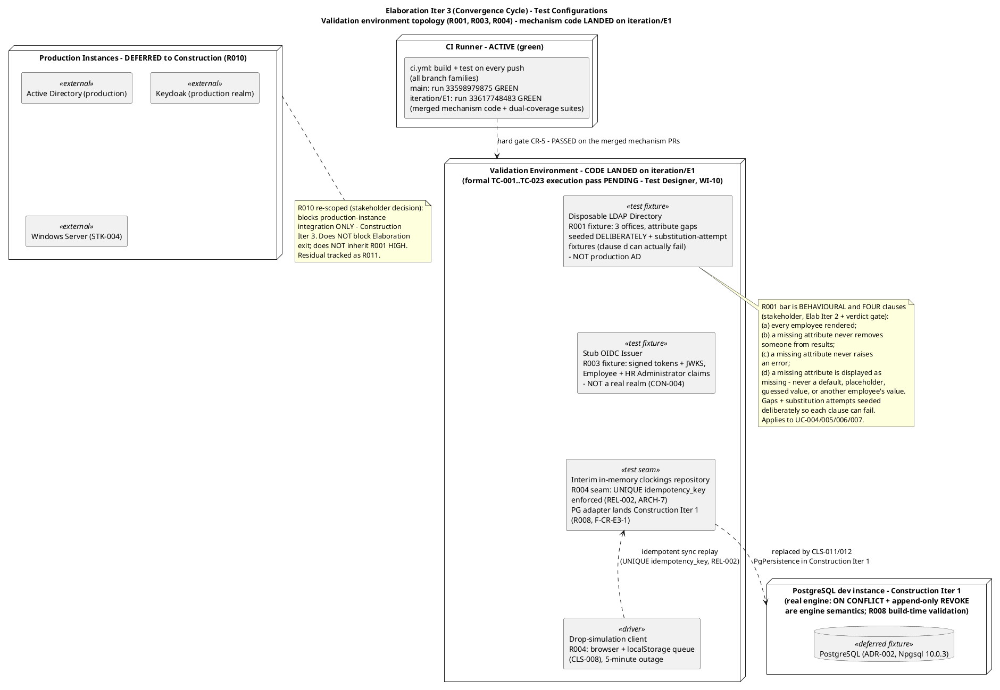
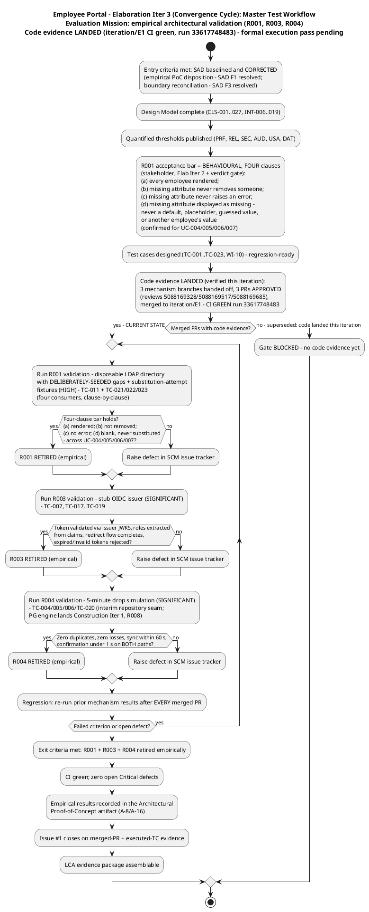
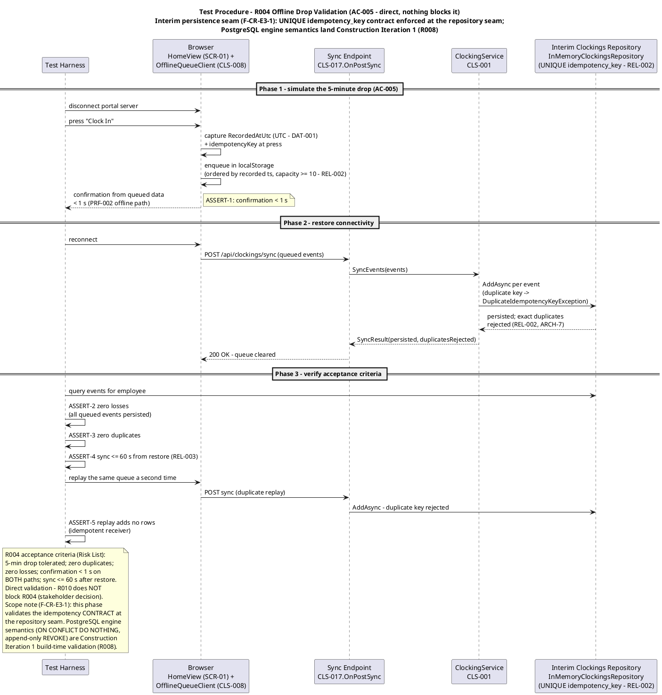
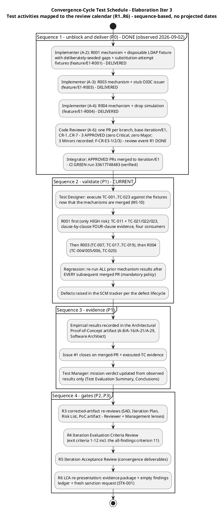
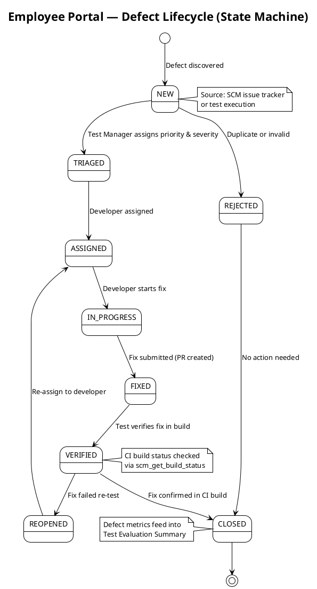

## Document Control

| Field | Value |
|---|---|
| Phase | Elaboration |
| Status | Draft — Elaboration Iter 3 (convergence cycle) evaluation record; EVOLVED from the Iter 2 record (Approved with changes — 1 Minor finding TES F1, remediated this revision), not recreated |
| Milestone Target | End of Elaboration (LCA) — **NOT yet achieved**; re-presentation pending convergence-cycle closure (empty findings ledger across all lenses and severities + empirical R001/R003/R004 evidence package with **FOUR-clause × four-consumer R001 evidence**) |
| Iteration | 3 (Cycle 1) — convergence cycle |
| Date | 2026-09-02 |
| Prior Version | Elaboration Iter 2 evaluation record (evolved from Iter 1; Inception Test Evaluation Summary Approved at LCO — mission ACHIEVED); EVOLVED, not recreated |
| CI Baseline | **Green on BOTH branches (verified this iteration):** main run 33598979875 (completed 2026-09-02 06:29:05Z); **`iteration/E1` run 33617748483 (completed 2026-09-02 10:07:56Z) — mechanism code + dual-coverage suites MERGED and building green** (the Iter 2 record's "zero CI runs on iteration/E1" is superseded) |
| Defect Baseline | **1 open SCM issue** (verified this iteration, all states): #1 (blocker/critical — R001/R003/R004 mechanism code absent; cr:approved, assigned: implementer — **delivery since landed; the issue now tracks the executed-TC evidence that closes it**). **Issue #2 CLOSED** (cr:complete — CONTRIBUTING.md committed, sha `6662813…` per the Review Record) |
| Elaboration Changes (Iter 3) | (1) **TES F1 (Minor, remediation A-19) RESOLVED** — all eight stale `TC-001…TC-020` enumerations corrected to the 23-case Test Case authority (mission scope, master workflow, schedule Sequence 2, resources table, INC-1, conclusions, recommendation 1, defect-status row), and the mission-scope boundary row corrected: TC-021/022/023 are DESIGNED and executed THIS convergence cycle as part of the R001 PoC; what lands in Construction is the full functional main-flow suites for UC-005/006/007, not the AF-3 bar cases. (2) **FOURTH behavioural-bar clause incorporated** (stakeholder contribution at the Iter 2 verdict gate, binding; propagation A-25…A-31): the R001 acceptance threshold extends from three to four clauses — clause (d), verbatim: "a missing attribute is displayed as missing. It is never replaced by a default, a placeholder, a guessed value, or another employee's value" — across all four AD-reading UCs; the acceptance-thresholds table, configurations diagram, master workflow, and test types updated. (3) **Observed state refreshed from verified SCM data** — the Implementer handoff ARRIVED (3 ready-for-review branches; 3 PRs APPROVED per the Review Record's Iter 3 code-review record; merged to `iteration/E1`; CI green run 33617748483); mechanism files verified on the branch (LdapGateway.cs `b8df8b7`, KeycloakAuthProvider.cs `7bd4cfd`, ClockingsRepository.cs `017cbcd`, offline-queue.js `9ac644a`); Issue #2 closed. (4) **R004 test procedure re-scoped to the interim persistence seam** (F-CR-E3-1, Minor — the merged code enforces the UNIQUE idempotency_key contract at the repository seam; PostgreSQL engine semantics land Construction Iteration 1 per R008). (5) INC-1 updated — the #1 testing bottleneck MOVED from code delivery to the formal TC-001…TC-023 execution pass. (6) Risk-driven prioritization trends updated (R001/R003/R004 IMPROVED — code evidence landed) |
| Elaboration Changes (Iter 2, preserved) | R001 acceptance threshold REPLACED per the stakeholder's Elab Iter 2 decision (behavioural bar replaces the dropped >90% figure — closes the Risk List F1 propagation, remediation A-10); Evaluation Mission refined for the convergence cycle; convergence-cycle test schedule added (delivering the Work Order's requested test-plan substance inside this sanctioned artifact); fixture spec requires deliberately-seeded gaps; quality metrics refreshed; INC-2 RESOLVED (SAD PoC Plan corrected by the Software Architect); trend column added |
| Elaboration Changes (Iter 1, preserved) | Evaluation Mission redefined for Elaboration (empirical architectural validation: R001 > R003 > R004, per binding stakeholder decision); acceptance thresholds per quality attribute defined from quantified Supplementary Specification; test configurations identified; master test workflow, R004 test procedure, and test-configuration topology diagrams added; defect lifecycle preserved; quality baseline verified against real SCM data; mission verdict recorded honestly as NOT YET ACHIEVED |

## Test Scope

### Evaluation Mission (Elaboration Iteration 3 — convergence cycle)

**Purpose:** empirically validate the three architecturally significant mechanisms — **R001 (HIGH) via a disposable LDAP directory, R003 (SIGNIFICANT) via a stub OIDC issuer, R004 (SIGNIFICANT) directly** — so the LCA milestone is decided on **code evidence, not paper**. This iteration continues the **convergence cycle**: it closes all open review findings (binding stakeholder directive: "Fix all the issues and close all findings" — all lenses, all severities) and assembles the LCA evidence package. Binding stakeholder decisions: "The PoC is produced in Elaboration and validated empirically"; "I will not accept an LCA that validates a HIGH architectural risk on paper only."

**Focus:** UC-001 (Clock In and Clock Out), UC-004 (Search Employee Directory), UC-010 (Unpublish News) — the three architecturally significant use cases (SAD Use-Case View priority 1–3) — **plus the R001 behavioural bar's stakeholder-confirmed extension to UC-005/006/007** (all four AD-reading UCs). Validation order: **R001 > R003 > R004** (R001 is the only HIGH-magnitude risk).

**Acceptable outcome (mission met):** all three validations pass their acceptance criteria **with SCM code evidence** (merged PRs on `iteration/E1`, CI green — **now observed**), the R001 behavioural bar observed to hold **clause-by-clause across all four clauses and all four AD-reading consumers** (TC-011 + TC-021/022/023), zero open Critical defects, regression baseline established, and the findings ledger empty across all lenses and severities → the LCA evidence package is assemblable and LCA is re-presented with a fresh sanction request. **Exit criterion = Evaluation Mission met, NOT 100% pass rate or perfect coverage.**

**Mission scope boundaries:**

| In Scope | Out of Scope |
|---|---|
| Empirical validation of R001/R003/R004 mechanisms (evolutionary code in `src/` — **merged to `iteration/E1` this iteration**) | Full functional testing of all 10 UCs (Construction) |
| R001 behavioural bar — **FOUR clauses** — across all four AD-reading UCs (UC-004/005/006/007 — stakeholder-confirmed Elab Iter 2; fourth clause added at the Iter 2 verdict gate). **TC-021/022/023 (the UC-005/006/007 AF-3 bar cases) are designed and executed THIS convergence cycle as part of the R001 PoC** — what lands in Construction is the full functional main-flow suites for UC-005/006/007 against the same retained fixtures, not the bar cases | Test procedure execution against production AD / Keycloak (Construction Iter 3 — R010/R011) |
| Test case design + execution of **TC-001…TC-023** as mechanisms land (Test Designer, WI-10) | Performance load testing (NFR-001 full-scale — Construction) |
| Regression of prior mechanism results after every merged PR | Usability / adoption testing (AC-004, BG-003 — Transition pilot) |
| Defect tracking via SCM issue tracker (authoritative source) | UI visual-fidelity testing against CON-011 (Construction) |
| Quality signals: CI build status, SCM defect census | **Real-AD data-quality measurement (Construction, R011 residual — excluded from the LCA evidence package per the stakeholder's Elab Iter 2 decision)** |

**Test configurations (updated for the convergence cycle — the fixture spec carries the FOUR-clause behavioural bar; mechanism code verified landed):**

**Resource justification (every resource justified against the mission):** the CI runner is ACTIVE and green on BOTH branches (main run 33598979875; `iteration/E1` run 33617748483 — the merged mechanism code builds and its dual-coverage suites pass in CI). The four validation fixtures are the minimum set that retires the three risks without waiting on STK-004 (R010): a disposable LDAP directory with **deliberately-seeded attribute gaps and substitution-attempt fixtures** answers R001's behavioural question empirically (a uniformly-populated fixture would pass vacuously and prove nothing; a fixture without substitution temptations could not fail clause d); a stub issuer proves OIDC consumption without a real realm (CON-004); the drop-simulation client exercises ADR-003 end-to-end; the interim in-memory repository enforces the UNIQUE idempotency_key contract at the seam this phase, with the PostgreSQL dev instance validating the real declared engine semantics in Construction Iteration 1 (R008, F-CR-E3-1). No fifth environment is justified — production instances are Construction integration scope, not Elaboration.

### Acceptance Thresholds per Quality Attribute (architecture-milestone go/no-go)

Every threshold is quantified upstream (Supplementary Specification, Risk List, SAD, stakeholder decisions) — none is invented here. These are the measurable criteria the LCA gate applies to the architecture milestone.

| Quality Attribute | Threshold (go/no-go) | Source | Validated By |
|---|---|---|---|
| **Functionality — directory data shape (R001 behavioural bar, FOUR clauses)** | **(1) Every employee is rendered whether or not their attributes are complete; (2) a missing attribute never removes someone from search results; (3) a missing attribute never raises an error; (4) a missing attribute is displayed as missing — it is never replaced by a default, a placeholder, a guessed value, or another employee's value** — observed across all four AD-reading UCs: UC-004 person card (blank fields, entry shown), UC-005 event row (blank display fields — clocking data is portal data, always complete), UC-006 CSV row (blank cells, every event row present, no abort — ad_user_id always present), UC-007 employee locatable and selectable | **R001 behavioural bar (stakeholder decision, Elab Iter 2 — replaces the dropped >90% figure; FOURTH clause added at the Iter 2 verdict gate, binding)**; UC-004 AF-2, UC-005 AF-3, UC-006 AF-3, UC-007 AF-3 (stakeholder-confirmed) | R001 validation (disposable directory with deliberately-seeded gaps + substitution-attempt fixtures) — **TC-011 + TC-021/022/023, clause-by-clause, four consumers** |
| Reliability — offline tolerance | 5-minute drop tolerated; queue ≥ 10 events/employee browser; queued events never lost; exact duplicates rejected, never duplicated; events ordered by recorded timestamp | REL-002, AC-005, ADR-003 | R004 validation (direct) — TC-004/005/006, TC-020 |
| Reliability — sync completion | All queued events persisted ≤ 60 s after connectivity restored | REL-003 | R004 validation |
| Performance — clocking response | Confirmation < 1 s from button press on BOTH the online and offline-queued paths | PRF-002, NFR-002 | R004 validation |
| Security — authentication | OIDC token validated via the issuer's JWKS; Employee + HR Administrator roles extracted from claims; redirect flow completes; expired/invalid tokens rejected at the request boundary; HR-only functions reject Employee-role sessions | SEC-001, SEC-002, SEC-003, SEC-006, R003 | R003 validation (stub issuer) — TC-007, TC-017…TC-019 |
| Data integrity — timestamp capture | Timestamp fixed at button press, stored UTC; queued events persist recorded timestamp unchanged on sync | DAT-001, ADR-003 | R004 validation |
| Data integrity — display convention | Displayed clocking times render in America/Havana local time (IANA, DST-aware); raw UTC or server time never shown | USA-008, stakeholder decision | UC-001 test cases (Test Designer) — TC-008 |
| Auditability — append-only | Audit entries append-only; no update/delete path exists; state change and audit entry commit in one transaction | DAT-002, NFR-005 | UC-010 test cases (Test Designer); Construction integration (PG engine REVOKE semantics — R008) |
| Build integrity | CI green on every merged mechanism PR (hard gate CR-5) | Review Record CR-5 | Code Reviewer gate — **PASSED on all three mechanism PRs (per the Review Record's Iter 3 code-review record); `iteration/E1` CI green run 33617748483 (verified)** |

**Note on the R001 threshold (Elab Iter 3 — extends the Iter 2 note):** the Iter 1 record carried ">90% of sampled users per office with all six attributes populated," sourced to the Risk List. The stakeholder decided (Elab Iter 2) the figure is invented and is **dropped**: measured against a disposable directory the team seeds itself, a percentage measures our own test data — it cannot fail, so it proves nothing. The bar is **behavioural, not statistical**: the clauses above, with gaps seeded **deliberately** in the disposable directory so each clause can actually fail. **At the Iter 2 verdict gate the stakeholder added the FOURTH clause, verbatim: "a missing attribute is displayed as missing. It is never replaced by a default, a placeholder, a guessed value, or another employee's value"** — with the rationale, verbatim: "Blank is an answer. 'General', or the first office in the list, is a fabrication — and on the CSV that reaches payroll a fabricated department is worse than an empty cell. An empty cell gets questioned. A plausible wrong one does not." The first three clauses stop data from being LOST; the fourth stops it from being INVENTED. The statistical measurement of the real AD's data quality is a Construction activity (R011 residual, STK-004-dependent) and is **excluded from the LCA evidence package**. This closes the Risk List F1 (Reviewer) propagation into this artifact (remediation A-10, applied Iter 2; fourth clause incorporated Iter 3).

## Test Summary

### Master Test Workflow (Elaboration Iteration 3 — convergence cycle)

### Test Types (Elaboration Iteration 3)

| Test Type | Target | Method | Owner |
|---|---|---|---|
| Mechanism validation (functional) | R001 LDAP attribute mapping + graceful degradation (COMP-007/CLS-009) | Query the disposable directory over LDAP v3 with **deliberately-seeded gaps + substitution-attempt fixtures**; assert the behavioural bar's **four clauses**; missing attributes → blank (never substituted), entry NOT hidden, no error — across the four AD-reading renderings (UC-004 card, UC-005 row, UC-006 CSV cells, UC-007 locatable/selectable) per the PoC execution protocol — **TC-011 + TC-021/022/023** | Implementer builds (delivered); Test Designer designs cases |
| Auth validation (security) | R003 OIDC consumption (COMP-006/CLS-010) | Stub issuer emits signed tokens + JWKS with Employee + HR Administrator claims; verify validation via JWKS, role extraction, redirect flow, rejection of expired/invalid tokens — **TC-007, TC-017…TC-019** | Implementer builds (delivered); Test Designer designs cases |
| Reliability validation | R004 offline queue + idempotent sync (COMP-009/CLS-008, ADR-003) | 5-minute drop simulation; queue, reconnect, replay; zero duplicates/losses; sync ≤ 60 s; confirmation < 1 s both paths — **TC-004/005/006, TC-020** — at the interim repository seam this phase (UNIQUE idempotency_key contract); PG engine semantics Construction Iteration 1 (R008) | Implementer builds (delivered); Test Designer designs cases |
| Dual-coverage unit testing | Every mechanism PR | Black-box contract + white-box paths (branches, loops, error handlers) — Review Record CR-2 — **shipped with the PRs and green in CI** (run 33617748483) | Implementer |
| Regression | All previously merged mechanisms | Re-run prior mechanism results after EVERY merged PR; CI gates every push | Test Designer / CI |
| Build-time validation | R008 PostgreSQL + .NET 10 | Basic CRUD + migration test against the real engine — **Construction Iteration 1** (the interim in-memory seam carries Elaboration; F-CR-E3-1) | Implementer |

### Test Procedure — R004 Offline Drop Validation (highest-procedure risk; AC-005)

### Schedule and Resources (convergence cycle — aligned to Iteration Plan WIs 7–10 and the R1–R6 review calendar)

**Schedule basis:** sequence-based, tied to workflow-activity completion — never projected calendar dates (deadlines are iteration-relative per the Review Record; human-gate queues are a Risk List matter, not a plan forecast).

| Activity | Owner | Plan Reference | Sequence |
|---|---|---|---|
| Test case design: UC-001, UC-004, UC-010 + PoC acceptance criteria + the four-consumer R001 bar (TC-011, TC-021/022/023) | Test Designer (~120K tokens) | WI-10 | **Designed (Iter 1–2); execution begins NOW — mechanisms merged** |
| R001 mechanism + validation (four-clause behavioural bar, deliberately-seeded gaps + substitution-attempt fixtures) | Implementer (~100K tokens) | WI-7 / Issue #1 / A-2 | **Sequence 1 — DELIVERED, merged, CI green** |
| R003 mechanism + validation | Implementer (~80K tokens) | WI-8 / Issue #1 / A-3 | **Sequence 1 — DELIVERED, merged, CI green** |
| R004 mechanism + validation | Implementer (~70K tokens) | WI-9 / Issue #1 / A-4 | **Sequence 1 — DELIVERED, merged, CI green** |
| PR gate per mechanism | Code Reviewer | Review Record A-6 / R1 | **DONE — 3 APPROVED (reviews 5088169328/5088169517/5088169685, per the Review Record)** |
| **TC-001…TC-023 execution + regression re-run** | Test Designer + CI | WI-10 / R2 | **Sequence 2 — CURRENT: after EVERY merged PR, mandatory** |
| Empirical results → PoC artifact; mission verdict update | Software Architect (A-8/A-16) / Test Manager | R3 | Sequence 3 — from observed results only |

**Cost-of-testing constraint honored:** the Test discipline's Elaboration effort is concentrated on the three risk-retiring mechanisms (Test Designer WI-10) rather than spread thin — within the 30–50%-of-project-cost reality when Construction's larger test share is included. Token actuals are recorded by the Project Manager in the Iteration Assessment; the iteration budget box itself is under PM correction this cycle (Iteration Plan F6 — the PM's finding, not this artifact's).

**Two clocks (never summed):** agent work is measured in tokens (Test Designer ~120K this iteration; actuals recorded by the Project Manager in the Iteration Assessment); human gates are a Risk List matter, not a plan forecast (per Iteration Plan F5 remediation A-13 — queue forecasts removed from the plan; the 14-day suspension ceiling bounds the risk). No person-week figures are produced by this system.

### Regression Policy (mandatory per iteration)

Every merged mechanism PR triggers a re-run of all previously validated mechanism results. With three mechanisms merged in sequence (R001 → R003 → R004), any subsequent validation re-runs the earlier ones. An iteration without regression accumulates undiscovered defect debt — this policy is not waivable under schedule pressure. CI gates every push on all branch families, so a red build blocks the PR before review (CR-5 hard gate). **Current regression baseline: the dual-coverage suites shipped with the three mechanism PRs are green in CI (run 33617748483 on `iteration/E1`); the formal TC-001…TC-023 execution pass (Test Designer, WI-10) establishes the case-level regression baseline — it activates with the first executed PASS.**

### Quality Metrics (defined now, measured from real SCM data — refreshed this iteration)

| Metric | Definition | Current Value (real data, 2026-09-02) |
|---|---|---|
| CI build status | Latest run on main | **Green** — run 33598979875 (started 2026-09-02 06:28:18Z, completed 06:29:05Z) |
| CI on `iteration/E1` | Latest run on the integration branch | **Green** — run 33617748483 (started 2026-09-02 10:06:46Z, completed 10:07:56Z) — **mechanism code + dual-coverage suites merged and building** (supersedes the Iter 2 "zero runs" record) |
| Open defects | SCM issue tracker, all states | **1** — Issue #1 (blocker/critical, cr:approved, assigned: implementer — delivery landed; the issue now tracks the executed-TC evidence that closes it). Issue #2 **CLOSED** (cr:complete) |
| Risk-retirement evidence | Merged PRs per mechanism with passing validation | **Code merged for 3 of 3 mechanisms** (verified on `iteration/E1`: LdapGateway.cs `b8df8b7`, KeycloakAuthProvider.cs `7bd4cfd`, ClockingsRepository.cs `017cbcd`, offline-queue.js `9ac644a`); **formal TC execution 0 of 23 — the Test Designer's execution pass is pending** |
| Tests executed / pass rate | Actual validation runs | **No formal TC-001…TC-023 execution record exists yet** — the dual-coverage suites shipped with the PRs are green in CI (run 33617748483), but no case-level pass counts are claimed or fabricated |
| Defect density | Defects per merged mechanism PR | 3 Minors recorded by the Code Reviewer across the 3 PRs (F-CR-E3-1/2/3 — per the Review Record); zero Critical, zero Major |
| Escaped defects | Defects found in Construction/Transition that Elaboration validation missed | Tracked from Construction Iter 1 onward — the key quality indicator |

### Risk-Driven Test Prioritization (evolved — statuses and trends updated this iteration)

| Risk | Magnitude | Affected UCs / ACs | Test Activity | Priority | Status (Elab Iter 3) | Trend (since last review) |
|---|---|---|---|---|---|---|
| R001 — AD LDAP attribute consistency | HIGH | UC-004, UC-005, UC-006, UC-007, AC-003 | Empirical validation against disposable LDAP directory with deliberately-seeded gaps + substitution-attempt fixtures; **four-clause behavioural bar** (stakeholder, Elab Iter 2 + verdict gate) | 1 | MITIGATING — **mechanism code merged (CI green)**; formal four-clause × four-consumer execution pass pending (TC-011 + TC-021/022/023) | **IMPROVED — code evidence landed; retirement awaits the executed evidence** |
| R003 — OIDC/Keycloak integration | SIGNIFICANT | All UCs (auth) | Empirical validation against stub OIDC issuer (no real realm, CON-004) | 2 | MITIGATING — **mechanism code merged (CI green)**; execution pass pending (TC-007, TC-017…TC-019) | **IMPROVED — code evidence landed** |
| R004 — Offline fault tolerance | SIGNIFICANT | UC-001, AC-005, NFR-004 | Direct 5-minute drop simulation; queue + sync + idempotency (interim repository seam; PG engine Construction Iter 1, R008) | 3 | MITIGATING — **mechanism code merged (CI green)**; execution pass pending (TC-004/005/006, TC-020) | **IMPROVED — code evidence landed** |
| R010 — Infra team deliverables | SIGNIFICANT (re-scoped) | Production-instance integration | Deferred to Construction Iter 3 — does NOT block Elaboration exit | 4 | OPEN — PM owns STK-004 engagement | NARROWED — blocks production instances only |
| R011 — Validation-environment fidelity | MODERATE | R001/R003 residuals | Record deltas between fixtures and production instances; fixtures kept as reusable Construction test fixtures | 5 | OPEN — surfaces at Construction integration | FLAT |
| R002 — Clocking adoption | SIGNIFICANT | UC-001, AC-004, BG-003 | Usability test in Transition (pilot); not a technical test | 6 | OPEN — Transition | FLAT |
| R005 — LDAP query performance | MODERATE | UC-004, NFR-001, AC-003 | Measured during R001 validation; 5 s hard timeout (PRF-003); cache tactic in reserve | 7 | Monitored during R001 execution pass | FLAT |
| R006 — Audit trail completeness | MODERATE | UC-007…UC-010, NFR-005 | UC-010 test cases this iteration (design); Construction integration test on all four flows (PG engine REVOKE — R008) | 8 | Design complete (CLS-005, DAT-002); test pending | FLAT |
| R007 — UI design fidelity | MODERATE | All user-facing UCs | Visual regression against CON-011 in Construction | 9 | OPEN — Construction | FLAT |
| R008 — PostgreSQL + .NET 10 compat | MODERATE | All UCs (persistence) | Build-time CRUD + migration validation (Implementer) — Construction Iteration 1 (interim in-memory seam carries Elaboration, F-CR-E3-1) | 10 | OPEN — Construction Iteration 1 build-time | FLAT |
| R009 — Scope creep | MODERATE | All declared scope | Process control (CCB gate); not a test activity | 11 | OPEN — CCB enforced | FLAT |

### Use-Case to Acceptance Criteria Coverage Map (preserved from Inception — unchanged, all 5 ACs mapped)

| UC | Source FR | Acceptance Criteria Covered | Test Type |
|---|---|---|---|
| UC-001 | FR-004 | AC-001, AC-004, AC-005 | Functional + usability + reliability |
| UC-002 | FR-005 | — | Functional |
| UC-003 | FR-007 | — | Functional |
| UC-004 | FR-010 | AC-003 | Functional + performance |
| UC-005 | FR-001 | — | Functional |
| UC-006 | FR-002 | — | Functional + format validation (CSV) |
| UC-007 | FR-003 | — | Functional + audit verification |
| UC-008 | FR-006 | AC-002 | Functional + usability + audit |
| UC-009 | FR-008 | — | Functional + audit verification |
| UC-010 | FR-009 | — | Functional + audit verification |

**Coverage assessment (unchanged):** all 5 ACs mapped to at least one UC. AC-001/AC-004/AC-005 → UC-001 (highest-risk convergence: OIDC + offline + persistence); AC-003 → UC-004 (only HIGH risk, R001); AC-002 → UC-008.

## Defects and Incidents

### Defect Lifecycle (preserved — governs all defect management)

The following state machine governs defect management throughout the project lifecycle. Defects are tracked in the SCM issue tracker (GitHub Issues), which is the authoritative source for defect data.

### Current Defect Status (real SCM data — verified this iteration, 2026-09-02)

| Metric | Count | Source |
|---|---|---|
| Total defects (open) | **1** | `scm_list_issues` (all states) |
| Issue #1 — R001/R003/R004 mechanism code absent (blocks the formal TC-001…TC-023 execution record; exit criteria 1–3) | 1 — severity:blocker, priority:critical, **cr:approved, assigned: implementer** — **the code delivery has since LANDED (3 PRs APPROVED and merged per the Review Record; CI green run 33617748483); the issue now tracks the executed-TC + PoC-results evidence that formally closes it** | `scm_list_issues` |
| Issue #2 — CONTRIBUTING.md absent (CR-1 guidelines baseline) | **CLOSED — cr:complete** (CONTRIBUTING.md committed, sha `6662813…` per the Review Record) | `scm_list_issues` |
| Closed defects | 1 | `scm_list_issues` (all states) |

Issue #1 remains the single open defect. Its substance has shifted: the mechanism code it tracked is now merged and CI-green, so what stands between the issue and closure is the **formal TC-001…TC-023 execution record and the empirical results in the Architectural Proof-of-Concept artifact** — exactly the evidence the LCA gate requires. No validation verdicts have been recorded by the Test Designer yet, so no test-execution defects could have been raised; defect tracking against executed cases activates with the execution pass.

### Incidents

**INC-1 (Elaboration Iter 1 — updated Iter 3): Validation bottleneck — MOVED from code delivery to the formal execution pass.** Status at Iter 3: **the code-delivery half of this incident is RESOLVED** — the Implementer handed off all three mechanisms (the stakeholder's stated priority for this iteration, fulfilled), the Code Reviewer issued 3 APPROVED terminal dispositions (reviews 5088169328/5088169517/5088169685, zero Critical, zero Major — per the Review Record's Iter 3 code-review record), the Integrator merged the PRs to `iteration/E1`, and CI is green on the branch (run 33617748483 — verified this iteration; mechanism files verified present: LdapGateway.cs, KeycloakAuthProvider.cs, ClockingsRepository.cs, offline-queue.js). What remains: **the formal TC-001…TC-023 execution pass (Test Designer, WI-10) and the empirical results ledger in the Architectural Proof-of-Concept artifact (A-8/A-16)** — the 23 cases are designed and regression-ready, and the fixtures (disposable LDAP with deliberately-seeded gaps + substitution-attempt fixtures, stub OIDC issuer, drop simulation) are specified in the Test Case artifact. This is now the **#1 testing bottleneck: execution, not delivery**. Issue #1 closes on merged-PR + executed-TC evidence.

**INC-2 (upstream inconsistency — RESOLVED, preserved):** the SAD §Quality PoC Plan carried the superseded "analysis-only + designed mechanism" disposition, contradicting the binding stakeholder decision. The Software Architect corrected the SAD (SAD F1 resolved, Iter 2): the PoC Plan now records the EMPIRICAL disposition and — verified this iteration — the FOUR-clause behavioural bar with substitution-attempt fixtures. The Test discipline's alignment chain (stakeholder decision → Risk List → Iteration Plan → SAD → PoC artifact → this artifact) is consistent end-to-end. No open inconsistency remains.

## Conclusions

### Evaluation Mission Verdict (Elaboration Iteration 3, Cycle 1)

**Mission status: NOT YET ACHIEVED — code evidence LANDED; the formal execution pass and results ledger are what remain.**

The Evaluation Mission is defined, agreed, and — as of this iteration — **every delivery precondition is met**: the R001 acceptance bar is the stakeholder-decided **four-clause behavioural bar** (three clauses stop data from being LOST; the fourth stops it from being INVENTED); the SAD correction (INC-2) removed the upstream inconsistency; the fixture specification requires deliberately-seeded gaps **and substitution-attempt fixtures** so every clause can actually fail; the **23 test cases** (TC-001…TC-020 from Iter 1 plus TC-021/022/023, the four-consumer R001 bar cases designed Iter 2) are designed and regression-ready; and — the state change this iteration — **the three mechanisms are merged to `iteration/E1` with CI green** (run 33617748483), their dual-coverage suites passing in CI, and the Code Reviewer's gate closed with 3 APPROVED dispositions.

What the mission **cannot yet claim**: the formal TC-001…TC-023 execution record and the clause-by-clause empirical results in the Architectural Proof-of-Concept artifact. The dual-coverage suites shipped with the PRs are green in CI — real, observed build evidence — but the mission's acceptance thresholds are validated by the case-level execution pass (Test Designer, WI-10), whose record does not yet exist. Recording a "mission achieved" verdict before that pass would be exactly the paper-only validation of a HIGH architectural risk the stakeholder refused. The verdict is therefore recorded honestly: **NOT YET ACHIEVED**, with the remaining work precisely identified (execute TC-001…TC-023; record results; close Issue #1) and owned (Test Designer; Software Architect for the PoC results ledger). The convergence cycle is one execution pass away from an assemblable LCA evidence package.

**Evidence summary (all real, none fabricated):** CI green on main (run 33598979875) and on `iteration/E1` (run 33617748483); 1 open SCM issue (#1 — delivery landed, executed-TC evidence pending); Issue #2 closed (cr:complete); mechanism code verified on `iteration/E1` (LdapGateway.cs `b8df8b7`, KeycloakAuthProvider.cs `7bd4cfd`, ClockingsRepository.cs `017cbcd`, offline-queue.js `9ac644a`); 3 PRs APPROVED (per the Review Record); 0 formal TC executions recorded; 0 test-execution defects raised. The Inception Evaluation Mission remains ACHIEVED (historical record — five objectives met, preserved in SCM history).

### Recommendations

1. **Execute TC-001…TC-023 now that the mechanisms are merged** (Test Designer, WI-10) — the single remaining action that produces the exit-criteria 1–3 evidence. R001 first (the only HIGH risk): TC-011 + TC-021/022/023, clause-by-clause, four clauses × four consumers.
2. **Assert the fourth clause where it can actually fail.** The substitution-attempt fixtures are shipped (a "General" default temptation, a first-office "Central" fallback, an "N/A" placeholder temptation — per the Review Record's code-review verification); the execution pass must assert the rendered/exported value is BLANK, never substituted — on the CSV that reaches payroll, a fabricated department is worse than an empty cell (stakeholder rationale, verbatim).
3. **Record the results clause-by-clause in the Architectural Proof-of-Concept artifact** (Software Architect, A-8/A-16/A-21/A-29) — the R001 results row must carry FOUR-clause × four-consumer evidence (TC-011 + TC-021/022/023), not the directory search alone; Issue #1 closes on merged-PR + executed-TC evidence.
4. **Hold the regression line.** Three mechanisms merged in one iteration is precisely the situation where skipped regression accumulates hidden defect debt — any subsequent validation re-runs the earlier ones; the case-level baseline activates with the first executed PASS.
5. **Keep the disposable directory and stub issuer as reusable Construction fixtures** (R011 mitigation) — they become the integration-test baseline until production instances arrive (R010).
6. **Track the interim persistence seam explicitly** (F-CR-E3-1): R004 validation this phase covers the idempotency CONTRACT at the repository seam; the PostgreSQL engine semantics (ON CONFLICT DO NOTHING, append-only REVOKE) are Construction Iteration 1 build-time validation (R008) — TC-006/TC-016 engine-level assertions execute then.
7. **Escaped-defect tracking starts at Construction Iter 1** — every defect found later in a mechanism validated here is a direct measure of this iteration's validation quality.

### Test Plan Status

**[OMITTED: Test Plan — trigger not fired per Development Case §5.2 oracle; per-iteration testing scope lives in the Iteration Plan]**

The Development Case oracle (`get_optional_artifact_triggers`, re-consulted this iteration, 2026-09-02) reports the Test Plan trigger **not fired**: the project requires no formal delivery, regulatory audit, or contractual test reporting. **Recorded conflict (standing):** the Work Order's additional instruction ("update test plan with detailed schedule, resources, test types, and acceptance criteria for the architecture milestone") names an artifact the Development Case does not sanction this round. The Development Case is the law that governs artifact production; the requested substance is delivered **here, inside the sanctioned Test Evaluation Summary** — the convergence-cycle test schedule (§ Test Summary), the resources table, the test-types table, and the architecture-milestone acceptance thresholds (§ Test Scope), all refreshed this iteration to the delivered state. If formal test reporting is later required, a Change Request through the CCB can fire the trigger — the Development Case re-evaluates triggers every iteration.

## Traceability

| Element | Traces From | Link Type | Traces To |
|---|---|---|---|
| Evaluation Mission (Elab Iter 3) | Stakeholder decisions: "The PoC is produced in Elaboration and validated empirically" (Elab Iter 1); R001 behavioural bar + confirmation for UC-004/005/006/007 (Elab Iter 2); FOURTH clause at the Iter 2 verdict gate (binding; A-25…A-31); "Fix all the issues and close all findings" (escalation resolution); Risk List R001/R003/R004 re-scope; Iteration Plan objectives, exit criteria 1–3 + all-findings criterion | Refines | R001, R003, R004 retirement evidence; LCA milestone gate (re-presentation) |
| R001 validation activity | R001 (Risk List — HIGH), FR-010, FR-001, FR-002, FR-003; **R001 behavioural bar, FOUR clauses (stakeholder decisions, Elab Iter 2 + verdict gate — clause d: never a default, placeholder, guessed value, or another employee's value)**; UC-004 AF-2, UC-005 AF-3, UC-006 AF-3, UC-007 AF-3; COMP-007, CLS-009 (merged, sha `b8df8b7`) | Tests | AC-003 (partial evidence); disposable LDAP directory fixture (deliberately-seeded gaps + substitution-attempt fixtures); **TC-011 + TC-021/022/023**; Architectural Proof-of-Concept artifact |
| R003 validation activity | R003 (Risk List — SIGNIFICANT), CON-004, SEC-001/002/003/006, COMP-006, CLS-010 (merged, sha `7bd4cfd`) | Tests | All UCs (auth `<<include>>`); stub OIDC issuer fixture; TC-007, TC-017…TC-019 |
| R004 validation activity | R004 (Risk List — SIGNIFICANT), NFR-004, AC-005, REL-002/003, PRF-002, ADR-003, COMP-009, CLS-008 (merged, sha `9ac644a`); **F-CR-E3-1 (interim repository seam — PG engine Construction Iter 1, R008)** | Tests | AC-005 (partial evidence); UC-001 AF-1; TC-004/005/006, TC-020 |
| Acceptance thresholds table | PRF-002, REL-002, REL-003, SEC-001/002/003/006, DAT-001/002, USA-008 (Supplementary Specification); **R001 behavioural bar, FOUR clauses (stakeholder decisions, Elab Iter 2 + verdict gate — replaces the dropped >90% figure; closes Risk List F1 (Reviewer) propagation, remediation A-10)** | Refines | LCA milestone go/no-go criteria; Architectural Proof-of-Concept acceptance criteria; R6 evidence gate (FOUR-clause × four-consumer) |
| Test configurations topology | SAD Deployment View + corrected §Quality PoC Plan (empirical disposition, four-clause bar — verified this iteration); R010 re-scope (stakeholder decision); R011 (Risk List); F-CR-E3-1 (interim seam) | DependsOn | Implementer WIs 7–9 (**DELIVERED, merged**); Test Designer execution pass (WI-10); Construction Iter 1 (R008 PG engine) and Iter 3 (R010/R011) |
| Master test workflow | Iteration Plan WIs 7–10; Review Record CR-1…CR-7, actions A-1…A-6 (**executed — 3 APPROVED**), A-16; convergence-cycle context (all-findings directive); Test Case authority (23 cases) | Refines | Elaboration exit criteria 1–3; LCA evidence package |
| Convergence-cycle test schedule | Review Record R1–R6 review calendar; actions A-1…A-31; Iteration Plan WIs 7–10; Work Order additional instruction (test-plan substance delivered in this sanctioned artifact) | Refines | Sequence 1 (DONE) → Sequence 2 (CURRENT) → Sequences 3–4; LCA re-presentation entry gate |
| R004 test procedure | AC-005, REL-002/003, PRF-002, DAT-001, SEQ-001, CLS-008/CLS-001/CLS-017; F-CR-E3-1 (seam scope) | Tests | UNIQUE idempotency_key contract (repository seam; `uk_clockings_idempotency_key` at Construction Iter 1) |
| Regression policy | RUP test discipline (mandatory per iteration); CI pattern (all branch families) | Refines | Construction regression suite baseline |
| Quality metrics | `scm_get_build_status` (main run 33598979875; iteration/E1 run 33617748483 — both GREEN), `scm_list_issues` (1 open: #1; #2 closed cr:complete), `scm_get_file_content` (mechanism shas b8df8b7/7bd4cfd/017cbcd/9ac644a) | DependsOn | Iteration Assessment (actuals); Construction defect tracking |
| INC-1 (updated Iter 3) | Review Record F-CR-E1-1 (**RESOLVED Iter 3** — 3 branches handed off, 3 PRs APPROVED, merged); SCM Issue #1 (cr:approved, assigned: implementer — delivery landed, executed-TC evidence pending) | Derives | Test Designer (execution pass, WI-10); Software Architect (PoC results, A-8/A-16); Issue #1 closure |
| INC-2 (RESOLVED, preserved) | SAD §Quality PoC Plan (corrected Iter 2 by the Software Architect, SAD F1 resolved; four-clause bar verified this iteration) | Reviews | Software Architecture Document (corrected — no open inconsistency) |
| Defect lifecycle | `scm_list_issues` (authoritative source); RUP test management | DependsOn | Elaboration+ defect tracking; Test Evaluation Summary metrics |
| UC-to-AC coverage map (preserved) | UC-001…UC-010 (Use-Case Model), AC-001…AC-005 (declared) | Tests | Construction functional test design |
| Risk-driven prioritization (evolved, trend column) | R001–R011 (Risk List); R001 four-clause behavioural bar (stakeholder, Elab Iter 2 + verdict gate); management heuristic 3 (decreasing trend lines) | Refines | Test Designer execution pass (WI-10); Construction/Transition test planning; milestone trend verification |
| TES F1 remediation (A-19, this revision) | Review Record Test Evaluation Summary F1 (Minor, Iter 2 — 8 stale TC enumerations + stale mission-scope boundary row); Test Case §Test Case Catalog (TC-ID authority, 23 cases) | Reviews | This artifact (all enumerations corrected to TC-001…TC-023; boundary row corrected — TC-021/022/023 executed THIS cycle, Construction receives the main-flow suites) |
| Test Plan omission | Development Case §5.2 oracle (Test Plan trigger not fired — re-consulted this iteration, 2026-09-02) | DependsOn | Iteration Plan (per-iteration testing scope); this artifact (schedule, resources, test types, acceptance criteria); CCB (trigger re-evaluation) |