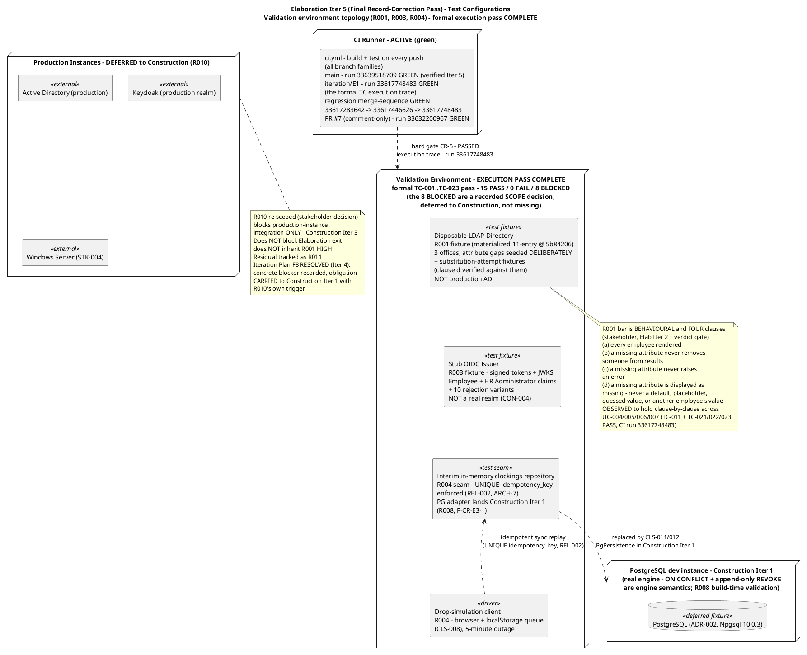
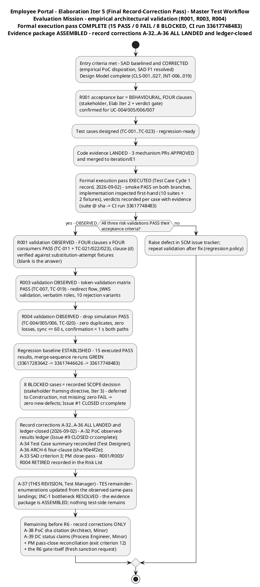
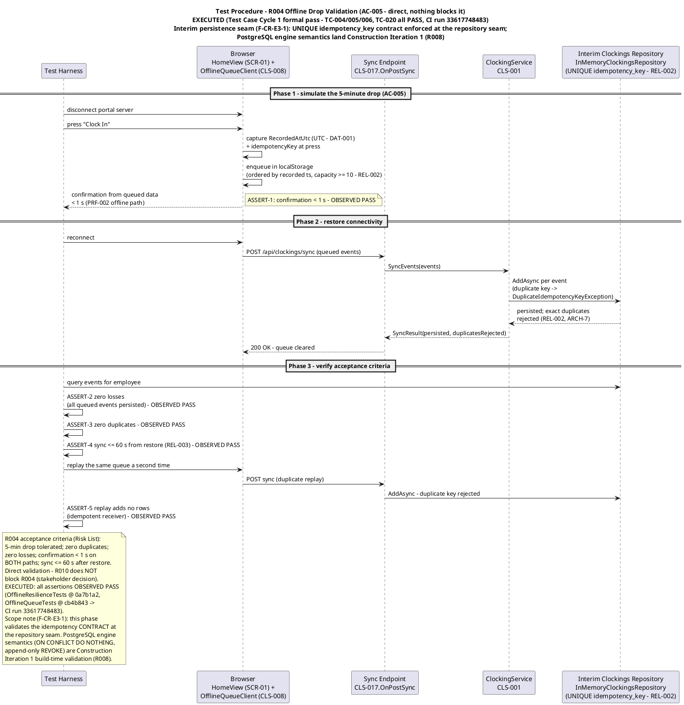
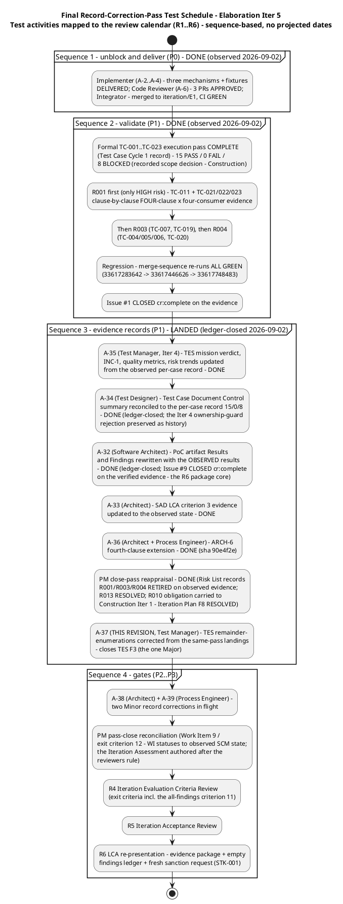
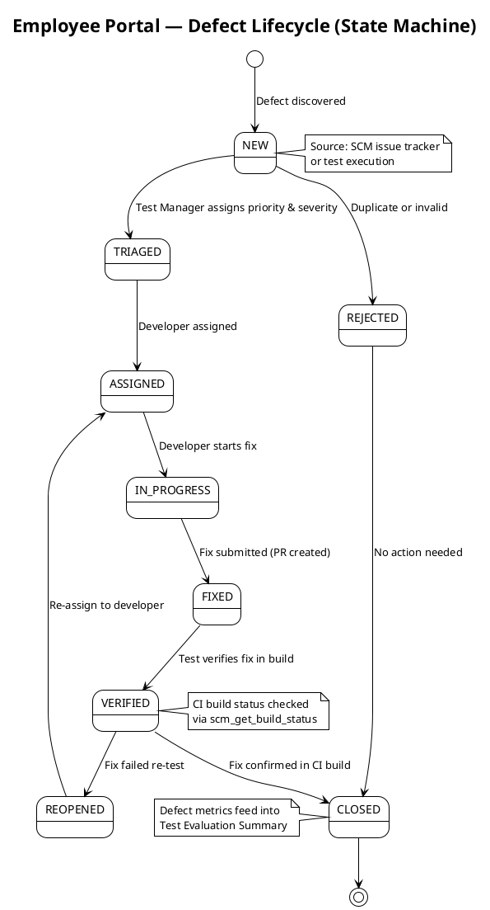

# Test Evaluation Summary

## Document Control
| Field | Value |
|---|---|
| Phase | Elaboration |
| Status | Draft — Elaboration Iter 5 (final record-correction pass) evaluation record; EVOLVED from the Iter 4 record, not recreated. **TES F3 (Major, remediation A-37 — the Work Order's [Moderate] Test Evaluation Summary CR) RESOLVED this revision:** every remainder-enumeration the finding named is updated from the OBSERVED same-pass landings — A-32 (PoC observed-results ledger) LANDED and ledger-closed 2026-09-02, SCM Issue #9 CLOSED cr:complete on that evidence; A-34 (Test Case summary reconciliation) DONE by the Test Designer, ledger-closed; A-36 (ARCH-6 four-clause, sha 90e4f2e) LANDED; A-33 (SAD criterion 3) LANDED; PM close-pass reappraisal LANDED (Risk List records R001/R003/R004 RETIRED on observed evidence; Iteration Plan F8 RESOLVED). The mission verdict ("VALIDATION SUBSTANCE ACHIEVED — OBSERVED") is correct and unchanged. No verdict is claimed beyond the Test Case authority's record |
| Milestone Target | End of Elaboration (LCA) — **NOT yet achieved**; the milestone decision belongs to the R6 gate and the stakeholder (fresh sanction request). The validation substance is OBSERVED and the R6 evidence package is ASSEMBLED (its core — the PoC observed-results ledger — landed and ledger-closed). The record-propagation corrections A-32…A-36 are ALL landed and verified. What remains before R6 is record corrections only: A-38 (PoC sha citation, Minor — Software Architect), A-39 (DC status claims, Minor — Process Engineer), the PM pass-close reconciliation (Work Item 9 / exit criterion 12), and the R6 gate itself. This artifact's own Major (TES F3) is closed by this revision |
| Iteration | 5 (Cycle 1) — final record-correction pass |
| Date | 2026-09-02 |
| Prior Version | Elaboration Iter 4 evaluation record (evolved from Iter 3, evolved from Iter 2, evolved from Iter 1; Inception Test Evaluation Summary Approved at LCO — mission ACHIEVED); EVOLVED, not recreated |
| CI Baseline | **Green:** main run 33639518709 (verified this iteration — started 2026-09-02 14:02:55Z, completed 14:04:14Z, post-PR-7); `iteration/E1` run 33617748483 — **the formal TC execution trace** (mechanism code + dual-coverage suites merged and green). Regression merge-sequence GREEN: 33617283642 → 33617446626 → 33617748483 (per the Test Case record); PR #7 (comment-only) CI GREEN run 33632200967 |
| Defect Baseline | **0 open SCM issues** (verified this iteration, all states): Issue #1 **CLOSED** (cr:complete — closed on the merged-PR + executed-TC evidence); Issue #2 **CLOSED** (cr:complete — CONTRIBUTING.md); Issue #9 **CLOSED** (cr:complete — the PoC results-ledger CR, closed on the verified A-32 observed-results ledger evidence). The Iter 4 record's issue census is extended, not contradicted |
| Elaboration Changes (Iter 5) | (1) **TES F3 (A-37) RESOLVED** — the remainder-enumerations (Milestone Target; master-workflow "Remaining" box; schedule Sequence 3; resources table; INC-1; Conclusions "What the mission cannot yet claim"; recommendations 1–2; traceability rows) updated from the observed same-pass landings: A-32/A-34/A-36/PM close-pass all DONE and ledger-closed 2026-09-02; INC-1's bottleneck is RESOLVED — the evidence package is ASSEMBLED; nothing test-side stands between the team and the R6 re-presentation. (2) **Quality intelligence refreshed from first-hand SCM data** — main CI GREEN run 33639518709 (verified this iteration); Issue #9 CLOSED cr:complete; 0 open issues across all states. (3) **Risk-prioritization trends updated** — R001/R003/R004 RETIRED (Elaboration scope), recorded in the Risk List close-pass reappraisal (landed); R010 obligation carried to Construction Iter 1 with its own trigger (Iteration Plan F8 RESOLVED). (4) Test Plan trigger re-consulted (Development Case oracle, 2026-09-02): still NOT fired — the [OMITTED] declaration stands |
| Elaboration Changes (Iter 4, preserved) | (1) **TES F2 (A-35) RESOLVED** — mission verdict updated from the observed per-case record: the acceptance thresholds are OBSERVED to hold for R001/R003/R004 against the merged mechanisms, CI-traced; the remaining gap is the PoC results-ledger propagation (PoC F2, A-32 — Architect-owned), not test work. (2) **Quality metrics refreshed from real SCM data** — 0 open issues (both closed); 15 of 23 cases executed, 15/15 pass, 0 fail, 8 blocked (recorded scope decision); regression baseline established (15 executed PASS, merge-sequence green). (3) **INC-1 RESOLVED** — the formal execution pass is complete; the #1 testing bottleneck moves to the PoC ledger propagation (A-32). (4) **Risk-prioritization trends updated** — R001/R003/R004 VALIDATION OBSERVED (retirement recording owned by the PM close-pass reappraisal). (5) **Test Case F1 (A-34) — NOT executed by this role; ownership correction recorded honestly.** The finding's remediation text names "Test Designer / Test Manager", but the DC §6 Ownership Matrix permits this role to upsert only the Test Evaluation Summary and the Test Plan — this role's Test Case upsert attempt was **REJECTED by the ownership guard** (no commit, no damage). **A-34 was subsequently executed by the Test Designer and ledger-closed (2026-09-02, verified by the Reviewer lens at Iter 4) — the ownership-guard rejection is preserved here as history.** (6) PR #7 (F-CR-E3-3 state-comment remediation) APPROVED per the Review Record's Iter 4 code-review record (review 5090059324, CI GREEN run 33632200967) — F-CR-E3-3 resolved; the R003 record now says exactly what the code does. (7) Sibling record correction A-33 observed DONE by the Architect (SAD §Quality criterion 3 updated to the observed state — verified by direct read) |
| Elaboration Changes (Iter 3, preserved) | (1) TES F1 (Minor, remediation A-19) RESOLVED — all eight stale TC-001…TC-020 enumerations corrected to the 23-case Test Case authority; mission-scope boundary row corrected. (2) FOURTH behavioural-bar clause incorporated (stakeholder contribution at the Iter 2 verdict gate, binding; A-25…A-31). (3) Observed state refreshed from verified SCM data — the Implementer handoff ARRIVED (3 PRs APPROVED, merged to iteration/E1, CI green run 33617748483). (4) R004 test procedure re-scoped to the interim persistence seam (F-CR-E3-1). (5) INC-1 updated — bottleneck moved from code delivery to the formal execution pass. (6) Risk-driven prioritization trends updated |
| Elaboration Changes (Iter 2, preserved) | R001 acceptance threshold REPLACED per the stakeholder's Elab Iter 2 decision (behavioural bar replaces the dropped >90% figure — closes the Risk List F1 propagation, remediation A-10); Evaluation Mission refined for the convergence cycle; convergence-cycle test schedule added (delivering the Work Order's requested test-plan substance inside this sanctioned artifact); fixture spec requires deliberately-seeded gaps; quality metrics refreshed; INC-2 RESOLVED; trend column added |
| Elaboration Changes (Iter 1, preserved) | Evaluation Mission redefined for Elaboration (empirical architectural validation: R001 > R003 > R004, per binding stakeholder decision); acceptance thresholds per quality attribute defined from quantified Supplementary Specification; test configurations identified; master test workflow, R004 test procedure, and test-configuration topology diagrams added; defect lifecycle preserved; quality baseline verified against real SCM data; mission verdict recorded honestly as NOT YET ACHIEVED |
## Test Scope
### Evaluation Mission (Elaboration Iteration 5 — final record-correction pass)

**Purpose:** empirically validate the three architecturally significant mechanisms — **R001 (HIGH) via a disposable LDAP directory, R003 (SIGNIFICANT) via a stub OIDC issuer, R004 (SIGNIFICANT) directly** — so the LCA milestone is decided on **code evidence, not paper**. Binding stakeholder decisions: "The PoC is produced in Elaboration and validated empirically"; "I will not accept an LCA that validates a HIGH architectural risk on paper only." **Iter 4 status: the empirical validation is EXECUTED and OBSERVED** (Test Case Cycle 1 formal pass — 15 PASS · 0 FAIL · 8 BLOCKED, execution trace CI run 33617748483). **Iter 5 status: the record-propagation corrections (A-32…A-36) are ALL LANDED and ledger-closed (2026-09-02) — the R6 evidence package is ASSEMBLED. This pass (A-37) propagates the same-pass landings into this artifact's remainder-enumerations, so the mission-verdict record no longer contradicts the artifacts it sits beside.**

**Focus:** UC-001 (Clock In and Clock Out), UC-004 (Search Employee Directory), UC-010 (Unpublish News) — the three architecturally significant use cases — **plus the R001 behavioural bar's stakeholder-confirmed extension to UC-005/006/007** (all four AD-reading UCs). Validation order: **R001 > R003 > R004** (R001 is the only HIGH-magnitude risk).

**Acceptable outcome (mission met):** all three validations pass their acceptance criteria **with SCM code evidence** (merged PRs on `iteration/E1`, CI green — OBSERVED), the R001 behavioural bar observed to hold **clause-by-clause across all four clauses and all four AD-reading consumers** (TC-011 + TC-021/022/023 — OBSERVED), zero open Critical defects (OBSERVED — the verified ledger holds zero Critical), regression baseline established (OBSERVED — 15 executed PASS, merge-sequence green), and the findings ledger empty across all lenses and severities (**NOT YET — but narrowed to its final form: this artifact's own Major (TES F3) is closed by this revision; what remains is A-38 (PoC sha citation, Minor — Software Architect), A-39 (DC status claims, Minor — Process Engineer), the PM pass-close reconciliation, and the R6 gate itself**) → the LCA evidence package is assemblable — **it IS assembled** — and LCA is re-presented with a fresh sanction request. **Exit criterion = Evaluation Mission met, NOT 100% pass rate or perfect coverage** — the 8 BLOCKED cases are a recorded SCOPE decision, not mission failures.

**Mission scope boundaries:**

| In Scope | Out of Scope |
|---|---|
| Empirical validation of R001/R003/R004 mechanisms (evolutionary code in `src/` — merged to `iteration/E1`) — **EXECUTED: 15 PASS observed** | Full functional testing of all 10 UCs (Construction) |
| R001 behavioural bar — **FOUR clauses** — across all four AD-reading UCs (UC-004/005/006/007) — **OBSERVED PASS clause-by-clause** (TC-011 + TC-021/022/023) | Test procedure execution against production AD / Keycloak (Construction Iter 3 — R010/R011) |
| Test case design + execution of **TC-001…TC-023** — **DESIGNED and EXECUTED** (15 PASS · 0 FAIL · 8 BLOCKED — the 8 BLOCKED are Construction-scope mechanisms, a recorded SCOPE decision: deferred, not missing) | Performance load testing (NFR-001 full-scale — Construction) |
| Regression of prior mechanism results after every merged PR — **BASELINE ESTABLISHED** (15 executed PASS; merge-sequence green 33617283642 → 33617446626 → 33617748483) | Usability / adoption testing (AC-004, BG-003 — Transition pilot) |
| Defect tracking via SCM issue tracker (authoritative source) — **0 open** (Issues #1, #2 and #9 all CLOSED cr:complete) | UI visual-fidelity testing against CON-011 (Construction) |
| Quality signals: CI build status, SCM defect census — **both green/clean, verified this iteration** | **Real-AD data-quality measurement (Construction, R011 residual — excluded from the LCA evidence package per the stakeholder's Elab Iter 2 decision)** |

**Test configurations (updated for the final record-correction pass — the fixtures are EXECUTED assets, retained for Construction):**

**Resource justification (every resource justified against the mission):** the CI runner is ACTIVE and green on BOTH branches (main run 33639518709 verified this iteration; `iteration/E1` run 33617748483 — the execution trace). The four validation fixtures are the minimum set that retired the three risks without waiting on STK-004 (R010): the disposable LDAP directory with deliberately-seeded attribute gaps and substitution-attempt fixtures answered R001's behavioural question empirically (clause (d) verified against the exact temptations a lazy implementation would take); the stub issuer proved OIDC consumption without a real realm (CON-004); the drop-simulation client exercised ADR-003 end-to-end; the interim in-memory repository enforced the UNIQUE idempotency_key contract at the seam this phase, with the PostgreSQL dev instance validating the real declared engine semantics in Construction Iteration 1 (R008, F-CR-E3-1). No fifth environment is justified — production instances are Construction integration scope, not Elaboration. **All four fixtures are now EXECUTED assets, retained as reusable Construction test fixtures (R011 mitigation).**

### Acceptance Thresholds per Quality Attribute (architecture-milestone go/no-go)

Every threshold is quantified upstream (Supplementary Specification, Risk List, SAD, stakeholder decisions) — none is invented here. **The Validated By column records the OBSERVED status from the Test Case Cycle 1 formal execution pass (execution trace CI run 33617748483) — no verdict beyond that record.**

| Quality Attribute | Threshold (go/no-go) | Source | Validated By (OBSERVED status) |
|---|---|---|---|
| **Functionality — directory data shape (R001 behavioural bar, FOUR clauses)** | (1) Every employee is rendered whether or not their attributes are complete; (2) a missing attribute never removes someone from search results; (3) a missing attribute never raises an error; (4) a missing attribute is displayed as missing — it is never replaced by a default, a placeholder, a guessed value, or another employee's value — observed across all four AD-reading UCs: UC-004 person card, UC-005 event row, UC-006 CSV row, UC-007 employee locatable and selectable | R001 behavioural bar (stakeholder decision, Elab Iter 2 — replaces the dropped >90% figure; FOURTH clause added at the Iter 2 verdict gate, binding); UC-004 AF-2, UC-005/006/007 AF-3 (stakeholder-confirmed) | **OBSERVED PASS — clause-by-clause, four consumers** (TC-011 + TC-021/022/023; clause (d) verified against the substitution-attempt fixtures: NOT "General", NOT "Central", NOT "N/A", no cross-entry inheritance) |
| Reliability — offline tolerance | 5-minute drop tolerated; queue ≥ 10 events/employee browser; queued events never lost; exact duplicates rejected, never duplicated; events ordered by recorded timestamp | REL-002, AC-005, ADR-003 | **OBSERVED PASS** (TC-004/005/006, TC-020 — zero duplicates incl. double replay + mixed online/queued paths, zero losses, capacity ≥ 10) |
| Reliability — sync completion | All queued events persisted ≤ 60 s after connectivity restored | REL-003 | **OBSERVED PASS** (TC-005; full-capacity sync ≤ 60 s) |
| Performance — clocking response | Confirmation < 1 s from button press on BOTH the online and offline-queued paths | PRF-002, NFR-002 | **OBSERVED PASS** (TC-001 online path; TC-004 offline path) |
| Security — authentication | OIDC token validated via the issuer's JWKS; Employee + HR Administrator roles extracted from claims; redirect flow completes; expired/invalid tokens rejected at the request boundary | SEC-001, SEC-002, SEC-003, R003 | **OBSERVED PASS** (TC-007, TC-019 — 10 rejection variants at the request boundary; roles extracted verbatim). The HR-only endpoint-denial attacks (TC-017/TC-018 — `/hr/*` and `/history` request surfaces) are **deferred to Construction — recorded SCOPE decision** (the R003 boundary foundation they lean on IS validated via TC-019) |
| Data integrity — timestamp capture | Timestamp fixed at button press, stored UTC; queued events persist recorded timestamp unchanged on sync | DAT-001, ADR-003 | **OBSERVED PASS** (TC-004/TC-005; press-time capture never rewritten) |
| Data integrity — display convention | Displayed clocking times render in America/Havana local time (IANA, DST-aware); raw UTC or server time never shown | USA-008, stakeholder decision | **OBSERVED PASS** (TC-008 — summer −04:00 vs winter −05:00; local calendar month bounds; a hardcoded UTC-5 fails here) |
| Auditability — append-only | Audit entries append-only; no update/delete path exists; state change and audit entry commit in one transaction | DAT-002, NFR-005 | **DEFERRED to Construction — recorded SCOPE decision** (TC-013…TC-016 BLOCKED: the news/audit mechanism is Construction scope; PG engine REVOKE semantics = Construction Iteration 1, R008). Design complete (CLS-005, DAT-002); not an Elaboration exit-criterion blocker |
| Build integrity | CI green on every merged mechanism PR (hard gate CR-5) | Review Record CR-5 | **OBSERVED PASS** — CR-5 held on all three mechanism PRs; `iteration/E1` CI green run 33617748483; regression merge-sequence green; main green run 33639518709 (verified this iteration) |

**Note on the R001 threshold (preserved — extends the Iter 2/Iter 3 note):** the Iter 1 record carried ">90% of sampled users per office with all six attributes populated," sourced to the Risk List. The stakeholder decided (Elab Iter 2) the figure is invented and is **dropped**: measured against a disposable directory the team seeds itself, a percentage measures our own test data — it cannot fail, so it proves nothing. The bar is **behavioural, not statistical**: the four clauses above, with gaps seeded **deliberately** in the disposable directory so each clause can actually fail. **At the Iter 2 verdict gate the stakeholder added the FOURTH clause, verbatim: "a missing attribute is displayed as missing. It is never replaced by a default, a placeholder, a guessed value, or another employee's value"** — with the rationale, verbatim: "Blank is an answer. 'General', or the first office in the list, is a fabrication — and on the CSV that reaches payroll a fabricated department is worse than an empty cell. An empty cell gets questioned. A plausible wrong one does not." The first three clauses stop data from being LOST; the fourth stops it from being INVENTED. The statistical measurement of the real AD's data quality is a Construction activity (R011 residual, STK-004-dependent) and is **excluded from the LCA evidence package**. **The four-clause bar is OBSERVED to hold across all four consumers** (Test Case Cycle 1 clause-by-clause evidence table).
## Test Summary
### Master Test Workflow (Elaboration Iteration 5 — final record-correction pass)

### Test Types (Elaboration Iteration 5 — execution status recorded)

| Test Type | Target | Method | Owner | Execution status (OBSERVED) |
|---|---|---|---|---|
| Mechanism validation (functional) | R001 LDAP attribute mapping + graceful degradation (COMP-007/CLS-009) | Query the disposable directory over LDAP v3 with deliberately-seeded gaps + substitution-attempt fixtures; assert the behavioural bar's four clauses across the four AD-reading renderings — TC-011 + TC-021/022/023 | Implementer built; Test Designer designed | **EXECUTED — PASS** (clause-by-clause, four consumers; CI run 33617748483) |
| Auth validation (security) | R003 OIDC consumption (COMP-006/CLS-010) | Stub issuer emits signed tokens + JWKS with Employee + HR Administrator claims; verify validation via JWKS, role extraction, redirect flow, rejection of expired/invalid tokens — TC-007, TC-019 | Implementer built; Test Designer designed | **EXECUTED — PASS** (10 rejection variants at the request boundary) |
| Reliability validation | R004 offline queue + idempotent sync (COMP-009/CLS-008, ADR-003) | 5-minute drop simulation; queue, reconnect, replay; zero duplicates/losses; sync ≤ 60 s; confirmation < 1 s both paths — TC-004/005/006, TC-020 — at the interim repository seam (UNIQUE idempotency_key contract); PG engine semantics Construction Iter 1 (R008) | Implementer built; Test Designer designed | **EXECUTED — PASS** (double replay + mixed online/queued paths) |
| Dual-coverage unit testing | Every mechanism PR | Black-box contract + white-box paths (branches, loops, error handlers) — Review Record CR-2 | Implementer | **EXECUTED — green in CI** (run 33617748483; CR-2 verified by the Code Reviewer on all three PRs) |
| Regression | All previously merged mechanisms | Re-run prior mechanism results after EVERY merged PR; CI gates every push | Test Designer / CI | **BASELINE ESTABLISHED** — 15 executed PASS; merge-sequence green 33617283642 → 33617446626 → 33617748483; PR #7 (comment-only) CI green run 33632200967 per the Review Record |
| Build-time validation | R008 PostgreSQL + .NET 10 | Basic CRUD + migration test against the real engine — Construction Iteration 1 (the interim in-memory seam carried Elaboration; F-CR-E3-1) | Implementer | **DEFERRED — recorded SCOPE decision** (Construction Iteration 1) |

### Test Procedure — R004 Offline Drop Validation (highest-procedure risk; AC-005 — EXECUTED)

### Schedule and Resources (final record-correction pass — aligned to the Iteration Plan and the R1–R6 review calendar)

**Schedule basis:** sequence-based, tied to workflow-activity completion — never projected calendar dates (deadlines are iteration-relative per the Review Record; human-gate queues are a Risk List matter, not a plan forecast).

| Activity | Owner | Plan Reference | Sequence |
|---|---|---|---|
| Test case design: UC-001, UC-004, UC-010 + PoC acceptance criteria + the four-consumer R001 bar (TC-011, TC-021/022/023) | Test Designer (~120K tokens) | WI-10 | **DONE — designed (Iter 1–2), extended (A-28, Iter 3), executed (Iter 3 formal pass)** |
| R001 mechanism + validation (four-clause behavioural bar, deliberately-seeded gaps + substitution-attempt fixtures) | Implementer (~100K tokens) | WI-7 / Issue #1 / A-2 | **DONE — delivered, merged, CI green; validation OBSERVED PASS** |
| R003 mechanism + validation | Implementer (~80K tokens) | WI-8 / Issue #1 / A-3 | **DONE — delivered, merged, CI green; validation OBSERVED PASS** |
| R004 mechanism + validation | Implementer (~70K tokens) | WI-9 / Issue #1 / A-4 | **DONE — delivered, merged, CI green; validation OBSERVED PASS** |
| PR gate per mechanism | Code Reviewer | Review Record A-6 / R1 | **DONE — 3 APPROVED (reviews 5088169328/5088169517/5088169685); PR #7 (Iter 4) APPROVED review 5090059324** |
| TC-001…TC-023 execution + regression re-run | Test Designer + CI | WI-10 / R2 | **DONE — 15 PASS · 0 FAIL · 8 BLOCKED (recorded scope decision); regression baseline established** |
| Empirical results → PoC artifact; mission verdict update | Software Architect (A-8/A-16/A-32) / Test Manager (A-35, A-37) | R3 | **A-35 DONE (Iter 4); A-32 DONE (ledger-closed 2026-09-02 — Issue #9 CLOSED cr:complete on the verified evidence); A-37 DONE (this revision — closes TES F3)** |

**Cost-of-testing constraint honored:** the Test discipline's Elaboration effort was concentrated on the three risk-retiring mechanisms (Test Designer WI-10) rather than spread thin — within the 30–50%-of-project-cost reality when Construction's larger test share is included. Token actuals are recorded by the Project Manager in the Iteration Assessment; the iteration budget box was re-sized from measured actuals (Iteration Plan F6 resolved Iter 3).

**Two clocks (never summed):** agent work is measured in tokens (actuals recorded by the Project Manager in the Iteration Assessment); human gates are a Risk List matter, not a plan forecast (per Iteration Plan F5 remediation A-13 — queue forecasts removed from the plan; the 14-day suspension ceiling bounds the risk). No person-week figures are produced by this system.

### Regression Policy (mandatory per iteration — baseline ESTABLISHED)

Every merged mechanism PR triggers a re-run of all previously validated mechanism results. With three mechanisms merged in sequence (R001 → R003 → R004), any subsequent validation re-runs the earlier ones. An iteration without regression accumulates undiscovered defect debt — this policy is not waivable under schedule pressure. CI gates every push on all branch families, so a red build blocks the PR before review (CR-5 hard gate). **Current regression baseline: 15 executed PASS results (Test Case Cycle 1 formal pass), with the merge-sequence itself exercising the policy — PR #3 merged → CI GREEN 33617283642; PR #5 merged → CI GREEN 33617446626 (R004 suites re-running R001's); PR #4 merged → CI GREEN 33617748483 (R003 suites re-running both) — every merged PR re-ran ALL prior suites, all GREEN. PR #7 (Iter 4, comment-only) continued the line: CI GREEN run 33632200967 per the Review Record. From this point, ANY subsequent merged PR re-runs all 15.**

### Quality Metrics (measured from real SCM data — refreshed this iteration)

| Metric | Definition | Current Value (real data, verified 2026-09-02) |
|---|---|---|
| CI build status | Latest run on main | **Green** — run 33639518709 (started 2026-09-02 14:02:55Z, completed 14:04:14Z — verified this iteration, post-PR-7) |
| CI on `iteration/E1` | Latest run on the integration branch | **Green** — run 33617748483 — **the formal TC execution trace** (mechanism code + dual-coverage suites merged and building) |
| Open defects | SCM issue tracker, all states | **0** — Issue #1 **CLOSED** (cr:complete — closed on the merged-PR + executed-TC evidence); Issue #2 **CLOSED** (cr:complete); Issue #9 **CLOSED** (cr:complete — the PoC results-ledger CR, closed on the verified A-32 observed-results ledger evidence) |
| Risk-retirement evidence | Merged PRs per mechanism with passing validation | **3 of 3 mechanisms merged AND formally executed** — R001 four-clause × four-consumer PASS (TC-011 + TC-021/022/023); R003 matrix PASS (TC-007, TC-019); R004 simulation PASS (TC-004/005/006, TC-020) — execution trace CI run 33617748483; **retirement RECORDED in the Risk List close-pass reappraisal (R001/R003/R004 RETIRED, Elaboration scope)** |
| Tests executed / pass rate | Actual validation runs | **15 of 23 executed — 15/15 PASS, 0 FAIL, 8 BLOCKED** (TC-003, TC-010 — UI mechanisms; TC-017, TC-018 — endpoint/request surfaces; TC-013…TC-016 — news/audit — all Construction scope; **a recorded SCOPE decision — deferred to Construction, not missing**, per the stakeholder's Iter 3 framing directive) |
| Defect density | Defects per merged mechanism PR | 3 Minors recorded by the Code Reviewer across the 3 mechanism PRs (F-CR-E3-1/2/3 per the Review Record); **F-CR-E3-3 RESOLVED Iter 4** (PR #7 APPROVED); zero Critical, zero Major; **zero test-execution defects** (zero FAIL verdicts in the formal pass) |
| Escaped defects | Defects found in Construction/Transition that Elaboration validation missed | Tracked from Construction Iter 1 onward — the key quality indicator; every defect found later in a mechanism validated here is a direct measure of this phase's validation quality |

### Risk-Driven Test Prioritization (evolved — statuses and trends updated from the observed execution record and the landed close-pass reappraisal)

| Risk | Magnitude | Affected UCs / ACs | Test Activity | Priority | Status (Elab Iter 5) | Trend (since last review) |
|---|---|---|---|---|---|---|
| R001 — AD LDAP attribute consistency | HIGH | UC-004, UC-005, UC-006, UC-007, AC-003 | Empirical validation against disposable LDAP directory with deliberately-seeded gaps + substitution-attempt fixtures; four-clause behavioural bar | 1 | **RETIRED (Elaboration scope) — four clauses × four consumers OBSERVED PASS** (TC-011 + TC-021/022/023, clause (d) against the substitution-attempt fixtures); retirement RECORDED in the Risk List close-pass reappraisal; production-AD residual → R011 (Construction) | **RETIRED — the HIGH risk's line TERMINATES: OPEN → MITIGATING (unexecuted) → VALIDATION OBSERVED → RETIRED (recorded)** |
| R003 — OIDC/Keycloak integration | SIGNIFICANT | All UCs (auth) | Empirical validation against stub OIDC issuer (no real realm, CON-004) | 2 | **RETIRED (Elaboration scope) — token-validation matrix OBSERVED PASS** (TC-007, TC-019; 10 rejection variants); endpoint-level denial attacks (TC-017/TC-018) deferred — recorded scope decision; claim-shape residual → R011 (Construction) | **RETIRED** |
| R004 — Offline fault tolerance | SIGNIFICANT | UC-001, AC-005, NFR-004 | Direct 5-minute drop simulation; queue + sync + idempotency (interim repository seam; PG engine Construction Iter 1, R008) | 3 | **RETIRED (Elaboration scope) — drop simulation OBSERVED PASS** (TC-004/005/006, TC-020); formal AC-005 re-verification at Construction Iter 1 with the PG engine | **RETIRED** |
| R010 — Infra team deliverables | SIGNIFICANT (re-scoped) | Production-instance integration | Deferred to Construction Iter 3 — does NOT block Elaboration exit | 4 | OPEN — PM owns STK-004 engagement; **Iteration Plan F8 RESOLVED (Iter 4): the concrete blocker is recorded (no direct STK-004 channel in this runtime; the questionnaire reaches STK-001 only) and the obligation is CARRIED to Construction Iter 1 with R010's own trigger** | NARROWED — blocks production instances only; obligation relocated with trigger armed |
| R011 — Validation-environment fidelity | MODERATE | R001/R003 residuals | Record deltas between fixtures and production instances; fixtures kept as reusable Construction test fixtures | 5 | OPEN — surfaces at Construction integration; the fixtures are EXECUTED assets, retained | FLAT |
| R002 — Clocking adoption | SIGNIFICANT | UC-001, AC-004, BG-003 | Usability test in Transition (pilot); not a technical test | 6 | OPEN — Transition | FLAT |
| R005 — LDAP query performance | MODERATE | UC-004, NFR-001, AC-003 | Measured during R001 validation; 5 s hard timeout (PRF-003); cache tactic in reserve | 7 | **Hard-timeout mechanism OBSERVED** (TC-012 PASS — the timeout fires and translates to "Directory temporarily unavailable"; no local fallback, CON-006); full-scale percentile measurement = Construction | FLAT (mechanism observed) |
| R006 — Audit trail completeness | MODERATE | UC-007…UC-010, NFR-005 | UC-010 test cases designed (TC-013…TC-016); Construction integration test on all four flows (PG engine REVOKE — R008) | 8 | Design complete (CLS-005, DAT-002); **execution deferred — recorded scope decision** (news/audit mechanism is Construction scope) | FLAT |
| R007 — UI design fidelity | MODERATE | All user-facing UCs | Visual regression against CON-011 in Construction | 9 | OPEN — Construction | FLAT |
| R008 — PostgreSQL + .NET 10 compat | MODERATE | All UCs (persistence) | Build-time CRUD + migration validation (Implementer) — Construction Iteration 1 (interim in-memory seam carried Elaboration, F-CR-E3-1) | 10 | OPEN — Construction Iter 1 build-time | FLAT |
| R009 — Scope creep | MODERATE | All declared scope | Process control (CCB gate); not a test activity | 11 | OPEN — CCB enforced | FLAT |

### Use-Case to Acceptance Criteria Coverage Map (preserved from Inception — unchanged, all 5 ACs mapped)

| UC | Source FR | Acceptance Criteria Covered | Test Type |
|---|---|---|---|
| UC-001 | FR-004 | AC-001, AC-004, AC-005 | Functional + usability + reliability |
| UC-002 | FR-005 | — | Functional |
| UC-003 | FR-007 | — | Functional |
| UC-004 | FR-010 | AC-003 | Functional + performance |
| UC-005 | FR-001 | — | Functional |
| UC-006 | FR-002 | — | Functional + format validation (CSV) |
| UC-007 | FR-003 | — | Functional + audit verification |
| UC-008 | FR-006 | AC-002 | Functional + usability + audit |
| UC-009 | FR-008 | — | Functional + audit verification |
| UC-010 | FR-009 | — | Functional + audit verification |

**Coverage assessment (unchanged):** all 5 ACs mapped to at least one UC. AC-001/AC-004/AC-005 → UC-001 (highest-risk convergence: OIDC + offline + persistence); AC-003 → UC-004 (only HIGH risk, R001); AC-002 → UC-008. **AC-005's technical substance (5-minute drop, sync, idempotency) is OBSERVED PASS at the mechanism level (TC-004/005/006, TC-020); AC-001/AC-002/AC-003/AC-004 end-to-end verification is Construction/Transition scope per the Evaluation Mission boundary.**
## Defects and Incidents
### Defect Lifecycle (preserved — governs all defect management)

The following state machine governs defect management throughout the project lifecycle. Defects are tracked in the SCM issue tracker (GitHub Issues), which is the authoritative source for defect data.

### Current Defect Status (real SCM data — verified this iteration, 2026-09-02)

| Metric | Count | Source |
|---|---|---|
| Total defects (open) | **0** | `scm_list_issues` (all states) |
| Issue #1 — R001/R003/R004 mechanism code absent (blocked the formal TC execution record; exit criteria 1–3) | **CLOSED — cr:complete** — closed on the merged-PR + executed-TC evidence (3 PRs APPROVED and merged; formal pass 15 PASS · 0 FAIL · 8 BLOCKED, execution trace CI run 33617748483) | `scm_list_issues` |
| Issue #2 — CONTRIBUTING.md absent (CR-1 guidelines baseline) | **CLOSED — cr:complete** (CONTRIBUTING.md committed, sha `6662813…` per the Review Record) | `scm_list_issues` |
| Issue #9 — PoC results ledger stale vs observed validation (PoC F2 / action A-32 — the Work Order's [Moderate] Architectural Proof-of-Concept CR) | **CLOSED — cr:complete** — closed on the verified A-32 observed-results ledger evidence (the R6 evidence package's core landed and ledger-closed 2026-09-02) | `scm_list_issues` |
| Closed defects | 3 | `scm_list_issues` (all states) |

**Zero open defects.** All three SCM issues are closed cr:complete — the defect lifecycle executed end-to-end for each (NEW → TRIAGED → ASSIGNED → IN_PROGRESS → FIXED → VERIFIED → CLOSED). The formal execution pass produced zero FAIL verdicts, so no new defects were raised; defect tracking against executed cases reactivates with Construction execution of the 8 deferred cases.

### Incidents

**INC-1 (Elaboration Iter 1 — RESOLVED at every stage; the bottleneck is CLOSED):** the validation bottleneck is fully resolved, end to end. The code-delivery half was resolved at Iter 3 (3 mechanisms handed off, 3 PRs APPROVED, merged to `iteration/E1`, CI green). The execution half was resolved at Iter 4 (the formal TC-001…TC-023 execution pass COMPLETE — 15 PASS · 0 FAIL · 8 BLOCKED, execution trace CI run 33617748483; R001 four clauses × four consumers clause-by-clause PASS; R003 matrix PASS; R004 simulation PASS; regression baseline established; Issue #1 CLOSED cr:complete). The record-propagation half — the bottleneck the Iter 4 record named as #1 — is now ALSO resolved: the PoC observed-results ledger LANDED and ledger-closed (A-32, 2026-09-02; Issue #9 CLOSED cr:complete on that evidence), the Test Case summary reconciliation LANDED (A-34, Test Designer), ARCH-6 carries the four-clause contract (A-36, sha 90e4f2e), and the PM close-pass reappraisal LANDED (R001/R003/R004 RETIRED recorded in the Risk List). **Nothing test-side stands between the team and the assemblable LCA evidence package — the package IS assembled.** The remaining pre-R6 items (A-38 PoC sha citation, A-39 DC status claims, the PM pass-close reconciliation) are record corrections owned by the Software Architect, the Process Engineer, and the Project Manager — none is test work.

**INC-2 (upstream inconsistency — RESOLVED, preserved):** the SAD §Quality PoC Plan carried the superseded "analysis-only + designed mechanism" disposition, contradicting the binding stakeholder decision. The Software Architect corrected the SAD (SAD F1 resolved, Iter 2); the correction is verified in the current SAD §Quality (re-read this iteration — the empirical disposition, the four-clause bar, and the A-33 criterion-3 update are all present). The Test discipline's alignment chain (stakeholder decision → Risk List → Iteration Plan → SAD → PoC artifact → this artifact) is consistent end-to-end. No open inconsistency remains.
## Conclusions
### Evaluation Mission Verdict (Elaboration Iteration 5, Cycle 1 — final record-correction pass)

**Mission status: VALIDATION SUBSTANCE ACHIEVED — OBSERVED. The acceptance thresholds are OBSERVED to hold for R001/R003/R004 against the merged mechanisms, CI-traced.**

The Evaluation Mission's central objective — empirically validate the three architecturally significant mechanisms so the LCA milestone is decided on code evidence, not paper — is **met on executed, observed evidence** (Test Case Cycle 1 formal pass, execution trace CI run 33617748483):

- **R001 (HIGH, exposure=9): OBSERVED PASS — RETIRED (Elaboration scope)** — the four-clause behavioural bar holds clause-by-clause across all four AD-reading consumers (TC-011 + TC-021/022/023): every employee rendered; no removal for a missing attribute; no error; and clause (d) verified against the substitution-attempt fixtures — NOT "General", NOT "Central", NOT "N/A", no cross-entry inheritance. Blank is the answer. Retirement RECORDED in the Risk List close-pass reappraisal.
- **R003 (SIGNIFICANT): OBSERVED PASS — RETIRED (Elaboration scope)** — the token-validation matrix (TC-007, TC-019): redirect flow completes; signed tokens validated via the issuer's JWKS; roles extracted verbatim from claims; 10 rejection variants rejected at the request boundary.
- **R004 (SIGNIFICANT): OBSERVED PASS — RETIRED (Elaboration scope)** — the 5-minute drop simulation (TC-004/005/006, TC-020): zero duplicates (including double replay and mixed online/queued paths), zero losses, sync ≤ 60 s, confirmation < 1 s on both paths, capacity ≥ 10.
- **Regression baseline ESTABLISHED** — 15 executed PASS results; the merge-sequence itself exercised the mandatory policy (33617283642 → 33617446626 → 33617748483, all GREEN).
- **Zero FAIL verdicts → zero new defects; zero open Critical findings (verified ledger); 0 open SCM issues** (Issues #1, #2 and #9 all CLOSED cr:complete).

**The 8 BLOCKED cases are a recorded SCOPE decision, not an open gap** (stakeholder framing directive, Iter 3, binding): TC-003, TC-010 (UI mechanisms), TC-017, TC-018 (endpoint/request surfaces), and TC-013…TC-016 (news/audit) are Construction-scope mechanisms — production AD and Keycloak integration belongs to Construction (R010/R011). They are **deferred, not missing**, and none is an Elaboration exit-criterion blocker (exit criteria 1–3 cover R001/R003/R004 only). The verdict distribution the LCA evidence package carries: **15 executed PASS + 8 deferred-by-scope-decision, zero FAIL.**

**What the mission cannot yet claim — the current remainder, and it is not test work:** the R6 re-presentation itself. The record-propagation corrections A-32…A-36 are ALL landed and ledger-closed (2026-09-02): the PoC observed-results ledger (A-32 — Issue #9 CLOSED cr:complete on the verified evidence), the Test Case summary reconciliation (A-34, Test Designer), the SAD criterion-3 update (A-33), ARCH-6 four-clause (A-36, sha 90e4f2e), and the PM close-pass reappraisal (R001/R003/R004 RETIRED recorded; Iteration Plan F8 RESOLVED). This revision closes this artifact's own Major (TES F3, A-37) by propagating those landings into every remainder-enumeration. What remains before R6 is: **A-38** (PoC sha citation, Minor — Software Architect), **A-39** (DC status claims, Minor — Process Engineer), the **PM pass-close reconciliation** (Work Item 9 / exit criterion 12 — work-item statuses to observed SCM state; the Iteration Assessment is authored after the reviewers rule), and the **R6 gate itself** (empty findings ledger + evidence package + fresh sanction request to STK-001). Every one of these is a record correction or a gate — none requires code, design, or new validation. **No verdict beyond the Test Case authority's record is claimed here; the milestone decision itself belongs to the R6 gate and the stakeholder's fresh sanction request.**

**Evidence summary (all real, none fabricated):** CI green on main (run 33639518709, verified this iteration) and on `iteration/E1` (run 33617748483 — the execution trace); 0 open SCM issues (Issues #1, #2, #9 all closed cr:complete); 15 of 23 cases executed, 15/15 PASS, 0 FAIL, 8 BLOCKED (recorded scope decision); per-case evidence suite @ sha → CI run (Test Case Cycle 1 record); regression merge-sequence green; PR #7 (F-CR-E3-3 remediation) APPROVED per the Review Record's Iter 4 code-review record. The Inception Evaluation Mission remains ACHIEVED (historical record — five objectives met, preserved in SCM history).

### Recommendations

1. **~~A-32 is the one remaining Major and the evidence package's core~~ — RETIRED (landed and ledger-closed 2026-09-02):** the PoC artifact § Results and Findings carries the OBSERVED results (R001 clause-by-clause FOUR-clause × four-consumer evidence, R003 matrix, R004 simulation, verdict distribution 15/0/8 with the 8 BLOCKED stated as a recorded SCOPE decision, regression baseline, MERGED delivery rows, Issue #1 closure) — verified by the Reviewer lens at Iter 4; SCM Issue #9 CLOSED cr:complete on that evidence. The R6 evidence package's core is ASSEMBLED.
2. **~~A-34 belongs to the Test Designer~~ — RETIRED (executed and ledger-closed 2026-09-02):** the Test Case Document Control verdict summary is reconciled to the authoritative per-case record (15 PASS · 0 FAIL · 8 BLOCKED, TC-017/TC-018 named in the BLOCKED set, stated as a recorded SCOPE decision) — executed by the Test Designer; the Iter 4 ownership-guard rejection of this role's co-execution attempt is preserved as history in Document Control.
3. **Carry the 8 deferred cases into the Construction Iteration Plan with their owners** — TC-003/TC-010 (UI mechanisms), TC-017/TC-018 (endpoint/request surfaces), TC-013…TC-016 (news/audit + PG engine REVOKE, R008) — so the recorded scope decision has a scheduled landing, not just a deferral record.
4. **Hold the regression line into Construction** — any subsequent merged PR re-runs all 15 executed PASS results; the baseline is established and CI-enforced (PR #7 already continued the line green).
5. **Keep the disposable directory and stub issuer as reusable Construction fixtures** (R011 mitigation) — they are executed, proven assets and become the integration-test baseline until production instances arrive (R010).
6. **Escaped-defect tracking starts at Construction Iter 1** — every defect found later in a mechanism validated here is a direct measure of this phase's validation quality; the review-first result (all code defects caught at the PR gate, zero test failures) is the baseline to beat.
7. **Track the interim persistence seam explicitly** (F-CR-E3-1): R004 validation this phase covered the idempotency CONTRACT at the repository seam; the PostgreSQL engine semantics (ON CONFLICT DO NOTHING, append-only REVOKE) are Construction Iteration 1 build-time validation (R008) — TC-006/TC-016 engine-level assertions execute then.
8. **Close the two remaining Minor record corrections before R6** (not this role's work, recorded for the R6 entry gate): A-38 — the PoC § Traceability sha citation (c86ebf7 → the verified current file sha 90e4f2e, or cite c86ebf7 explicitly as the introducing commit sha), Software Architect; A-39 — the DC's three stale A-32/PM-close-pass status claims, Process Engineer. Both are one-pass corrections; the R6 entry gate requires the ledger empty across all lenses and severities.

### Test Plan Status

**[OMITTED: Test Plan — trigger not fired per Development Case §5.2 oracle; per-iteration testing scope lives in the Iteration Plan]**

The Development Case oracle (`get_optional_artifact_triggers`, re-consulted this iteration, 2026-09-02) reports the Test Plan trigger **not fired**: the project requires no formal delivery, regulatory audit, or contractual test reporting. **Recorded conflict (standing):** the Work Order's additional instruction ("update test plan with detailed schedule, resources, test types, and acceptance criteria for the architecture milestone") names an artifact the Development Case does not sanction this round. The Development Case is the law that governs artifact production; the requested substance is delivered **here, inside the sanctioned Test Evaluation Summary** — the final-record-correction-pass test schedule (§ Test Summary), the resources table, the test-types table with execution status, and the architecture-milestone acceptance thresholds with OBSERVED validation status (§ Test Scope), all refreshed this iteration to the executed state. If formal test reporting is later required, a Change Request through the CCB can fire the trigger — the Development Case re-evaluates triggers every iteration.
## Traceability
| Element | Traces From | Link Type | Traces To |
|---|---|---|---|
| Evaluation Mission (Elab Iter 5) | Stakeholder decisions: "The PoC is produced in Elaboration and validated empirically" (Elab Iter 1); R001 behavioural bar + four-UC confirmation (Elab Iter 2); FOURTH clause at the Iter 2 verdict gate (binding; A-25…A-31); "Fix all the issues and close all findings" (escalation resolution); "Close all findings and issues opened" (Iter 4 verdict gate — reinforces the standing all-findings directive); BLOCKED-cases framing directive (Iter 3, binding); Risk List R001/R003/R004 re-scope + close-pass reappraisal (RETIRED, recorded); Iteration Plan objectives, exit criteria 1–3 + all-findings criterion | Refines | R001, R003, R004 retirement evidence (OBSERVED and RECORDED); LCA milestone gate (R6 re-presentation) |
| Mission verdict (Iter 4, A-35 — preserved; Iter 5, A-37 — remainder-enumerations corrected) | Test Case Cycle 1 formal execution pass (15 PASS · 0 FAIL · 8 BLOCKED, execution trace CI run 33617748483; R001 clause-by-clause table; R003 matrix; R004 simulation; regression merge-sequence 33617283642 → 33617446626 → 33617748483); Review Record TES F2 (Minor — remediation A-35, executed Iter 4); Review Record TES F3 (Major — remediation A-37, executed this revision); stakeholder framing directive (Iter 3) | Reviews | This artifact (mission verdict, INC-1, metrics, trends, remainder-enumerations — all updated from the observed record and the same-pass landings); PoC observed-results ledger (A-32 — LANDED, ledger-closed; consumes the same observed record); R6 evidence gate |
| TES F3 remediation (A-37, this revision — closes the Work Order's [Moderate] Test Evaluation Summary CR) | Review Record Test Evaluation Summary F3 (Major, Iter 4 — stale remainder-enumerations vs the same-pass landings: A-32/A-34/A-36/PM-close-pass claimed PENDING/OPEN while all four landed and ledger-closed 2026-09-02); the observed same-pass landings (PoC F2 resolved on the A-32 verification; Test Case F1 resolved on A-34; DC F3 resolved on A-36, sha 90e4f2e; Risk List close-pass reappraisal — R001/R003/R004 RETIRED recorded; Iteration Plan F8 RESOLVED); SCM Issue #9 CLOSED cr:complete (verified first-hand this iteration) | Reviews | This artifact (Milestone Target; master-workflow "Remaining" box; schedule Sequence 3; resources table; INC-1; Conclusions; recommendations 1–2; traceability rows — every named location corrected); R6 evidence-package internal consistency (the mission-verdict record no longer contradicts the PoC ledger it sits beside) |
| R001 validation activity | R001 (Risk List — HIGH; RETIRED Elaboration scope, recorded in the close-pass reappraisal), FR-010, FR-001, FR-002, FR-003; R001 behavioural bar, FOUR clauses (stakeholder decisions, Elab Iter 2 + verdict gate); UC-004 AF-2, UC-005/006/007 AF-3; COMP-007, CLS-009 (merged, sha `b8df8b7`) | Tests | AC-003 (partial evidence); disposable LDAP directory fixture (deliberately-seeded gaps + substitution-attempt fixtures); TC-011 + TC-021/022/023 — **OBSERVED PASS**; Architectural Proof-of-Concept artifact (A-32 — LANDED, ledger-closed; Issue #9 CLOSED cr:complete) |
| R003 validation activity | R003 (Risk List — SIGNIFICANT; RETIRED Elaboration scope), CON-004, SEC-001/002/003/006, COMP-006, CLS-010 (merged, sha `7bd4cfd`); F-CR-E3-3 remediation (PR #7 APPROVED, review 5090059324 — Review Record Iter 4) | Tests | All UCs (auth `<<include>>`); stub OIDC issuer fixture; TC-007, TC-019 — **OBSERVED PASS**; TC-017/TC-018 endpoint surfaces — deferred (recorded scope decision) |
| R004 validation activity | R004 (Risk List — SIGNIFICANT; RETIRED Elaboration scope), NFR-004, AC-005, REL-002/003, PRF-002, ADR-003, COMP-009, CLS-008 (merged, sha `9ac644a`); F-CR-E3-1 (interim repository seam — PG engine Construction Iter 1, R008) | Tests | AC-005 (mechanism-level evidence — OBSERVED PASS); UC-001 AF-1; TC-004/005/006, TC-020 — **OBSERVED PASS** |
| Acceptance thresholds table | PRF-002, REL-002, REL-003, SEC-001/002/003/006, DAT-001/002, USA-008 (Supplementary Specification); R001 behavioural bar, FOUR clauses (stakeholder decisions — replaces the dropped >90% figure; closes Risk List F1 propagation, A-10) | Refines | LCA milestone go/no-go criteria (OBSERVED status recorded per threshold); Architectural Proof-of-Concept acceptance criteria; R6 evidence gate (FOUR-clause × four-consumer) |
| Test configurations topology | SAD Deployment View + corrected §Quality PoC Plan (empirical disposition, four-clause bar; A-33 criterion-3 update verified present this iteration); R010 re-scope (stakeholder decision); R011 (Risk List); F-CR-E3-1 (interim seam) | DependsOn | Implementer WIs 7–9 (DELIVERED, merged); Test Designer execution pass (WI-10 — COMPLETE); Construction Iter 1 (R008 PG engine) and Iter 3 (R010/R011) |
| Master test workflow + final-record-correction schedule | Iteration Plan WIs 7–10; Review Record CR-1…CR-7, actions A-1…A-6 (executed), A-16 (executed), A-32…A-36 (ALL LANDED and ledger-closed 2026-09-02), A-37 (executed this revision); A-38/A-39 (in flight — Architect / Process Engineer); R1–R6 review calendar; Test Case authority (23 cases, formal pass record) | Refines | Elaboration exit criteria 1–3 (evidence OBSERVED); R6 LCA re-presentation entry gate |
| R004 test procedure | AC-005, REL-002/003, PRF-002, DAT-001, SEQ-001, CLS-008/CLS-001/CLS-017; F-CR-E3-1 (seam scope) | Tests | UNIQUE idempotency_key contract (repository seam; `uk_clockings_idempotency_key` at Construction Iter 1) — **OBSERVED PASS** |
| Regression policy | RUP test discipline (mandatory per iteration); CI pattern (all branch families); Test Case Cycle 1 merge-sequence record | Refines | Construction regression suite baseline (15 executed PASS) |
| Quality metrics | `scm_get_build_status` (main run 33639518709 — verified this iteration; iteration/E1 run 33617748483 — the execution trace), `scm_list_issues` (0 open: #1, #2 and #9 all CLOSED cr:complete), Test Case Cycle 1 per-case record (15/0/8) | DependsOn | Iteration Assessment (actuals); Construction defect tracking; escaped-defect baseline |
| INC-1 (RESOLVED at every stage — code delivery, execution, record propagation) | Review Record F-CR-E1-1 (RESOLVED Iter 3); Test Case Cycle 1 formal execution pass (the execution half — complete, Iter 4); the A-32 observed-results ledger (the record-propagation half — LANDED and ledger-closed 2026-09-02; Issue #9 CLOSED cr:complete); A-34/A-36/PM close-pass (all LANDED) | Derives | The R6 evidence package (ASSEMBLED — nothing test-side remains); R6 re-presentation |
| INC-2 (RESOLVED, preserved) | SAD §Quality PoC Plan (corrected Iter 2; A-33 update verified present this iteration) | Reviews | Software Architecture Document (corrected — no open inconsistency) |
| Defect lifecycle | `scm_list_issues` (authoritative source); RUP test management; all three issues CLOSED cr:complete (lifecycle executed end-to-end) | DependsOn | Elaboration+ defect tracking; Construction execution of the 8 deferred cases |
| UC-to-AC coverage map (preserved) | UC-001…UC-010 (Use-Case Model), AC-001…AC-005 (declared) | Tests | Construction functional test design |
| Risk-driven prioritization (evolved, trend column) | R001–R011 (Risk List — R001/R003/R004 RETIRED, recorded in the close-pass reappraisal; R013 RESOLVED; R010 obligation carried to Construction Iter 1 with its own trigger — Iteration Plan F8 RESOLVED); R001 four-clause behavioural bar (stakeholder); Test Case Cycle 1 observed results; management heuristic 3 (decreasing trend lines — the HIGH risk's line TERMINATES: OPEN → MITIGATING → VALIDATION OBSERVED → RETIRED) | Refines | Construction/Transition test planning; milestone trend verification at the R6 gate |
| TES F2 remediation (A-35, Iter 4 — preserved) | Review Record Test Evaluation Summary F2 (Minor, Iter 3 — stale mission verdict, INC-1, metrics, trends vs the completed execution pass); Test Case Cycle 1 formal-pass record (the observed per-case record); stakeholder framing directive (Iter 3) | Reviews | This artifact (mission verdict, INC-1, metrics, trends — updated from observed data only); the R6 evidence package (verdict distribution 15 executed PASS + 8 deferred-by-scope-decision, zero FAIL) |
| Test Case F1 (A-34 — DONE, ledger-closed 2026-09-02) | Review Record Test Case F1 (Minor, Iter 3 — Document Control summary 17/6 contradicts the per-case record 15/8); Test Case § Findings per-case table (authority); DC §6 Ownership Matrix (Test Case = Test Designer-owned; this role's Iter 4 co-execution upsert attempt was REJECTED by the ownership guard — no commit, no damage; preserved as history) | Reviews | Test Case Document Control (summary reconciled to 15/0/8 by the Test Designer — ledger-closed; verified by the Reviewer lens at Iter 4); execution-record internal consistency (the LCA evidence for exit criteria 1–3) |
| Test Plan omission | Development Case §5.2 oracle (Test Plan trigger not fired — re-consulted this iteration, 2026-09-02) | DependsOn | Iteration Plan (per-iteration testing scope); this artifact (schedule, resources, test types, acceptance criteria — the Work Order's requested substance); CCB (trigger re-evaluation) |
