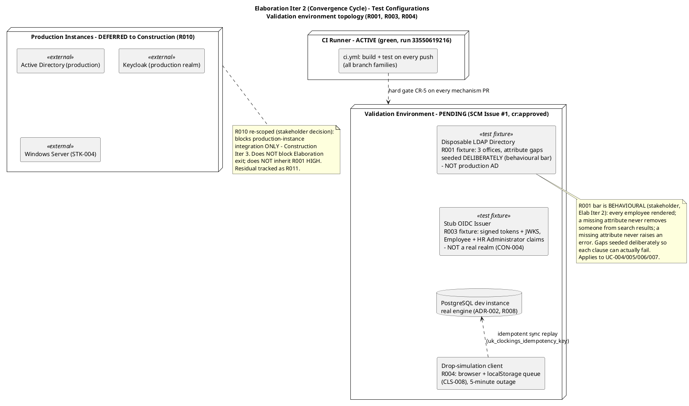
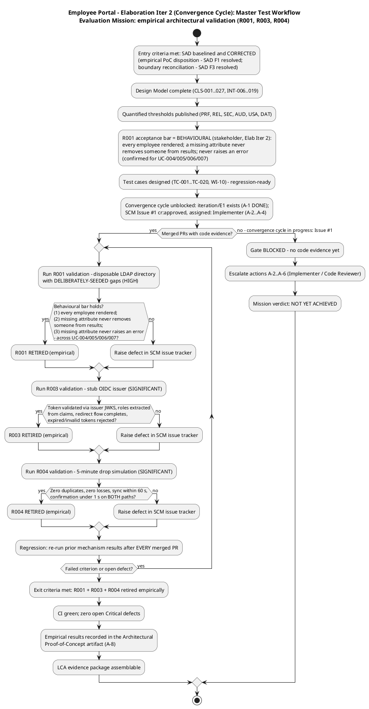
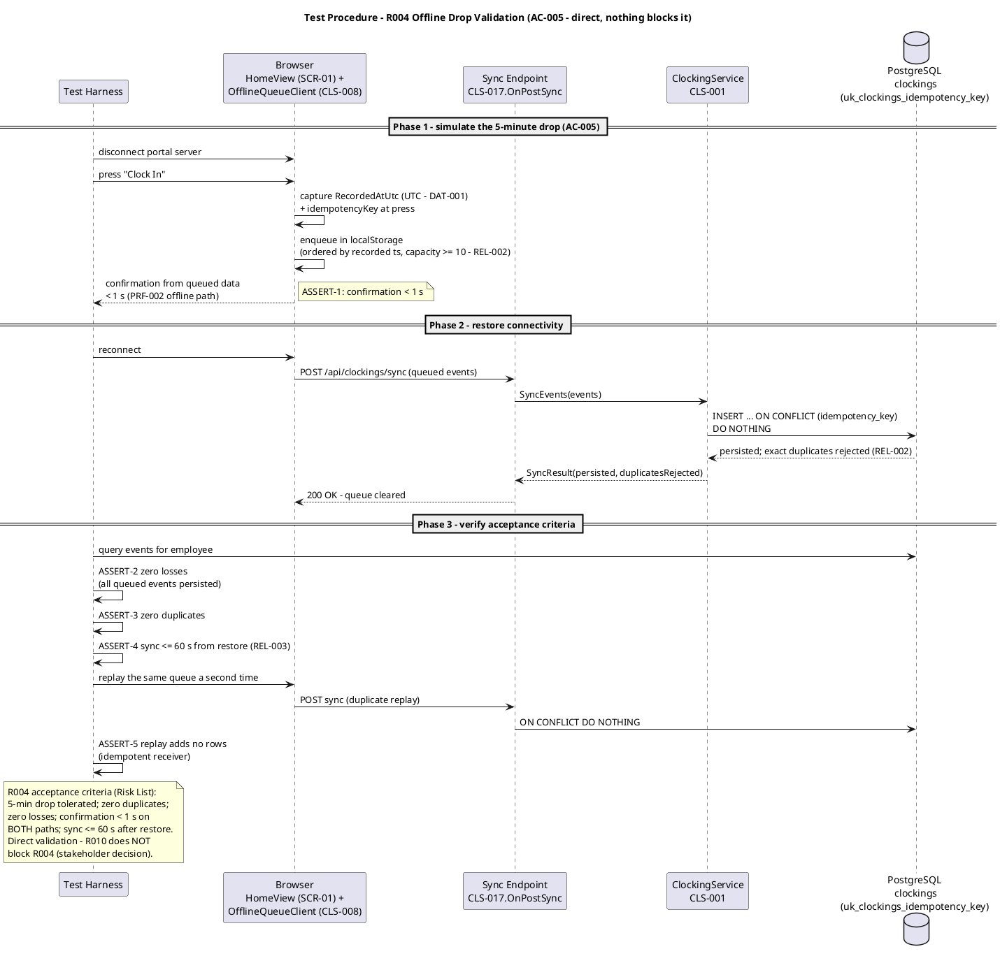
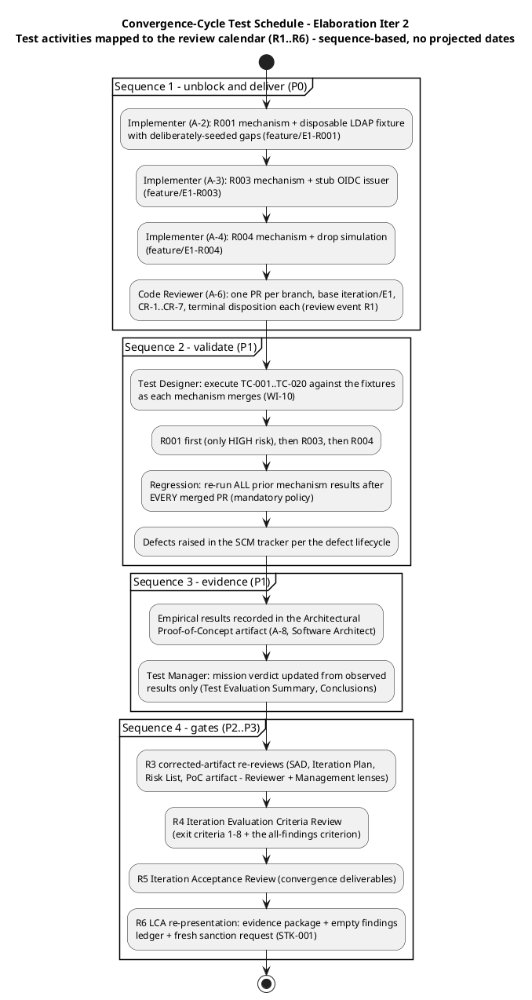
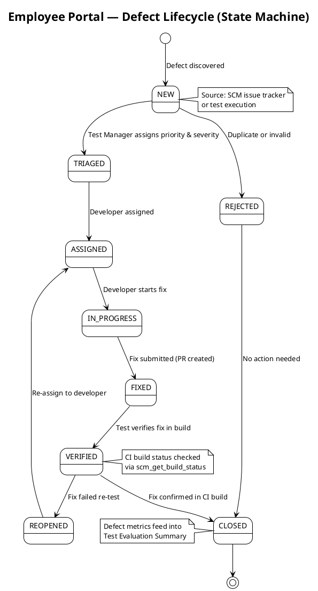

## Document Control

| Field | Value |
|---|---|
| Phase | Elaboration |
| Status | Draft — Elaboration Iter 2 (convergence cycle) evaluation record; EVOLVED from the Iter 1 record (Approved, zero findings at the LCA technical review), not recreated |
| Milestone Target | End of Elaboration (LCA) — **NOT yet achieved**; re-presentation pending convergence-cycle closure (empty findings ledger + empirical R001/R003/R004 evidence package) |
| Iteration | 2 (Cycle 1) — convergence cycle |
| Date | 2026-09-02 |
| Prior Version | Elaboration Iter 1 evaluation record; Inception Test Evaluation Summary (Approved at LCO — mission ACHIEVED); EVOLVED, not recreated |
| CI Baseline | Green on main (run 33550619216, verified this iteration); **zero CI runs on `iteration/E1`** — no pushes have landed on the integration branch |
| Defect Baseline | **2 open SCM issues** (verified this iteration, all states): #1 (blocker/critical — R001/R003/R004 mechanism code absent; cr:approved, assigned: implementer), #2 (minor/high — CONTRIBUTING.md absent; cr:approved, assigned: implementer) |
| Elaboration Changes (Iter 2) | (1) **R001 acceptance threshold REPLACED per the stakeholder's Elab Iter 2 decision** — the unsourced >90% statistical criterion is dropped; the bar is now **behavioural** (three clauses), confirmed for all four AD-reading UCs (UC-004/005/006/007) — this closes the Risk List F1 (Reviewer) propagation into this artifact's acceptance-thresholds table (remediation A-10, applied on this evolution). (2) Evaluation Mission refined for the convergence cycle (all-findings directive; R1–R6 review calendar). (3) **Convergence-cycle test schedule added** (sequence-based, no projected dates) — delivering the Work Order's requested test-plan substance (schedule, resources, test types, architecture-milestone acceptance criteria) inside this sanctioned artifact. (4) Test-configuration and master-workflow diagrams updated to the behavioural bar and convergence context; fixture spec now requires deliberately-seeded gaps. (5) Quality metrics refreshed from real SCM data (CI run 33550619216; Issues #1/#2; zero runs on iteration/E1). (6) **INC-2 RESOLVED** — the SAD PoC Plan was corrected to the empirical disposition by the Software Architect this iteration (verified by reading the corrected SAD). (7) INC-1 updated — convergence path unblocked (iteration/E1 exists; Issue #1 cr:approved, assigned: Implementer) but code delivery still pending. (8) Risk-driven prioritization table gains a trend column (management heuristic 3 support) |
| Elaboration Changes (Iter 1, preserved) | Evaluation Mission redefined for Elaboration (empirical architectural validation: R001 > R003 > R004, per binding stakeholder decision); acceptance thresholds per quality attribute defined from quantified Supplementary Specification (PRF/REL/SEC/AUD/DAT/USA); test configurations identified (validation environment vs deferred production instances); master test workflow, R004 test procedure, and test-configuration topology diagrams added; defect lifecycle preserved; quality baseline verified against real SCM data; incident F-CR-E1-1 recorded (no code evidence — validation cannot execute); mission verdict recorded honestly as NOT YET ACHIEVED |

## Test Scope

### Evaluation Mission (Elaboration Iteration 2 — convergence cycle)

**Purpose:** empirically validate the three architecturally significant mechanisms — **R001 (HIGH) via a disposable LDAP directory, R003 (SIGNIFICANT) via a stub OIDC issuer, R004 (SIGNIFICANT) directly** — so the LCA milestone is decided on **code evidence, not paper**. This iteration is the **convergence cycle**: it closes all open review findings (binding stakeholder directive: "Fix all the issues and close all findings" — all lenses, all severities) and assembles the LCA evidence package. Binding stakeholder decisions: "The PoC is produced in Elaboration and validated empirically"; "I will not accept an LCA that validates a HIGH architectural risk on paper only."

**Focus:** UC-001 (Clock In and Clock Out), UC-004 (Search Employee Directory), UC-010 (Unpublish News) — the three architecturally significant use cases (SAD Use-Case View priority 1–3) — **plus the R001 behavioural bar's stakeholder-confirmed extension to UC-005/006/007** (all four AD-reading UCs). Validation order: **R001 > R003 > R004** (R001 is the only HIGH-magnitude risk).

**Acceptable outcome (mission met):** all three validations pass their acceptance criteria **with SCM code evidence** (merged PRs on `iteration/E1`, CI green), the R001 behavioural bar observed to hold (mechanism level via the shared LDAP read path, and across the four AD-reading renderings per the PoC execution protocol), zero open Critical defects, regression baseline established, and the findings ledger empty across all lenses and severities → the LCA evidence package is assemblable and LCA is re-presented with a fresh sanction request. **Exit criterion = Evaluation Mission met, NOT 100% pass rate or perfect coverage.**

**Mission scope boundaries:**

| In Scope | Out of Scope |
|---|---|
| Empirical validation of R001/R003/R004 mechanisms (evolutionary code in `src/`) | Full functional testing of all 10 UCs (Construction) |
| R001 behavioural bar across all four AD-reading UCs (UC-004/005/006/007 — stakeholder-confirmed, Elab Iter 2); dedicated per-UC test cases for UC-005/006/007 land in Construction functional suites against the same retained fixtures | Test procedure execution against production AD / Keycloak (Construction Iter 3 — R010/R011) |
| Test case design + execution of TC-001…TC-020 as mechanisms land (Test Designer, WI-10) | Performance load testing (NFR-001 full-scale — Construction) |
| Regression of prior mechanism results after every merged PR | Usability / adoption testing (AC-004, BG-003 — Transition pilot) |
| Defect tracking via SCM issue tracker (authoritative source) | UI visual-fidelity testing against CON-011 (Construction) |
| Quality signals: CI build status, SCM defect census | **Real-AD data-quality measurement (Construction, R011 residual — excluded from the LCA evidence package per the stakeholder's Elab Iter 2 decision)** |

**Test configurations (updated for the convergence cycle — the fixture spec carries the behavioural bar):**

**Resource justification (every resource justified against the mission):** the CI runner is the only ACTIVE configuration — it exists and is green (run 33550619216). The four validation fixtures are the minimum set that retires the three risks without waiting on STK-004 (R010): a disposable LDAP directory with **deliberately-seeded attribute gaps** answers R001's behavioural question empirically (a uniformly-populated fixture would pass vacuously and prove nothing); a stub issuer proves OIDC consumption without a real realm (CON-004); the drop-simulation client exercises ADR-003 end-to-end; the PostgreSQL dev instance validates against the real declared engine (R008). No fifth environment is justified — production instances are Construction integration scope, not Elaboration.

### Acceptance Thresholds per Quality Attribute (architecture-milestone go/no-go)

Every threshold is quantified upstream (Supplementary Specification, Risk List, SAD, stakeholder decisions) — none is invented here. These are the measurable criteria the LCA gate applies to the architecture milestone.

| Quality Attribute | Threshold (go/no-go) | Source | Validated By |
|---|---|---|---|
| **Functionality — directory data shape (R001 behavioural bar)** | **(1) Every employee is rendered whether or not their attributes are complete; (2) a missing attribute never removes someone from search results; (3) a missing attribute never raises an error** — observed across all four AD-reading UCs: UC-004 person card (blank fields, entry shown), UC-005 event row (blank display fields — clocking data is portal data, always complete), UC-006 CSV row (blank cells, every event row present, no abort — ad_user_id always present), UC-007 employee locatable and selectable | **R001 behavioural bar (stakeholder decision, Elab Iter 2 — replaces the dropped >90% figure)**; UC-004 AF-2, UC-005 AF-3, UC-006 AF-3, UC-007 AF-3 (stakeholder-confirmed) | R001 validation (disposable directory with deliberately-seeded gaps) |
| Reliability — offline tolerance | 5-minute drop tolerated; queue ≥ 10 events/employee browser; queued events never lost; exact duplicates rejected, never duplicated; events ordered by recorded timestamp | REL-002, AC-005, ADR-003 | R004 validation (direct) |
| Reliability — sync completion | All queued events persisted ≤ 60 s after connectivity restored | REL-003 | R004 validation |
| Performance — clocking response | Confirmation < 1 s from button press on BOTH the online and offline-queued paths | PRF-002, NFR-002 | R004 validation |
| Security — authentication | OIDC token validated via the issuer's JWKS; Employee + HR Administrator roles extracted from claims; redirect flow completes; expired/invalid tokens rejected at the request boundary; HR-only functions reject Employee-role sessions | SEC-001, SEC-002, SEC-003, SEC-006, R003 | R003 validation (stub issuer) |
| Data integrity — timestamp capture | Timestamp fixed at button press, stored UTC; queued events persist recorded timestamp unchanged on sync | DAT-001, ADR-003 | R004 validation |
| Data integrity — display convention | Displayed clocking times render in America/Havana local time (IANA, DST-aware); raw UTC or server time never shown | USA-008, stakeholder decision | UC-001 test cases (Test Designer) |
| Auditability — append-only | Audit entries append-only; no update/delete path exists; state change and audit entry commit in one transaction | DAT-002, NFR-005 | UC-010 test cases (Test Designer); Construction integration |
| Build integrity | CI green on every merged mechanism PR (hard gate CR-5) | Review Record CR-5 | Code Reviewer gate |

**Note on the R001 threshold (Elab Iter 2 — supersedes the Iter 1 note):** the Iter 1 record carried ">90% of sampled users per office with all six attributes populated," sourced to the Risk List. The stakeholder has since decided (Elab Iter 2) that the figure is invented and is **dropped**: measured against a disposable directory the team seeds itself, a percentage measures our own test data — it cannot fail, so it proves nothing. The bar is **behavioural, not statistical**: the three clauses above, with gaps seeded **deliberately** in the disposable directory so each clause can actually fail. The statistical measurement of the real AD's data quality is a Construction activity (R011 residual, STK-004-dependent) and is **excluded from the LCA evidence package**. This closes the Risk List F1 (Reviewer) propagation into this artifact (remediation A-10, applied on this evolution).

## Test Summary

### Master Test Workflow (Elaboration Iteration 2 — convergence cycle)

### Test Types (Elaboration Iteration 2)

| Test Type | Target | Method | Owner |
|---|---|---|---|
| Mechanism validation (functional) | R001 LDAP attribute mapping + graceful degradation (COMP-007/CLS-009) | Query the disposable directory over LDAP v3 with **deliberately-seeded gaps**; assert the behavioural bar's three clauses; missing attributes → blank, entry NOT hidden, no error — across the four AD-reading renderings (UC-004 card, UC-005 row, UC-006 CSV cells, UC-007 locatable/selectable) per the PoC execution protocol | Implementer builds; Test Designer designs cases |
| Auth validation (security) | R003 OIDC consumption (COMP-006/CLS-010) | Stub issuer emits signed tokens + JWKS with Employee + HR Administrator claims; verify validation via JWKS, role extraction, redirect flow, rejection of expired/invalid tokens | Implementer builds; Test Designer designs cases |
| Reliability validation | R004 offline queue + idempotent sync (COMP-009/CLS-008, ADR-003) | 5-minute drop simulation; queue, reconnect, replay; zero duplicates/losses; sync ≤ 60 s; confirmation < 1 s both paths | Implementer builds; Test Designer designs cases |
| Dual-coverage unit testing | Every mechanism PR | Black-box contract + white-box paths (branches, loops, error handlers) — Review Record CR-2 | Implementer |
| Regression | All previously merged mechanisms | Re-run prior mechanism results after EVERY merged PR; CI gates every push | Test Designer / CI |
| Build-time validation | R008 PostgreSQL + .NET 10 | Basic CRUD + migration test against the real engine | Implementer |

### Test Procedure — R004 Offline Drop Validation (highest-procedure risk; AC-005)

### Schedule and Resources (convergence cycle — aligned to Iteration Plan WIs 7–10 and the R1–R6 review calendar)

**Schedule basis:** sequence-based, tied to workflow-activity completion — never projected calendar dates (deadlines are iteration-relative per the Review Record; human-gate queues are a Risk List matter, not a plan forecast).

| Activity | Owner | Plan Reference | Sequence |
|---|---|---|---|
| Test case design: UC-001, UC-004, UC-010 + PoC acceptance criteria | Test Designer (~120K tokens) | WI-10 | Designed (Iter 1); execution begins as mechanisms merge |
| R001 mechanism + validation (behavioural bar, deliberately-seeded gaps) | Implementer (~100K tokens) | WI-7 / Issue #1 / A-2 | Sequence 1, priority 1 — only HIGH risk |
| R003 mechanism + validation | Implementer (~80K tokens) | WI-8 / Issue #1 / A-3 | Sequence 1, priority 2 |
| R004 mechanism + validation | Implementer (~70K tokens) | WI-9 / Issue #1 / A-4 | Sequence 1, priority 3 — direct, nothing blocks it |
| PR gate per mechanism | Code Reviewer | Review Record A-6 / R1 | After each `ready-for-review` branch; base `iteration/E1` |
| TC-001…TC-020 execution + regression re-run | Test Designer + CI | WI-10 / R2 | Sequence 2 — after EVERY merged PR, mandatory |
| Empirical results → PoC artifact; mission verdict update | Software Architect (A-8) / Test Manager | R3 | Sequence 3 — from observed results only |

**Cost-of-testing constraint honored:** the Test discipline holds ~10% of the iteration budget box (Test Designer ~120K of ~1,180K tokens) — within the 30–50%-of-project-cost reality when Construction's larger test share is included; Elaboration's test intensity is concentrated on the three risk-retiring mechanisms, not spread thin.

**Two clocks (never summed):** agent work is measured in tokens (Test Designer ~120K this iteration; actuals recorded by the Project Manager in the Iteration Assessment); human gates are a Risk List matter, not a plan forecast (per Iteration Plan F5 remediation A-13 — queue forecasts removed from the plan; the 14-day suspension ceiling bounds the risk). No person-week figures are produced by this system.

### Regression Policy (mandatory per iteration)

Every merged mechanism PR triggers a re-run of all previously validated mechanism results. With three mechanisms merging in sequence (R001 → R003 → R004), the third validation re-runs the first two. An iteration without regression accumulates undiscovered defect debt — this policy is not waivable under schedule pressure. CI gates every push on all branch families, so a red build blocks the PR before review (CR-5 hard gate). **Current regression baseline: zero prior PASS results exist (first execution cycle pending code delivery) — the baseline activates with the first executed PASS.**

### Quality Metrics (defined now, measured from real SCM data — refreshed this iteration)

| Metric | Definition | Current Value (real data, 2026-09-02) |
|---|---|---|
| CI build status | Latest run on main | **Green** — run 33550619216 (started 2026-09-01 19:37:50Z, completed 19:38:39Z) |
| CI on `iteration/E1` | Latest run on the integration branch | **No runs found** — zero pushes have landed (code delivery pending, Issue #1) |
| Open defects | SCM issue tracker, all states | **2** — Issue #1 (blocker/critical, cr:approved, assigned: implementer), Issue #2 (minor/high, cr:approved, assigned: implementer) |
| Risk-retirement evidence | Merged PRs per mechanism with passing validation | **0 of 3** — no code evidence exists (Issue #1) |
| Tests executed / pass rate | Actual validation runs | **None executed** — no mechanism code exists; no counts are fabricated |
| Defect density | Defects per merged mechanism PR | Not yet measurable — zero PRs |
| Escaped defects | Defects found in Construction/Transition that Elaboration validation missed | Tracked from Construction Iter 1 onward — the key quality indicator |

### Risk-Driven Test Prioritization (evolved — statuses and trend updated this iteration)

| Risk | Magnitude | Affected UCs / ACs | Test Activity | Priority | Status (Elab Iter 2) | Trend (since last review) |
|---|---|---|---|---|---|---|
| R001 — AD LDAP attribute consistency | HIGH | UC-004, UC-005, UC-006, UC-007, AC-003 | Empirical validation against disposable LDAP directory with deliberately-seeded gaps; **behavioural bar** (stakeholder, Elab Iter 2) | 1 | MITIGATING — bar now behavioural and stakeholder-confirmed for all four AD-reading UCs; validation pending code handoff (Issue #1) | **IMPROVED (bar defined; >90% figure dropped)** — retirement evidence still pending |
| R003 — OIDC/Keycloak integration | SIGNIFICANT | All UCs (auth) | Empirical validation against stub OIDC issuer (no real realm, CON-004) | 2 | MITIGATING — validation pending code handoff (Issue #1) | FLAT — path designed, unexecuted |
| R004 — Offline fault tolerance | SIGNIFICANT | UC-001, AC-005, NFR-004 | Direct 5-minute drop simulation; queue + sync + idempotency | 3 | MITIGATING — validation pending code handoff (Issue #1) | FLAT — path designed, unexecuted |
| R010 — Infra team deliverables | SIGNIFICANT (re-scoped) | Production-instance integration | Deferred to Construction Iter 3 — does NOT block Elaboration exit | 4 | OPEN — PM owns STK-004 engagement | NARROWED — blocks production instances only |
| R011 — Validation-environment fidelity | MODERATE | R001/R003 residuals | Record deltas between fixtures and production instances; fixtures kept as reusable Construction test fixtures | 5 | OPEN — surfaces at Construction integration | NEW (Iter 1) |
| R002 — Clocking adoption | SIGNIFICANT | UC-001, AC-004, BG-003 | Usability test in Transition (pilot); not a technical test | 6 | OPEN — Transition | FLAT |
| R005 — LDAP query performance | MODERATE | UC-004, NFR-001, AC-003 | Measured during R001 validation; 5 s hard timeout (PRF-003); cache tactic in reserve | 7 | Monitored during R001 | FLAT |
| R006 — Audit trail completeness | MODERATE | UC-007…UC-010, NFR-005 | UC-010 test cases this iteration (design); Construction integration test on all four flows | 8 | Design complete (CLS-005, DAT-002); test pending | FLAT |
| R007 — UI design fidelity | MODERATE | All user-facing UCs | Visual regression against CON-011 in Construction | 9 | OPEN — Construction | FLAT |
| R008 — PostgreSQL + .NET 10 compat | MODERATE | All UCs (persistence) | Build-time CRUD + migration validation (Implementer) | 10 | OPEN — build-time | FLAT |
| R009 — Scope creep | MODERATE | All declared scope | Process control (CCB gate); not a test activity | 11 | OPEN — CCB enforced | FLAT |

### Use-Case to Acceptance Criteria Coverage Map (preserved from Inception — unchanged, all 5 ACs mapped)

| UC | Source FR | Acceptance Criteria Covered | Test Type |
|---|---|---|---|
| UC-001 | FR-004 | AC-001, AC-004, AC-005 | Functional + usability + reliability |
| UC-002 | FR-005 | — | Functional |
| UC-003 | FR-007 | — | Functional |
| UC-004 | FR-010 | AC-003 | Functional + performance |
| UC-005 | FR-001 | — | Functional |
| UC-006 | FR-002 | — | Functional + format validation (CSV) |
| UC-007 | FR-003 | — | Functional + audit verification |
| UC-008 | FR-006 | AC-002 | Functional + usability + audit |
| UC-009 | FR-008 | — | Functional + audit verification |
| UC-010 | FR-009 | — | Functional + audit verification |

**Coverage assessment (unchanged):** all 5 ACs mapped to at least one UC. AC-001/AC-004/AC-005 → UC-001 (highest-risk convergence: OIDC + offline + persistence); AC-003 → UC-004 (only HIGH risk, R001); AC-002 → UC-008.

## Defects and Incidents

### Defect Lifecycle (preserved — governs all defect management)

The following state machine governs defect management throughout the project lifecycle. Defects are tracked in the SCM issue tracker (GitHub Issues), which is the authoritative source for defect data.

### Current Defect Status (real SCM data — verified this iteration, 2026-09-02)

| Metric | Count | Source |
|---|---|---|
| Total defects (open) | **2** | `scm_list_issues` (all states) |
| Issue #1 — R001/R003/R004 mechanism code absent (blocks all 20 test cases; exit criteria 1–3) | 1 — severity:blocker, priority:critical, **cr:approved, assigned: implementer** | `scm_list_issues` |
| Issue #2 — CONTRIBUTING.md absent (CR-1 guidelines baseline) | 1 — severity:minor, priority:high, **cr:approved, assigned: implementer** | `scm_list_issues` |
| Closed defects | 0 | `scm_list_issues` (all states) |

Both open issues are **approved change requests assigned to the Implementer** — the remediation path is sanctioned and owned; what is absent is the delivery. No validation has executed (no mechanism code exists), so no test-execution defects could have been raised yet. Defect tracking activates the moment the first mechanism PR is reviewed and the first validation runs.

### Incidents

**INC-1 (Elaboration Iter 1 — updated Iter 2): Validation environment absent; test effort impeded.** Status at Iter 2: the convergence cycle has **unblocked the path** — `iteration/E1` exists (action A-1 DONE), SCM Issue #1 is formalized with canonical CCM labels, **cr:approved, and assigned to the Implementer** (actions A-2…A-4), and the CI trigger configuration is verified correct (`iteration/**` covered for push and PR — the gap is code delivery, not CI infrastructure). What remains absent: **the mechanism code itself** — zero pushes have landed on `iteration/E1` (no CI runs on the branch), so exit criteria 1–3 still have no code evidence and no validation can execute. This remains the **#1 testing bottleneck — code delivery, not test design or infrastructure**. Remediation is owned by the Implementer (A-2…A-4) and gated by the Code Reviewer (A-6). The Test Designer's 20 cases remain designed and regression-ready; the moment handoffs arrive, the master test workflow's "yes" branch executes.

**INC-2 (upstream inconsistency — RESOLVED this iteration):** the SAD §Quality PoC Plan carried the superseded "analysis-only + designed mechanism" disposition, contradicting the binding stakeholder decision (empirical validation this phase; R010 blocks production-instance integration only). **The Software Architect corrected the SAD this convergence cycle (SAD F1 resolved):** the PoC Plan now records the EMPIRICAL disposition (R001 disposable directory / R003 stub issuer / R004 direct, per-risk dispositions recorded), R010 is re-scoped to production-instance integration only, LCA criterion 3 is corrected, and the SAD's R001 acceptance bar is the same behavioural bar this artifact now carries (the >90% figure dropped in both). **Verified by reading the corrected SAD this iteration.** The Test discipline's alignment chain — stakeholder decision → Risk List → Iteration Plan → SAD → Architectural Proof-of-Concept artifact → this artifact — is now consistent end-to-end. No open inconsistency remains from this incident.

## Conclusions

### Evaluation Mission Verdict (Elaboration Iteration 2, Cycle 1)

**Mission status: NOT YET ACHIEVED — convergence cycle in progress; blocked on code delivery (SCM Issue #1).**

The Evaluation Mission is defined, agreed, and executable, and this convergence cycle has resolved **every test-side precondition**: the R001 acceptance bar is now the stakeholder-decided **behavioural bar** (replacing the invented >90% figure — the one defect the Iter 1 review flagged as propagating into this artifact, now closed by replacement per the stakeholder's answered decision); the SAD correction (INC-2) removed the upstream inconsistency; the fixture specification now requires **deliberately-seeded gaps** so the behavioural bar can actually fail; the 20 test cases are designed and regression-ready; the CI gate is green and verified correctly configured; and the convergence path is sanctioned (Issue #1 cr:approved, assigned).

What the mission **cannot yet claim**: the three empirical validations have not run, because the mechanism code has not been delivered — zero pushes have landed on `iteration/E1` (no CI runs on the branch), and Issue #1 remains open. Recording a "mission achieved" verdict here would be exactly the paper-only validation of a HIGH architectural risk the stakeholder refused. The verdict is therefore recorded honestly: **NOT YET ACHIEVED**, with the blocker documented (INC-1) and the unblocking actions owned by the Implementer and Code Reviewer (A-2…A-6). The moment handoffs arrive, the master test workflow's "yes" branch executes: three validations, regression per merged PR, empirical results into the Architectural Proof-of-Concept artifact, and the LCA evidence package becomes assemblable.

**Evidence summary (all real, none fabricated):** CI green on main (run 33550619216); zero CI runs on `iteration/E1`; 2 open SCM issues (#1 blocker, #2 minor — both cr:approved, assigned: implementer); 0 of 3 risk-retirement validations evidenced; 0 test executions (no code to test). The Inception Evaluation Mission remains ACHIEVED (historical record — five objectives met, preserved in SCM history).

### Recommendations

1. **Deliver the three mechanisms in risk order R001 → R003 → R004** (Issue #1 remediation; actions A-2…A-4) — the single action that unblocks all 20 test cases and exit criteria 1–3. R004 is direct and unblocked by anything — it can proceed in parallel if capacity allows.
2. **Seed the disposable directory's gaps deliberately** (missing job title / extension / email / department / office across all 3 offices) so each behavioural clause can actually fail — a fixture that cannot fail proves nothing (the stakeholder's own framing).
3. **Assert the behavioural bar across all four AD-reading renderings** (UC-004 card, UC-005 row, UC-006 CSV cells, UC-007 locatable/selectable) per the PoC execution protocol — the stakeholder confirmed the bar applies to all four UCs; the dedicated per-UC functional suites for UC-005/006/007 land in Construction against the same retained fixtures.
4. **Hold the regression line.** Three mechanisms merging in one iteration is precisely the situation where skipped regression accumulates hidden defect debt. The third validation must re-run the first two.
5. **Keep the disposable directory and stub issuer as reusable Construction fixtures** (R011 mitigation) — they become the integration-test baseline until production instances arrive (R010).
6. **Escaped-defect tracking starts at Construction Iter 1** — every defect found later in a mechanism validated here is a direct measure of this iteration's validation quality.

### Test Plan Status

**[OMITTED: Test Plan — trigger not fired per Development Case §5.2 oracle; per-iteration testing scope lives in the Iteration Plan]**

The Development Case oracle (`get_optional_artifact_triggers`, re-consulted this iteration) reports the Test Plan trigger **not fired**: the project requires no formal delivery, regulatory audit, or contractual test reporting. **Recorded conflict (standing):** the Work Order's additional instruction ("update test plan with detailed schedule, resources, test types, and acceptance criteria for the architecture milestone") names an artifact the Development Case does not sanction this round. The Development Case is the law that governs artifact production; the requested substance is delivered **here, inside the sanctioned Test Evaluation Summary** — this iteration's evolution adds the convergence-cycle test schedule (§ Test Summary), the resources table, the test-types table, and the architecture-milestone acceptance thresholds (§ Test Scope). If formal test reporting is later required, a Change Request through the CCB can fire the trigger — the Development Case re-evaluates triggers every iteration.

## Traceability

| Element | Traces From | Link Type | Traces To |
|---|---|---|---|
| Evaluation Mission (Elab Iter 2) | Stakeholder decisions: "The PoC is produced in Elaboration and validated empirically" (Elab Iter 1); R001 behavioural bar + confirmation for UC-004/005/006/007 (Elab Iter 2); "Fix all the issues and close all findings" (escalation resolution); Risk List R001/R003/R004 re-scope; Iteration Plan objectives, exit criteria 1–3 + all-findings criterion | Refines | R001, R003, R004 retirement evidence; LCA milestone gate (re-presentation) |
| R001 validation activity | R001 (Risk List — HIGH), FR-010, FR-001, FR-002, FR-003; **R001 behavioural bar (stakeholder decision, Elab Iter 2 — three clauses, confirmed for all four AD-reading UCs)**; UC-004 AF-2, UC-005 AF-3, UC-006 AF-3, UC-007 AF-3; COMP-007, CLS-009 | Tests | AC-003 (partial evidence); disposable LDAP directory fixture (deliberately-seeded gaps); Architectural Proof-of-Concept artifact |
| R003 validation activity | R003 (Risk List — SIGNIFICANT), CON-004, SEC-001/002/003/006, COMP-006, CLS-010 | Tests | All UCs (auth `<<include>>`); stub OIDC issuer fixture |
| R004 validation activity | R004 (Risk List — SIGNIFICANT), NFR-004, AC-005, REL-002/003, PRF-002, ADR-003, COMP-009, CLS-008 | Tests | AC-005 (partial evidence); UC-001 AF-1 |
| Acceptance thresholds table | PRF-002, REL-002, REL-003, SEC-001/002/003/006, DAT-001/002, USA-008 (Supplementary Specification); **R001 behavioural bar (stakeholder decision, Elab Iter 2 — replaces the dropped >90% figure; closes Risk List F1 (Reviewer) propagation, remediation A-10)** | Refines | LCA milestone go/no-go criteria; Architectural Proof-of-Concept acceptance criteria |
| Test configurations topology | SAD Deployment View + corrected §Quality PoC Plan (empirical disposition, SAD F1 resolved); R010 re-scope (stakeholder decision); R011 (Risk List) | DependsOn | Implementer WIs 7–9 (Issue #1); Construction Iter 3 integration (R010/R011) |
| Master test workflow | Iteration Plan WIs 7–10; Review Record CR-1…CR-7, actions A-1…A-6; convergence-cycle context (all-findings directive) | Refines | Elaboration exit criteria 1–3; LCA evidence package |
| Convergence-cycle test schedule | Review Record R1–R6 review calendar; actions A-1…A-15; Iteration Plan WIs 7–10; Work Order additional instruction (test-plan substance delivered in this sanctioned artifact) | Refines | Sequence 1–4 test activities; LCA re-presentation entry gate |
| R004 test procedure | AC-005, REL-002/003, PRF-002, DAT-001, SEQ-001, CLS-008/CLS-001/CLS-017 | Tests | uk_clockings_idempotency_key (Design Model §Persistent Data Classes) |
| Regression policy | RUP test discipline (mandatory per iteration); CI pattern (all branch families) | Refines | Construction regression suite baseline |
| Quality metrics | `scm_get_build_status` (main run 33550619216; iteration/E1 zero runs), `scm_list_issues` (2 open: #1 blocker, #2 minor) | DependsOn | Iteration Assessment (actuals); Construction defect tracking |
| INC-1 | Review Record F-CR-E1-1 (Critical), actions A-1…A-6; SCM Issue #1 (cr:approved, assigned: implementer) | Derives | Implementer (A-2…A-4); Code Reviewer (A-6) |
| INC-2 (RESOLVED) | SAD §Quality PoC Plan (superseded disposition — corrected this iteration by the Software Architect, SAD F1 resolved; verified by reading the corrected SAD) | Reviews | Software Architecture Document (corrected — no open inconsistency) |
| Defect lifecycle | `scm_list_issues` (authoritative source); RUP test management | DependsOn | Elaboration+ defect tracking; Test Evaluation Summary metrics |
| UC-to-AC coverage map (preserved) | UC-001…UC-010 (Use-Case Model), AC-001…AC-005 (declared) | Tests | Construction functional test design |
| Risk-driven prioritization (evolved, trend column) | R001–R011 (Risk List, Elab Iter 1 reappraisal); R001 behavioural bar (stakeholder, Elab Iter 2); management heuristic 3 (decreasing trend lines) | Refines | Test Designer case design (WI-10); Construction/Transition test planning; milestone trend verification |
| Test Plan omission | Development Case §5.2 oracle (Test Plan trigger not fired — re-consulted this iteration) | DependsOn | Iteration Plan (per-iteration testing scope); this artifact (schedule, resources, test types, acceptance criteria); CCB (trigger re-evaluation) |