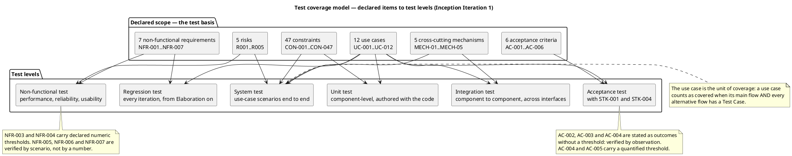
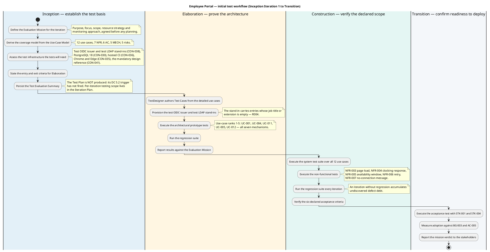
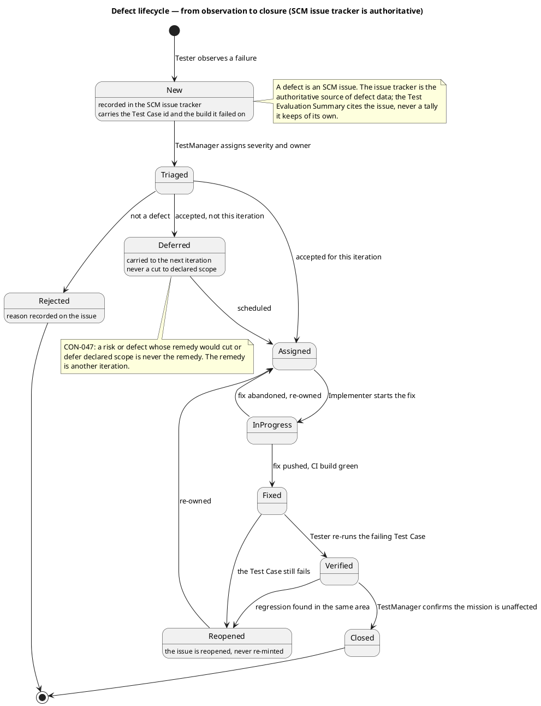

## Document Control

- Phase: Inception
- Status: Draft — under review for the end-of-Inception milestone
- Milestone Target: end-of-Inception (NOT YET ACHIEVED)
- Iteration: 1, Cycle 1
- Owner: TestManager
- Last updated: 2026-09-29

## Test Scope

### Evaluation Mission — Inception, Iteration 1

The Evaluation Mission is the explicit agreement on the purpose, focus and acceptable outcome of the test effort for this iteration. It is stated before any planning, and every resource below is justified against it.

| Field | Statement |
|---|---|
| Purpose | Establish the test basis for the declared scope and make the test effort's outcome decidable. Inception produces no executable, so the mission this iteration is to fix what will be tested, at which level, against which evidence, and what "acceptable" will mean — not to execute anything. |
| Focus | The twelve declared use cases as the unit of coverage, the seven declared non-functional requirements as the quality dimension, and the five cross-cutting mechanisms as the integration dimension. The three High-volatility use cases (UC-004, UC-011, UC-012) and the two architecturally significant write paths (UC-001, UC-005) carry the highest test risk and are tested first. |
| Scope | All twelve use cases of the Use-Case Model, including every alternative flow. All seven non-functional requirements. All six declared acceptance criteria. The five cross-cutting mechanisms MECH-01..MECH-05. The five risks R001..R005, each mapped to the test that confronts it. |
| Resource strategy | Test effort is planned as a share of the project, not as a residual. The test levels are staffed by the Test discipline roles the Development Case fixes: TestDesigner authors Test Cases, Tester executes them, TestManager owns this summary and the mission verdict. No test environment beyond the stand-ins the team already controls is requested — see the infrastructure diagram below. |
| Monitoring approach | Defect data comes from the SCM issue tracker, which is authoritative; CI build status is the quality signal for the integration level. Progress is reported as use cases covered (main flow plus every alternative flow) and as non-functional requirements verified, never as a pass-rate percentage. |
| Acceptable outcome | The mission is met when every declared use case has a Test Case covering its main flow and every alternative flow, every declared non-functional requirement has a named verification method, and every declared acceptance criterion has a named evidence and the iteration that produces it. A 100% pass rate is not the criterion and is not sought. |

**The Test Plan is not produced.** The Development Case §5.2 records the Test Plan trigger as NOT FIRED — the condition requires formal delivery, regulatory audit or contractual test reporting, and NFR-002 states that no external compliance regime applies and no retention period is mandated. Per-iteration testing scope therefore lives in the Iteration Plan, and the strategy, scope, entry and exit criteria and resource requirements that a Test Plan would carry are stated in this summary instead.

### Coverage model

The use case is the unit of coverage. A use case counts as covered when its main flow **and every alternative flow** has a Test Case — a use case whose alternative flows are untested is not covered, it is sampled.

```plantuml
@startuml
title Test coverage model — declared items to test levels (Inception Iteration 1)

skinparam componentStyle rectangle

package "Declared scope — the test basis" {
  component "12 use cases\nUC-001..UC-012" as UC
  component "7 non-functional requirements\nNFR-001..NFR-007" as NFR
  component "6 acceptance criteria\nAC-001..AC-006" as AC
  component "5 cross-cutting mechanisms\nMECH-01..MECH-05" as MECH
  component "5 risks\nR001..R005" as RISK
  component "47 constraints\nCON-001..CON-047" as CON
}

package "Test levels" {
  component "Unit test\ncomponent-level, authored with the code" as L1
  component "Integration test\ncomponent to component, across interfaces" as L2
  component "System test\nuse-case scenarios end to end" as L3
  component "Non-functional test\nperformance, reliability, usability" as L4
  component "Acceptance test\nwith STK-001 and STK-004" as L5
  component "Regression test\nevery iteration, from Elaboration on" as L6
}

UC --> L1
UC --> L2
UC --> L3
UC --> L5
UC --> L6
NFR --> L4
NFR --> L6
AC --> L5
MECH --> L2
MECH --> L3
RISK --> L3
RISK --> L4
CON --> L1
CON --> L3

note right of L3
  The use case is the unit of coverage: a use case
  counts as covered when its main flow AND every
  alternative flow has a Test Case.
end note

note bottom of L4
  NFR-003 and NFR-004 carry declared numeric
  thresholds. NFR-005, NFR-006 and NFR-007 are
  verified by scenario, not by a number.
end note

note bottom of L5
  AC-002, AC-003 and AC-004 are stated as outcomes
  without a threshold: verified by observation.
  AC-004 and AC-005 carry a quantified threshold.
end note
@enduml
```

### Test levels and what each one is accountable for

| Level | Accountable for | Authored by | Executed from |
|---|---|---|---|
| Unit | The behaviour of one component behind its interface — the invariants each component encapsulates | Implementer, with the code | Elaboration |
| Integration | The five cross-cutting mechanisms across component boundaries: MECH-01 OIDC login, MECH-02 LDAP read, MECH-03 audit write, MECH-04 idempotency, MECH-05 client retry | TestDesigner | Elaboration |
| System | Each use case end to end, main flow and every alternative flow | TestDesigner | Construction |
| Non-functional | NFR-003 page load, NFR-004 clocking response, NFR-005 availability window, NFR-006 retry, NFR-007 no-connection message | TestDesigner | Construction |
| Acceptance | AC-001..AC-006, with STK-001 and STK-004 | TestManager, with the stakeholders | Transition |
| Regression | Every use case already passing, re-run every iteration from Elaboration on | Tester | Elaboration onward |

### In scope and out of scope of the test effort

| In scope | Out of scope, and why |
|---|---|
| The twelve declared use cases, main flow and every alternative flow | Any behaviour not declared. The declared scope is the ceiling; a test for an undeclared feature would be a test for a requirement nobody agreed to. |
| The seven declared non-functional requirements | Throughput, concurrency and resource-usage targets — none is declared, and none is invented. |
| The six declared acceptance criteria | A general usability metric beyond AC-002..AC-005 — none is declared. |
| The five cross-cutting mechanisms, at integration level | Keycloak and Active Directory as systems under test. They are external systems this project neither deploys nor operates (CON-031, CON-011); the team's obligation is that every use case works correctly against the stand-ins it controls (CON-038). |
| The declared exclusions, as negative tests — no native mobile app, no push notification, no payroll integration, no write-back to AD, no local copy of the employee, no news archive screen, no hard delete, no offline mode beyond the clocking retry, no permission model beyond the two levels, no automatic featuring, no in-portal audit view | — |
| The visual layer against the mandatory design reference (CON-041), by the UserInterfaceDesigner's per-page comparison | An automated visual-regression check. STK-001 accepted R005 on 2026-09-28 with the per-page comparison as the only check and declined the alternative, so no tooling outside the declared constraints is introduced. |

## Test Summary

### Initial test workflow

```plantuml
@startuml
title Employee Portal — initial test workflow (Inception Iteration 1 to Transition)

|#E3F0F8|Inception — establish the test basis|
start
:Define the Evaluation Mission for the iteration;
note right
  Purpose, focus, scope, resource strategy and
  monitoring approach, agreed before any planning.
end note
:Derive the coverage model from the Use-Case Model;
note right
  12 use cases, 7 NFR, 6 AC, 5 MECH, 5 risks.
end note
:Assess the test infrastructure the tests will need;
note right
  Test OIDC issuer and test LDAP stand-ins (CON-038),
  PostgreSQL 18 (CON-030), hosted CI (CON-036),
  Chrome and Edge (CON-035), the mandatory design
  reference (CON-041).
end note
:State the entry and exit criteria for Elaboration;
:Persist the Test Evaluation Summary;
note right
  The Test Plan is NOT produced: its DC 5.2 trigger
  has not fired. Per-iteration testing scope lives
  in the Iteration Plan.
end note

|#FFF6E2|Elaboration — prove the architecture|
:TestDesigner authors Test Cases from the detailed use cases;
:Provision the test OIDC issuer and test LDAP stand-ins;
note right
  The stand-in carries entries whose job title or
  extension is empty — R004.
end note
:Execute the architectural prototype tests;
note right
  Use-case ranks 1-5: UC-001, UC-004, UC-011,
  UC-005, UC-012 — all seven mechanisms.
end note
:Run the regression suite;
:Report results against the Evaluation Mission;

|#E4F6F3|Construction — verify the declared scope|
:Execute the system test suite over all 12 use cases;
:Execute the non-functional tests;
note right
  NFR-003 page load, NFR-004 clocking response,
  NFR-005 availability window, NFR-006 retry,
  NFR-007 no-connection message.
end note
:Run the regression suite every iteration;
note right
  An iteration without regression accumulates
  undiscovered defect debt.
end note
:Verify the six declared acceptance criteria;

|#F4F7FA|Transition — confirm readiness to deploy|
:Execute the acceptance test with STK-001 and STK-004;
:Measure adoption against BG-003 and AC-005;
:Report the mission verdict to the stakeholders;
stop
@enduml
```

### Test infrastructure

Every item below is either already available or is a stand-in the team controls. No test environment beyond these is requested, and none is justified by the mission.

```plantuml
@startuml
title Test infrastructure — what the test effort needs, and who provides it

skinparam componentStyle rectangle

package "Team-controlled — the team builds and tests against these (CON-038)" {
  component "Test OIDC issuer stand-in\nplaceholder issuer, client id, client secret" as OIDC
  component "Test LDAP directory stand-in\ncarries the declared attributes, INCLUDING\nentries whose job title or extension are empty" as LDAP
  component "PostgreSQL 18 test instance\nCON-030" as PG
  component "Hosted CI on the SCM provider\nbuild and test only, never deploys (CON-036)" as CI
  component "Corporate browsers\ncurrent Chrome and Edge (CON-035)" as BROWSER
  component "Mandatory design reference\ndocs/inputs/employee-portal-design.html (CON-041)" as DESIGN
}

package "Not team work to plan — validated by people (CON-038)" {
  component "Real Keycloak\nInfrastructure-operated (CON-031)" as RKC
  component "Real Active Directory\nInfrastructure-operated, read-only (CON-011)" as RAD
}

package "Test levels that consume them" {
  component "Integration test" as L2
  component "System test" as L3
  component "Non-functional test" as L4
  component "Acceptance test" as L5
}

OIDC --> L2
OIDC --> L3
LDAP --> L2
LDAP --> L3
PG --> L2
PG --> L3
CI --> L2
CI --> L3
CI --> L4
BROWSER --> L4
BROWSER --> L5
DESIGN --> L5

RKC ..> L5 : human validation, feedback before LCA
RAD ..> L5 : human validation, feedback before LCA

note right of LDAP
  R004: the stand-in carries empty job title and
  extension entries, so the empty-attribute path is
  exercised from the first directory-dependent use
  case rather than discovered late.
end note

note bottom of RKC
  The availability, configuration and ownership of
  Keycloak and AD are NOT risks of this project and
  are not registered (CON-047). The team's obligation
  is that every use case works correctly against the
  stand-ins it controls.
end note

note bottom of CI
  CI never holds production data or credentials and
  never deploys: Infrastructure deploys (CON-036).
end note
@enduml
```

| Infrastructure item | Status at Inception close | Needed by | Justification against the mission |
|---|---|---|---|
| Test OIDC issuer stand-in | Not yet provisioned | First login-dependent use case, Elaboration | MECH-01 is included by all twelve use cases. Without it no use case can be executed at all. |
| Test LDAP directory stand-in | Not yet provisioned | First directory-dependent use case, Elaboration | MECH-02 is included by UC-003, UC-004, UC-011 and UC-012. It carries the empty-attribute entries that make R004 testable. |
| PostgreSQL 18 test instance | Not yet provisioned | First persistence-dependent use case, Elaboration | MECH-06. Infrastructure installs it on the existing estate (CON-030). |
| Hosted CI on the SCM provider | Available | Elaboration | CON-036. Build and test only; it never holds production data or credentials and never deploys. |
| Corporate browsers — Chrome and Edge | Available | Non-functional and acceptance levels | CON-035. The declared compatibility target. |
| Mandatory design reference | Committed to the repository | Acceptance level | CON-041. The single authority for the visual layer, and the only check R005's accepted treatment provides. |
| Real Keycloak and real Active Directory | Not team work to plan | Human validation, feedback before LCA | CON-038. Validated by people — Infrastructure, with HR — not by the team. |

### Entry criteria — Elaboration

| # | Criterion | Met when |
|---|---|---|
| EN1 | The test basis is baselined | The Use-Case Model, Supplementary Specification and Software Architecture Document exist and every declared item is addressed by identifier |
| EN2 | The test OIDC issuer stand-in is provisioned | A login can be completed against it with the placeholder configuration values (CON-038) |
| EN3 | The test LDAP directory stand-in is provisioned | It carries the declared attributes, including entries whose job title or extension are empty (CON-038) |
| EN4 | The PostgreSQL 18 test instance is reachable | The four persistent structures can be created and queried (CON-030) |
| EN5 | The CI pipeline builds and runs tests | A push to a branch family produces a build and a test run (CON-036) |
| EN6 | The Test Cases for the architectural prototype exist | UC-001, UC-004, UC-011, UC-005 and UC-012 have Test Cases covering main flow and every alternative flow |

### Exit criteria — the mission is met when

| # | Criterion | Met when |
|---|---|---|
| EX1 | Every declared use case is covered | All twelve have a Test Case covering the main flow and every alternative flow |
| EX2 | Every declared non-functional requirement has a verification method | NFR-001..NFR-007 each name the test that verifies it and the threshold or scenario it is verified against |
| EX3 | Every declared acceptance criterion has named evidence | AC-001..AC-006 each name the evidence that closes it and the iteration that produces it |
| EX4 | Every declared risk is confronted by a test | R001..R005 each map to the test that reduces or retires it |
| EX5 | Regression runs every iteration | From Elaboration on, the passing use cases are re-run each iteration |
| EX6 | The mission verdict is stated | This summary states, per iteration, whether the mission was met — not a pass-rate percentage |

**A 100% pass rate is not an exit criterion.** The criterion is that the Evaluation Mission is met. A defect that is understood, classified and accepted with a named owner does not fail the mission; an unexecuted alternative flow does.

### Resource strategy

| Resource | Justification against the mission |
|---|---|
| TestDesigner | Authors the Test Cases. The mission's unit of coverage is the use case with all its alternative flows, which is a design activity, not an execution one. |
| Tester | Executes the Test Cases and records defects in the SCM issue tracker. |
| TestManager | Owns this summary, the Evaluation Mission and the mission verdict. Does not author or execute Test Cases. |
| Implementer | Authors the unit tests with the code, and fixes defects. |
| UserInterfaceDesigner | Performs the per-page comparison against the mandatory design reference — the only check R005's accepted treatment provides. |
| Test OIDC issuer and test LDAP stand-ins | The two stand-ins are the whole of the test environment. No separate staging topology is declared and none is requested. |
| Hosted CI | The integration-level quality signal. It never holds production data or credentials and never deploys (CON-036). |

**Test effort is planned as a share of the project, not as a residual.** No figure is quoted for that share: no phase has closed, so no measured actual exists, and a percentage would be an assumption presented as a measurement. The first measured actual of a closed phase replaces any assumed share in every forecast made afterwards.

### Monitoring approach

| Signal | Source | What it decides |
|---|---|---|
| Use cases covered | This summary, against the Use-Case Model | Whether the mission's coverage criterion is met |
| Non-functional requirements verified | This summary, against the Supplementary Specification | Whether the quality dimension of the mission is met |
| Defects | The SCM issue tracker — authoritative | Severity, ownership and whether the mission is affected |
| Build and test status | The hosted CI pipeline (CON-036) | Whether the integration level is holding |
| Acceptance criteria evidence | This summary, against the declared criteria | Whether the iteration can close |

### Results this iteration

No test was executed this iteration. Inception produces no executable: the Iteration Plan records that all twelve use cases are analysed and designed and none is implemented, so there is no system under test and no Test Case to run. The only executed verification evidence available to this summary is CI run `ci-run-36528250994` on `main`, which builds the skeleton and runs no test of declared behaviour.

Stating this rather than implying a result is the point: a summary that reported a pass rate for an iteration with no executable would be reporting a number it did not measure.

## Defects and Incidents

### Defect lifecycle

```plantuml
@startuml
title Defect lifecycle — from observation to closure (SCM issue tracker is authoritative)

[*] --> New : Tester observes a failure
New : recorded in the SCM issue tracker
New : carries the Test Case id and the build it failed on
New --> Triaged : TestManager assigns severity and owner

Triaged --> Rejected : not a defect
Triaged --> Deferred : accepted, not this iteration
Triaged --> Assigned : accepted for this iteration

Rejected : reason recorded on the issue
Rejected --> [*]

Deferred : carried to the next iteration
Deferred : never a cut to declared scope
Deferred --> Assigned : scheduled

Assigned --> InProgress : Implementer starts the fix
InProgress --> Fixed : fix pushed, CI build green
InProgress --> Assigned : fix abandoned, re-owned

Fixed --> Verified : Tester re-runs the failing Test Case
Fixed --> Reopened : the Test Case still fails

Reopened --> Assigned : re-owned
Reopened : the issue is reopened, never re-minted

Verified --> Closed : TestManager confirms the mission is unaffected
Verified --> Reopened : regression found in the same area

Closed --> [*]

note right of New
  A defect is an SCM issue. The issue tracker is the
  authoritative source of defect data; the Test
  Evaluation Summary cites the issue, never a tally
  it keeps of its own.
end note

note bottom of Deferred
  CON-047: a risk or defect whose remedy would cut or
  defer declared scope is never the remedy. The remedy
  is another iteration.
end note
@enduml
```

### Defect data source

The SCM issue tracker is the authoritative source of defect data, and the hosted CI pipeline is the quality signal for the integration level. This summary cites issues and runs by identifier; it keeps no tally of its own.

No defect has been observed this iteration, because no test was executed. No issue is registered against this project.

### Incidents carried into Elaboration

| Item | Nature | Consequence for the test effort |
|---|---|---|
| Test OIDC issuer stand-in not provisioned | Environment gap, recorded by the Development Case §Environment readiness | Blocks every use case at integration and system level. Entry criterion EN2. |
| Test LDAP directory stand-in not provisioned | Environment gap, recorded by the Development Case §Environment readiness | Blocks UC-003, UC-004, UC-011 and UC-012, and blocks the R004 empty-attribute path. Entry criterion EN3. |
| PostgreSQL 18 test instance not provisioned | Environment gap, recorded by the Development Case §Environment readiness | Blocks every persistence-dependent use case. Entry criterion EN4. |
| `CONTRIBUTING.md`, lint configuration and CI workflow file absent | Tooling gap, recorded by the Development Case | The CI pipeline cannot run tests until the workflow file exists. Entry criterion EN5. |

None of these is a defect: no system under test exists yet. Each is an entry criterion for Elaboration, and each is owned by a named role in the Development Case.

## Conclusions

### Mission verdict — Inception, Iteration 1

| Mission element | Verdict |
|---|---|
| Purpose — establish the test basis | Met. The coverage model is derived from the baselined Use-Case Model, Supplementary Specification and Software Architecture Document, and every declared item is addressed by identifier. |
| Focus — use cases as the unit of coverage | Met. All twelve use cases are in the coverage model, with the three High-volatility ones and the two significant write paths ranked first. |
| Scope — declared items only | Met. Twelve use cases, seven non-functional requirements, six acceptance criteria, five mechanisms and five risks. Nothing undeclared is tested and nothing declared is omitted. |
| Resource strategy | Met. Every resource is justified against the mission; no test environment beyond the two stand-ins the team controls is requested. |
| Monitoring approach | Met. Defect data comes from the SCM issue tracker and the CI pipeline; progress is reported as coverage, never as a pass rate. |
| Acceptable outcome | Met for Inception. The mission this iteration was to make the test effort's outcome decidable, and it is: the entry criteria, exit criteria and evidence for every declared acceptance criterion are named. |

**The mission is met for Inception.** No test was executed and none could be — Inception produces no executable. The mission for this iteration was the test basis, and it is established.

### Recommendation

Proceed to Elaboration. The test effort's first obligation there is to close entry criteria EN2, EN3 and EN4 — the two stand-ins and the test database — before the first use case is executed, and to author the Test Cases for the architectural prototype (UC-001, UC-004, UC-011, UC-005, UC-012) alongside the code rather than after it.

### Risks to the test effort

| Risk | Exposure to the test effort | Position |
|---|---|---|
| R004 — AD attributes unevenly filled across 3 offices | The directory, the clocking report and the CSV export all read AD. An empty attribute must not break a row. | Confronted at integration level by the test LDAP stand-in, which carries entries whose job title and extension are empty (CON-038). The empty-attribute path is exercised from the first directory-dependent use case. |
| R005 — UI drift from the mandatory design reference | The visual layer has no automated check, so a page can drift and pass every functional test. | The per-page comparison by the UserInterfaceDesigner is the only check, as STK-001 accepted on 2026-09-28. The test effort does not add a visual-regression check: that alternative was declined and would introduce tooling outside the declared constraints. |
| R002 — missing clock-outs | The correction path must be atomic and audited, or the Corrected flag and the audit trail drift apart. | Confronted at system level by UC-005, whose Test Case must assert the new record, the audit entry (who, when, previous value, reason) and Corrected = Y together, and must assert that the original record is intact (CON-014). |
| R001 — adoption | Not a test-effort risk. Adoption is measured, not tested. | AC-005 and BG-003 are measured in Transition. |
| R003 — single engineering contact | Not a test-effort risk. | CON-038 removes the real Keycloak and the real AD from the team's critical path. |

### Open items

| Item | Status |
|---|---|
| Test Cases for the architectural prototype | Authored in Elaboration by the TestDesigner |
| Measurement conditions for NFR-003 and NFR-004 — load profile, data volume, instrumentation | Fixed in Elaboration by the RequirementsSpecifier; the thresholds themselves are declared |
| Test procedure for AC-002 and AC-003, which are stated as outcomes without a threshold | Owned by the TestDesigner; verified by observation |
| Test Plan | Not produced — the Development Case §5.2 trigger has not fired |

No `[SCOPE_QUESTION]` is open in this artifact. Every declared item is addressed by identifier, and no test, tool or environment was introduced that the stakeholder did not declare.

## Traceability

| Element | Traces From | Link Type | Traces To |
|---|---|---|---|
| Test Evaluation Summary | Use-Case Model, Supplementary Specification, Software Architecture Document, Risk List, Iteration Plan | DependsOn | Test Case |
| Evaluation Mission — Inception, Iteration 1 | AC-001, AC-002, AC-003, AC-004, AC-005, AC-006 | Refines | Test Case |
| Coverage model | UC-001, UC-002, UC-003, UC-004, UC-005, UC-006, UC-007, UC-008, UC-009, UC-010, UC-011, UC-012 | Derives | Test Case |
| Coverage model — non-functional dimension | NFR-001, NFR-002, NFR-003, NFR-004, NFR-005, NFR-006, NFR-007 | Derives | Test Case |
| Coverage model — integration dimension | MECH-01, MECH-02, MECH-03, MECH-04, MECH-05 | Derives | Test Case |
| Coverage model — component dimension | COMP-001, COMP-002, COMP-003, COMP-004, COMP-005, COMP-006, COMP-007, COMP-008, COMP-009, COMP-010 | DependsOn | Test Case |
| Test infrastructure | CON-030, CON-035, CON-036, CON-038, CON-041 | DependsOn | Implementation Model |
| Defect lifecycle | NFR-002, CON-047 | DependsOn | Risk List |
| Risk confrontation — R004 | R004, CON-038 | DependsOn | Test Case |
| Risk confrontation — R005 | R005, CON-041, STK-001 | DependsOn | Test Case |
| Risk confrontation — R002 | R002, CON-008, CON-014, NFR-002 | DependsOn | Test Case |
| Entry criteria — Elaboration | CON-030, CON-036, CON-038 | DependsOn | Iteration Plan |
| Exit criteria — mission met | AC-001, AC-002, AC-003, AC-004, AC-005, AC-006, NFR-001, NFR-002, NFR-003, NFR-004, NFR-005, NFR-006, NFR-007 | Refines | Iteration Assessment |

### Coverage — declared items addressed by this summary

| Declared family | Count | Addressed |
|---|---|---|
| Functional requirements FR-001..FR-010 | 10 | All realized by a use case in the coverage model |
| Use cases UC-001..UC-012 | 12 | All in the coverage model; the three High-volatility ones and the two significant write paths ranked first |
| Non-functional requirements NFR-001..NFR-007 | 7 | All have a named test level and verification method |
| Acceptance criteria AC-001..AC-006 | 6 | All have named evidence and the iteration that produces it |
| Cross-cutting mechanisms MECH-01..MECH-05 | 5 | All tested at integration level |
| Constraints CON-001..CON-047 | 47 | The test-relevant ones are cited by identifier; the declared exclusions are carried as negative tests |
| Risks R001..R005 | 5 | All mapped to the test that confronts them |
| Business goals BG-001..BG-003 | 3 | Measured in Transition, not tested; BG-003 and AC-005 share the adoption measurement |

No declared item is unaddressed and no test, tool or environment was invented.
