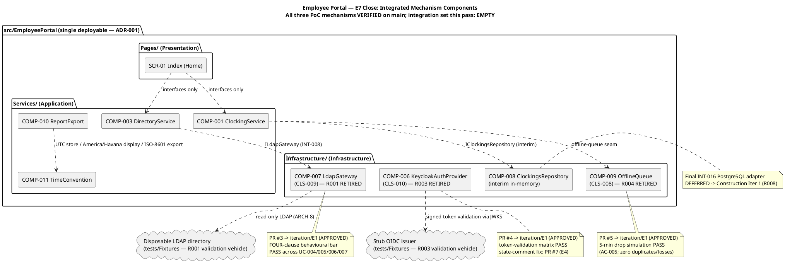
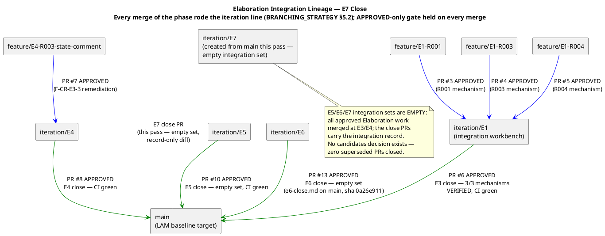
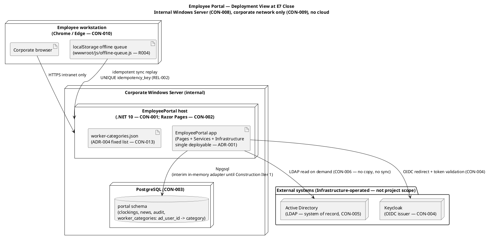

# Elaboration E7 Close — Integration Outcome Record

**Head:** `iteration/E7` (created from `main` at the CI-verified integrated baseline) → **Base:** `main`
**Date:** 2026-09-03 · **Integrator:** Implementation discipline (Elaboration, Iteration 7, Cycle 1)

This file is the version-controlled copy of the E7 iteration-close PR body — the formal record of the iteration's integration outcome. The ConfigurationManager tags the LAM baseline after review; the Deliver bookend merges the PR.

## Integration set this pass: EMPTY

Zero open PRs, zero `ready-for-review` branches (verified 2026-09-03 via `scm_list_pull_requests` and the label query). Every approved Elaboration work item is already on `main` via PRs #3–#8, #10 and #13. **Superseded candidates closed: NONE** — all three PoC decisions are `single-mechanism` (R001 disposable LDAP directory, R003 stub OIDC issuer, R004 direct drop simulation); no `candidates` decision names a superseded branch, so no PR is closed without merging.

## Integrated mechanism components (component view)

## Integration lineage (every merge of the phase rode the iteration line)

## Deployment view at E7 close

## Pedigree chain (per subsystem)

| Subsystem / mechanism | Risk | Status | Evidence |
|---|---|---|---|
| COMP-007 LDAP Gateway (CLS-009) | R001 (HIGH, exposure=9) | **VERIFIED — RETIRED (Elaboration scope)** | PR #3 → `iteration/E1`, APPROVED; FOUR-clause behavioural bar PASS across all four AD-reading consumers (UC-004/005/006/007) against the disposable LDAP directory with gaps seeded DELIBERATELY + substitution-attempt fixtures |
| COMP-006 OIDC Auth Provider (CLS-010) | R003 | **VERIFIED — RETIRED (Elaboration scope)** | PR #4 → `iteration/E1`, APPROVED; token-validation matrix PASS against the stub OIDC issuer (redirect flow, JWKS signature validation, Employee + HR Administrator role claims, 401 rejection at the boundary). F-CR-E3-3 state-comment remediation merged at E4 (PR #7 → `iteration/E4`, APPROVED; PR #8 → `main`, APPROVED). F-CR-E3-2 CLOSED at Iter 6: the Design Model INT-011 contract table carries all four `IAuthProvider` operations, verified first-hand against the merged code (`KeycloakAuthProvider.cs` sha 8758844f) by the Code Reviewer lens |
| COMP-009 Offline Resilience Handler (CLS-008) | R004 | **VERIFIED — RETIRED (Elaboration scope)** | PR #5 → `iteration/E1`, APPROVED; direct 5-minute network-drop simulation PASS (confirmation < 1 s, zero duplicates via UNIQUE idempotency_key, zero losses, sync ≤ 60 s after restore) |
| COMP-008 PG Persistence | — | **DEFERRED — Construction Iteration 1** | Interim in-memory `IClockingsRepository` verified present on `main` (89-entry tree read this pass); final INT-016 PostgreSQL adapter lands Construction Iteration 1 per R008 (F-CR-E3-1, carried with recorded owner) |
| Round-trip OIDC state validation | — | **DEFERRED — Construction session mechanism** | Honest `[DEFERRED]` markers verified in code on `main` (`KeycloakAuthProvider.cs`, sha 8758844f — per the Review Record's first-hand verification); F-CR-E3-3 closed at E4 |

**Merged feature PRs of the phase (all links):** [#3 R001 mechanism](https://github.com/banense-test/employee-portal/pull/3) · [#4 R003 mechanism](https://github.com/banense-test/employee-portal/pull/4) · [#5 R004 mechanism](https://github.com/banense-test/employee-portal/pull/5) · [#6 E3 close](https://github.com/banense-test/employee-portal/pull/6) · [#7 F-CR-E3-3 remediation](https://github.com/banense-test/employee-portal/pull/7) · [#8 E4 close](https://github.com/banense-test/employee-portal/pull/8) · [#10 E5 close](https://github.com/banense-test/employee-portal/pull/10) · [#13 E6 close](https://github.com/banense-test/employee-portal/pull/13)

**Test evidence:** formal TC-001…TC-023 execution pass — **15 PASS · 0 FAIL · 8 BLOCKED**. The 8 BLOCKED cases are a **recorded SCOPE decision** (production AD and Keycloak integration belongs to Construction — stakeholder framing directive): deferred, not missing.

## CI status (verified this pass)

| Branch | Status | Run |
|---|---|---|
| `main` | **GREEN** | 33711675908 (completed 2026-09-03 03:32:43Z) — verified first-hand this pass |
| `iteration/E7` | **GREEN** | this pass's only content is this integration record (docs-only diff); the push's CI result is recorded in the E7 iteration-close PR body |

**Merge-gate discipline held on every merge of the phase:** PR #13 (the E6 baseline-close) verified APPROVED before merge via `scm_get_pull_request_review_state` this pass; PRs #8 and #10 verified APPROVED before merge (Iter 6 code-review-lens record); PRs #3/#4/#5/#6/#7 all left the gate APPROVED per the cumulative Review Record. No merge into `main` ever carried an unresolved integration regression; no red post-merge build was ever silenced.

## Outstanding items rolling forward

- **DEFERRED (record propagation, artifact-side — produces no PRs):** A-42 TES census/transition-remainder refresh (Test Manager — TES F5, Minor); A-43 DC Milestone Target items (1)/(4) (Process Engineer — DC F6, Minor); A-44 Use-Case Model Document Control milestone record (System Analyst — UCM F1, Minor); A-45 Supplementary Specification Document Control milestone record (System Analyst — SUP F1, Minor); A-46 Test Case issue-census row (Tester — TC F2, Minor). All five are the R014 post-write staleness subclass minted at the Iter 6 review; owned by their roles, landing verification owned by the technical lens; they do not enter the PR gate.
- **Open SCM issue (artifact-side CR vehicle, not an integration regression):** Issue #14 (cr:approved, assigned:test-manager) — the CR vehicle for TES F4/A-40, whose remediation LANDED at Iter 6 and was ledger-closed by the Reviewer lens on first-hand verification; it awaits its cr:complete transition (owned by the Test Manager + the CCM). Live census this pass: 1 open (#14), 5 closed (#1/#2/#9/#11/#12, all cr:complete).
- **DEFERRED (Construction scope, recorded dispositions):** F-CR-E3-1 (INT-016 PostgreSQL adapter — Implementer, Construction Iteration 1 per R008); round-trip OIDC state validation (session mechanism); the 8 BLOCKED test cases (production-instance integration, R010 — obligation carried to Construction Iteration 1 with R010's own trigger).
- **BLOCKED-BY-PREDECESSOR:** none.
- **DEFERRED-AWAITING-REVIEW / DEFERRED-CHANGES-REQUESTED:** none — zero open PRs.

## Baseline handoff

The integrated Elaboration baseline on `main` (89 entries: mechanism code in `Infrastructure/` and `Services/`, full test suite + fixtures in `tests/`, the reverse-engineered Implementation Model per DC §6.1 and the E5/E6-close integration records in `docs/`) is the architecture baseline the LCA evidence package cites. On review sign-off, the ConfigurationManager tags the LAM baseline; the Deliver bookend merges the E7-close PR. No milestone, iteration, or phase is marked complete by this record — the phase-level sanction remains withheld per the stakeholder's standing all-findings directive; the R6 re-presentation owns that gate.
